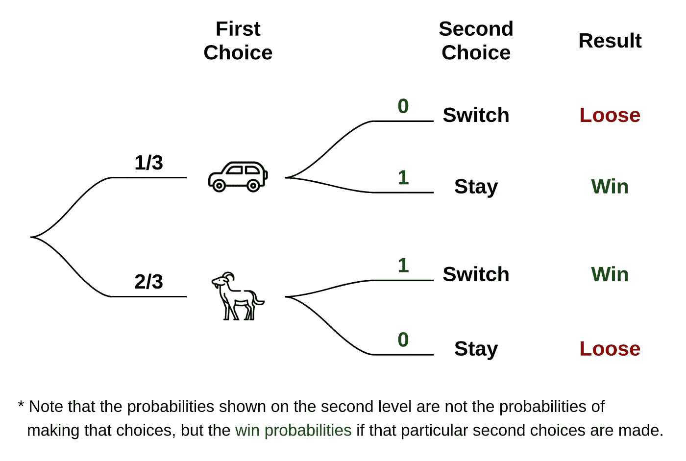
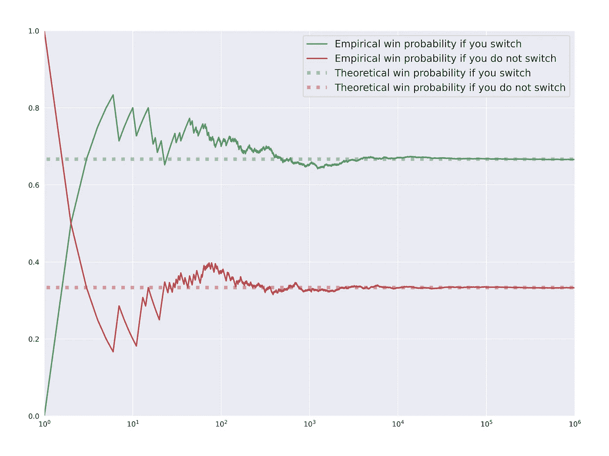

# 蒙蒂·霍尔问题——一个经验证明

> 原文：<https://towardsdatascience.com/monty-hall-problem-an-empirical-proof-60e7e0761503?source=collection_archive---------8----------------------->

## 蒙蒂霍尔问题的 Python 模拟

照片由来自 pexels.com[的](https://www.pexels.com/photo/three-yellow-wooden-doors-2726517/)Oleg Magni 拍摄

蒙蒂霍尔问题是一个处理概率决策的数学脑筋急转弯。它起源于 1963 年蒙蒂·霍尔主持的一个电视节目。这是一个很好的例子，说明概率情景看似简单，但有时却很难让我们理解。

# 场景…

问题很简单，你去蒙蒂的游戏节目《我们做个交易吧》。你面前有三扇门。其中一扇门后有一辆汽车，其余两扇门后是山羊！如果你选择车停在哪个门后面，你就把它开回家。主人让你选一扇门，你选一扇。接下来是有趣的部分。你选好一扇门后，主人会打开剩下的两扇门中的一扇，让**总是**露出一只山羊。现在他会问你，你是要改变你的选择，还是坚持你最初的选择？这就是进退两难的地方。

从表面上看，坚持原来的决定或改变它似乎没有明显的优势。由于现在有两个未打开的门，我们认为这是一个对半的选择。但事实上，如果你深思熟虑，你会发现当主持人问你是否想改变时，改变你的决定有明显的好处！！！

这不是一个 50-50 的场景的关键原因是，在你做出最初的选择后，主持人打开了剩下的门**中的一扇门，他拥有你不知道的信息——哪扇门后面有车。而他**从来不**打开后面有车的门。如果我们把这条信息结合到计算概率中，我们最终得到的数字是，如果你改变，你有 2/3 的概率获胜。**

# 说明

互联网上有很多使用多种方法的好解释。(我觉得[这个](https://www.youtube.com/watch?v=4Lb-6rxZxx0)、[那个](https://www.youtube.com/watch?v=hdo4CZC76fA)、[另一个](https://www.statisticshowto.com/probability-and-statistics/monty-hall-problem/)挺有意思的。)但我个人觉得，在概率上，任何事情都可以用树形图简单直观的解释。

图 1 —树形图显示了与 Monty Hall 问题相关的概率(图表由作者提供)

当你被要求做出你的第一选择时，有相等的概率汽车在三个门的任何一个后面。所以你有 1/3 的几率猜对。这意味着你的猜测有 2/3 是错误的。所以现在主人来了，他打开一扇门，露出一只山羊。在这一点上，他开门的选择不是随意的。这是由你之前的选择决定的，因为他有一个规则，开门时不要露出车。

我们先考虑一下你的第一选择是正确的情况。然后剩下的两扇门后面有山羊。在这种情况下，主人可以打开这两扇门中的任何一扇门。所以现在如果你改变你最初的选择，你肯定会失去主人选择的门。但是请记住，这种情况只发生 1/3 次，因为你最初的选择只有那么多次是正确的。

现在考虑你最初的选择是错误的情况。你选择一扇门，门后有一只山羊。现在剩下的两扇门中，一扇门后面有汽车，一扇门后面有山羊。现在主人不能随便开门了。车在后面，他打不开门。所以他是**强迫**开门，另一只山羊跟在后面。此时，如果你改变最初的选择，你一定会赢。如果我们回顾最初的概率，我们可以意识到这是最有可能的情况，因为我们最初的猜测有 2/3 是错误的。所以你应该经常切换！据统计，如果你玩这个游戏无数次，你会在 2/3 的游戏中获胜，如果你总是进行转换的话。

我和我的一个朋友讨论这个问题，他说，“是的，这似乎可以理解，但要理解这个解释还是有点晕”。所以我想，“嘿，让我们模拟一下，得到同样的数字！”。那样的话，看到经验证据会更有说服力！

# 蟒之道！

让我们开始有趣的部分吧！我创建了整个程序，门的数量是可配置的，所以如果有人想模拟有更多门的场景(如这里的[所解释的](https://www.statisticshowto.com/probability-and-statistics/monty-hall-problem/))，这是可以做到的。

首先，我们来看一下`Contestant`类。它有一个构造函数参数`switch`。这个参数定义了当被问到“你想交换吗？”时，参赛者的反应。。通过在实例化竞争者对象时改变这个参数，我们可以模拟一个总是切换的竞争者和一个从不切换的竞争者。

`Contestant`类有两个方法。第一个是`select_door()`。这是用来做初始选择的。当给定门的数量(`door_count`)作为输入时，它以随机的均匀概率选择并返回一个门(`selection`)。下一个方法是`wanna_switch()`。当主持人打开所有剩余的门，展示一个备选门，并询问参赛者是否想改变她的/他的决定时，将调用此方法。它需要一个输入:T5。如果参赛选手的属性`switch`是`False`，这个方法返回旧的`selection`(坚持原来的决定)。如果参赛选手的属性`switch`为真，则返回`new_door`(改变原来的选择)。

接下来我们有`Host`类。它采用一个构造函数参数`door_count`。在实例化过程中，`Host`类通过设置私有属性`_car_index`将虚拟汽车随机“放置”在其中一扇门后。*我已经做了* `*_car_index*` *，* `*door_counts*` *属性的* `*Host*` *类，既然主人已经知道了这些。*

`Host`类有三个方法。第一个是`present_doors()`，用于通过返回`door_count`向参赛者显示门。接下来的方法是`eliminate_others_and_present_one_door()`。该方法将参赛者的第一个选择(`contestant_selection`)作为输入，并返回一个`alternative_door`作为输出，以询问参赛者她/他是否想要切换？如果参赛者的第一个选择是后面有车的门，它随机返回另一个门作为`alternative_door`。如果参赛者的首选不是后面有车的门，这个方法返回`_car_index`(后面有车的门)作为`alternative_door`。(*`*alternative_door*`*的这种回归，就好比打开了所有其他的门，露出了身后的山羊。*)最后一个方法是`reveal_if_winner()`。它将参赛选手的`final_selection`作为输入，并返回参赛选手是否获胜。*

*将所有东西放在一起，我们可以使用下面的代码片段模拟一次竞争。*

*然而，要获得实际的获胜概率，我们需要无限多次模拟(这是不可能的)。因此，我对此进行了一百万次模拟，并使用结果数字作为实际概率的代理。随着迭代次数的增加，我们可以在图 2 中看到，经验概率向(预期的)实际概率收敛。*

**

*图 2——显示随着迭代次数的增加，经验获胜概率向理论概率收敛的图表(作者的图表)*

*我模拟了两个参赛者:一个总是改变她/他的决定，另一个总是坚持原来的决定。从上面的结果，我们可以清楚地看到，如果我们在被要求时改变我们的决定，我们有更好的机会把想象中的车开回家。*

*安全驾驶…😁*

*如果你想访问完整的代码(我不知道为什么有人会想要)，可以在这里找到。*

# *参考*

*<https://en.wikipedia.org/wiki/Monty_Hall_problem>  <https://www.statisticshowto.com/probability-and-statistics/monty-hall-problem/>  

“数字迷”解说视频—[https://www.youtube.com/watch?v=4Lb-6rxZxx0](https://www.youtube.com/watch?v=4Lb-6rxZxx0)

“信息图表展示”解说视频—【https://www.youtube.com/watch?v=hdo4CZC76fA *