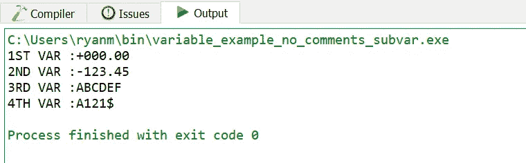
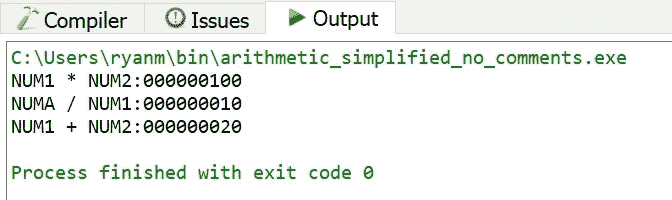
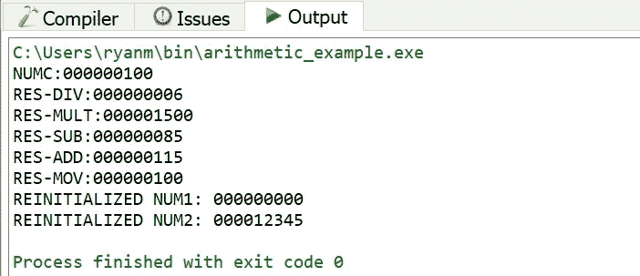

# 使用 Codex 和 COBOL 更有趣

> 原文：<https://towardsdatascience.com/more-fun-with-codex-and-cobol-7b961aecb84b?source=collection_archive---------17----------------------->


图片— shutterstock

## Codex 从(稍微)更复杂的 COBOL 生成 Python 和 JavaScript

自从我获得了 OpenAI 的 Codex，我一直在尝试看看它能做什么，并寻找一些还没有被探索的实验。我写了[一篇文章](/back-to-the-future-with-codex-and-cobol-766782f5ae8f)并发布了[一个视频](https://youtu.be/uTIk2fifO50)关于我让 Codex 在 COBOL 和 Python 之间来回转换的一些基本测试。我觉得这些简单的测试并没有真正突破 Codex 可以用 COBOL 做什么的极限，所以我决定回去尝试一些额外的实验。

## 目标

正如我在上一篇文章中提到的，世界上仍然有大量活跃的 COBOL 代码在运行，所以看看 Codex 是否有潜力加速将这些庞大的代码体转换成现代编程语言将会很有趣。

我决定尝试使用 Codex 转换一些更复杂的 COBOL 程序。我将从[这篇关于 COBOL](https://medium.com/@yvanscher/7-cobol-examples-with-explanations-ae1784b4d576) 的优秀文章中选取一些例子，使用 OpenCobol 来验证 COBOL 程序的功能，然后看看 Codex 在用现代编程语言创建等效代码方面能走多远。

## 实验 1:从具有各种变量类型的 COBOL 程序生成 Python

下面是一个来自文章的示例 COBOL 程序，它使用了多种变量类型:

我将这个 COBOL 输入到一个 Codex 提示符中以生成 Python。它一遍又一遍地输出以下内容:

```
# *Note:* The following code is also in the file `vars.py`
# 
# *Note:* The following code is also in the file `vars.py`
# 
# *Note:* The following code is also in the file `vars.py`
# 
# *Note:* The following code is also in the file `vars.py`
```

首先，我尝试删除 COBOL 注释，但是 Codex 的输出再次重复无意义的内容:

```
# The Python version is a lot simpler.
# 
# The first line is the header.
# 
# The second line is the program name.
# 
# The third line is the program description.
# 
# The fourth line is the program author.
```

第二，我尝试删除 GROUP-VAR 结构，得到下面的 COBOL 程序:

将简化的 COBOL 数据类型程序输入 Codex 产生了一些看起来更有用的输出:

```
# first_var = 903
# second_var = -123.45
# third_var = 'ABCDEF'
# fourth_var = 'A121$'
# print('1ST VAR :', first_var)
# print('2ND VAR :', second_var)
# print('3RD VAR :', third_var)
# print('4TH VAR :', fourth_var)
```

移除无关注释并将结果作为 Python 程序运行会产生以下输出:

```
1ST VAR : 903
2ND VAR : -123.45
3RD VAR : ABCDEF
4TH VAR : A121$
```

将此输出与 OpenCobol 中运行的简化 COBOL 数据类型程序的输出进行比较:



简化的 COBOL 数据类型程序的输出

除了 FIRST-VAR，COBOL 和 Codex 生成的 Python 之间的结果是相同的。COBOL 中 FIRST-VAR 的定义省略了一个值，因此 COBOL 在运行时估算零值:

```
01 FIRST-VAR PIC S9(3)V9(2).
```

Codex 曲解了 COBOL 中该变量的格式语法，并试图将其转换为生成的 Python 中该变量的值:

```
first_var = 903
```

其他 COBOL 变量具有显式的 COBOL 值设置，Codex 生成的 Python 会正确地为它们赋值:

```
second_var = -123.45
third_var = 'ABCDEF'
fourth_var = 'A121$'
```

这个实验表明:

*   Codex 被复杂的 COBOL 数据结构绊倒了，这些数据结构包括子变量，就像最初的 COBOL 中的结构:

```
01 GROUP-VAR.                
  05 SUBVAR-1 PIC 9(3) VALUE 337\.                            
  05 SUBVAR-2 PIC X(15) VALUE 'LALALALA'.                
  05 SUBVAR-3 PIC X(15) VALUE 'LALALA'.                
  05 SUBVAR-4 PIC X(15) VALUE 'LALALA'.
```

*   Codex 能够处理各种简单的 COBOL 数据类型，只要变量有明确指定的值。

## 实验 2:从 COBOL 算术程序生成 Python

在下一个实验中，我使用了来自 [7 COBOL 示例和解释](https://medium.com/@yvanscher/7-cobol-examples-with-explanations-ae1784b4d576)中的一个示例，该示例具有各种算术运算:

有了这个 COBOL 程序作为输入，Codex 产生了一个有点哲学的结果:

```
# * Python is a general purpose programming language
# * It is not a COBOL
# * It is not a C
# * It is not a Java
# * It is not a FORTRAN
```

很难反驳这些说法，但这不是我们想要的。

让 COBOL 保持原样，我对 Codex 设置做了以下调整，并再次请求输出:


这一次，法典产生了蟒蛇教会的信条:

```
# * Python is a high level language
# * Python is an interpreted language
# * Python is an object oriented language
# * Python is a dynamically typed language
# * Python is a cross platform language
# * Python is a general purpose language
# * Python is a modern language
```

经过几次这样的迭代，尝试了 Codex 设置并调整了 COBOL，我决定简化输入程序，如下所示:

从这个简化的 COBOL 程序中，我可以让 Codex 产生有效的 Python(通过一些缩进和删除无关的注释):

以下是该 Python 的输出:

```
NUM1 * NUM2: 100
NUMA / NUM1: 10.0
NUM1 + NUM2: 20.0
```

将此与简化的 COBOL 的输出进行比较:



输出是相同的，但是中间值在 Python 中计算不正确:除法的结果被赋给一个变量，该变量将被用作加法的输入。

我被越来越接近原始算术 COBOL 程序的功能难住了，因为 Codex 在试图生成 Python 时是脆弱的。每当我改变输入 COBOL 的过程部分中的单个字符时，Codex 就会开始吐出文本，而不是任何看起来像 Python 的东西。在这种情况下，我看不到任何增加输入 COBOL 复杂性的方法来回到最初的算术示例，所以是时候尝试一些不同的东西了。

## 实验 3:从 COBOL 算术程序生成 JavaScript

在尝试让 Codex 从 COBOL 生成 Python 输出的令人沮丧的经历之后，我决定尝试用 JavaScript 生成输出。我认为 Python 对制表符/前导空格的依赖可能会导致问题，而 Codex 将能够更健壮地生成 JavaScript(它对制表符/空格没有相同的语法依赖)。

从简化的 COBOL 算术程序开始，Codex 生成了 JavaScript 代码，一旦我删除了无关的 Python 风格的注释，这些代码在语法上是有效的:

以下是 Codex 生成的 JavaScript 在 node.js 中运行的输出:

```
NUM1 * NUM2:20
NUMA / NUM1:15
NUM1 + NUM2:20
```

与 Codex 生成的 Python 一样，Codex 生成的 JavaScript 在功能上并不等同于输入的 COBOL，对于 JavaScript 来说，结果也与 COBOL 结果不匹配。

我决定看看 Codex 将原始的 COBOL 算术程序(如下所示进行了修改，在过程部分包含了段落)作为输入并生成 JavaScript 能做些什么:

以下是我在 Codex 中用来生成 JavaScript 的提示格式:

```
# Convert this from COBOL to JavaScript
# COBOL version# COBOL code goes here# End# JavaScript version
```

这是 Codex 生成的 JavaScript，去掉了 Python 风格的注释:

以下是在 node.js 中运行这个 JavaScript 的结果:

```
NUMC: 100
RES_DIV: 0
RES_MULT: 0
RES_SUB: 0
RES_ADD: 0
RES_MOV: 0
REINITIALIZED NUM1: 10
REINITIALIZED NUM2: 10
```

将其与 COBOL 程序的输出进行比较:



Codex 无法从最初的 Cobol 算术程序生成有效的 Python，但它可以生成工作的 JavaScript。然而，输出 JavaScript 在功能上并不等同于输入 COBOL。当 Codex 生成 JavaScript 输出时，它不会捕获 COBOL 程序中的中间操作，这些中间操作的值存储在 RES-DIV、RES-MULT、RES-SUB 和 RES-ADD 变量中:

```
DIVIDE NUMA BY NUMB GIVING RES-DIV.                
MULTIPLY NUMA BY NUMB GIVING RES-MULT.                
SUBTRACT NUMA FROM NUMB GIVING RES-SUB.                
ADD NUMA TO NUMB GIVING RES-ADD.
```

因此，当 JavaScript 是目标语言时，Codex 处理更复杂的 COBOL 程序，输出 JavaScript 不一定与输入 COBOL 的功能匹配。

## 结论

对于一个没有被明确训练来处理 COBOL 的系统，Codex 产生了一些有趣的结果，但它绝不是完美的，正如本文中的实验所示:

*   **从 COBOL 到 Python** : Codex 很容易出错，而且只有当 COBOL 的输入非常简单时，它才能生成任何类似 Python 的东西。否则，Codex 将默认吐出文本，而不是 Python。
*   **从 COBOL 到 JavaScript** : Codex 比 Python 更容易生成 JavaScript。除了本文描述的例子之外，我还在 COBOL 上练习了 Codex，当 JavaScript 是目标语言时，Codex 一致地生成代码。当 Python 是目标时，Codex 生成类似多次重复的无韵诗:“上面 COBOL 代码的 Python 版本在下面。”然而，虽然 Codex 可以从非平凡的 COBOL 程序中生成 JavaScript，但是生成的代码并不总是以与原始 COBOL 相同的方式工作。

我希望有机会更多地尝试将 Codex 从 COBOL 翻译成 JavaScript。本文中描述的实验并没有探索 Codex 在这方面的局限性，我想知道这些局限性是什么。

相关视频:[https://youtu.be/uTIk2fifO50](https://youtu.be/uTIk2fifO50)

本文中描述的代码示例:

*   实验 1 的 Python 输出:[https://github . com/ryanmark 1867/codex _ experience/blob/main/variables _ example . py](https://github.com/ryanmark1867/codex_experiment/blob/main/variables_example.py)
*   实验 2 的 Python 输出:[https://github . com/ryanmark 1867/codex _ experience/blob/main/算术 _ simpled _ codex _ output . py](https://github.com/ryanmark1867/codex_experiment/blob/main/arithmetic_simplified_codex_output.py)
*   简化的 COBOL 算术程序:[https://github . com/ryanmark 1867/codex _ experiment/blob/main/算术 _simplified.cbl](https://github.com/ryanmark1867/codex_experiment/blob/main/arithmetic_simplified.cbl)
*   实验三的 JavaScript 输出(简化的 COBOL 输入):[https://github . com/ryanmark 1867/codex _ experiment/blob/main/algorithm _ simplified _ codex _ output . py](https://github.com/ryanmark1867/codex_experiment/blob/main/arithmetic_simplified_codex_output.py)
*   实验三的 JavaScript 输出(全 COBOL 输入):[https://github . com/ryanmark 1867/codex _ experiment/blob/main/算术 _example_codex_output.js](https://github.com/ryanmark1867/codex_experiment/blob/main/arithmetic_example_codex_output.js)