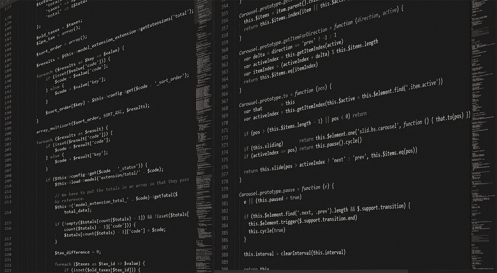

# 更多的方法意味着更好的代码

> 原文：<https://towardsdatascience.com/more-methods-means-better-code-1d3b237f6cf2?source=collection_archive---------20----------------------->

## 如何使用提取技术来编写更好的代码？



([https://pixabay.com/images/id-1873831/](https://pixabay.com/images/id-1873831/)

# 介绍

C 计算机编程可能非常复杂，并且很容易对计算机编程产生误解。这些误解会给你可能正在构建的软件带来很多问题。例如，一些函数经常重复代码，浪费了包内的空间，却没有完成多少工作。另一个常见的陷阱是非常长的、非结构化的代码，由于其长度和复杂性而难以阅读。这使得除了你自己，几乎任何人都无法接近代码，并且如果你打算和别人一起工作，会产生很多问题。

在编写软件时，避免使用方法是一件很糟糕的事情。的确，方法调用会让你的软件变慢。然而，方法调用对性能的影响是如此之小，以至于在大多数情况下都是微不足道的。避免使用方法调用只会对性能有一点点的提升，同时会使你的软件无法阅读并且不断重复。

# 命名您的代码

使用方法调用进行重构时，最重要的事情是给代码命名。这是一个很好的练习，对于程序员来说也是一个很好的实践。使用这种技术，我们可以将方法、模块或类型分成更小的部分，然后找到不同代码命名部分之间的相关性。命名代码后，我们就可以决定使用什么方法来使代码变得更好。考虑下面的函数，这是我为了将字典转换成 HTML5 表而编写的函数。

```
function _head(lookup::Dict, count::Int64 = 5; style::String = "classic")
    thead = "<thead><tr>"    
tbody = "<tbody>"
    [thead = string(thead, "<th>", string(name), "</th>") for name in keys(lookup)]
    thead = string(thead, "</thead>")
    cols = values(lookup)
    features = [push!(val) for val in cols]
    for i in 1:length(features[1])
        obs = [row[i] for row in features]
        tbody = string(tbody, "<tr>")
        [tbody = string(tbody, "<td>", observ, "</td>")
 for observ in obs]
        tbody = string(tbody, "</tr>")
    end
    tbody = string(tbody, "</tbody>")
    compisition = string(_css,"<table class = \"", style, "\">",     thead, tbody,"</table>")
    display("text/html", compisition)
end
```

这是一个算法的 Julia 版本，我也是用 Python 写的。如果您想了解我是如何编写 Python 等价物的，您可以在这里查看我写的关于它的文章:

[](/automating-markup-with-python-and-html5-9054362e87ce) [## 使用 Python 和 HTML5 自动化标记

### 使用原始 Python 处理 HTML5 非常容易，以便从字典数据创建 web 友好的表格。

towardsdatascience.com](/automating-markup-with-python-and-html5-9054362e87ce) 

虽然这个函数并不太长，也没有写得很糟糕，但是很难看一眼就决定如何改进。使用命名方法，我们可以识别代码库的较小部分，并一部分一部分地工作，而不会被整个函数淹没。让我们把这个函数分成几个确定的部分，它们在算法中有不同的用途。第一部分代码我称之为“参数和变量初始化部分”这通常适用于大多数方法，因为这是相当常见的编程技术。这部分代码创建了一些需要在函数的其余部分引用的变量，还包括方法别名的定义及其参数:

```
function _head(lookup::Dict, count::Int64 = 5; style::String = "classic")
    thead = "<thead><tr>"    
tbody = "<tbody>"
```

虽然我们在这里没有太多的重构工作可以做，但是获取这部分代码并理解它本身确实可以帮助我们理解代码的其他部分。代码的下一部分将列名连接到 thead 标记内的一行中，因此我们可以将这部分称为 header 部分:

```
[thead = string(thead, "<th>", string(name), "</th>") for name in keys(lookup)]
thead = string(thead, "</thead>")
```

这段代码在工作方面也没有什么需要改进的地方，因为这里的代码非常简洁，易于理解。幸运的是，理解了函数的参数和变量初始化部分，我们也可以更好地理解函数这一部分的代码，因为这一部分的结尾只是函数头初始化的逆过程。现在让我们看看下一部分，它是为我们的表体生成 HTML5 的，我们将把它命名为 body 部分:

```
cols = values(lookup)
    features = [push!(val) for val in cols]
    for i in 1:length(features[1])
        obs = [row[i] for row in features]
        tbody = string(tbody, "<tr>")
        [tbody = string(tbody, "<td>", observ, "</td>")
 for observ in obs]
        tbody = string(tbody, "</tr>")
    end
    tbody = string(tbody, "</tbody>")
```

这段代码比其他函数要广泛得多，而且肯定会有一些非常显著的变化。从新的角度来看这段代码，我们看到除了在参数和初始化部分声明的成员之外，所有的成员都是在这个部分中创建的。现在这已经不在代码中了，很容易看出前两行可以很容易地重构为一行代码:

```
cols = values(lookup)
    features = [push!(val) for val in cols]
```

变成了:

```
features = [push!(val) for val in values(lookup)]
```

观察它下面的迭代循环，我们还可以看到循环中有一个迭代循环:

```
for i in 1:length(features[1])
        obs = [row[i] for row in features]
        tbody = string(tbody, "<tr>")
        [tbody = string(tbody, "<td>", observ, "</td>")
 for observ in obs]
        tbody = string(tbody, "</tr>")
    end
    tbody = string(tbody, "</tbody>")
```

当然，为了将数据放入行中并填充行，这些循环是必要的，因为这个循环填充每一行的值，而不仅仅是一行。然而，当涉及到我们函数的这一部分时，用于清理这些方法的下一项技术肯定会派上用场。但是现在，让我们继续这个函数的结论，我称之为“完成并返回”函数的这一部分体现了我们之前在函数中所做的所有工作，并以一个返回来结束函数:

```
 compisition = string(_css,"<table class = \"", style, "\">",     thead, tbody,"</table>")
    display("text/html", compisition)
end
```

对于这部分功能，我们也没有太多可以改进的地方，这是完全可以接受的。

# 提取，血统

现在我们已经命名了函数的各个部分，接下来我们来讨论一个好的方法应该是什么样子。任何方法都要考虑的最重要的部分是 IO、输入和输出。根据我们命名的部分，这将是“参数和初始化”和“完成和返回”部分。函数的这些部分不能移动，它们是函数的主干。如果我们试图将参数移动到一个不同的函数中，请考虑我们将参数提供到一个不同的函数中——违背了目的。返回也是如此，成员变量需要在这个函数的作用域内声明，以便由函数使用或由函数返回，所以它们也属于这里。

记住这一点，对于提取技术，我们真的需要看看函数的其他命名部分，它们是:

*   头

```
[thead = string(thead, "<th>", string(name), "</th>") for name in keys(lookup)]
thead = string(thead, "</thead>")
```

*   主体(带有我们稍微修改过的代码)

```
 features = [push!(val) for val in values(lookup)]
    for i in 1:length(features[1])
        obs = [row[i] for row in features]
        tbody = string(tbody, "<tr>")
        [tbody = string(tbody, "<td>", observ, "</td>")
 for observ in obs]
        tbody = string(tbody, "</tr>")
    end
    tbody = string(tbody, "</tbody>")
```

函数的这两个部分当然可以是独立的函数。为了评估一个部分是否可能是它自己的函数，我们需要考虑这些部分的输入和输出——作为参数和返回，就像它们在新方法中一样。对于 thead 示例，我们需要传递 lookup 的键，或者 lookup 字典本身，并且我们可以期待 thead 字符串作为返回返回。至于 tbody 示例，我们需要将我们的特性作为参数传递，我们可以期待 tbody 字符串的返回。

鉴于头部相当短，只有两行代码，我们不太可能选择提取它。这里的代码意图非常清楚，在我们的方法中没有占用过多的空间，所以我们当然可以保留它。也就是说，有平等的机会提取它，这样做只是一个偏好的问题。另一方面，主体部分运行多达 9 行代码。客观地说，除了这一部分，我们方法的其余部分只有 8 行代码。这意味着仅这一部分就比我们整个函数的其余部分都要大！考虑到这一点，这当然是一个提取的候选人！现在让我们通过编写一个全新的函数来提取它:

```
function body(values)
    features = [push!(val) for val in values]
    for i in 1:length(features[1])
        obs = [row[i] for row in features]
        tbody = string(tbody, "<tr>")
        [tbody = string(tbody, "<td>", observ, "</td>")
 for observ in obs]
        tbody = string(tbody, "</tr>")
    end
    return(string(tbody, "</tbody>"))
endfunction _head(lookup::Dict, count::Int64 = 5; style::String = "classic")
    thead = "<thead><tr>"    
tbody = "<tbody>"
    [thead = string(thead, "<th>", string(name), "</th>") for name in keys(lookup)]
    thead = string(thead, "</thead>")
    tbody = body(values(lookup) compisition = string(_css,"<table class = \"", style, "\">",     thead, tbody,"</table>")
    display("text/html", compisition)
end
```

# 结论

许多程序员偏离了将他们的代码分成不同方法的做法。然而，这可能会产生许多可读性方面的问题，并且通常会使代码不那么简洁和易于使用。使用本文介绍的命名和提取技术，您可以保持代码的组织性和可读性，并使其他人更容易使用您的软件。我希望这篇文章能给你提供信息，也许能帮助你成为一名更好的程序员。非常感谢您的阅读！