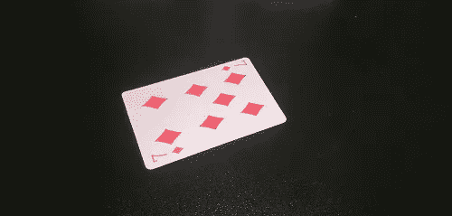
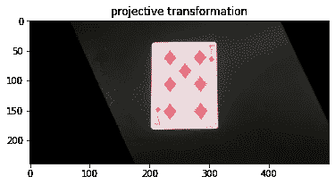
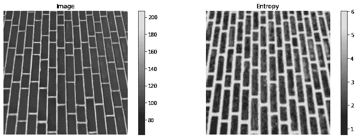

# 事情并不象初看到的那样简单

> 原文：<https://towardsdatascience.com/more-than-meets-the-eye-image-transformations-using-homography-and-texture-metrics-in-python-db03427c5091?source=collection_archive---------45----------------------->

## Python 中使用单应性和纹理度量的图像变换


照片由 [Cookie 在](https://unsplash.com/@cookiethepom?utm_source=medium&utm_medium=referral) [Unsplash](https://unsplash.com?utm_source=medium&utm_medium=referral) 上的 Pom 拍摄

在我以前的文章中，我讨论了图像处理的不同方法。其中一些是[图像清理](https://nico-aguila.medium.com/put-on-the-filter-and-well-clean-out-the-fillers-a7dfd37b88bd)甚至[物体检测](https://nico-aguila.medium.com/spot-the-blob-on-the-job-image-detection-labeling-and-measurement-using-python-6faf7af2fc19)。在这篇文章中，我们将更多地讨论图像的变换和特征生成，即:单应性和纹理度量。

**单应**

单应性可以进行的变换包括旋转、平移、缩放，甚至倾斜。这可以通过映射两个平面投影之间的坐标来实现。

这方面的一个例子是我们的文档扫描仪应用程序，其中纸张被转换为可读的视角。让我们以下面的代码为例来尝试一下:



作者图片

为了生成卡片的俯视图，我们必须计算单应矩阵。这是通过获得卡片角的坐标，以及卡片将被投影到自顶向下视图的坐标来实现的。

```
#import libraries
from skimage.io import imread, imshow
import matplotlib.pyplot as plt
import numpy as np#load the card
cards = imread('medium/cards.jpg')#initialize source and destination coordinates
src = np.array([319, 134,
                273, 61,
                133, 103,
                162, 188,
]).reshape((4, 2))dst = np.array([203, 37,
                314, 36,
                314, 181,
                203, 182,
]).reshape((4, 2))
```

对于我们希望图像呈现的投影类型，有不同类型的变换。因为我们希望保留卡片形状的线条，所以我们将使用投影类型的变换。不同的类型可以在[这里找到](https://scikit-image.org/docs/stable/auto_examples/transform/plot_transform_types.html)供你参考。

```
#transform image point of view
from skimage import transform
tform = transform.estimate_transform('projective', src, dst)
tf_img = transform.warp(cards, tform.inverse)
fig, ax = plt.subplots()
ax.imshow(tf_img)
_ = ax.set_title('projective transformation')
```



作者图片

**纹理度量**

由于一些图像在本质上非常敏感，颜色信息可能在多个区域不一致，因此可以考虑另一种方法来表征我们的图像。纹理是这种替代形式，其中考虑了强度值的空间排列。

样本纹理度量可以通过使用熵作为度量来完成。熵的好处是它可以检测灰度中强度值的变化。给定下面的代码，我们可以看到熵在起作用

```
import matplotlib.pyplot as plt
import numpy as npfrom skimage import data
from skimage.util import img_as_ubyte
from skimage.filters.rank import entropy
from skimage.morphology import diskimage = img_as_ubyte(data.brick())fig, (ax0, ax1) = plt.subplots(ncols=2, figsize=(12, 4),
                               sharex=True, sharey=True)img0 = ax0.imshow(image, cmap=plt.cm.gray)
ax0.set_title("Image")
ax0.axis("off")
fig.colorbar(img0, ax=ax0)img1 = ax1.imshow(entropy(image, disk(5)), cmap='gray')
ax1.set_title("Entropy")
ax1.axis("off")
fig.colorbar(img1, ax=ax1)fig.tight_layout()plt.show()
```



作者图片

这就是你可以用单应性和纹理度量做的样本输出。

对我的工作感兴趣？你可以在我的个人资料中看到更多的故事

<https://nico-aguila.medium.com/> 