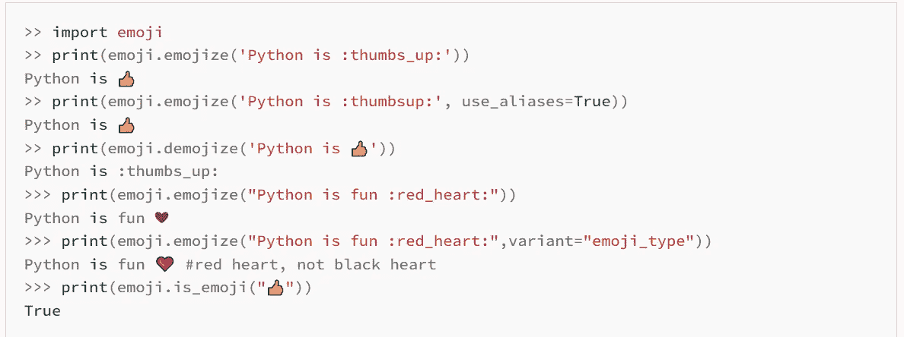
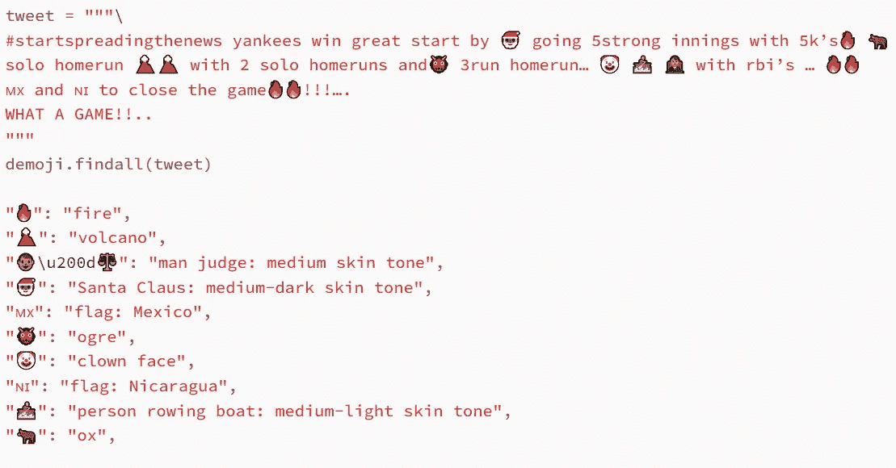

# 不仅仅是文字——你的表情符号表达了很多

> 原文：<https://towardsdatascience.com/more-than-words-your-emoji-says-a-lot-96f4ec21af23?source=collection_archive---------32----------------------->

## 三个表情符号解释器 Python 包的简要概述。


照片由[多明戈·阿尔瓦雷斯 E](https://unsplash.com/@domingoalvarze?utm_source=medium&utm_medium=referral) 在 [Unsplash](https://unsplash.com?utm_source=medium&utm_medium=referral) 拍摄

几年前，我需要从 Twitter 数据流中检索 tweets，以完成关于在线说服分类的论文。正如任何第一个大规模研究项目所预期的那样，任何可能出错的事情都会出错。我在检索 8GB 的推文后发现的一个问题是，在所有编码之间的某个地方，所有东西都不可读，并且包含奇怪的符号和类似胡言乱语的字符——我怀疑一个可能的原因是表情符号。

这件事让我开始探索各种解释表情符号的 python 包。

# 表情符号

第一个包是`emoji`,它通过简单安装检索表情名称，反之亦然，如下例所示:



包文档截图[https://pypi.org/project/emoji/](https://pypi.org/project/emoji/)

这是您可能想要与语言模型结合的包。你可以替换句子中的表情符号，并根据自己的喜好使用 NLP 模型。当使用 n-grams 时，将表情符号解释放在句子中的原始位置很重要，你可以通过标记化来做到这一点。

以下是从[包文档](https://pypi.org/project/emoji/)中截取的截图代码，方便您使用:

```
>> import emoji
>> print(emoji.emojize('Python is :thumbs_up:'))
Python is 👍
>> print(emoji.emojize('Python is :thumbsup:', use_aliases=True))
Python is 👍
>> print(emoji.demojize('Python is 👍'))
Python is :thumbs_up:
>>> print(emoji.emojize("Python is fun :red_heart:"))
Python is fun ❤
>>> print(emoji.emojize("Python is fun :red_heart:",variant="emoji_type"))
Python is fun ❤️ #red heart, not black heart
>>> print(emoji.is_emoji("👍"))
True
```

`emoji`包很棒。它还支持除英语之外的其他语言，但如果你在一条推文或一个句子中有多个表情符号，该怎么办？在这种情况下，你可能会考虑为你原来句子中的所有表情符号创建一个字典，供以后使用。为此，更好的选择可能是`demoji`方案。它有一个选项，可以检索文本中出现的所有表情符号的字典。就我而言，这正是我所需要的，这样我就不会在处理数据时丢失信息。

# 德莫吉

`demoji`这个包的用法如下:



包文档截图[https://pypi.org/project/demoji/](https://pypi.org/project/demoji/)

这个包`demoji.findall()`创建了一个表情符号的字典和它们与原文分开的解释。如果你想在语言模型中使用这个包，你需要使用`demoji.replace()`-它将取代表情符号。

另一个选项是`demoji.replace_with_desc()`，它用描述代码替换字符串中的表情符号。

为了方便您的使用，下面是从[包文档](https://pypi.org/project/demoji/)中截取的截图代码:

```
>>> tweet = """\
... #startspreadingthenews yankees win great start by 🎅🏾 going 5strong innings with 5k’s🔥 🐂
... solo homerun 🌋🌋 with 2 solo homeruns and👹 3run homerun… 🤡 🚣🏼 👨🏽‍⚖️ with rbi’s … 🔥🔥
... 🇲🇽 and 🇳🇮 to close the game🔥🔥!!!….
... WHAT A GAME!!..
... """
>>> demoji.findall(tweet)
{
    "🔥": "fire",
    "🌋": "volcano",
    "👨🏽\u200d⚖️": "man judge: medium skin tone",
    "🎅🏾": "Santa Claus: medium-dark skin tone",
    "🇲🇽": "flag: Mexico",
    "👹": "ogre",
    "🤡": "clown face",
    "🇳🇮": "flag: Nicaragua",
    "🚣🏼": "person rowing boat: medium-light skin tone",
    "🐂": "ox",
}
```

# DeepMoji

最后，在搜索适合我需求的包时，我找到了这个令人惊叹的 python 包`deepmoji.`顾名思义，这是一个基于深度学习的包，它检索了 N 个最相似的意思表情符号。

这个令人难以置信的软件包提供了一个全新的方法来分析数据，找到文本和作者之间的相似意义。

下面是一个基于 PyTorch 版本 [torchMoji](https://github.com/huggingface/torchMoji) 实现 [DeepMoji](https://www.media.mit.edu/projects/deepmoji/overview/) 包的简单教程:

我搜索了为特定任务解释表情符号的包，但它们有其他用途。你可能想考虑一个分析你的朋友或家人 WhatsApp 群组的项目:每个人都发送哪种表情符号？也许用 DeepMoji 对使用表情符号意义相近的成员进行分类？可能性是无限的。欢迎你在下面的评论中告诉我这些包可能对其他项目有用。有没有其他你喜欢的解释表情符号的 python 包？