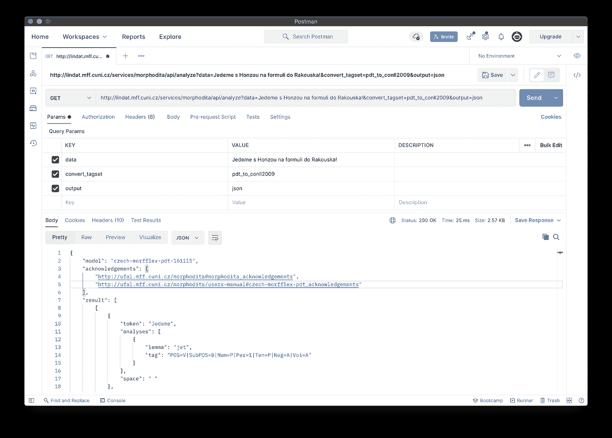
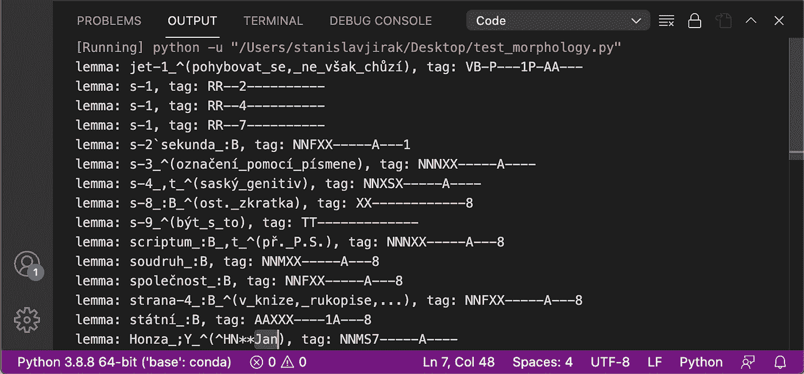

# 强屈折语言的形态分析

> 原文：<https://towardsdatascience.com/morphological-analysis-in-strongly-inflected-languages-623e2cc8a443?source=collection_archive---------29----------------------->

## 在数据科学中，如何有效地为具有丰富形态句法复杂性的非英语语言建立语言模型

托马斯·凯利在 [Unsplash](https://unsplash.com/s/photos/language?utm_source=unsplash&utm_medium=referral&utm_content=creditCopyText) 上的照片

***关键词*** *:自然语言处理、半监督训练、数据科学、命名实体识别、词性标注、语言模型、词法分析、词法分析、单词嵌入、文本分类*

词法分析、NER(命名实体识别)和词性(词性)标注在 NLU(自然语言理解)中起着重要的作用，并且在强屈折(融合)的外语中可能变得特别困难，例如捷克语、德语、阿拉伯语或汉语，而一个单词可能有许多变体和后缀，这取决于其语法上下文(例如:捷克语名称:Jan — Honza — Honzík、Honzíkovi、Honzovi……)。因此，如果不将一个单词转换成其适当的引理形式，我们很难考虑任何文本分类，例如，将主格名词转换成其关于 NLG(自然语言生成)的假设语言情况。

我想到的一个外语通用方法的例子可能是使用 ULMFiT(一种基于迁移学习的方法)，在维基百科等大型文本语料库上进行训练，在目标语料库上进行微调，并使用它来编码您的文档。这可能会产生一个基本的分类模型，而当前的 FastAi 库实现 sentencecode 来将单词分割成标记(从而产生更小的词汇)使这项工作变得更加容易。当这可能花费时间和资源时，为 NER 标记数据和训练用于词性标记的语言模型是昂贵的。例如，如果没有这些步骤，我们将无法构建基于意图的聊天机器人。

这正是布拉格查尔斯大学数学和物理学院形式和应用语言学研究所作为开源软件发布的 MorphoDiTa 工具(形态学词典和标记器)的用处。它的特点是词汇识别和单词及语义标记(名、姓、公司、俚语、粗俗术语、位置、子位置、大小写等)，既可以作为独立的库使用，也可以通过 REST API 作为 web 服务使用。目前，它公开提供捷克语、斯洛伐克语和英语，但阿拉伯语也在开发中，该模型基本上可以为任何语言定制——只要有足够的标签数据。让我们从用户的角度简单了解一下它是如何工作的…

邮递员|作者的印刷屏幕

上面我们看到的是 Postman 中 API 的 JSON 响应。具体来说，我们用给定的参数调用分析方法。你能注意到的是，每个记号都有它的引理和标签。文档中描述了标记标志(参见参考资料)。例如，你可以看到单词“Jedeme”(“我们要去”)有它的词条“jet”(“去”)，它是一个动词(POS)，现在或未来形式(subPOS)。此外，还有 lemma 结构，当我们用 Python 迭代 json 文件时，这一点很明显，如下图所示。

VS 代码|作者打印屏幕

例如，你可以看到动词“jet”(“go”)有它的基本形式，并且有一个注释；单词“s”(“with”)有很多可能的缩写，用“:B”表示，这是一个撒克逊的外国风格的术语，用“，t”表示；并且还可以看到给定名称的文字形式(lemma("；y”)“Honza”就是“Jan”。

您可以在我的 GitHub repo 上看到完整的代码，并通过点击此处亲自体验一下[。](https://github.com/jirakst/morphodita_test/blob/main/test_morphology.py)

如上面的简单例子所示，当您需要处理一门外语的丰富的形态句法复杂性时，MorphoDiTa 提供了一个有价值的工具。有了它，您可以轻松地将令牌转换为词条，然后在 NLU/NLP 部分中使用 FastText(它在生成词向量时会考虑 n 元语法)将这些词条进一步转换为语言模型。在基于意图的聊天机器人的情况下，这在理论上也可以作为一个实体提取器用于填充你的槽，因为所有这些信息都是需要的(例如语言格——与格:可能是接收东西的人、姓名、公司、时间、地点等)。)已经是形态分析的一部分。此外，您还可以在创建单词向量时使用这些信息作为特征，从而为包括英语在内的任何语言生成比没有词法分析丰富更准确的单词分类和预测模型。

如果没有 MorphoDiTa，非英语国家(占世界大多数)中与 NLP 相关的任何工作都将变得相当复杂，并且将处于研究领域的边缘，甚至是简单的开发和数据科学任务。
词法分析甚至可以为英语语言带来优于现有 NLP 库的好处。

**参考文献**:

*   [https://arxiv.org/pdf/1810.10222.pdf](https://arxiv.org/pdf/1810.10222.pdf)
*   [https://aclanthology.org/C12-1015.pdf](https://aclanthology.org/C12-1015.pdf)
*   [https://aclanthology.org/P14-5003.pdf](https://aclanthology.org/P14-5003.pdf)
*   [https://aclanthology.org/E09-1087.pdf](https://aclanthology.org/E09-1087.pdf)
*   [https://ufal.mff.cuni.cz/morphodita](https://ufal.mff.cuni.cz/morphodita)
*   [https://github.com/ufal/morphodita](https://github.com/ufal/morphodita)
*   [https://lindat.mff.cuni.cz/repository/xmlui/handle/11234/1-1836](https://lindat.mff.cuni.cz/repository/xmlui/handle/11234/1-1836)
*   [https://ufal.mff.cuni.cz/pdt2.0/doc/manuals/en/m-layer/html/ch02.html](https://ufal.mff.cuni.cz/pdt2.0/doc/manuals/en/m-layer/html/ch02.html)