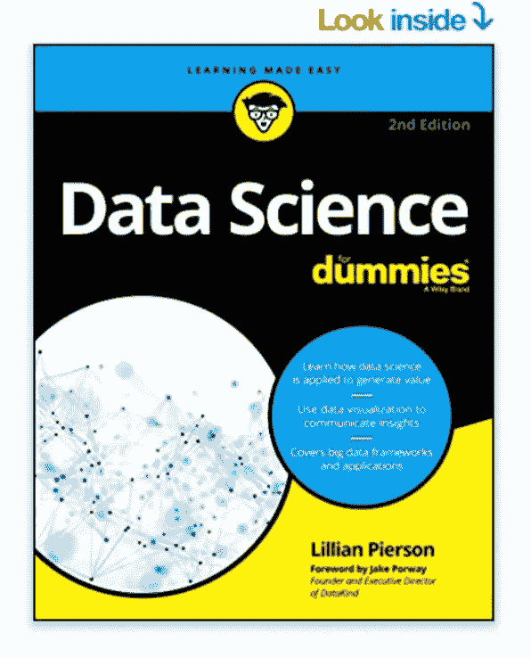
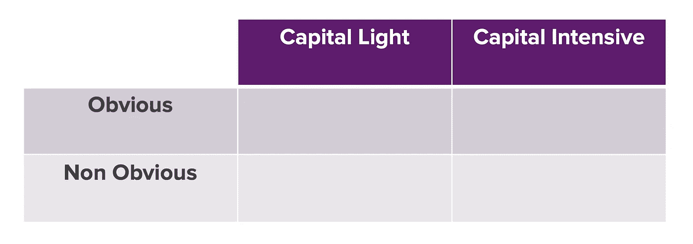

# 大多数业务经理不关心你可能学过的复杂算法

> 原文：<https://towardsdatascience.com/most-business-managers-dont-care-about-fancy-algorithms-you-might-have-discovered-6ef7761310fa?source=collection_archive---------37----------------------->

## 数据科学的主要作者说。以下是他们在雇用数据科学家时实际寻找的东西。

Unsplash.com[上](https://unsplash.com/photos/gvc7MK4gnDk)的 [Lucrezia Carnelos 的照片](https://unsplash.com/@ciabattespugnose)

你可能会惊讶地听到，大多数雇用数据科学家的商业领袖实际上并不关心你可能读过或学过的花哨的统计/ML 算法。当然，基于有抱负的数据希望者的意见，你必须在你的技术工具包下有复杂的、最先进的算法，这似乎是反直觉的。

但业内资深人士却不这么看。我在加州硅谷担任数据科学家才三年，但我对商业问题的复杂算法解决方案越来越怀疑和犹豫。以下是造成这种情况的基本原因，也是这些商业领袖在聘用数据科学家时所寻求的。

# 1.商业领袖“根本不关心复杂的算法”。

这种说法实际上直接来自**的《傻瓜数据科学》(第二版)。作者莉莲·皮尔森写道:**

> “大多数业务经理和组织领导都不关心编码和复杂的统计算法。另一方面，他们对寻找通过提高销售率和减少低效来增加业务利润的新方法非常感兴趣。

[虚拟数据科学](https://www.amazon.com/Data-Science-Dummies-2nd-Computers/dp/1119327636)

Lilian 谈到了我认为当今数据科学中最被误解的部分:它的实际目的。我遇到的许多有抱负的数据科学家对学习复杂的技术和算法更感兴趣，而不是理解这些算法如何被用来影响公司的底线。

我对 TradeRev(现在在 Acerta)ML 技术主管的 TDS 采访说明了一切。他在数据和软件工程领域拥有超过 15 年的行业经验，他告诉我:

> “数据科学家通常关心模型、Jupyter 笔记本和超参数……但你需要考虑业务环境，机器学习如何适应业务。
> 
> [例如]考虑业务环境——ML 如何适应业务。ML 是商业的一部分，就像推荐系统一样。推荐系统不是业务，而是业务的一部分。"

如果你是一个经验丰富的行业老手，这种关于在技术冷静之前优先考虑业务环境的观点应该是很自然的。你知道，归根结底，重要的是业务，而不是算法。

但是作为一名有抱负的数据科学家，你可能会对这样的说法感到震惊。我见过太多的有志之士，他们花了无数的时间学习在权威期刊上发表的所有最新和最复杂的算法，希望学习算法所花的时间/金钱与工作成就直接相关。

不难看出为什么。机器/深度学习算法被神秘和敬畏所笼罩，市场上学习这些算法的过多课程似乎验证了它们在就业市场上的重要性，如果不是整个工作的话。

但诚实的事实是，在商业环境中，如果一家公司不能从这些算法中赚钱，它们就会被视为毫无意义的投资。很多时候，像深度强化学习这样的利基算法无法为一般的商业目的货币化，从而产生可观的收入。

以 Spotify(之前在 DoorDash 工作)的高级数据科学家 Jeffrey Li 为例，我在 TDS 采访过他。听听他对与求职面试体验相关的业务影响的看法:

> 根据我从评分带回家的经验，我在市场上看到的大多数数据科学家的最大陷阱或最大弱点是*能够将机器学习模型与商业影响*联系起来。所以很多非常非常聪明的人建立了这个非常复杂的五层神经网络，它能做出很好的预测，得分很高。
> 
> 但是，当我们深入研究特定模型的业务影响时，他们通常很难回答这个问题。最终，我们需要机器学习对业务产生影响。这非常重要。

# 2.在私营公司，复杂性意味着风险。

在现实行业生活中，复杂性扼杀 ML 项目还有一个更具体的原因，那就是风险。脸书著名增长黑客、社交资本首席执行官查马斯·帕利哈帕蒂亚(Chamath Palihapatiya)认为，对硅谷科技公司的投资可以归结为以下两个方面:

作者图片

资本轻/密集是指生产一个产品需要多少资源和时间。显而易见/不显而易见指的是制造这种产品的商业案例有多显而易见。

许多成功的科技公司在考虑如何投入时间和资源开发产品或功能时，都遵循类似的原则。在数据科学的例子中，如果一个 ML 算法惊人的强大，但是没有明显的商业案例，没有企业或产品经理会批准这个项目。这就摒弃了数据科学家数月来一直致力于的模型，让他们永远生活在本地笔记本电脑中，只为收集灰尘。

> 大多数业务经理和组织领导不关心编码和复杂的统计算法。另一方面，他们对寻找通过提高销售率和减少低效来增加商业利润的新方法非常感兴趣。

资本要求也是如此。如果你不在一家资本过剩的公司，那么这家公司会对资源分配非常严格和有意识。现在，Covid 经济的情况更是如此，在这里，曾经自由的投资支出已经被资源保守主义所抵消。

但是在资本问题上还有另外一个例子。解决问题的算法越复杂，它给公司的技术生态系统带来的潜在风险就越大。风险越大，业务经理(尤其是没有数据背景的经理)就越不兴奋，因为如果部署的模型出现问题，他们必须直接承担部分责任。相信我。事情总是会出错。

例如，我们的 ML 技术主管 Amit 指出了一个在模型生产后可能出错的主要问题。他说，“现场数据可能与训练/测试数据有不同的分布”，这是一种你训练模型的数据和你在现实生活中收到的数据完全不同的情况，不管出于什么原因。有人称之为*特性漂移，*这是生产级数据科学家必须经常面对的一个常见问题。

</3-strategies-to-successfully-switch-to-a-thriving-data-science-career-5cf0cbe1f010>  

另一个在模型生产中经常出现的问题是“模型错误，你的预测是错误的。”一般来说，随着技术解决方案变得越来越复杂和具有挑战性，更多的 bug 自然会堆积起来。

这些问题不会扼杀一个复杂的 ML 项目。关键是，如果在最初的项目范围确定期间没有正确评估风险，并且如果有更简单、资本更少(更精简)的解决方案可以产生更高的收入，经理们会选择后一种方法。

# 3.以下是在数据科学面试中这一切是如何进行的。

听听 Amit 和 Jeffrey 的经验丰富的想法，很明显，在数据科学行业，无论是应用周期还是更长的时间，不将新奇性置于适用性之上是一个常见的比喻。因此，简单的解决方法是反其道而行之。也就是说，寻找资本轻、业务明显的数据解决方案。

这里有一个例子。假设你被要求为一个带回家的访谈项目做一个异常检测预测任务。不要只是展示像 Prophet 这样的最先进的算法，而是要问一个问题，从工程和产品的角度来看，解决这个问题的最简单的方法是什么？

这可能意味着利用简单 IQR 或滚动平均作为阈值来创建异常指标。然后，您可以进一步使用中心极限定理，看看更多的统计方法如何改变异常检测的输出。

建立这种心态是至关重要的，因为它允许你从多个角度看问题，而不仅仅是从数据的角度。如果你对这种技能不熟悉，培养你的商业敏锐度的一个好方法是通读数据科学产品问题和产品设计问题。这可能看起来超出了数据学习的范围，但它将成为您的数据之旅中的基本要素。