# 每个人都应该知道的最常见的数据建模面试问题

> 原文：<https://towardsdatascience.com/most-common-data-modelling-interview-questions-4055adf79229?source=collection_archive---------6----------------------->

## 了解 SQL、NoSQL、关系数据库等的基础知识…

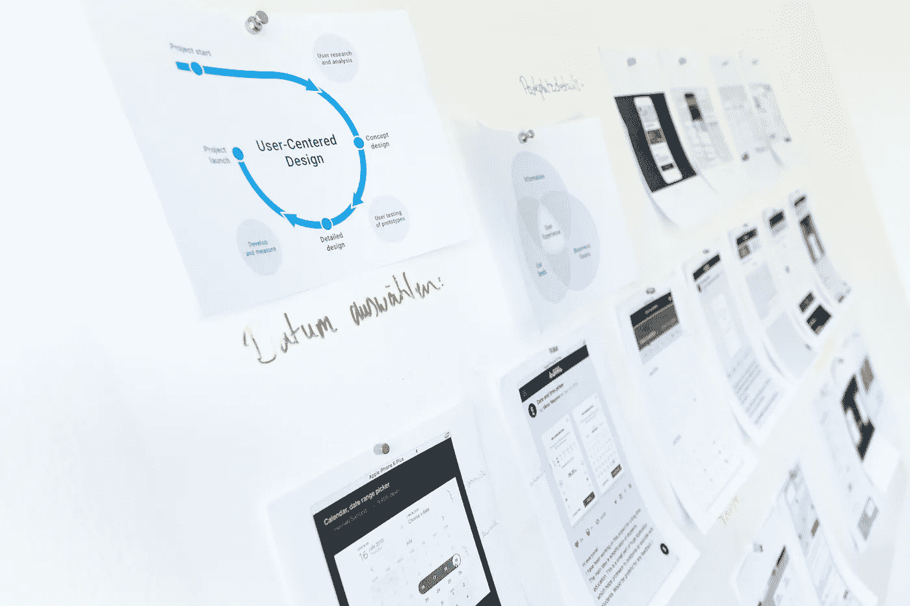

图片由 [Unsplash](https://unsplash.com/s/photos/data-modelling?utm_source=unsplash&utm_medium=referral&utm_content=creditCopyText) 上的[新数据服务](https://unsplash.com/@new_data_services?utm_source=unsplash&utm_medium=referral&utm_content=creditCopyText)提供

本文将讨论一些在面试中最常被问到的关于数据建模的基本问题。在您的数据科学之旅中掌握数据建模是非常有益的，对于初学者来说，一开始可能会不知所措，但通过实践，它可以产生巨大的回报。

# **什么是数据建模？**

简单地说，为家庭账单创建电子表格的行为就是数据建模。

> 定义:“…组织数据元素以及它们如何相互关联的抽象概念…”

数据建模可以很容易地转化为数据库建模，因为这是基本的最终状态。对于任何参与准备、分析和处理数据的人来说，这是一项重要的技能。正如你所猜测的，这肯定是一个迭代过程。数据工程师、数据科学家、软件工程师、开发人员等..不断重组、重构和优化数据模型，以满足组织的需求。

> 现在回到最初的问题，那么如果数据建模是组织数据元素和定义关系的行为，为什么不能像我们的家庭示例一样，在 Excel 中创建和存储所有内容呢？

Excel 电子表格中可以存储的数据量有很多限制。因此，数据库有助于将元素组织成表格——行和列等。基本操作(如大规模读写)是无法用 Excel 表完成的，因此最好使用数据库来处理大多数业务功能。

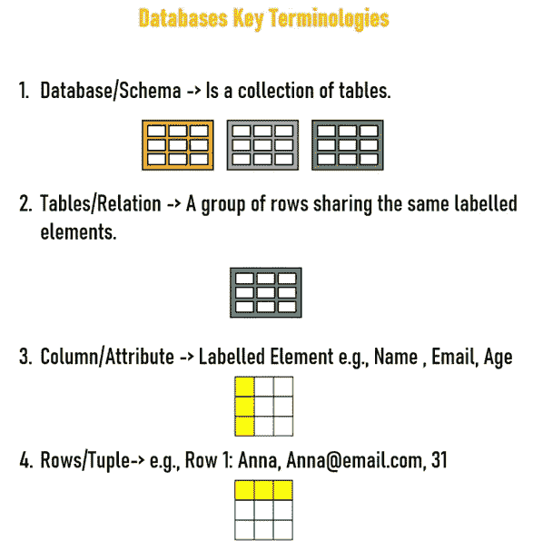

作者图片

## 数据模型的三种类型是什么？

三种类型的数据模型:

*   **概念数据模型** —这关注于所讨论的数据的非常高级的用户视图(实体映射)。
*   **物理数据模型** —这是模式(表的集合)描述数据如何物理存储在数据库中的地方。
*   **逻辑数据模型** —该模型位于概念模型和数据模型之间，允许数据的逻辑表示脱离物理存储而存在。

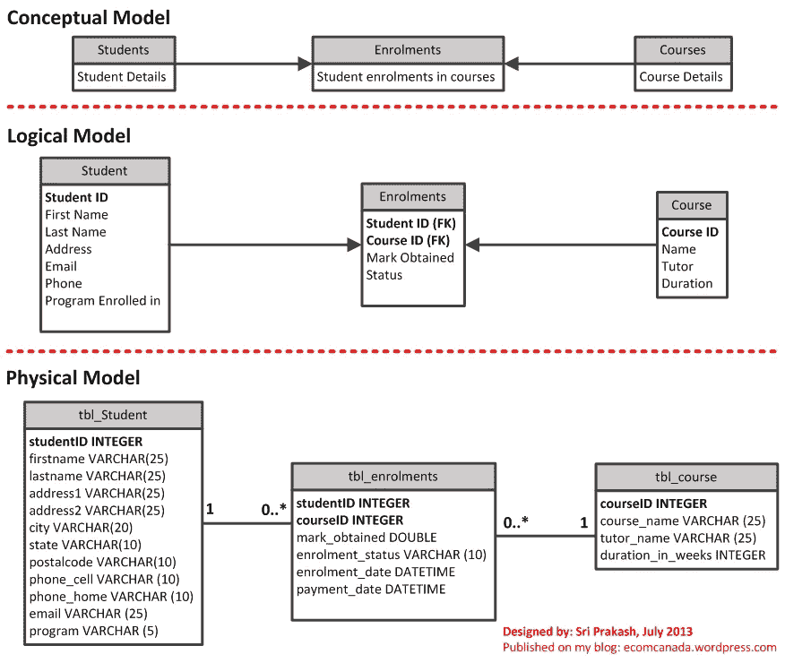

鸣谢:斯里·普拉卡什，来源:[https://www.pinterest.co.uk/pin/218917231859820120/](https://www.pinterest.co.uk/pin/218917231859820120/)

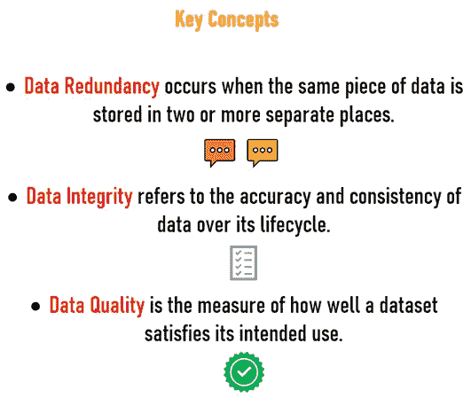

作者图片

## **数据建模有什么好处？**

数据建模使开发人员、数据架构师、业务分析师和其他利益相关者更容易查看和理解数据库或数据仓库中数据之间的关系。简单来说:

*   减少软件和数据库开发中的错误。
*   提高整个企业中文档和系统设计的一致性。
*   提高应用程序和数据库性能。
*   简化整个组织的数据映射过程。
*   改善开发人员和商业智能团队之间的沟通。
*   在概念、逻辑和物理层面简化和加速数据库设计过程。

## 什么是关系模型？

> 该模型将数据组织到一个或多个由列和行组成的表中，用唯一的键标识每一行。

## **什么是关系数据库？**

> 它是基于数据关系模型的数字数据库，用于维护关系数据库的软件系统是关系数据库管理系统(RDBMS)。

> **常见的关系数据库类型:** Oracle、Teradata、Mysql、PostgreSQL、Sqlite

## 使用关系数据库的优势是什么？

一旦数据被转换为行和列格式，数据就被标准化了，可以用 SQL 查询。

*   灵活地添加表，改变表，添加和删除数据。
*   数据完整性是使用关系数据库的基础。
*   数据以表格格式系统地存储和建模。
*   如果你有一个较小的数据量(不是大数据)，你可以使用一个简单的关系数据库。
*   ACID 事务:这允许满足数据库事务的一组属性，以通过保持数据完整性来保证有效性，即使在出现错误、断电的情况下也是如此。

## 什么是主键？

> 主键是唯一标识关系数据库管理系统表中每一行的一列或一组列。

## 什么是外键？

> 外键是在两个表之间创建关系的列。外键的目的是维护数据完整性，并允许在一个实体的两个不同实例之间导航。

## 主要差异

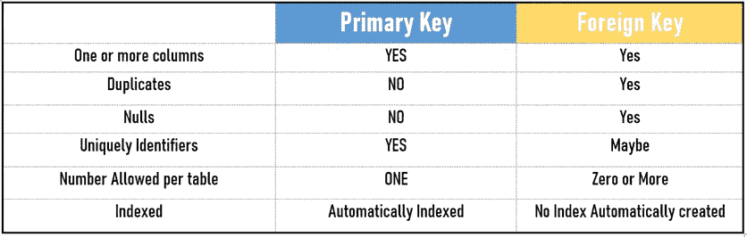

作者图片

## 什么是正常化？

***规范化*** 是为了减少**数据冗余**和增加**数据完整性，按照一系列范式构建关系数据库的过程。**

## 什么是反规格化？

***反规范化*** 是通过添加数据的冗余副本，以损失一些写性能为代价，试图提高数据库的读性能的过程。简而言之，这意味着拥有数据的重复拷贝，这看起来像是一个不自然的过程，但是必须在读取量大的工作负载中执行该过程，以提高性能。

## OLAP 和 OLTP 有什么区别？

数据库被设计为将结构化数据存储为可以使用 SQL 查询读取的表。数据必须遵循严格的模式，这允许(DBMS)极大地协同优化数据存储和处理。

也就是说，它们将磁盘文件中数据和索引的内部布局与其高度优化的查询处理查询紧密分离，从而为存储的数据提供非常快速的计算，并为所有读/写操作提供强大的事务 ACID 保证。

数据库上的 SQL 工作负载可以分为两类:

*   **在线事务处理(OLTP):** 这些通常是高并发、低延迟的简单查询，一次读取或更新几条记录:就像银行账户事务一样
*   **在线分析处理(OLAP):** 这些工作负载类似于定期报告，是典型的复杂查询(涉及聚集和连接)，需要对许多记录进行高吞吐量扫描。

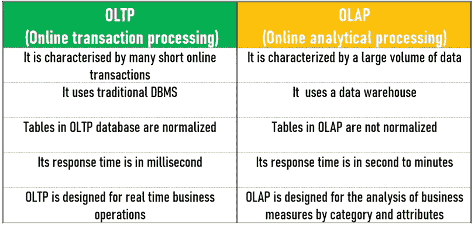

作者图片

## 星型与雪花型模式比较

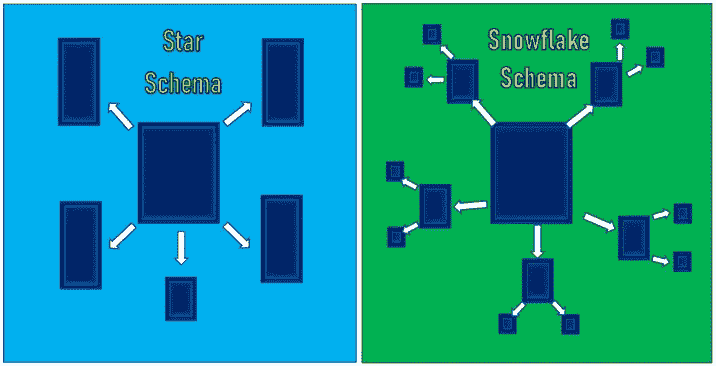

作者图片

## 列出不同之处

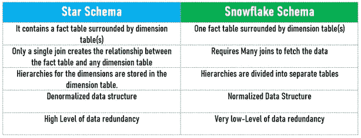

作者图片

## 何时不使用关系数据库？

*   拥有大量数据
*   需要能够存储不同的数据类型格式
*   需要高吞吐量—快速读取
*   需要灵活的模式
*   需要高可用性:表示系统始终运行，没有停机时间
*   需要横向可扩展性

## 什么是 NoSql？

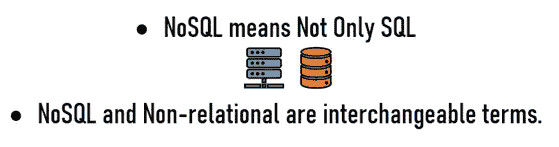

作者图片

## SQL 与无 SQL

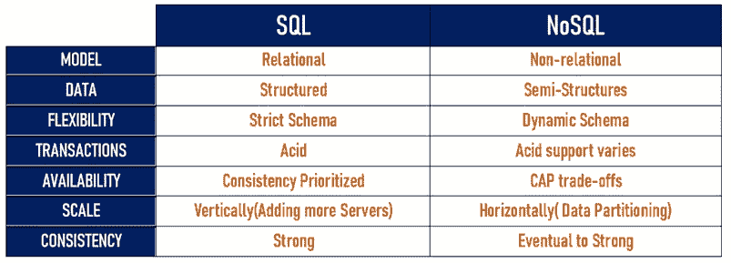

作者图片

## NoSQL 数据库的类型

**NoSQL 数据库**主要分为四类:

> 1)键值
> 
> 2)基于列
> 
> 3)基于图形
> 
> 4)基于文档。

以上指定的数据库没有一个能更好地解决所有问题。根据产品需求选择数据库总是最好的。

**Key-Value:** 这些数据库在一个简单的数据模型上工作，这个模型有一对惟一的键和一个与之相关联的值。这种类型的数据库运行高效，并显示出高度的可伸缩性，例如:在缓存 web 应用和会话管理中。

> 一些例子:Redis、Memcached

**基于文档:**这些数据库以文档格式存储半结构化数据及其描述。它们非常类似于键/值数据库。它们基于键/值存储数据，类似于键-值数据库，唯一的区别是值以 XML、JSON、BSON 的形式存储。这些主要用于移动应用数据处理和内容管理。

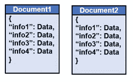

作者图片

> 一些例子:MongoDB、Terrastore、RavenDB

**基于列:**这些数据库以列而不是行来组织数据。这些行有许多与特定行相关联的列。列族包含我们可以一起访问的一组相关数据，这意味着它们可以比其他传统数据库更快地查询大型数据集。这些主要用于欺诈检测推荐引擎和目录。

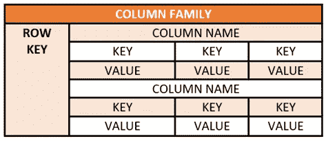

作者图片

> 一些例子:Cassandra，Hbase，Hypertable，Amazon DynamoDB

**图形存储:**这些数据库将数据组织成节点和显示节点之间连接的边。这些用于映射关系，例如映射客户关系或预订管理系统。

与表松散连接的传统关系数据库相比，图数据库本质上是多关系的。遍历关系尤其重要，因为它们已经被捕获到数据库中，不需要计算它们。它们主要用于社交网络、物流和空间数据。

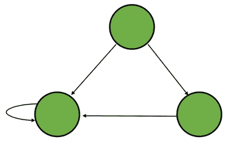

作者图片

一些例子:Neo4J，Dgraph，Amazon Neptune，OrientDB

## 17)什么是 CAP 定理？

CAP 定理证明了任何分布式系统都不能同时保证 C、A 和 P。换句话说，它表明分布式系统不可能提供三分之二以上的保证。

1.  **一致性**:即使在一个操作执行之后，数据也应该保持一致。例如，在更新数据库之后，我们运行的所有查询应该产生相同的结果。
2.  **可用性:**数据库不应该有任何停机时间，它应该始终可用并且响应迅速。
3.  **分区容忍度:**即使服务器之间的通信不稳定，系统也应该继续运行。

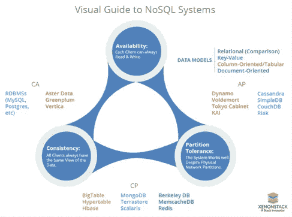

来源:[https://www.xenonstack.com/blog/nosql-databases/](https://www.xenonstack.com/blog/nosql-databases/)

如果你想更多地了解 NoSQL，我强烈推荐这个关于这个话题的写得很好的博客:[https://www.xenonstack.com/blog/nosql-databases/](https://www.xenonstack.com/blog/nosql-databases/)

# 感谢阅读！

恭喜你！你坚持到了最后。我希望这些关于数据建模的问题对您有所帮助和启发。如果你已经知道所有这些，我很高兴刷新你的记忆和技能。我会不时更新这个列表，提出更多的问题。谢谢:)

更多阅读:

</creating-beautiful-gif-with-python-for-your-data-analysis-ac50c618b559>  </dimensionality-reduction-for-data-visualization-pca-vs-tsne-vs-umap-be4aa7b1cb29>  </most-useful-python-functions-for-time-series-analysis-ed1a9cb3aa8b>  </statistical-testing-understanding-how-to-select-the-best-test-for-your-data-52141c305168> 