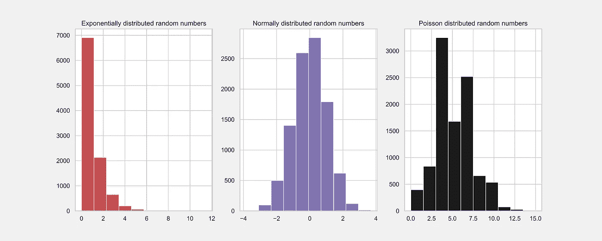
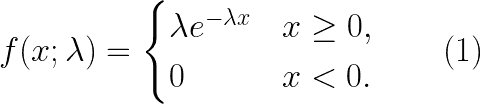

# 最重要的随机数 Python 模块，永远在你身边

> 原文：<https://towardsdatascience.com/most-important-random-number-python-modules-to-keep-always-by-your-side-ef99a4ae624b?source=collection_archive---------29----------------------->



随机生成的数字的指数、正态和泊松分布函数的直方图，使用第三节中的 Python 代码创建。在所有地块中，使用了 5000 个随机产生的数字大小的样本。作者出于教育目的创作的图形。

# 介绍

在数据科学、统计建模、机器学习和绘图中，由于多种原因，人们经常需要生成随机数据进行模拟。有许多编程语言可以用来生成随机数和数据，在本文中，我想特别关注 Python 编程语言。在本文中，我将向您展示哪些是可以帮助用户生成随机数据的最重要的 Python 库和模块。

这篇文章背后的原因是因为我观察到，在大多数教学材料、关于 Python 和数据科学的书籍中，他们只是彻底地提到了随机数生成函数，而没有专门的一节来介绍它们。显然，在本文中，我将选择这些库和模块中最重要的一些，我认为它们通常在数据科学中最常用，因此，我的选择并不完整，因为我不会讨论现有随机数模块的全部范围。像往常一样，在本文中，我假设读者了解基本的 Python 和它的一些库。

# I .不安全的随机数模块

Python 和许多其他程序中的随机数生成实际上并不是完全“随机”的，而是具有确定性的成分。为此，这些生成的数字被称为**伪随机数**。下面，当我写一个“随机数”时，你应该明白我指的是伪随机数。Python 和其他程序生成伪随机数的原因是，需要使用一个初始值来开始随机数生成序列，这个初始值通常被称为*种子数。*

基本的 Python 发行版都有一个名为 **random** 的默认模块，负责随机数的生成。这是生成具有不同分布函数的不同随机数时要调用的核心模块。然而，这个模块不能生成用于加密的安全随机数，这就是为什么它被称为不安全随机数模块。密码生成的随机数通常用于生成安全令牌、密码等。

## **1。random . seed(a =无，版本=2)**

该子模块用于修复和初始化随机数发生器。Python 中的种子号用于在没有运行多线程的情况下复制相同的随机数序列。例如，如果我将种子值设置为特定的数字、字符串等。如果使用相同的调用函数以相同的顺序调用，使用与我相同的种子号的另一个用户将获得相同的随机数序列。

*random.seed()* 模块的第一个参数 a 是种子的值，第二个参数是要使用的 Python 版本，其中 version=2 是默认版本。对于 Python 以上的版本，种子值 a 可以是`[int](https://docs.python.org/3/library/functions.html#int)`、`[float](https://docs.python.org/3/library/functions.html#float)`、`[str](https://docs.python.org/3/library/stdtypes.html#str)`、`[bytes](https://docs.python.org/3/library/stdtypes.html#bytes)`或`[bytearray](https://docs.python.org/3/library/stdtypes.html#bytearray)`。例如，在本文中，我将使用种子值 1，即 a=1 来生成随机数。首先，我使用以下 Python 代码:

```
[In]: **import** random 
[In]: random.seed(a = 1)
```

在上面的代码中，种子从 a=1 的值开始，但是可以使用任何值。如果你在你的计算机中设置了相同的种子值，你应该在下面生成和我一样的数字序列。

## 2. **random.randint(a，b)**

该子模块生成区间[a，b]中的随机整数，包括区间极值。如果我选择，a = 0，b = 10，我得到例如:

```
[In]: random.randint(a = 0, b = 10)
[Out]: 2
```

## 3.random.randrange **( *开始*，*停止=无*，*步进=1* )**

该子模块在半开区间[a，b]内生成整数，默认步长为 1。这个函数与 *random.randint()，*相同，如果我们用 b+1 代替 b，或者等价地， *random.randint(a，b)* 和 *random.randrange(a，b+1)*如果在*random . seed(a = 1)**之后立即被分别调用，它们将给出相同的随机数。*例如，如果我在第 2 节的代码之后运行下面的代码，我会得到:

```
[In]: random.randrange(start = 0, stop = 11)
[Out]: 9
```

如您所见，结果与前面的代码不同，因为它们是按顺序执行的。但是，如果您独立执行这些代码，您会得到相同的结果。

## 4.随机选择(序列)

该子模块使用户可以从给定的序列列表中选择一个随机数。例如，假设我有一个列表，l = [1，4。，8，9.6，30]，然后运行下面的代码:

```
[In]: l = [1, 4., 8, 9.6, 30]
[In]: random.choice(list)
[Out]: 1
```

在上面的例子中，我使用了一个数字列表，但是序列可以是字符串、元组、范围等。

## 5.随机. random()

这个子模块在半开区间[0，1]产生一个随机数(浮点)。如果我在前面的代码之后依次运行下面的代码，我会得到:

```
[In]: random.random()
[Out]: 0.2550690257394217
```

## 6.随机高斯(μ，σ)

该子模块为用户提供了从随机数的高斯分布中生成随机数的可能性，其中均值=μ，标准差=σ。例如，如果我选择平均值 *= 0* ，并且*∑= 1*，我得到:

```
[In]: random.gauss(mu = 0, sigma = 1)
[Out]: -1.0921732151041414
```

## 7.随机指数变量

的这个子模块根据指数概率分布函数生成随机数，其表达式如下



指数概率分布函数在物理学、生物学、水文学等不同的科学领域都是非常重要的。例如，在物理学中，放射性粒子衰变分布近似遵循函数(1)。参数𝜆称为速率参数，它是一个大于零的正数。对于给定的随机变量 *X* ，其期望值为 E *(X) = 1/𝜆* ，方差为 Var(X) = 1/𝜆。所以遵循指数概率分布函数的随机变量 *X* 的*均值*为 *= 1/𝜆，*其中𝜆必须不为零。

例如，为了生成服从分布(1)且 *= 2 的随机数，*我运行以下 Python 代码:

```
[Int]: random.expovariate(lambda = 1/2)
[Out]: 2.108767728131761
```

## 8.随机均匀(a，b)

该子模块在区间[a，b]中生成均匀分布的浮点数，包括极值 a，但是极值 b 可能包括也可能不包括，这取决于舍入。例如，为了从区间[0，10]中的均匀分布生成一个随机数，我在上面第 7 点中的代码之后运行下面的代码(请注意代码的顺序，以生成与这里给出的输出相同的输出):

```
[In]: random.uniform(a = 0, b = 10)
[Out]: 7.887233511355132
```

我上面描述的八个随机数模块有一个核心模块，Python 的 **random** 模块。然而，Python 中有一些基本上基于上述随机模块的库，允许用户执行快速有效的数值计算。在这些图书馆中，有一个是 T21 图书馆。NumPy 有很多随机数模块，可以用来生成数字和数组。为了简化符号，首先我导入 NumPy:

```
[In]: **import** numpy **as** np
[In]: np.random.seed(a = 2)
```

在导入 NumPy 之后，我还导入了 random.seed()模块来设置 NumPy 生成器的种子。这个模块是第 1 点中 random.seed()的 NumPy 等价物。为了简单起见，我选择种子的值等于 2。下面讨论 NumPy 最重要的随机数子模块。

## 9.np.random.rand(d0，d1，…，dn)

NumPy 的这个子模块在半开区间[0，1]内生成随机数和填充有*个均匀分布的*个随机数的不同形状的数组。如果没有给这个子模块一个参数，它将返回一个区间为[0，1]的随机数。如果给定一个参数，则返回一维 NumPy 数组。如果给定多个参数，将返回一个多维数组。以下 Python 代码使这些概念更加清晰:

```
[In]: np.random.rand()
[Out]: 0.43599490214200376[In]: np.random.rand(d0 = 3)
[Out]: array([0.02592623, 0.54966248, 0.43532239])[In]: np.random(d0 = 3, d1 = 2)
[Out]: array([[0.4203678 , 0.33033482],
       [0.20464863, 0.61927097],
       [0.29965467, 0.26682728]])
```

**NP . rand()**模块与[**NP . random()**](https://numpy.org/doc/1.16/reference/generated/numpy.random.random.html#numpy.random.random)模块有相似之处，我不在本文中介绍。

## 10.randn(d0，d1，…，dn)

NumPy 的这个子模块允许用户从均值为零且标准差等于 1 的正态分布中生成一个或多个随机数据样本。元组(d0，d1，…，dn)必须是正整数，它的存在是可选的。元组的大小表示返回数组的维数。如果没有给函数 **np.random.randn()，**赋值，那么它的输出就是一个来自正态分布的随机浮点数。如果只有一个数字作为参数给出，则输出是一个浮点一维 NumPy 数组，其分量等于给定的参数值。如果给定了多个数字作为参数，该函数将返回一个具有特定维度和组件的浮点多维数组。下面的例子让事情变得更清楚:

```
[Int]: np.random.randn()
[Out]: 0.5514540445464243[In]: np.random.randn(d0 = 4)
[Out]: array([ 2.29220801,  0.04153939, -1.11792545,  0.53905832])[In]: np.random.randn(d0 = 3, d1 = 3)
[Out]: array([[-0.5961597 , -0.0191305 ,  1.17500122],
       [-0.74787095,  0.00902525, -0.87810789],
       [-0.15643417,  0.25657045, -0.98877905]])
```

NumPy 模块[**NP . random . standard _ normal()**](https://numpy.org/doc/1.16/reference/generated/numpy.random.standard_normal.html#numpy.random.standard_normal)与 **np.random.rand()，**非常相似，唯一的区别是前者以一个整数或一组整数作为参数。

## 11.np.random.randint(low，high = None，size = None，dtype = 'I ')

NumPy 的这个子模块在半开区间[低，高]从离散的均匀概率分布函数生成随机整数。在 high = None 的情况下，该子模块生成区间[0，low 内的整数。大小通常是一个整数或整数元组，它指定输出 *ndarray* 或整数的大小。以下示例有助于更好地理解该子模块:

```
[In]: np.random.randint(low = 3, high = None, size = 4)
[Out]: array([2, 0, 2, 1])[In]: np.random.randint(low = 3, high = 10, size = 4)
[Out]: array([9, 3, 5, 8])[In]: np.random.randint(low = 0, high = 10, size = (2, 2))
[Out]: array([[9, 8],
       [7, 1]])
```

## 12.np.random.exponential(scale = 1，size = None)

NumPy 的这个子模块从指数概率分布函数(1)生成样本。比例参数等于 *1/𝜆，*，其默认值等于 1。size 指定从分布(1)中生成的数字样本的大小。这里有一些具体的例子:

```
[In]: np.random.exponential(scale = 2, size = 1)
[Out]: array([1.89881464])[In]: np.random.exponential(scale = 2)
[Out]: 9.388438956222803[In]: np.random.exponential(scale = 3, size = (2, 2))
[Out]: array([[0.38174426, 0.48249559],
       [5.73733106, 2.13714827]])[In]: np.random.exponential(scale = 3, size = (1, 2, 2))
[Out]: array([[[ 0.73490213, 15.00188906],
        [ 1.13631244,  0.89818388]]])
```

## 13.np.random.binomial(n，p，size = None)

NumPy 的这个子模块从二项式分布函数生成标量数和数组。这里我假设读者知道这种在统计学中非常重要的分布函数。自变量 n 是试验次数，p 是每次试验成功的概率。概率 p 在区间[0，1]内，试验次数 n 是大于或等于零的正数。size 指定输出数组的维度。以下示例有助于理解该子模块:

```
[In]: np.random.binomial(n = 1, p = 1/2, size = None)
[Out]: 1[In]: np.random.binomial(n = 10, p = 1/3, size = (2, 2, 2))
[Out]: array([[[3, 3],
        [2, 5]],

       [[5, 6],
        [5, 3]]])[In]: np.random.binomial(n = 0, p = 0.4, size = 3)
[Out]: array([0, 0, 0])[In]: np.random.binomial(n = (1, 2, 4), p = (0.1, 0.5, 0.4), size = 3)
[Out]: array([0, 2, 2])
```

## 14.np.random.poisson(lam = 1.0，size = None)

NumPy 的这个子模块根据泊松概率分布函数生成标量数和数组。即使在这里，我也假设读者知道这个分布、它的参数和它的性质。第一个参数是 k 个事件应该发生的区间 *𝜆* 。参数 *𝜆* 可以是标量，也可以是类似数组的标量。size 可以是 None，也可以是指定输出多维数组形状的 tuple。这些示例有助于理解该子模块:

```
[In]: np.random.poisson(lam = 2, size = None)
[Out]: 4[In]: np.random.poisson(lam = 2, size = 4)
[Out]: array([4, 3, 1, 2])[In]: np.random.poisson(lam = (1, 3, 4), size = (3, 3))
[Out]: array([[0, 6, 7],
       [3, 5, 9],
       [3, 2, 4]])
```

# 二。安全随机数模块

第二节中讨论的所有模块都不是生成随机数和随机数数组的安全模块。Python 为用户提供了通过 [**secrets**](https://docs.python.org/3/library/secrets.html#module-secrets) Python 模块生成安全随机数和字节的可能性。这个模块为加密、密码、令牌等创建随机数和字节。在本文中，我不会讨论这个模块，读者可以在上面的链接中找到更多信息。

# 三。绘制随机数据

上面描述的随机模块对于在许多情况下创建模拟图非常有用。它们可用于检查特定概率分布函数的行为，可用于将实际数据分布与众所周知的概率分布(如泊松、正态、伯努利分布等)进行比较。在下面的 Python 代码中，我使用了上面解释的一些随机数模块来创建本文顶部显示的图形。Python 代码是:

```
[In]: **import** numpy **as** np
[In]: **import** matplotlib.pyplot **as** plt 
[In]: import **seaborn** as **sns**
[In]: sns.set(style="whitegrid")
[In]: np.random.seed(10)[In]: fig, axs=plt.subplots(1, 3, figsize=(15, 6))
axs[0].hist(np.random.exponential(scale = 1, size = 10000), color = "r")
axs[0].set_title("Exponentially distributed random numbers")
axs[1].hist(np.random.randn(10000), color = "m") 
axs[1].set_title("Normally distributed random numbers")
axs[2].hist(np.random.poisson(lam = 5, size = 10000), color = "k")
axs[2].set_title("Poisson distributed random numbers")
```

# 四。结论

在本文中，我讨论了 Python 中最重要的随机数模块。正如我在开始时提到的，我的列表并不完整，因为还有其他模块，但我试图尽可能不偏不倚地列出我的列表，它由那些通常在数据科学中最常用的模块组成。

如果想要简单的随机数用于一般目的，那么内置的 Python 模块 **random** 就足够了。如果想要创建随机数和填充随机数的数组，那么 NumPy **random** 模块可能是最好的选择。可以使用这个模块进行模拟，并创建模拟图，如第三节所示。

## 如果你喜欢我的文章，请与你可能对这个话题感兴趣的朋友分享，并在你的研究中引用/参考我的文章。不要忘记订阅将来会发布的其他相关主题。