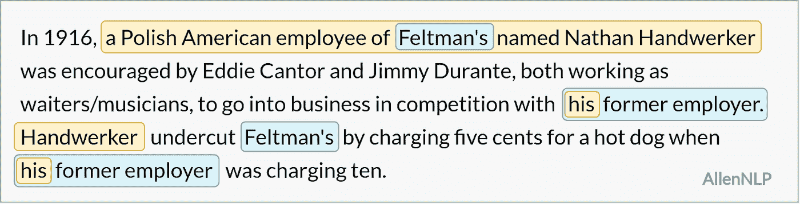
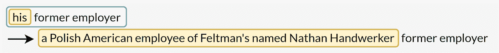
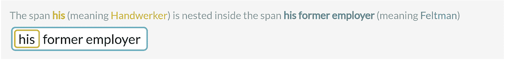

# 最流行的共指消解框架

> 原文：<https://towardsdatascience.com/most-popular-coreference-resolution-frameworks-574ba8a8cc2d?source=collection_archive---------9----------------------->

## 最好的共指消解模型是什么？选一个看什么？

*作者* [*玛尔塔·马朗考斯卡*](https://medium.com/@m.maslankowska) *和* [*帕韦·米耶尼克祖克*](https://medium.com/@p.mielniczuk) *。*

照片由[玛丽·赫林](https://unsplash.com/photos/ilSnKT1IMxE)拍摄

# **快速回顾一下**

这是我们上一篇 [*共指消解*](https://neurosys.com/article/intro-to-coreference-resolution-in-nlp/) 介绍的后续文章。如果你正在寻找一个有例子支持的好的理论背景，我们推荐它。反过来，本文涵盖了最流行的共指消解库，同时展示了它们的优缺点。

简单回顾一下——共指消解(CR)是一项具有挑战性的自然语言处理(NLP)任务。它的目的是将指同一现实世界实体的表达组合在一起，以获得不那么模糊的文本。它在文本理解、问题回答和摘要等任务中很有用。

## 通过示例进行共指消解

通过使用共指消解，我们希望**得到一个明确的句子**——一个不需要任何额外上下文就能理解的句子。预期的结果显示在下面的简单示例中(而将 CR 应用到文本的详细过程显示在前面的*简介*文章中):

步骤 1 —选择一个句子来分析或嵌入并检测歧义词(提及)

步骤 2-将检测到的范围与剩余句子中的其他提及/真实单词实体进行分组

步骤 3-用最有意义的真实世界实体解决相互引用

第四步——获得一个明确的句子

# 研究动机

在 NLP 系统中，共指消解通常只是整个项目的一部分。像大多数人一样，我们也更喜欢利用经过充分测试的现成解决方案，这些解决方案只需要一些微调，而不需要从头开始编写任何东西。

有许多关于共指消解的有价值的研究论文。然而，并不是所有的都有简单明了的实现。

> 我们的目标是找到一个**生产就绪的开源库**，它可以很容易地整合到我们的项目中。

# 顶级图书馆

有许多关于 CR 的开源项目，但在对当前最先进的解决方案进行全面研究后，到目前为止，最突出的两个库是 Huggingface NeuralCoref 和 AllenNLP。

## 拥抱脸

Huggingface 有相当多的项目集中在 NLP 上。他们最出名的可能是他们的[变形金刚](https://github.com/huggingface/transformers)库，我们也在我们的[人工智能咨询服务](https://neurosys.com/services/ai-consulting-services/)项目中使用这个库。

我们不会进入详细的实现，但 Huggingface 的[neural corf](https://github.com/huggingface/neuralcoref)使用神经网络解决了相互引用，并且基于一个优秀的 [spaCy](https://spacy.io/) 库，任何关注 NLP 的人都应该烂熟于心。

该库有一个简单易懂的自述文件，涵盖了基本用法。但是我们发现这个库最大的优点是它允许简单的访问底层空间结构并在其上扩展。spaCy 将句子解析成文档、跨度和标记。Huggingface 的 NeuralCoref 为它们增加了更多的特性，例如，给定的区间是否有任何共同引用，或者一个令牌是否在任何簇中，等等。

此外，该库有多个可配置的参数，例如算法应该如何贪婪地行动。然而，经过大量测试后，我们发现默认参数在大多数情况下效果最好。

还有一个演示可以标记所有有意义的跨度，并显示网络的输出——其中提到指的是哪个。它也给出了关于分配分数的信息，以及每个提及对是如何相似的。

这个演示对于简短的文本来说效果很好，但是由于输出显示在一行中，如果查询变得太大，就不容易阅读了。

不幸的是，还有一个更重要的问题。在撰写本文时，演示比代码中的实现效果更好。我们已经测试了许多参数和底层模型，但我们无法获得与演示完全相同的结果。

社区在其 Github 的**多篇文章中进一步证实了这一点，关于如何获得与演示页面上相同的模型，回答非常模糊和不准确——通常归结为“您必须试验不同的参数和模型，看看什么最适合您”。**

## 艾伦 LP

艾伦人工智能研究所(简称 AI2)可能是自然语言处理领域最著名的研究小组。他们是 ELMo 等模型的发明者。他们的项目名为 AllenNLP，是一个开源库，用于为各种 NLP 任务建立深度学习模型。

这是一个巨大的库，有许多基于 PyTorch 构建的模型，其中一个是我们使用的预先训练的共指消解模型，它基于[这篇](https://arxiv.org/pdf/1707.07045.pdf)论文。

同样，AllenNLP 也有一个[演示](https://demo.allennlp.org/coreference-resolution)。它非常清晰易懂，尤其是在输出方面。它的结构是多行的，可读性很好。然而，与 Huggingface 不同，相似性细节在这里是模糊的，即使从代码中也不容易访问。

然而，AllenNLP 共指消解并不是没有问题。当你第一次执行他们的 Python 代码时，结果非常混乱，很难知道如何理解它们。

> AllenNLP 倾向于找到更好的聚类，然而，它经常解析它们，导致无意义的句子。

然而，正如我们在后面提到的，我们已经应用了一些技术来解决这个库及其使用中的大多数问题。

# 详细比较

就像库一样，有许多不同的数据集是为共指消解而设计的。一些值得一提的是 [OntoNotes](https://catalog.ldc.upenn.edu/LDC2013T19) 和 [PreCo](https://arxiv.org/pdf/1810.09807.pdf) 数据集。但最符合我们需求并获得商业使用许可的是 GAP dataset，它是由谷歌开发的，[于 2018 年发布](https://arxiv.org/pdf/1810.05201.pdf)。

该数据集由近 9000 对有标签的歧义代词和先行词组成。由于 pairs 是从维基百科中取样的，它们提供了现实世界文本所带来的不同挑战的广泛覆盖面。数据集可以在 [Github](https://github.com/google-research-datasets/gap-coreference) 上下载。

我们已经在整个 GAP 数据集上运行了几次测试，但真正给我们带来最大收获的是手动检查每一对并精确分析中间聚类以及获得的结果。

下面是数据集中的一个例子，其中包含关于热狗历史的信息。

*从现在起，我们将 Huggingface NeuralCoref 实现称为“Huggingface ”,将 Allen Institute 提供的实现称为“AllenNLP”。*

原句

提及通过 Huggingface 找到的对

提及由 AllenNLP 找到的配对

# 最常见的 CR 问题

提及通过 Huggingface 获得的集群

提及 AllenNLP 收购的集群

## 非常长的跨度

很难说获得长跨距是否是一种优势。一方面，长跨度捕捉到了上下文，并告诉我们更多关于我们正在寻找的真实世界的实体。另一方面，它们通常包含太多的信息。

例如，第一个 AllenNLP 聚类由一个很长的提及来表示:*费尔特曼的一个波兰裔美国雇员，名叫内森·汉德沃克*。我们可能不想用如此广泛的表达来替换每个代词，尤其是在嵌套跨度的情况下:

相反，Huggingface 只会用单词 *Handwerker* 替换第一组中的所有提及。在这种情况下，我们将失去 Handwerker 的姓名、国籍以及与 Feltman 关系的信息。

## 嵌套共指提及

在 GAP 示例中，我们看到嵌套的跨度—一个(或多个)提及在另一个提及的范围内:

根据 CR 解析策略，嵌套跨度中的提及可以被替换或不被替换，但这完全取决于个人偏好——通常很难说哪种方法最适合数据。这可以从下面的例子中看出，对于每一个例子，不同的策略似乎是最合适的:

## 不正确的语法形式

缩写是浓缩的表达形式，通常通过使用撇号获得，例如:

AllenNLP 将某些缩写视为一个整体，用不正确的语法形式替换其他提及:

在这种情况下，Huggingface 通过始终采用名词短语的基本形式来避免这个问题。然而，这也可能导致不正确的句子:

这是因为所有格形容词和代词的出现——当一个集群是由主语和所有格组成的时候。

不幸的是，这两个库都存在这个问题。然而，AllenNLP 检测到几个 POS(词性)标签，并试图在某些情况下处理这个问题(尽管并不总是获得预期的效果)。

## 查找冗余 CR 群集

例如，不需要的聚类是所讨论的文本片段中的第二个拥抱脸聚类。将*的前雇主*替换为*的前雇主*并不能提供任何额外的信息。类似地，当一个集群不包含任何名词短语或仅由代词组成时，很可能是不必要的。这些类型的聚类可能导致语法错误的句子，如下例所示。

## 下传检测

我们之前已经全面描述了回指和下指的问题，后一个问题特别棘手，因为它更难捕捉，并且经常导致错误的提及替换。

Huggingface 在 cataphora 检测方面存在问题，而 AllenNLP 总是将聚类中的第一个区间视为代表性区间。

# 利弊

为了方便起见，我们还构建了一个两个库的主要优缺点的表格，这是我们在与它们合作的过程中发现的。

## 拥抱脸

✔演示提供有价值的信息
✔易于使用
✔与 spaCy 兼容

✘ **演示的工作方式不同于 Python 代码😞** ✘ 不处理下指
✘ 经常发现冗余簇

## **AllenNLP**

✔非常清晰的演示
✔检测所有格
✔检测下指

✘代码使用起来不直观
✘经常生成太长的簇
✘有时会错误地处理所有格
✘原始地解决共指经常导致**语法不正确的句子**

我们还发现有趣的是，Huggingface 通常定位更少的集群，因此替代提及的频率更低。相比之下，AllenNLP 似乎更“积极”地替换提及对，因为它发现了更多的聚类。

# 摘要

在本文中，我们讨论了**最著名的共指消解库**，以及我们使用它们的经验。我们也展示了它们的优势，并指出了它们带来的问题。

在本系列的下一篇也是最后一篇文章中，我们将展示我们是如何成功实现它们的。我们将展示如何在某种程度上把它们结合成一个解决方案，通过取长补短，利用对方的优势来解决问题。

如果你想使用这些库中的任何一个，我们还提供了两个更详细的笔记本，你可以在我们的 [NeuroSYS GitHub](https://github.com/NeuroSYS-pl/coreference-resolution) 上找到。

*更多类似的文章请看一下* [*神经系统博客*](https://neurosys.com/blog/category/rd/#blog-posts-blog-list) *。*

第三部分— [如何建立有效的共指消解模型](/how-to-make-an-effective-coreference-resolution-model-55875d2b5f19)

# 参考

[1]: [*聊天机器人最先进的神经共指消解* — Thomas Wolf (2017)](https://medium.com/huggingface/state-of-the-art-neural-coreference-resolution-for-chatbots-3302365dcf30)

[2]:[*—Kenton Lee，Luheng He，，Luke Zettlemoyer (2017)*](https://arxiv.org/pdf/1707.07045.pdf)

*[3]: [*注意差距:性别模糊代词的平衡语料库* —凯莉·韦伯斯特，玛尔塔·雷卡森斯，维拉·阿克塞尔罗德，杰森·巴尔德里奇(2018)](https://arxiv.org/abs/1810.05201)*