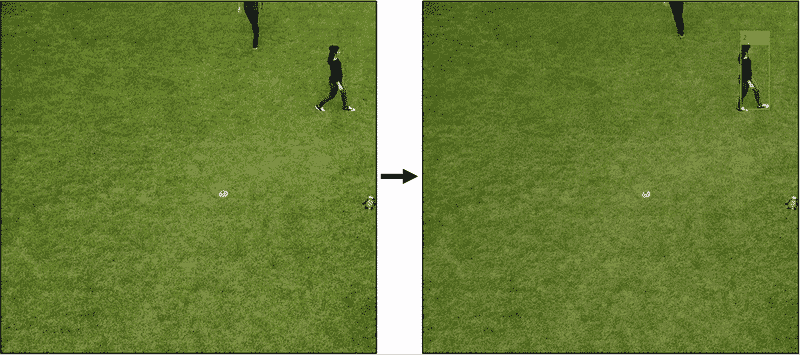
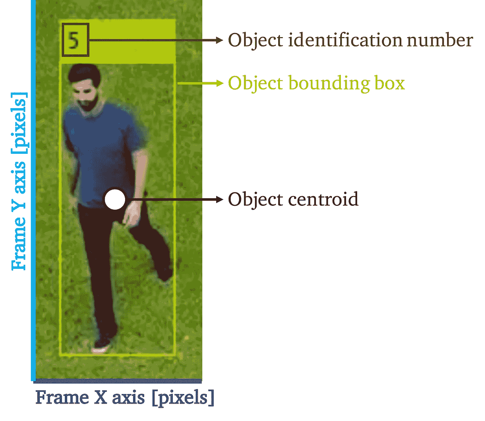
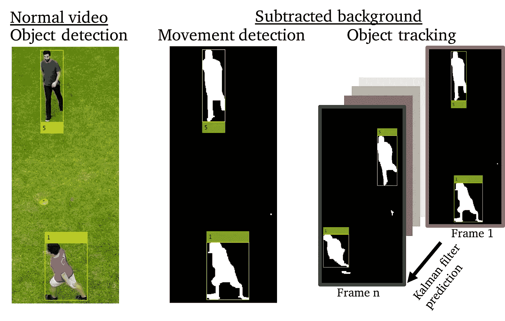
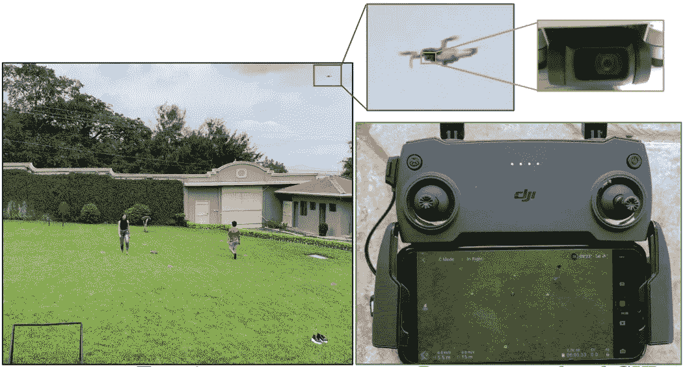
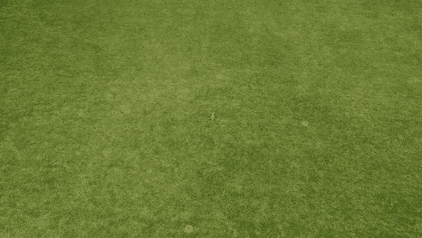
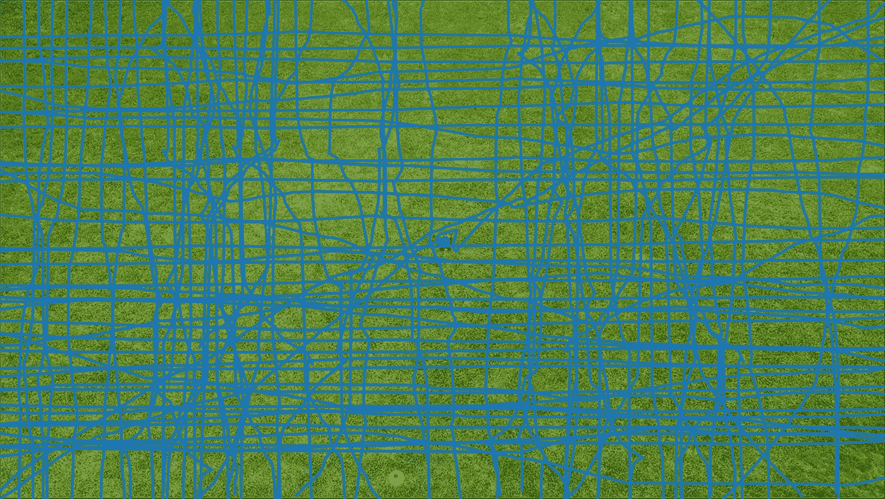
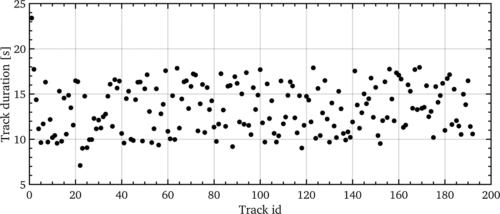
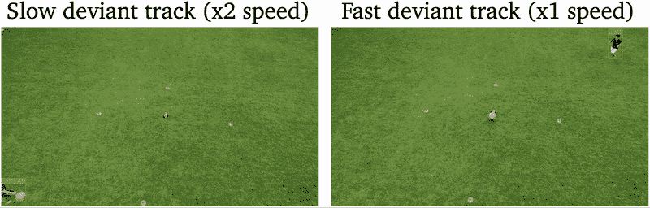

# MATLAB 中基于运动的目标检测与跟踪

> 原文：<https://towardsdatascience.com/motion-based-object-detection-and-tracking-in-matlab-5713f08362ff?source=collection_archive---------26----------------------->

## 基于运动的多目标跟踪算法在悬停无人机视频中的实现

作者图片

检测和跟踪全运动视频中的对象具有重要的应用，例如交通监控、安全和视频监控等。尽管它有各种各样的用途，但是由于它的复杂性，大多数人倾向于回避做任何计算机视觉工作，而没有意识到有许多库和软件包可以使实现变得简单。

这里介绍的是一个简单易懂的指南，用于理解和实现 Matlab 的基于运动的多对象跟踪算法，以便您可以在自己的视频中检测和跟踪移动对象。该算法在一个视频上进行测试，其中一个场景是从一架悬停的无人机上拍摄和记录的。

# 基于运动的多目标跟踪算法

我们将使用 Mathworks 的 Matlab 代码，可在这里[获得](https://www.mathworks.com/help/vision/ug/motion-based-multiple-object-tracking.html)。

在后面的讨论中，有几个术语是很重要的，下图说明了每一个术语。

相关术语以及它们对应于每个帧的哪个部分。作者图片

上面显示的术语也在这里定义:

*   **物体识别号**或物体 id 用于区分不同的物体。
*   **物体包围盒**是包围被检测物体的盒子
*   **帧 X 轴**是每帧中沿水平线的像素坐标轴
*   **帧 Y 轴**是每帧中沿垂直线的像素坐标轴
*   **物体质心**由 x 像素坐标和 y 像素坐标组成，用于定义物体在空间和时间上的中心
*   **帧数**是一个物体可见的帧数，知道每秒钟的摄像机帧数可以让这个参数测量一个物体在场景中的时间

与实现深度学习和大量训练数据来检测对象的流行检测算法不同，Matlab 基于运动的算法仅使用运动。通过首先减去两个帧的背景来检测对象，并且如果两个帧之间的差包含足够多的相连像素，则对象被识别。利用简单的卡尔曼滤波器预测每个探测到的物体的路径，如果沿着预测的轨迹探测到后续物体，则将其指定为相同的物体。

下图显示了一个普通视频截图的示例，旁边是用于检测和跟踪对象的减去的背景空间。

视频截图左边显示正常视频，右边显示运动检测和跟踪。减影背景图像中的变化是白色，而无变化是黑色。作者图片

# 获取机载视频数据

我用 DJI 的 Mavic Mini 无人机拍摄了自己和兄弟姐妹及朋友一起散步的场景。下面的照片展示了我们拍摄的场景和使用的设备。无人机一直在盘旋，因为如果相机超过一定的移动量，算法就不会工作。

显示测试现场的图片，演员走过现场，使用无人机和摄像机，以及无人机的遥控器。作者图片

我们都以正常的速度沿着场景的水平或垂直轴直线行走，除了两条轨迹以明显更慢或更快的速度倾斜，以便稍后测试跟踪算法。在获得大约 12 分钟的视频后，从无人机上检索数据，以输入到检测和跟踪算法中。

# 检测和跟踪的对象

尽管使用了悬停无人机的抖动镜头，检测和跟踪算法工作良好，如下面最繁忙的 15 秒剪辑所示，有 5 个不同的对象。

一个 15 秒的剪辑，展示了 5 个对象的检测和跟踪。作者图片

如前所述，为了显示对象检测和跟踪算法的简单应用，如上所示，两条路径偏离了正常模式。让我们来看看一些输出数据，以尝试在不必手动分析 12 分钟视频的情况下找到异常路径。输出数据包括对象 id、对象的 x 和 y 质心以及对象出现的帧。

在整个 12 分钟的视频中，总共检测和跟踪了 192 个物体，尽管需要注意的是，由于无人机的移动，其中一些可能是重复的或错误的识别。首先，我们可以将轨迹绘制到背景上，以查看每个被跟踪的对象经过的地方，下图显示了所有轨迹的绘制。

12 分钟视频中记录的所有 192 首曲目的图表。作者图片

虽然不是很清楚，在上面的图像中，我们可以看到两条对角线，代表偏离轨道。如果我们画出每个轨迹出现的时间，我们应该能够很容易地检测出较长和较短的异常轨迹。下图显示了所有曲目中每个曲目的持续时间。

所有音轨的音轨时长图。作者图片

使用上面的图，我们注意到慢速和快速异常磁道的异常磁道 id 分别为 1 和 22。现在，我们可以裁剪视频，仅显示异常轨道 1 和 22 出现的时间，如下所示。

快速和慢速异常轨迹的剪辑。那首慢歌以双倍速度播放。作者图片

使用输出轨迹数据，我们能够快速识别异常轨迹。过滤以仅显示异常剪辑比手动检查 12 分钟的视频以获得 30 秒的异常镜头要快得多。

# 摘要

随着所有库或算法的不断改进并向公众发布，实现对象检测和跟踪变得越来越容易。值得注意的是，有几种不同的工作流用于检测和跟踪对象，每种工作流都有其优点和缺点。这里提出的基于运动的方法对于诸如这里提出的具有运动目标的情况可能工作得很好，但是静止目标的检测和跟踪将需要不同的方法。

在这里给出的简单应用中，输出对象检测和跟踪数据用于从总共 192 个对象中识别两个异常轨迹。虽然只有一个 12 分钟的视频被用来识别总计 30 秒的特征，但这种方法可以用于从数小时的视频中识别小的异常行为。