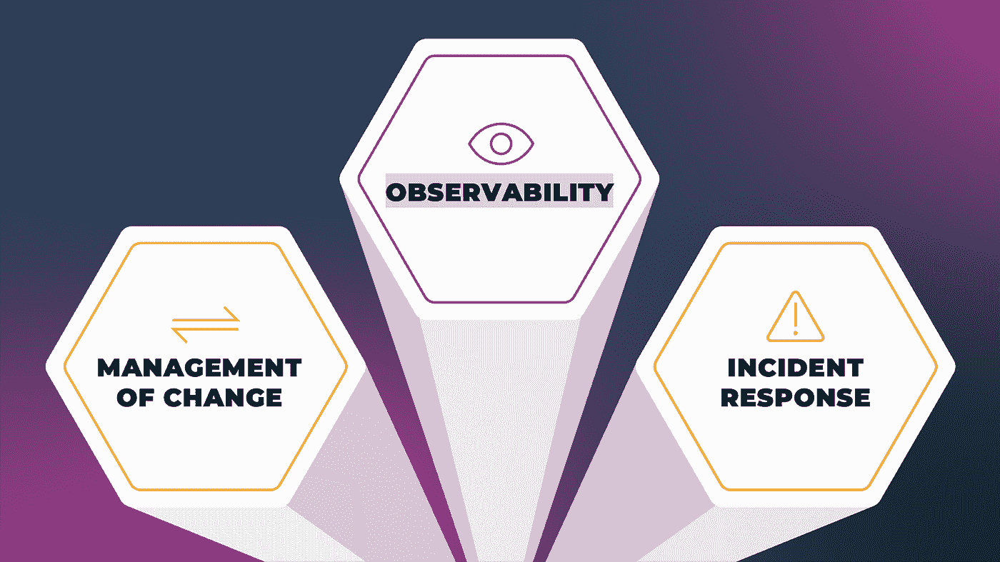
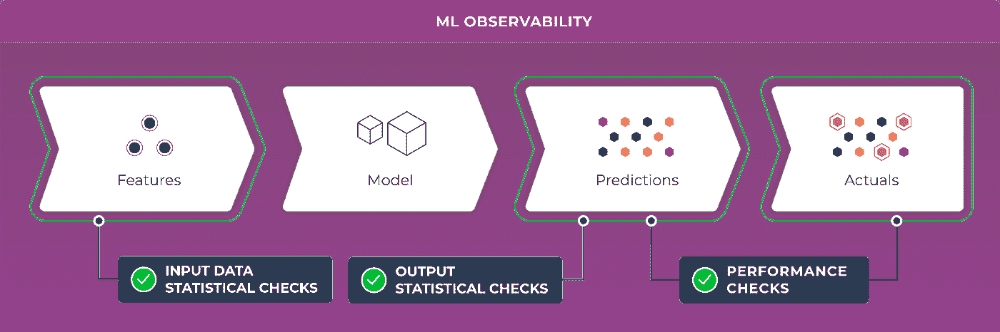
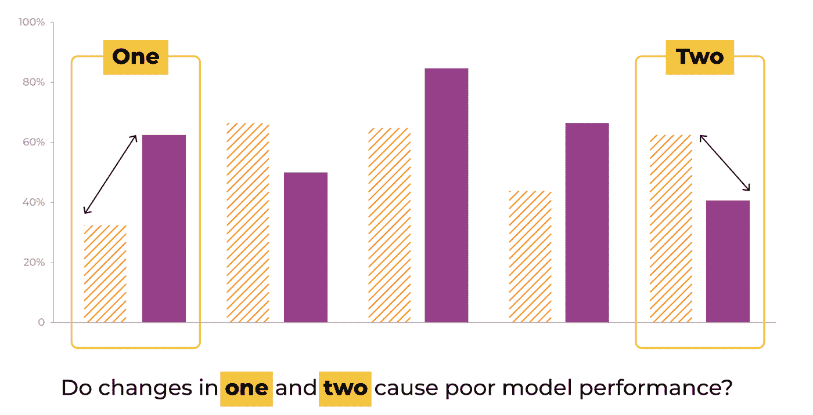
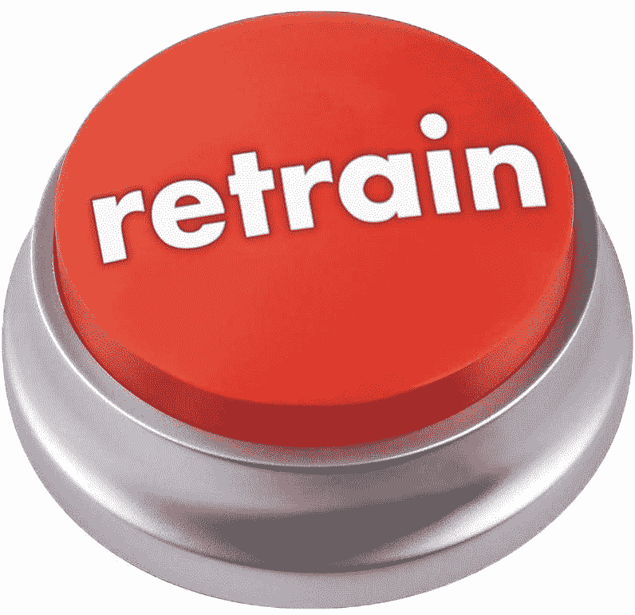

# 在 ML 中快速移动而不打破东西

> 原文：<https://towardsdatascience.com/move-fast-without-breaking-things-in-ml-c070bfca2705?source=collection_archive---------16----------------------->

## [行业笔记](https://towardsdatascience.com/tagged/notes-from-industry)

## 许多公司都认识到，将一个在研究实验室中有效的模型投入生产，说起来容易做起来难。

作者图片

*由 Doordash 的 ML 工程师 Bob Nugman 和 Arize AI 的 and Aparna Dhinakaran 撰写。在这篇文章中，Bob 和 Aparna 讨论了可靠性工程对于 ML 计划的重要性。*

机器学习正迅速成为新兴产品和技术的关键因素。这使得该领域迅速成熟，因为它试图将构建 ML 模型的过程从艺术转变为工程实践。换句话说，许多公司正在认识到，将一个在研究实验室中有效的模型投入生产，说起来容易做起来难。

ML 从业者在将模型部署到生产环境中时面临的一个特殊挑战是确保他们的用户获得可靠的体验。想象一下，现在是凌晨 3 点，你被一个疯狂的电话吵醒。你跳进一个会议，首席技术官在线上，问问题。在新推出的市场中，购买数量突然下降，导致每分钟都有大量收入损失。社交媒体突然充斥着令人讨厌的用户报告。时间不多了。你的团队正在努力，但还不清楚从哪里开始。一款车型在生产中开始失败了吗？随着行业试图将机器学习转化为工程实践，我们需要开始讨论解决这个 ML 可靠性问题。

工程的一个重要部分是确保我们产品的可靠性，那些包含机器学习的产品也不例外。在一天结束时，你的用户不会给你一个通行证，因为你在你的产品中使用了最新最棒的机器学习模型。他们只是希望事情能顺利进行。

为了框定我们关于 ML 中可靠性的讨论，让我们首先来看看软件工程领域在发布可靠软件方面学到了什么。

# 软件可靠性

## 为什么

事实上，任何现代技术企业都需要强大的可靠性工程项目。这种计划的范围和形式将取决于业务的性质，选择将涉及复杂性、速度、成本等方面的权衡。

一个特别重要的权衡是在速度(“快速移动”)和可靠性(“不打破东西”)之间。有些领域，如欺诈检测，两者都需要。

将 ML 加入其中会使事情变得更加有趣。

考虑设定 99.95%的可用性目标。这为我们提供了每周 5 分钟的停机预算。绝大多数停机(根据我们的经验，超过 90%)都是由人工引入的代码和/或配置更改引发的。这现在也越来越多地包括对生产 ML 模型和数据管道的改变。

对生产系统的代码和配置进行变更几乎是连续不断的，每一次变更都有可能导致停机事件。类似地，随着对 ML 依赖的增加，对 ML 系统的高速生产交付的需求也在增加，同样存在着引入倒退或中断的风险。

如果我们要实现这个目标，那么每周只允许一次事故，那么挑战就变成了在五分钟内检测*并完全缓解*一次事故。怎么会？

需要有一个系统的可靠性计划。

# 可靠性的三大支柱

一个成功的可靠性计划应具备以下要素。每一个都将在下面详细介绍。

作者图片

*   **可观察性**:检测、探索和理解回归的能力
*   **变更管理**:工具和实践确保每一个引入的变更(代码、配置、业务规则、基础设施等)都是可发现的、可观察的、逐步推出的、可缓解的、可恢复的。
*   **事故响应**:当(不是如果)事故发生时，预先存在的计划和能力已经到位，以首先减轻然后恢复事故的影响。事故响应流程包括事故后阶段的启动，包括*无过失*事后验尸，其结果反馈到所有三大支柱的改进中。

这三个支柱对整个工程过程、技术堆栈以及组织的文化施加压力。

让我们来探讨一下它们的目标和一些特性。

## 可观察性

成功的可观测性解决方案将使我们能够:

*   快速检测回归
*   告知快速有效缓解的途径。
*   一旦问题得到缓解，告知问题的原因，以便可以全面分析、理解和解决问题，通常通过事后分析过程。

为了提高效率，可观察性工具和实践需要在整个组织中标准化，同时能够灵活地满足每个团队的需求。一个可观察性团队应该制定最佳实践并实现工具，以使开发人员能够以最小的努力一致地满足他们的可观察性需求。

## 变革管理

如上所述，大多数停机都是由代码和配置的众多更改之一触发的。变更管理系统的目标是确保以集中、系统的方式引入变更，支持我们的可靠性目标。

与可观察性类似，变更管理(代码、配置、基础架构、ML 模型等)应该在整个组织内标准化，同时适应团队之间的不同需求。最好由专门的所有者来管理变更工具和实践。

[Sebastian Yates](https://www.usenix.org/conference/srecon17americas/program/presentation/yates) 展示了一个构建良好的变革能力管理的例子。

## 事故响应

尽管我们做了最好的准备，真正*难以想象的事情还是会发生。*在那个时候，响应不应该看起来像是头脑风暴、解决问题等工程活动。它应该看起来像一个[事件响应](https://www.fema.gov/incident-command-system-resources)，有一个预定义的结构，排练过的角色，尖锐的专业工具，和一个操作的命令。

重要的是，其他两个支柱，即变化的可观察性和管理，对于建立成功的事件响应能力至关重要。

# 机器学习中的可靠性

现在，我们已经了解了可靠性在软件工程的广阔世界中意味着什么，让我们利用我们的知识来理解 ML Ops 领域需要解决什么问题，以帮助公司部署具有机器学习组件的可靠应用程序。

要做到这一点，让我们回到我们之前讨论过的关于你的 CTO 深夜来电的故事。为了提供更多的背景信息，让我们假设为您的电子商务公司对您的搜索结果进行排名的模型正在返回奇怪的结果，并且正在严重影响客户转化率。让我们一步一步来看这里发生的事情。

甚至在你被邀请与你的首席技术官一起参加电话会议之前，对问题的第一步反应就已经发生了。问题已被发现，相关人士已被提醒。这可能是度量监控系统的结果，该系统负责确保重要的业务度量不会偏离轨道。

接下来使用你的 ML 可观察性工具，我们马上会谈到更多，你能够确定问题发生在你的搜索模型中，因为使用你返回的前 n 个链接的用户比例已经显著下降。

了解了这一点之后，你需要依靠你的模型管理系统，要么回滚到你之前的搜索排名模型，要么部署一个简单的模型，让你在此期间保持领先。这种缓解是阻止您的公司每分钟损失(同样多)金钱的原因，因为每一秒钟都是为用户提供不正确产品的关键。

现在事情又开始工作了，您需要回顾您的模型可观察性工具，以理解您的模型发生了什么。这里有许多可能出错的地方，其中一些可能会影响您的缓解策略，因此快速开始了解出错的原因非常重要。

最后，一旦您发现了问题的根本原因，您就必须想出一个解决方案，从修复数据源、重新训练您的模型，到重新设计一个新的模型架构。

现在，让我们更深入地了解这些在生产产品中实现 ML 可靠性的因素。

**可观察性**

作者图片

使任何系统可靠的关键因素是内省系统内部工作的能力。就像机械师需要在汽车引擎盖下观察你的引擎是否运转顺畅一样，ML 工程师需要能够在他们的模型引擎盖下观察，以了解他们的模型在生产中是如何整流罩的。虽然这似乎是显而易见的，但许多公司在部署机器学习时都是盲目的。通过综合性能指标来衡量模型的性能是不可观察的。

思考 [ML 可观察性](https://arize.com/what-is-ml-observability/)的最佳方式是，你的团队如何有效地检测到你的模型性能的问题，对问题进行缓解以止血，确定回归的根本原因，并对问题进行补救或解决。值得注意的是，有能力检测问题并不构成对 ML 系统的完全可观察性。如果没有自省的能力来找到根本原因或权衡各种因素的总和，任何解决方案都将是某种形式的猜测。

为了更好地说明您的工具应该寻找什么样的东西，我们首先需要了解哪些东西可能出错？

那么什么会出错呢？

*你应该观察什么实际上取决于什么会出错。*

使用 ML 模型时，有许多不同的[模型故障模式](https://arize.com/ml-model-failure-modes/)和生产挑战，每种模式都需要您观察系统中的附加信息。

作者图片

首先，战斗的第一步是检测问题的发生。这通常是通过测量模型性能指标来完成的，如运行精度、RMSE、f1 等。一个问题是这并不像听起来那么简单。在理想情况下，在模型做出决策后，您很快就知道了模型预测的基本事实，从而很容易确定模型在生产中的表现。举个例子，预测用户可能会点击哪个广告。在模型做出决定后，你几乎马上就能得到一个关于你表现如何的结果。用户要么点击了它，要么没有点击！

ML 的许多应用程序没有这种实时基础事实的奢侈，在这种情况下，可以使用代理性能度量，如相关的业务度量。除了模型性能指标之外，您可能希望监控服务健康指标，如预测延迟，以确保您的服务为您的用户提供良好的体验。

一旦通过[监控模型性能](https://arize.com/monitor-your-model-in-production/)或服务健康度量检测到回归，您需要更多的信息来理解您的模型可能会发生什么。有助于事件响应的一些重要注意事项:

## 服务:

*   模型预测的延迟和面向用户的延迟
*   服务停机时间(非常类似于软件)

## 数据:

*   培训中前所未见的生产新价值
*   数据中的噪声或缺失值[会对模型消费的特性产生很大的影响](https://arize.com/data-quality-monitoring/)。

## 型号:

*   模型正在执行的底层任务可能会在一夜之间发生缓慢或快速的变化！
*   你的模型可能会以一种非设计的方式产生偏差(你的用户的一些意想不到的子集会得到可测量的不同结果吗)
*   您的模型可能在某些数据子集上表现特别差(需要存储和理解您的模型错误)

对于这些潜在的生产挑战中的每一个，你的 ML 可观察性工具集应该使你的团队能够检测回归并深入研究它们，以最好地理解它们为什么会发生以及你能做些什么。

我们可以整天谈论 ML 可观察性，所以让我们继续讨论如何最好地管理生产中模型的发布更新。

# 变革管理

每次你把新的变化推向生产，你都冒着把你的用户引入到你的团队没有预见和防范的问题中的风险。

事实上，假设你的搜索模型在你假设的电子商务平台上因为一个新模型的推出而倒退了。现在，您的业务度量发现出了问题，并且您的可观察性工具确定了搜索模型，那么我们该怎么做呢？我们之前提到了缓解和补救之间的区别。在这种情况下，由于我们正在迅速损失公司的资金，最好的办法可能是尽快止血(缓解问题)。

我们可能有的一个选择是恢复到我们以前部署的模型。或者，我们可以发布我们的幼稚模型，这种模型可能没有那么好的性能，但始终工作得很好。在我们的例子中，这可能只是显示从弹性搜索返回的精确结果。

为了更好地防止这些潜在的问题迅速而显著地发生在你的产品的用户身上，ML 系统应该遵循与软件部署相似的展示过程。

与通常使用静态测试用例来测试软件以确保代码不会回归任何行为一样，ML 系统也应该在部署前进行静态验证测试。例如，如果你正在提供自动驾驶服务，通过一些标准化的确定性模拟器路线运行你的新模型可能会让你发现一些明显的回归。

虽然静态验证对于提高运输产品的质量非常重要，但它无法替代您在生产中对模型的了解。让我们来讨论一下如何从您的生产模型中获得这些经验，而不会有全面停机或降低所有用户体验的风险。

您可能希望首先将您的模型发布给一部分用户，以便在所有用户察觉到问题之前及早发现问题。这种技术通常被称为**金丝雀部署**。

如果通过 ML 监控系统检测到问题，随着您逐步推出您的更改，您应该能够轻松快速地恢复到之前的模型版本及其相应的软件版本。

另一个密切相关的话题是**影子部署**的想法。在影子部署中，你可以在新模型*发货之前，将现有模型在生产中看到的输入信息输入到新模型*中。因此，当您的用户仍在体验现有模型提供的预测和用户体验时，您可以开始衡量您的新模型的表现，并做出任何必要的更改，以使其为黄金时间做好准备。

影子部署的另一个好处是，您可以在影子部署中对多个候选模型进行实验，并选择一个能够在当前生产数据上表现最佳的模型。

现在我们已经有了一些技术来帮助我们提高部署的质量，让我们来讨论一下当您在将生产模型部署到生产中之后发现它有问题时，您可以做些什么。

# 事故响应

好的，我们在生产中发现了模型的一个问题，我们应该怎么做？这在很大程度上取决于您的模型应用程序，但这里我们将讨论一些关于如何在短期内处理问题(缓解)并朝着真正的修复(补救)努力的一般策略。

## 减轻

首先，就像软件一样，您可以回滚到以前的模型版本和相应的软件/配置。如果您推广了一个通过验证过程的坏模型，这种缓解策略可能会对您有所帮助；但是，这并不总能解决您的问题。可能您的输入数据分布或模型的底层任务已经发生了变化，使得旧模型在生产中也不是一个好的选择。

在某些情况下，另一个可行的策略是部署模型的简单版本。这可能通常比更复杂的模型性能低，但在面对输入和预期输出分布的变化时，它可能会做得更好。该模型不需要机器学习，可以只是一个简单的基于启发式的模型。这种策略可以帮助您在返工更复杂、但性能更好的模型时赢得时间。

## 补救

这给我们带来了解决由生产中的 ML 模型引起的事件的最常见的建议:只需重新培训它！这个建议很常见，因为它涵盖了模型的许多潜在故障模式。如果输入数据发生了变化或基础任务发生了变化，对较新的生产数据进行重新培训也许能够解决您的问题。随着时间的推移，世界在变化，你的模型可能需要定期重新培训以保持相关性。

作者图片

再培训策略可能包含一整篇技术文章，所以让我们跳到节略版。重新训练模型时，您有一些选择:

您可以选择**对数据的某些子集**进行上采样，这可能会修复与某类数据的非预期偏差或表现不佳有关的问题。

如果你认为你的输入/输出分布的转变会持续下去，你也可以**对更新的生产数据**进行采样，以建立新的训练集。

如果您认为这种分布变化是暂时的，并且可能是季节性的，那么您可以根据此季节性期间的数据来训练新版本的模型并部署它，或者求助于工程特征来帮助您的模型理解它试图近似的函数中的季节性指标。

您的模型的性能可能会下降，这是因为引入了一个新类别的示例，这是它在培训中没有见过的。如果这类例子非常不同，你可能需要一个全新的模型来处理这些特殊的例子。训练一个单独的模型并采用一个更高级别的模型来确定对一个特定的例子使用哪个模型的过程通常被称为**联合**。

我们将在这里讨论的最后一个选项是重新开始。如果再培训没有帮助恢复性能，并且您的旧模型也无法完成工作，那么任务可能已经发生了足够大的变化，需要以下一些内容:新的模型架构、新的功能、新的数据处理步骤。

# 结论

软件世界花了几年时间才支持我们上面概述的可靠性框架。有了可观察性、变更管理和事件响应这三个支柱，我们可以将可靠性收益从软件领域转化到 ML 应用领域。现在由 ML Ops 空间来提供我们迫切需要的工具，以使 ML 应用程序可靠。