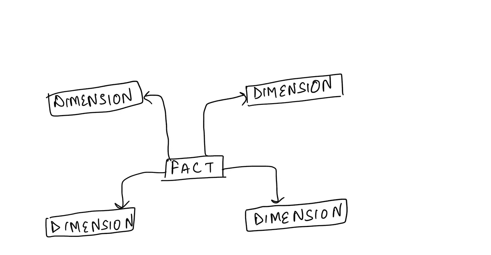
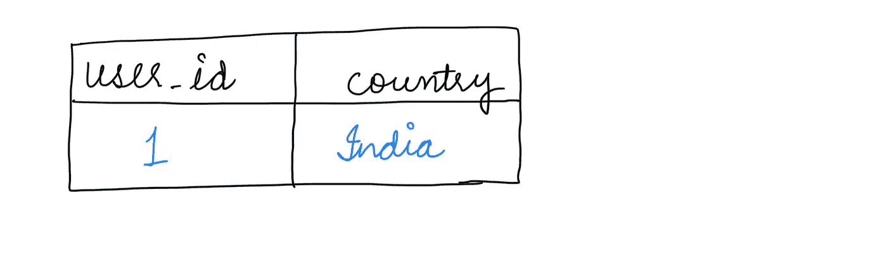
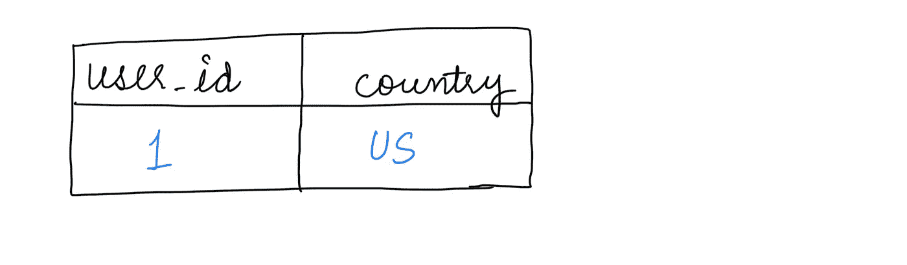
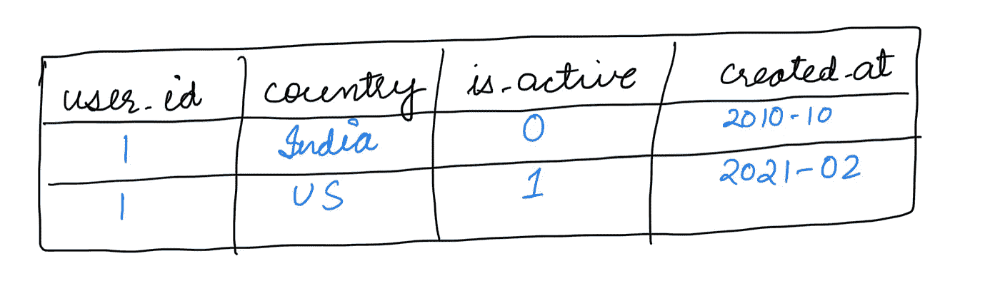
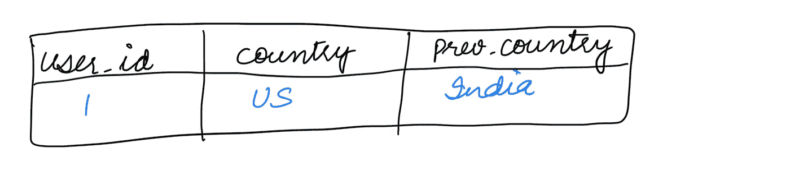

# 超越事实，了解你的维度

> 原文：<https://towardsdatascience.com/move-over-facts-know-your-dimensions-e1489862f9a0?source=collection_archive---------7----------------------->

## 数据仓库中的维度类型

照片由[西格蒙德](https://unsplash.com/@sigmund?utm_source=unsplash&utm_medium=referral&utm_content=creditCopyText)在 [Unsplash](https://unsplash.com/s/photos/dimension?utm_source=unsplash&utm_medium=referral&utm_content=creditCopyText) 拍摄

度量，度量，度量！如今，我们希望捕捉应用程序中的每一次点击、每一次滚动和每一个事件，并在其上运行作业。众所周知(*事实:P* )这些指标是黄金(*或者我应该说石油？*)但是你有没有想过失败者，这些指标所指的维度？

本文将带您回到数据仓库的基础，并回顾数据仓库中不同类型的维度。如果您已经熟悉什么是尺寸，您可以跳到下一部分。

让我先谈谈维度是什么，那么维度是什么？

> 维度是我们观察、测量和体验世界的方式。在数据领域，这可以转化为维度，即我们衡量数据和回答业务查询的实体。维度是衡量标准的方式。例如:指标如何与地理相关？

可视化和理解维度的最简单方法是它们在[星型模式](https://en.wikipedia.org/wiki/Star_schema)中的位置:

定义完维度后，让我们继续下一节，讨论维度的不同类型。

# 维度的类型

根据尺寸变化的频率，可将其分为三种类型:

**静态尺寸:**不随时间变化*的尺寸。这些维度非常容易实现。例如，用户的出生日期。*

**缓变尺寸(SCD):** 尺寸*随着时间推移缓慢改变* *或能够改变*的尺寸。实现 SCD 有多种方法，这取决于您希望如何处理发生的变化。

例如，假设用户在 21 年 2 月 24 日从*印度*搬到了*美国*，我们希望在维护为

设计 SCD 的各种方法有:

*   **SCD — Type 0:** 发生变化时，保留原来的值。更新的维度表:

*   **SCD — Type I:** 发生变化时，覆盖原始值。更新的维度表:

*   **SCD — Type II:** 发生变化时，增加新的一行。当您想要维护尺寸变更的历史记录时，请使用类型 II 尺寸设计。更新的维度表:

*   **SCD — Type III:** 当发生变化时，增加一个新列。更新的维度表:

*   **SCD — Type IV:** 当发生变化时，覆盖并维护一个单独的历史表。

**快速变化尺寸:**随时间变化 *或能快速变化*的尺寸*。例如，用户的体重。快速变化的维度通常被实现为垃圾维度，如下所述。*

上面介绍了基于更改频率的维度分类，还有其他基于维度存储方式和其他一些因素的维度分类。其中一些定义如下:

**退化维度:**作为事实表的一部分存储而不是存储在单独的表中的维度。将维度存储为退化维度的决定取决于几个因素，如查询性能考虑。例如，用户的名字可以存储为事实表的一部分。

**符合尺寸:**这些尺寸无论在哪里被引用都具有相同的含义。例如，日历维度表。

**垃圾维度:**这可以解释为一个杂项表，可以维护该表以将不相关的属性存储在一起，并且当不希望将事实表中的太多外键维护到太多维度表时，可以使用单个外键来引用该表。这些通常被实现来处理快速变化或快速变化的维度。

**推断维度:**这些是维度表类型，用于在维度表中的引用可用之前加载事实表的情况下，处理后期数据。在这种情况下，为了尊重引用完整性，可以在事实表可以*推断*的维度表中创建一个所有维度属性都为空的新记录。当维度数据可用时，可以更新该新行。

嗯，三分钟内的信息太多了！希望这有助于澄清数据仓库中的一些维度类型。

下次见，
JD