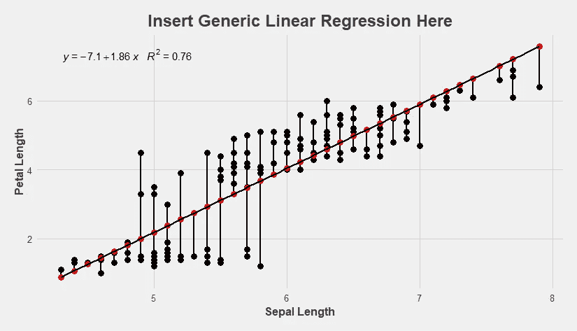
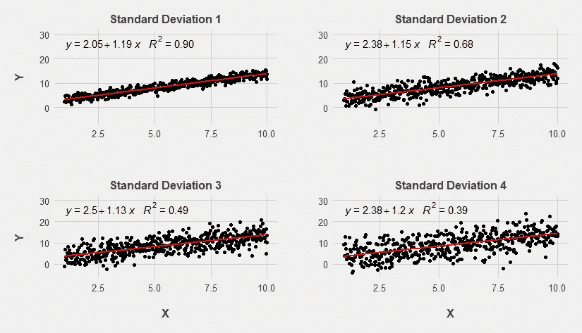
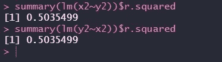

# 远离 R

> 原文：<https://towardsdatascience.com/moving-away-from-r%C2%B2-4a89b1c70393?source=collection_archive---------20----------------------->

## 使用它的危险以及如何改进你的分析。


作者造成的不良形象

# 介绍

r 是一个众所周知的模型指标，每个数据分析师都有它的工具箱，但尽管它很流行，数据分析师倾向于谈论和使用这一指标的方式与统计界对它的看法不匹配。在这篇文章中，我希望用简单的图表和语言来解释 R 的一些误用，以及我们如何使用更适用的度量来改进我们的分析。

*这篇文章很大程度上受到了* [*科斯马·沙立子博士的讲稿*](http://www.stat.cmu.edu/~cshalizi/mreg/15/lectures/10/lecture-10.pdf) *的启发。我的意图是将一些难以理解的统计数据转换成一个更加直观和外行的解释。*

# 行动纲要

一些积极使用 R 的人可能想知道这有什么大不了的。以下是一个简短的总结，如果你不同意以下至少一点，也许值得继续读下去。

## 使用 R 的好理由:

1.  我想看看我的数据有多嘈杂。

## 使用 R 的错误理由:

1.  我想知道我的模型在预测方面有多好。(不好，用均方差代替)
2.  我想知道我的自变量是否显著。(不好，使用 p 值)
3.  我想知道我的线性模型在统计上是否显著(不好，使用 f 检验，但是也要确保检查你的假设)
4.  我想知道我的因变量有多少是由我的自变量解释的(不好…有点……)

还感兴趣吗？太好了，继续读下去！

# 背景



按作者分类的图表

## 非常简要地回顾一下 R

r 是一个常用于评估线性回归模型的指标。在上图中，我们可以看到红点(预测值)与黑点(实际值)的差异。这两种颜色之间的黑线叫做余数。但是如果我们想想出一些方法来看看我们的残差有多大呢？插入 R。

r 是自变量解释的因变量方差的比例。用不太正式的术语来说，它是一个介于 0 和 1 之间的值，用来描述我们的模型与数据的吻合程度。在许多数据分析领域，R 还充当了比较和评估模型的指标，0 表示非常差的模型，接近 1 的值表示良好的模型。我们用残差平方和(RSS)除以总平方和(TSS ),然后从 1 中减去该分数。

## 信号和噪音

信号和噪声是数据世界的阴阳两极。信号是指我们试图检测的数据中的一些真相，而噪声是掩盖我们信号的无意义信息。为了把这个比喻带入 21 世纪，你可以把 signal 想象成你想要找到的最喜欢的 Spotify 播放列表，把 noise 想象成那些总是被推销的垃圾播客。在本文中，我将频繁使用这些术语，以便让来自非统计背景的人更容易理解诸如标准差和真实系数值之类的概念。

## r:噪声的度量单位

作为数据科学家，我们希望检测数据中的信号。我们开发模型和复杂的分析来做这件事，然后我们评估我们所做的，以确定我们是否做得很好。这就是为什么用 R 来衡量我们信号的强度(或有效性)是如此错误的原因——因为 R 在很大程度上衡量的是我们数据中的噪声。

回想一下，在我们对 R 的简短讨论中，我们说过，自变量解释的是因变量方差的比例。这应该会给我们带来一些危险信号，因为根据定义，我们意识到，随着因变量方差(噪声)的增加，我们能够解释的部分就越少，即使我们保持信号不变。

这可能还没有意义，所以让我们想象一下在保持信号不变的情况下增加噪声是什么样子。

# 操纵 R

在本例中，我们将创建一些数据。我们要做的是定义我们的信号是什么，引入不同水平的噪声，并观察 R 如何反应。

我们的信号:X 的真实系数等于 1.2

噪声:平均值为 0 且标准差增加的数字的随机相加。

为此，我们将使用以下代码来生成数据。

```
x1 <- seq(1,10,length.out = 500) 
y1 <- 2 + 1.2*x1 + rnorm(500,0,sd = 1) 
```

对于 x1，计算机将生成 500 个 1 到 10 之间的数字。对于 y1，我们要取这个数，乘以我们的真实系数(1.2)，加上 2，然后加上一个随机分布在 500 左右的随机数，平均值为 0，标准差为 1。

我们将创建 4 个图表和线性回归，以查看我们的结果如何随着标准差的增加而变化。重要的是要认识到，在每一种情况下，我们的信号(真实系数为 1.2)将保持不变，但我们会有不同水平的噪声(长期来看平均值为 0)。

如果 R 测量我们的信号或它的强度，它应该保持大致相等。如果它测量我们数据中的噪声，那么当我们增加模型中的噪声(保持信号不变)时，R 应该直线下降。那么会发生什么呢？



按作者分类的图表

你看看那个。我们每次回归的信号是 1.2，每次回归都在 1.2 左右。但是请注意，每次我们增加噪音时，我们的 R 似乎都受到了影响。

这就是为什么 R 可以成为一个破坏性的模型评估者。由于它甚至没有试图测量信号，淡化低 R 的模型会导致我们忽略我们在数据中准确识别信号的时间。

# r 和解释:一个解释

早些时候我告诉过你，R 是由自变量解释的因变量方差的比例，但是现在，亲爱的读者，我必须承认这也比看起来更复杂。

当我们经常说一个词的时候，我们可能会欺骗自己认为我们理解了它，但它值得我们注意真正检查“解释”在这里的意思。我担心的是，许多人认为这个模糊的词意味着“原因”。最后，我们应该证明 R 不可能告诉我们 X 导致 Y，或者在两者之间有某种因果联系。

这个简单的实验实际上很容易做。让我们取一些 X，它实际上对 Y 有一些因果影响(和前面的代码一样)。那么，如果 R 确实度量了某种因果联系，并且我们知道 X 是导致 Y 的原因，那么用 Y 解释的 X 的变化的 R 应该低于用 X 解释的 Y 的变化的 R。

让我们进行这个实验，看看我们的 R 有什么不同。

```
x2 <- seq(1,10,length.out = 500)     
y2 <- 2 + 1.2*x2 + rnorm(500,0,sd = 3)
summary(lm(x2~y2))$r.squared
summary(lm(y2~x2))$r.squared
```



我们代码的输出

我们知道，Y 对 X 没有因果影响，然而，如果我们相信 R 向我们展示了某种因果联系，那么这里的 R 应该是不同的，但它们不是，所以我们必须拒绝任何概念，即 R 可以证明我们的因变量和自变量之间的某种因果联系。

实际上，我认为大多数数据分析师会拒绝说 R 告诉我们 Y 有多少是由 X 引起的，但我确实认为许多人相信这一点。那些通常很少关心方差的人，却惊人地关心有多少方差是由某个变量“解释”的。

# 所有这些的含义

一旦你理解了 R 和噪声之间的关系，当分析师主要基于 R 值来提升或贬低一个模型时，你会忍不住退缩。正如我们刚刚看到的，R 不能告诉我们数据中的信号，它本身是一个非常有限的指标。

事实上，很难找到一个令人信服的理由来给 R 以它应该得到的关注。这篇文章已经太长了，但是我认为，很多时候沉迷于 R 是一个很坏的习惯，因为它通常会鼓励新人疯狂地过度适应(你的模型可以解释的噪声越多，R 就越好)，忽略其他更重要的线性回归模型指标，一旦他们遇到真实世界的数据及其混乱，他们就会失败。

我确实认为 R 在边缘情况下仍然有用，但是几乎每个分析都可以通过使用另一个更适用的度量来改进。它的简单性对任何数据科学的新手来说都是有吸引力的，但是为了更好地掌握统计和数据科学，认识到它的缺点并使用更好的技术是很重要的。

这篇文章是一个白痴数据分析师写的，他极大地简化了提到的统计数据。错误是可能的，但是 R 应该被更谨慎地使用的主要观点仍然存在(至少我希望如此。我知道什么？我只是一个免责消息)。