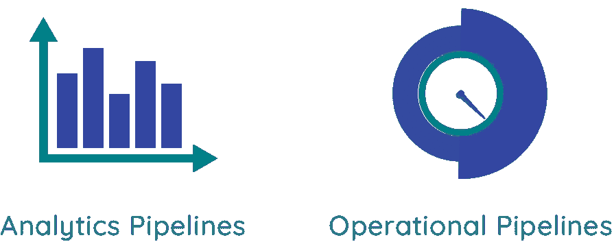

# 超越批处理与流

> 原文：<https://towardsdatascience.com/moving-beyond-batch-vs-streaming-continuous-datasets-e00713797929?source=collection_archive---------35----------------------->

## 连续数据集:通过两种生态系统的可访问性

来源:Pixabay

我的世界观很大程度上受我的产品和业务背景的影响，它让我以量化公司或产品价值的统计数据来思考这个世界。随着时间的推移发生了什么？现在发生了什么事？

世界各地的 FAANGs 都明白这一点，并提供量身定制的产品来提供这一价值。当我登录 Google AdWords 时，我不仅可以看到我的活动目前的运行情况，还可以看到它在一段时间内的表现。两者缺一不可，这将是一个不完整的观点。

谷歌分析、脸书和亚马逊拥有看似毫不费力的实时报告。网飞和苹果的反应式界面会根据我的浏览行为和指示的偏好进行更新，为我提供我可能感兴趣的产品和关于我互动方式的当前视图。如果没有基于实时洞察的即时调整，我的用户身份和与这些服务的关系就不会一样。

奇怪的是，当我们使用大多数其他商业工具时，我们的体验会受到影响。你能想到你使用的 B2B 系统没有几天或至少几个小时的报告延迟吗？

回想一下你上一次访问公司的人力资源系统是什么时候。与等待系统更新相比，打电话给他们确认确实做出了改变通常更容易。

B2C 也是如此。向保险公司索赔需要多长时间？你可能认为只有老派、行动缓慢的企业才会有这个问题，但事实并非如此。我们中的大多数人都曾在这样的组织中工作过:每个季度结束后，至少要花一个月的时间来最终确定销售目标。尽管《哈佛商业评论》调查的 83%的企业认为“在最佳时间将数据转化为可操作的洞察力的能力”很重要，但只有 22%的企业表示他们能够成功做到这一点。

但是人们越来越期待反应式的体验。提供这些功能的产品表现明显更好。几乎所有的[福布斯未来 50 强](https://fortune.com/future-50/2020/search/)都属于这一类别，这并不是巧合，因此 IDC 称[到 2025 年 30%的数据将是实时的](https://www.networkworld.com/article/3325397/idc-expect-175-zettabytes-of-data-worldwide-by-2025.html)。

那么，是什么让今天的 FAANGs 和明天的预计科技巨头提供这些类型的体验，而不是其他人呢？很可能是因为他们拥有庞大的技术团队，可以绕过当前数据管道的限制。管道分为两类，每一类都有自己的优点和缺点。A16Z 在他们最近的帖子中详细讨论了这些范例。

来源:作者创作

**批处理系统**组织大规模数据集，以便最终用户可以就这些数据集提出问题并快速获得答案。每次发出查询时，这些答案的计算都涉及到对围绕其提问的整个数据集的处理。批处理系统通常用于**分析**用例，具有特定的优点和缺点:

慢:问题只能问历史，不能问现在发生的事情。批处理系统通常有一天的延迟，但是有可能将这个时间范围降低到几个小时。

**昂贵:**因为每次提出一个问题都会处理整个世界，所以账单会随着数据集的大小和发出的查询数量而迅速增加。

**灵活:**它们易于使用，可以快速询问特定问题或试验新的用例。

**流系统**查看“事件”并在事件发生时处理每个事件。它们通常用于**操作**目的，如监控、机器学习或构建反应式体验。

**快速:**有可能在事件发生的几毫秒内获得洞察力或采取行动。

**昂贵且不方便:**用例需要定制开发，构建它们需要一个相当大的工程团队，既要让它们启动并运行，又要维护它们。

**历史很少:**流媒体系统通常只处理最近的数据，而不处理历史信息。

你们中的一些人会说“但是 [Kafka 最近使用云存储](https://www.confluent.io/blog/infinite-kafka-data-storage-in-confluent-cloud/)添加了无限保留，所以我可以在那里卸载我所有的历史，并从我的流媒体系统中获取历史”。你是对的，但有一个相当大的警告——为了实际使用历史数据，你需要通过卡夫卡读回那些数据。雪花不能通过设计直接查询它，任何其他批处理系统也不能，所以如果你想使用一个流系统来查看历史数据，每次提出一个问题，你都需要通过你的代理将数据返回，这有点像用一根吸管连接两个消防水管。这些查询将花费难以忍受的长时间来返回任何有用的信息。雪上加霜的是，这些代理正是您的生产系统所使用的代理。如果你超负荷工作，你会危及生产本身，这是不可取的。

这只是两个世界之间巨大差异的一个例子，不仅仅是在互操作性方面，还有最终用户的类型(分析师与工程师)。大多数大型企业在不同的用例中同时使用批处理和流处理，最终拥有两个完全不同的系统，这两个系统应该是一致的，但很少会这样。

打击一个能够从数据集而不是技术的角度思考的人。

我们知道定制管道可以做到这一点，因为科技巨头支持这种功能。一个显而易见的方法是协调系统间的查询。例如，我可以构建两个独立的管道，在我的分析系统中查询超过一天的数据，在我的流系统中查询最近的数据。这已经作为一个 Lambda 架构得到普及，但是有几个原因导致它不能很好地工作。

首先，光是实施就要花费[数百万美元](https://keen.io/blog/apache-kafka-vs-amazon-kinesis-to-build-a-high-performance-distributed-system/)，而且极其耗时，当我想要创建新的数据流和报告视图时，发展成本可能也一样高。当我在系统间查询时，我可能总是会被不一致性所困扰[。因此，虽然可能，但这种方法只适用于大型企业，而且效率肯定不高。](https://www.oreilly.com/radar/questioning-the-lambda-architecture/)

即使我想通了所有这些，也几乎不可能获得跨两个系统进行重复数据删除的准确答案，从而限制了此类设置中数据的效用。

对于大多数公司和应用程序来说，这是第二个问题。

仔细看看这个问题，我们只是看到了真正问题的症状:我们正在拼凑点解决方案，试图解决一个整体的业务数据问题。我们有帮助我们移动和处理数据的技术解决方案，但它们的互操作性很差，我们仍然需要协调全面解决方案所需的所有技术基础设施。这是有道理的，因为尽管批量数据处理已经取得了很大进展，但我们还只是处于真正实时连续物化的最早期阶段。所有现有的框架在可以发出的查询类型(例如，窗口)方面都有有意义的限制，这阻止了它们真正像批量分析那样被使用。从功能上来说，这意味着你可以连接和比较最近的数据，但是如果你想做任何超出这个范围的事情，祝你好运。

听起来很像三振出局。

## **连续数据集:呼唤新范式**

到了紧要关头，我们都有一个单一的底层数据集，尽管它可能由来自不同位置的多个信号组成。技术迫使我们将基于基础架构的“批处理”和“流式”视图捆绑在一起，并将其视为相同数据的根本不同的副本。当工程师想要构建一个新的用例时，他们需要协调这些副本。当他们创建依赖于低延迟流数据的服务时，他们必须从批处理环境中手动回填细节。这有着至关重要的连锁效应，当制定新的数据驱动的用例、发展或将它们集成到您的堆栈中时，这会限制或至少增加潜在使用模式的复杂性。

迄今为止，流媒体系统一直是围墙花园。静态数据存储在基于技术的专有格式和位置中，只能通过向流系统请求该数据来读取。您的数据永远不应该被锁定在访问层之后，而是以您的用户(了解批处理系统)可以直接访问的格式存储。如果是这样的话，我们可以有一个服务于低延迟流用例的单一数据表示，同时仍然可以被广泛使用的批量分析工具生态系统查询。

格式不是唯一不应该受制于技术和供应商的东西。您的数据应该存储在一个便宜、可访问且灵活的位置。对于这些要求，实际上只有一个选项—云存储—几乎是为任务定制设计的。这听起来有些愚蠢和过时，但大多数流媒体系统仍然在本地存储数据，并迫使用户担心当他们的磁盘填满时该怎么办。

我们应该能够清楚地表达我们关心的数据集，并确信技术将允许访问历史和非常低延迟的更新，这些更新是可访问的，并由云存储支持:**连续数据集**，尽管仅此还不够。为了满足我们的业务需求，连续数据集需要其他特定属性:

1.  **数据目录。**存放数据并易于搜索的单一位置。太多的企业依赖分散在工具中的分散数据。通过在企业内创建一个全局命名空间，数据目录可以包含每一条有权限的可用信息，以确保正确的用户可以访问。
2.  **可审计性。**改变某样东西的价值不应该看起来像是覆盖它，而是记录它的新价值。我们应该总是能够回到过去，看到任何数据集的完整历史。
3.  **无限变换。**这很难，但我们需要廉价地创建新的衍生数据集的能力，通过连接、扩充或转换上游数据集，这些数据集始终保持最新和完整。这些转换不能受制于今天的流窗口或回看限制，这些限制迫使用户为特定查询改变工具。
4.  **秤。即使是数据仓库也有局限性。工作流不应该根据规模需求来强制选择技术。**
5.  **互通性。**这些数据集应该与团队使用的任何工具一起工作。雪花，蜂房，数据库，SaaS 工具等应该很容易插入，并与历史和当前信息保持同步。

[河口流](http://estuary.readthedocs.io)是第一个考虑连续数据集的系统，有助于为每个人提供与 FAANG 一样的优质用户体验和业务洞察。