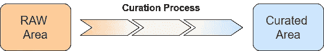
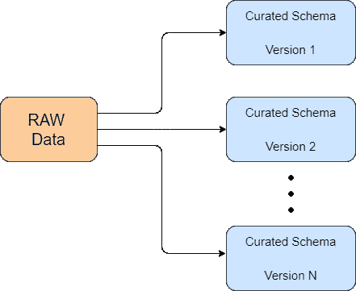

# 从数据库思维模式转向数据湖思维模式

> 原文：<https://towardsdatascience.com/moving-from-a-database-mindset-to-a-data-lake-mindset-d93ffae7caca?source=collection_archive---------15----------------------->

## 使用数据湖时的三种范式转变

图片作者:[乔尔·安巴斯](https://unsplash.com/@jcambass)

使用数据库和数据湖之间有几个关键的概念差异。
在这篇文章中，让我们找出一些乍一看可能并不直观的区别，尤其是对于具有强大关系数据库背景的人来说。

# 该服务器是一次性的。数据在云中。

*解耦存储和计算*:这是谈论数据湖的经典案例。

在传统数据库系统(以及最初基于 Hadoop 的数据湖)中，存储与计算服务器紧密耦合。服务器或者内置存储，或者直接连接到存储。

在现代基于云的数据湖架构中，数据存储和计算是独立的。数据保存在云对象存储中(例如:AWS S3，Azure 存储)，通常是像 parquet 这样的开放格式，计算服务器是无状态的，它们可以在任何需要的时候启动/关闭。

存储和计算的分离实现了:

*   **降低计算成本**:服务器在必要时运行。不使用时，可以关闭它们，从而降低计算成本。
*   **可扩展性**:您不必为峰值使用量购买硬件。服务器/CPU/内存的数量可以根据当前的使用情况动态增加/减少。
*   **沙箱**:多个计算服务器/集群可以同时读取相同的数据。这允许您有多个团队，在不同的集群中，并行工作，读取相同的数据，而不会相互影响。

# 原始数据才是王道！精选的数据是从。

在数据库范例中，来自源系统的数据被转换并加载到数据库表中后，就不再有用了。在数据湖范式中，原始数据作为真实的来源保存，最终永远保存，因为它是真正的资产。

然而，原始数据通常不适合企业用户使用，因此需要经过一个*处理过程*来提高质量、提供结构并简化使用。经过筛选的数据最终会被存储起来，供数据科学团队、数据仓库、报告系统和业务用户使用。

数据湖策展(来源:作者图片)

典型的数据湖消费者只看到经过策划的数据，因此他们对策划的数据比对生成它的原始数据更看重。

然而，*数据湖的真正资产是原始数据*(以及监管管道)，在某种意义上，监管数据类似于可以随时刷新的*物化视图*。

## 关键要点

*   可以随时从原始数据中重新创建。
*   可以通过改进的固化过程重新创建。
*   我们可以有多个精选视图，每个视图用于一个特定的分析。

# 今天做出的模式决策不会约束未来的需求

通常，信息需求会发生变化，需要分析一些最初不是从源/操作系统收集的信息。

在一个典型的场景中，如果原始的原始数据没有被存储，历史数据将永远丢失。

然而，在数据湖体系结构中，*今天做出的不将字段加载到管理模式上的决定可以在以后撤销，因为所有详细信息都安全地存储在数据湖的原始区域*中，并且历史管理数据可以用附加字段重新创建。

策划模式演变(图片由作者提供)

## 关键要点

*   如果您现在不需要，就不要花太多时间去创建一个通用的“一刀切”的管理模式。
*   迭代地创建一个管理模式，从添加您现在需要的字段开始。
*   当需要其他字段时，将它们添加到监管流程中并重新处理。

# 最后的想法

数据湖不是数据库的替代品，每种工具都有其优点和弱点。

对于 OLTP 来说，使用数据湖可能和使用数据库来存储万亿字节的非结构化数据一样糟糕。

我希望这篇文章有助于揭示两个系统之间的一些关键设计差异。