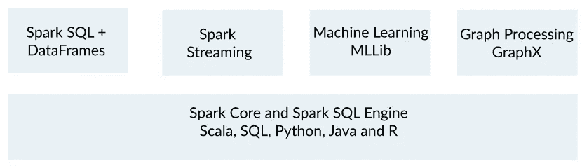
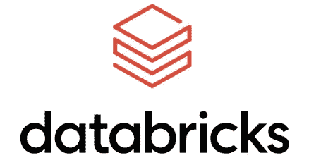
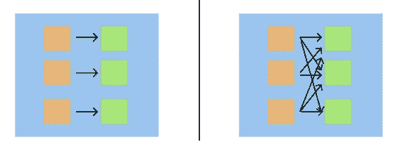
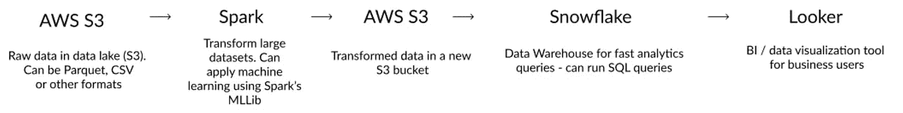
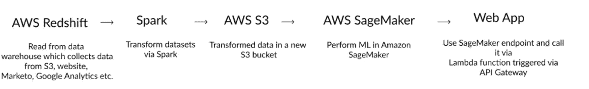

# 从熊猫到星火

> 原文：<https://towardsdatascience.com/moving-from-pandas-to-spark-7b0b7d956adb?source=collection_archive---------13----------------------->

## 当您的数据集开始变大时，迁移到 Spark 可以提高速度并节省时间。

大多数数据科学工作流都是从熊猫开始的。Pandas 是一个很棒的库，可以让你做各种各样的转换，可以处理不同种类的数据，比如 CSV 或 JSONs 等。我喜欢熊猫——我在上面制作了一个名为“为什么熊猫是新的 Excel”的播客。我仍然认为熊猫是数据科学家武库中的一个令人敬畏的图书馆。然而，当你正在处理的数据集变得太大时，熊猫就会开始耗尽内存。正是在这里，火花进入画面。

Spark 对于大型数据集来说是很棒的❤️ [ [来源](https://unsplash.com/photos/hBzrr6m6-pc)

我以问答的形式写这篇博文，带着你可能会有的问题，我刚开始写的时候也有。

## **Q1。什么是火花？**

Spark 是一个处理海量数据集的框架。它允许您以分布式方式处理大数据文件。它让几个工人运转起来，这些工人处理你的大数据集，所有这些都由一个驱动节点来编排。该框架的分布式特性使您可以将其扩展到数 TB 的数据。你不再被任何一台机器的内存所限制。Spark 生态系统现在已经发展得如此之快，以至于您不需要担心任何工作流程编排，并且可以开箱即用，性能卓越。

星火生态系统[参考](https://spark.apache.org/)

## **Q2。什么时候应该搬出熊猫，认真考虑用 Spark？**

这取决于你机器的内存。我想说大于 10GB 的数据集对熊猫来说太大了，Spark 在这里变得非常有益。假设您的数据集中有 10 列，每个单元格有 100 个字符，因此大约有 100 个字节，并且大多数字符都是 ASCII 码，可以用 1 个字节进行编码，那么 10M 行将是您应该想到 Spark 的地方。

## **Q3。Spark 做什么都比熊猫好吗？**

不要！对于初学者来说，学习熊猫肯定要容易得多。Spark 可能更难，但有了最新的 API，您可以使用数据帧处理大量数据，这些数据帧几乎和熊猫数据帧一样容易处理。

此外，直到最近，Spark 还不太支持可视化。你只能对数据子集进行可视化。最近，当 Databricks 宣布他们将在 Spark 中对可视化提供原生支持时，情况发生了变化(我仍在等待看到这一点)。但在这种技术成熟之前，Spark 至少在虚拟世界里不会完全取代熊猫。您总是可以通过`df.toPandas()`将 Spark 数据帧转换成 Pandas，然后运行可视化或 Pandas 代码。

## **Q4。Spark 设置起来很吓人。我该怎么办？**

Spark 可以通过 PySpark 或 Scala(或 R 或 SQL)在 Python 中进行交互。我写了一篇关于在本地或定制服务器上开始使用 PySpark 的[博客](/how-to-get-started-with-pyspark-1adc142456ec)——人们评论说开始使用 PySpark 有多难。我认为在尝试运行 Spark 时，您可以直接使用托管云解决方案。

我推荐两种开始使用 Spark 的方法:
1。Databricks —这是一个完全托管的服务，为您管理 AWS / Azure / GCP 中的 Spark 集群。他们有可以运行的笔记本，与 Jupyter 笔记本非常相似。
2。**亚马逊 EMR 和 Zeppelin 笔记本** —这是由 AWS 提供的半托管服务。您需要托管一个 Spark EMR 端点，然后运行 Zeppelin 笔记本与之交互。其他云提供商也有类似的服务，我在这里不包括他们。

Databricks 是托管 Spark 集群的一种流行方式[Image[Source](https://commons.wikimedia.org/wiki/File:Databricks_Logo.png)with CC[license](https://creativecommons.org/licenses/by-sa/4.0/deed.en)

## **Q5。Databricks 和 EMR 哪个好？**

在花了几个小时试图了解两者的利弊之后，有一些考虑:
a) EMR 完全由亚马逊管理，你不需要离开 AWS 生态系统。
b)如果您有 devops 专业知识或有 devops 人员帮助您，EMR 可能是一个更便宜的选择——您需要知道如何在完成后上下旋转实例。也就是说，EMR 可能不稳定，你可能需要花几个小时调试。Databricks Spark 要稳定得多。
c)使用 Databricks 很容易安排作业——您可以非常轻松地安排笔记本电脑在一天或一周的特定时间运行。它们还提供了一个到 Ganglia UI 中指标的接口。
d)对于 Spark 作业而言，Databricks 作业可能比 EMR 作业贵 30–40%。但是考虑到灵活性和稳定性以及强大的客户支持，我认为他们是值得的。Databricks 在 Spark 中以交互方式运行笔记本电脑的收费是 6-7 倍，所以请注意这一点。鉴于 30/60/120 分钟的活动后，你可以拒绝实例，从而节省成本，我仍然认为他们可以整体更便宜。

鉴于这几点，我想说如果这是你的第一个 Spark 项目，你应该选择 Databricks，但是如果你有大量的 DevOps 专业知识，你可以尝试 EMR 或者在你自己的机器上运行 Spark。如果你不介意公开分享你的工作，你可以免费试用 Databricks 社区版或者用他们的企业版做 14 天的[试用](https://databricks.com/try-databricks)。

## **Q6。PySpark 和熊猫相比有多相似或不同？**

我觉得这值得有自己的博客。星火计划的贡献者安德鲁·雷的这个演讲应该可以回答你的一些问题。
主要相似之处有:
a) Spark **数据帧**与熊猫数据帧非常相似。
b) PySpark 的 groupby、aggregations、selection 等变换都和熊猫很像。与熊猫相比，PySpark 稍微难一点，有一点学习曲线——但感觉相似。

主要区别是:
a) Spark 允许你用 SQL 和 Python**查询数据帧，我觉得这真的很棒。有时，用 SQL 编写一些逻辑可能比用 Pandas/PySpark 记住确切的 API 更容易，您可以这样做，也可以互换工作。
b) **火花数据帧是不可变的**。不允许切片，覆盖数据等。
c)**Spark※懒评**。它构建了一个所有转换的图表，然后当你实际提供一个动作，比如`collect`或`show`或`take`时，它会懒洋洋地评估它们。转换可以是宽的(查看所有节点上的全部数据，因此`orderBy`或`groupBy`)或窄的(查看每个节点中的单个数据，因此`contains`或`filter`)。与窄转换相比，进行几个宽转换会慢一些。与熊猫相比，你需要更加注意你正在使用的广泛转换！**

Spark 中的窄与宽转换。大范围转换速度较慢[图片由作者提供]

## **Q7。还有什么其他优势可以火花吗？**

Spark 不仅提供数据帧(rdd 上的高级抽象)，还通过 MLLib 提供优秀的流数据和分布式机器学习 API。因此，如果你想对流数据进行转换，或者想在大型数据集上进行机器学习，Spark 可能会对你有用。

## **Q8。有 Spark 的数据管道架构的例子吗？**

是的，这里有一个 ETL 管道，原始数据从数据湖(S3)处理，并在 Spark 中转换，加载回 S3，然后加载到像雪花或红移这样的数据仓库，然后驱动像 Tableau 或 Looker 这样的 BI 工具。

BI 工具的大型数据处理 ETL 管道示例[图片由作者提供]

在 Amazon SageMaker 中执行 ML 的示例管道

您也可以首先从仓库内不同的来源收集数据，然后使用 Spark 转换这些大型数据集，将它们加载到 S3 的 Parquet 文件中，然后从 SageMaker 读取它们，以防您更喜欢使用 SageMaker 而不是 Spark 的 MLLib。SageMaker 的一个额外优势是，它让您可以轻松部署，并通过 Lambda 函数触发模型，而 Lambda 函数又通过 API Gateway 中的 REST 端点连接到世界。我已经写了一篇关于这个架构的博文。另外[学习 Spark](https://www.amazon.com/dp/1492050040/?tag=omnilence-20)Jules Damji 的书学习 Spark 真的很棒。

这就完成了从熊猫到星火的博文。我们讨论了一些相似点和不同点，开始使用 Spark 的最佳方式，以及一些利用 Spark 的常见架构。

如有任何问题或意见，请通过 LinkedIn 联系我！

**资源:**
1。Jules Damji 讲述 Spark 如何工作的幕后故事。
2。朱尔斯·丹吉的《学习的火花》一书。
3。比较熊猫句法和安德鲁·雷的 PySpark [talk](https://www.amazon.com/dp/1492050040/?tag=omnilence-20) 。