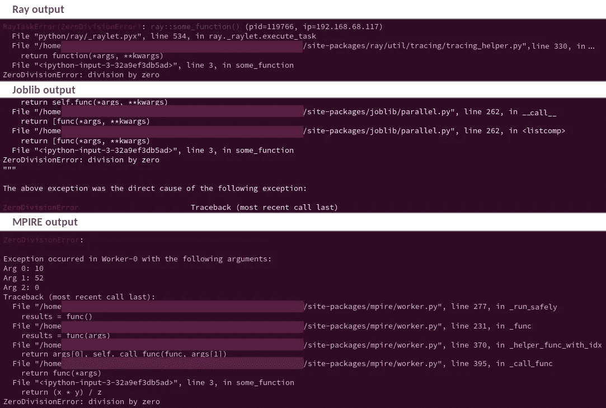
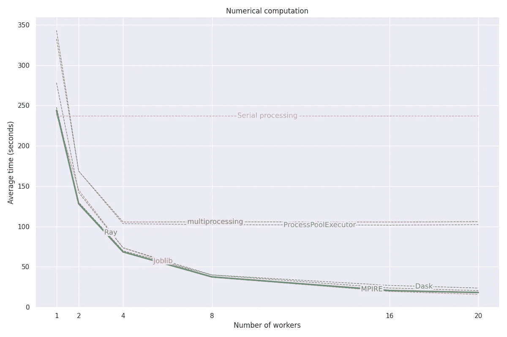
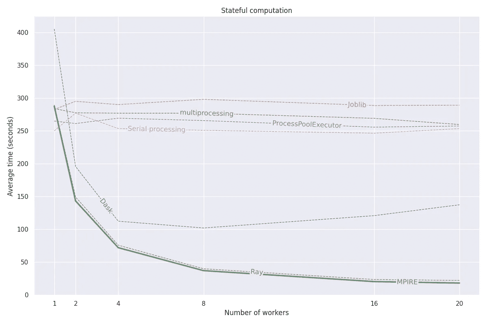
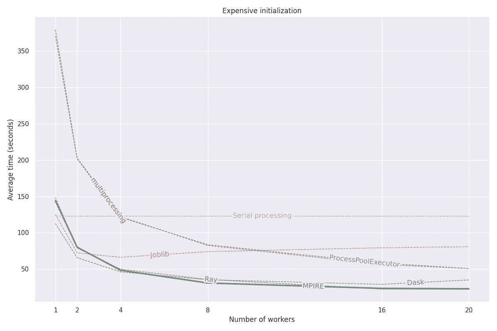
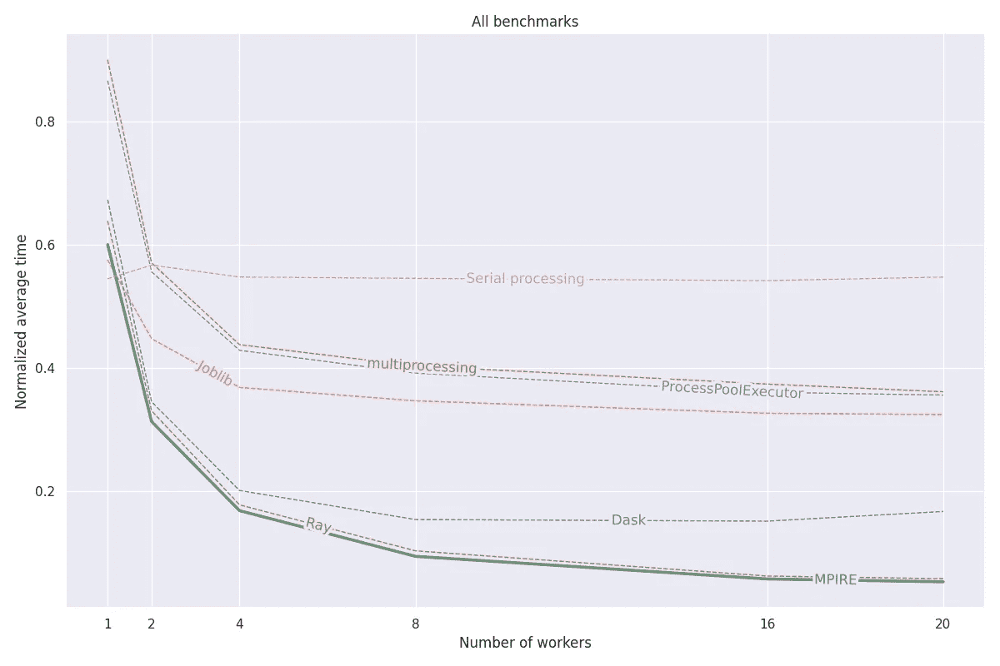

# MPIRE for Python:多重处理非常简单

> 原文：<https://towardsdatascience.com/mpire-for-python-multiprocessing-is-really-easy-d2ae7999a3e9?source=collection_archive---------1----------------------->

## MPIRE 简介，这是一个速度极快且最用户友好的 Python 多处理库

Jarek Jordan 在 [Unsplash](https://unsplash.com?utm_source=medium&utm_medium=referral) 上的照片

Python 是一种流行的编程语言，原因有几个。最重要的是，它易于设置和学习，因此开发速度快。然而，一个主要的缺点是 Python 的执行速度。与许多其他流行的编程语言相比，Python 在速度方面排在最后。幸运的是，通过用 C 编写许多性能关键的库并添加 Python 包装器(例如 NumPy)，速度问题已经大大缓解了。这些解决方案运行良好，它们可以利用多线程进行并行计算。当您自己的代码降低了您的速度，并且您想要并行化纯 Python 代码时，事情就变得棘手了。

通过多线程，单个进程的多个线程被同时执行。用 C/C++编写的库可以毫无问题地利用多线程。Python 不能利用多线程，因为臭名昭著的全局解释器锁(GIL)。我不会去解释它是做什么的，为什么它还在这里，因为有很多关于这个话题的[其他优秀的博客帖子](https://realpython.com/python-gil/)。这里要记住的是，由于这个 GIL，Python 不能像其他语言一样利用多线程处理 CPU 密集型任务。(注意:对于 I/O 密集型任务和其他释放 GIL 的任务，多线程可以很好地工作。)

因此，Python 程序员经常需要依赖多重处理，新的进程同时产生和执行。通过产生新的进程，我们有效地避开了 GIL。然而，为了在这些进程之间进行通信，我们需要使用管道或队列。这些通信原语不仅降低了多重处理的速度，而且如果你不是很有经验的话，它们也很难使用。

有许多 Python 库提供了多处理能力，并且不需要编写所有样板代码来处理进程和进程间通信。例如，有`multiprocessing.Pool` 和`concurrent.futures.ProcessPoolExecutor`类，它们都可以在 Python 标准库中找到。此外，还有 Joblib 等第三方包，以及 Dask 和 Ray 等分布式计算包。后一类还提供了跨几台机器的计算。然而，在我 7 年的 Python 程序员生涯中，单台机器上的多处理通常就足够了，建立一个工人集群的额外成本得不偿失。

然而，即使有这么多图书馆，没有一个能让我满意。大多数都有一个陡峭的学习曲线，因为它们引入了一个全新的关于`multiprocessing.Pool`的编程语法，提供了很差的错误处理，或者根本没有提供我正在寻找的所有功能。因此，四年前，我创建了一个新的包，它可以完成所有这些功能，甚至更多。它已经在 Slimmer AI 的几十个项目中使用，经过几次迭代的反馈和在生产环境中的暴露，它已经成为今天的成熟包。它现在是 Slimmer AI 的首选多处理库，最近，我们在 [GitHub](https://github.com/Slimmer-AI/mpire) 和 [PyPI](https://pypi.org/project/mpire/) 上公开了它。文档可在[这里](https://slimmer-ai.github.io/mpire/)获得。

在这篇博文中，我将介绍我们的多处理库 MPIRE(多处理真的很简单),并将它与现有的库在功能、易用性和速度方面进行比较。除了普通的串行处理，我对 MPIRE 进行基准测试的库有`multiprocessing.Pool`、`concurrent.futures.ProcessPoolExecutor`、*、*(一个`multiprocessing.Pool`的包装器)、Joblib、Dask 和 Ray。在这篇文章的剩余部分，我将用`ProcessPoolExecutor`来指代`concurrent.futures.ProcessPoolExecutor`。

# MPIRE 概述

MPIRE 构建在流行的`multiprocessing` 标准库之上，大部分遵循相同的语法，这使得它非常容易学习。`mpire.WorkerPool`级类似于`multiprocessing.Pool`级，但是增加了更多的特性和配置选项。MPIRE 的主要特点是:

*   比其他多处理库执行速度更快
*   直观的 Pythonic 语法
*   优雅且用户友好的异常处理
*   通过一组工作人员轻松使用写入时复制共享对象
*   每个工作者可以有自己的状态，并且通过方便的工作者初始化和退出功能，可以容易地操纵该状态
*   进度条支持使用 [tqdm](https://tqdm.github.io/)
*   仪表板支架
*   Worker insights 可让您深入了解多处理效率
*   子进程可以被固定到特定的或一系列的 CPU 上
*   多种进程启动方法可用，包括:fork、forkserver、spawn 和 threading(是的，threading)
*   可选地利用 [dill](https://pypi.org/project/dill/) 作为通过[多进程](https://github.com/uqfoundation/multiprocess)的序列化后端，支持在 iPython 和 Jupyter 笔记本中并行化更多外来对象、lambdas 和函数

对于这篇博文来说，浏览所有特性太多了。因此，我将重点放在几乎每个多处理任务的相关特性上。请参考[文档](https://slimmer-ai.github.io/mpire/)了解更多关于 MPIRE 的其他特性。

让我们看几个例子，并将 MPIRE 与其他库进行比较。

## 例 1。句法

假设我们有一个耗时的函数:

我们想调用 100 次并并行化:

Joblib 和 Ray 相对于`multiprocessing.Pool`引入了全新的语法。这意味着需要更多的时间来学习如何充分和优化地利用这些库。相比之下，MPIRE 的语法非常接近`multiprocessing.Pool`。

在没有多处理的情况下运行这个函数大约需要 100 秒，而所有经过测试的多处理库大约需要 20 秒。这是因为它们都被配置为创建 5 个流程，从而并行处理 5 个任务。在启动子进程和进程间通信时会有一些小的开销，但是在这种情况下预期会有 5 倍的加速。

## 示例 2:进度条

让我们添加一个进度条，让事情变得更有趣一点。当然，当你运行一个长任务时，你想知道任务的状态和完成的时间。我们将建立在前一个例子的基础上，利用`tqdm`作为进度条库。

在`multiprocessing.Pool`的情况下，如果我们想要显示实时进度信息，我们必须使用`imap`，一个返回生成器的`map`的惰性版本。尽管 Ray 有一个仪表板，但是在那里找不到进度信息。`ProcessPoolExecutor`和雷都引入了许多样板代码来实现进度条这样的琐碎工作。然而，雷在这里拿了蛋糕。当使用 MPIRE 时，我们可以简单地设置`progress_bar`标志，我们就完成了。

## 示例 3:异常处理

尽管您可能很有经验，但每个人都会偶尔引入 bug。在多处理上下文中调试异常并不总是容易的。然而，多重处理库至少可以使调试变得更容易。让我们看下面这个简单的例子:

现在，这个函数到处都在叫`ZeroDivisionError` ，这里只是为了说明。让我们看看不同的库将如何处理以下数据:

我们稍微修改了一下上面的代码，以使用新的函数和数据，但大部分都是相似的。完整代码见[此链接](https://gist.github.com/sybrenjansen/989027a3844e002c3ca9bdb944fe4237#file-error_test-py)。我们来看看输出。

*光线(上)、Joblib(中)、MPIRE(下)的错误输出。图片作者。*

对于大多数库，我们可以确切地看到哪一行导致了错误，即`return (x * y) / z`。然而 Joblib 和 Ray 只表示发生在`some_function`的第 3 行。即使雷召唤出一个`RayTaskError(ZeroDivisionError)`，它仍然可以作为普通`ZeroDivisionError`被抓，所以那里不用担心。然而，这些回溯之间的主要区别在于，MPIRE 显示传递给导致错误的函数的参数。这使得调试更加容易。唯一做这件事的其他图书馆是 Dask。

MPIRE 包含更多的特性，其中一些将在接下来的基准测试部分展示。

# 基准

这篇帖子显示了三个基准的结果，这些结果来自 2019 年由罗伯特·西原[发表的关于雷的](https://medium.com/@robertnishihara)[帖子](/10x-faster-parallel-python-without-python-multiprocessing-e5017c93cce1)。为了使基准测试更加公平，我将客户端的启动和关闭调用添加到总基准测试时间中，并删除了代码来“预热”Ray 工作线程。后者本来是作者做的，因为初始内存访问比较慢。预热在实践中并不常见，无论如何，所有多处理库都会受到预热的影响。此外，我增加了每个基准测试的工作负载，并使其在不同数量的内核之间保持一致，以更好地了解增加更多工作人员的好处。最后，通过允许使用`[Manager](https://docs.python.org/3/library/multiprocessing.html#multiprocessing-managers)` 对象，一些多处理实现得到了进一步优化。同样，这使得比较更加公平。

基准测试运行在一台具有 20 个内核的 Linux 机器上，禁用了超线程，内存为 200GB(对于这些基准测试来说已经足够了)。对于每项任务，使用不同数量的流程/工人进行实验，结果在 5 次运行中取平均值。各个库和基准测试的计时是一致的，所以为了使图形不那么混乱，省略了误差线。所有基准代码都可以在[这里](https://github.com/sybrenjansen/multiprocessing_benchmarks)找到。查看`[requirements.txt](https://github.com/sybrenjansen/multiprocessing_benchmarks/blob/main/requirements.txt)` 文件，了解需要安装哪些依赖项。

## 基准 1:数字数据

该基准使用不同的图像过滤器处理图像。每个滤镜的图像保持不变。因此，能够以某种方式将图像发送给每个进程的库具有明显的优势。这在`multiprocessing.Pool`中是不可能的，因为你需要求助于`multiprocessing.Process` 并且自己处理所有的通信和启动/加入过程。不理想。对于 MPIRE，代码如下所示:

就这么简单。该映像作为一个写时复制共享对象传递给每个进程，这意味着数据没有被复制，但底层内存被重用。只有当进程改变图像数据时，才会制作副本。在我们的例子中，这种情况不会发生，所以我们是安全的，处理将会很快。

计时结果如下图所示:

*数值计算基准测试结果平均超过 5 次运行。图片作者。*

`multiprocessing.Pool`和`ProcessPoolExecutor`明显表现不佳，我们认为为他们使用 4 名以上的工人没有额外的好处。每次发送图像显然会导致大量开销。另一方面，随着工作人员数量的增加，其他库的计算时间确实持续减少。当使用 4 个或更少的工人时，Joblib 和 Ray 都比 Dask 和 MPIRE 慢一点，但之后它们会赶上来。最终，Joblib 和 MPIRE 胜出，尽管差距很小。

在这个基准测试中，Joblib 利用其 [NumPy 内存映射特性](https://joblib.readthedocs.io/en/latest/parallel.html#automated-array-to-memmap-conversion)来加速重复共享相同的图像对象。禁用此项会显著增加 Joblib 的总时间。所以重要的是要记住，当你在一个不是 NumPy 数组的对象上做简单的计算时，Joblib 不会那么快。

## 基准 2:有状态计算

在第二个基准中，每个工作者跟踪自己的状态，并且应该在新任务到来时更新它。正如在[原始 Ray post](/10x-faster-parallel-python-without-python-multiprocessing-e5017c93cce1) 中一样，任务是处理文本文档并跟踪单词前缀计数——最多 3 个字符。每当某个前缀出现 3 次以上时，一旦处理完所有文档，就应该返回该前缀。

执行流前缀计数的简单类如下所示:

注意:`StreamingPrefixCount` 的这个实现类似于来自原始 Ray post 的，并不保证返回所有文档的正确前缀。然而，这在这种情况下并不重要，因为这个基准只是用来说明有状态计算。

可以为每个工作人员存储本地数据，并在所有工作完成后返回数据的库显然最适合这项任务。支持这一点的库有 Dask、Ray 和 MPIRE。 [Dask](https://distributed.dask.org/en/latest/actors.html) 和 [Ray](https://docs.ray.io/en/master/actors.html) 都支持`Actors`，支持有状态计算。然而，对 Dask 来说，这种支持似乎是实验性的，我无法让它在不崩溃的情况下工作。为了避免使用`Actors` ，我使用了`get_worker`，并在最后发送了一个特殊的哨兵令牌来收集结果。它并不漂亮，但很管用。

对于 Ray 来说，`Actor` 功能运行良好。人们可以使用`ActorPool` 来很好地分配工作量:

对于 MPIRE，我们可以利用 <https://slimmer-ai.github.io/mpire/usage/workerpool/worker_state.html> `[worker_state](https://slimmer-ai.github.io/mpire/usage/workerpool/worker_state.html)`和`[worker_exit](https://slimmer-ai.github.io/mpire/usage/map/worker_init_exit.html)`功能。在这种情况下，我们还可以利用写入时拷贝:

与其他库相比，样板代码的数量有限。与 Ray 一样，还有一个额外的好处，即负载会自动在工作人员之间进行平衡。

`multiprocessing.Pool`、`ProcessPoolExecutor`和 Joblib 对 worker 状态没有支持，需要依赖 Python `Manager`对象。使用`Manager`对象的缺点是它们存在于独立的服务器进程中，任何状态变化都必须通过代理传递给它们。因此，这些库的性能受到了很大的影响，与串行处理相比，性能更差。

*5 次运行的平均有状态计算基准测试结果。图片作者。*

串行处理的时间在这里有一点波动，尽管它只能利用一个工作线程。对于这个基准测试，每个工作者都有自己的状态，并保持本地前缀计数。为了使比较公平串行处理还利用了多个`StreamingPrefixCount` 对象，等于工人的数量。

从结果来看，Dask 在速度上显然很难赶上 Ray 和 MPIRE。如果 Dask 要修复他们的`Actor` 实现，可能会不相上下。雷和姆皮尔的表现差不多。虽然，MPIRE 一直比它快一点点，但差距很小。

## 基准 3:昂贵的初始化

在该基准中，神经网络模型用于预测图像数据集上的标签。(注:为了简单起见，反复使用同一个数据集进行预测。)加载这个模型只需要几秒钟。但是如果每项任务都需要这样做，那么时间会很快增加。虽然这个基准看起来与前面的例子相似，但是这个基准不需要跟踪工作状态的变化。

对于下面的代码片段，假设我们有一个`Model` 类，它在创建时加载到模型和数据集中。对于`multiprocessing.Pool`，代码如下所示:

对于 MPIRE，我们再次利用`[worker_state](https://slimmer-ai.github.io/mpire/usage/workerpool/worker_state.html)`。这一次，我们还使用了`[worker_init](https://slimmer-ai.github.io/mpire/usage/map/worker_init_exit.html)`功能:

我们可以在这里再次利用写时复制，但是 Tensorflow 模型在这样做的时候并不好用。然而，使用`worker_init`功能也一样快。注意，我们将`keep_alive`设置为`True`。默认情况下，MPIRE 会在一次`map`调用后关闭工作线程，以减少内存需求。由于 MPIRE 启动和停止工作线程的速度非常快，而 Python 可能非常需要内存(它倾向于将分配的内存保持在备用状态)，这通常是所希望的行为。然而，在这种情况下，我们不希望每次运行都重新加载模型，所以我们保留了工作线程。方便的是，当退出上下文管理器时，它们会自动关闭。

*昂贵的初始化基准测试结果平均超过 5 次运行。图片作者。*

Joblib 和 Dask 一开始都表现不错，但很快被 Ray 和 MPIRE 超越。`multiprocessing.Pool`和`ProcessPoolExecutor`似乎在最后赶上了，但是你必须意识到，如果加载模型的时间增加，它们之间的差异——以及像 Ray 和 MPIRE 这样的库——也会增加。

## 总体基准性能

当将基准计时标准化到 0–1 的范围并取平均值时，我们看到以下趋势:

*平均归一化基准结果。图片作者。*

所有多处理库都可以超越单核性能，这是关键所在。Joblib 明显优于`multiprocessing.Pool`和`ProcessPoolExecutor`，反过来 Dask 也击败了 Joblib，因为它有存储状态的能力。MPIRE 和 Ray 的性能甚至比 Dask 还要好，是首选。

虽然 Ray 和 MPIRE 的速度差不多，但是当您只能在一台计算机上使用时，MPIRE 的易用性使其成为更有趣的库。

# 摘要

这篇博客文章介绍了 MPIRE，这是一个用于 Python 的多处理库，它易于使用，包含许多特性，并且在速度方面一直胜过所有其他的多处理库。

MPIRE 不仅具有直观的 Pythonic 语法，还具有本机进度条支持和用户友好的异常回溯。后者将减少您的调试时间，并让您的注意力集中在重要的地方:尽可能快速地执行您的工作。

如果你发现 MPIRE 是一个对你自己的工作有价值的多重处理工具，我很乐意听到你的意见。我希望它为你提供效率收益，就像它为我们在 Slimmer AI 提供的一样。