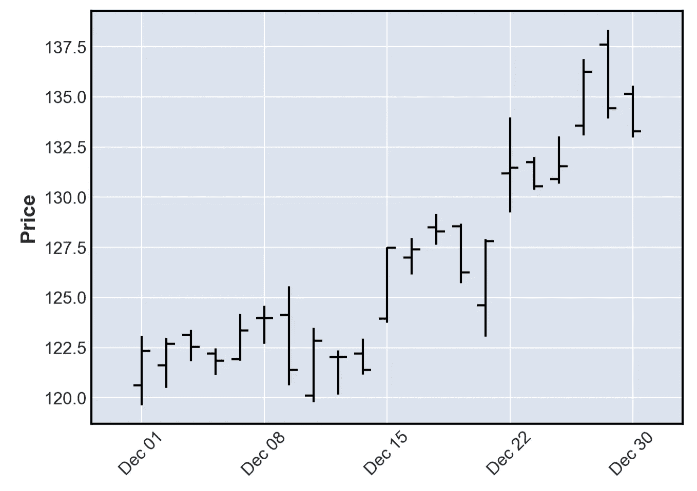
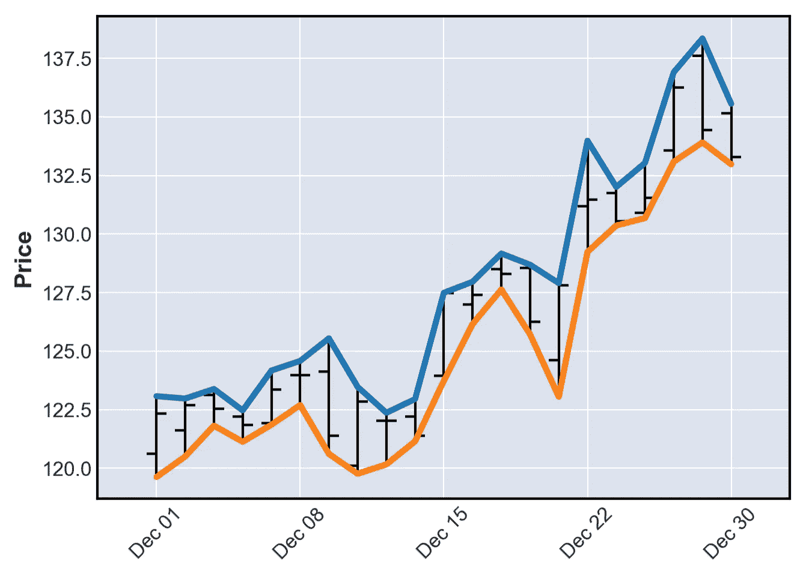
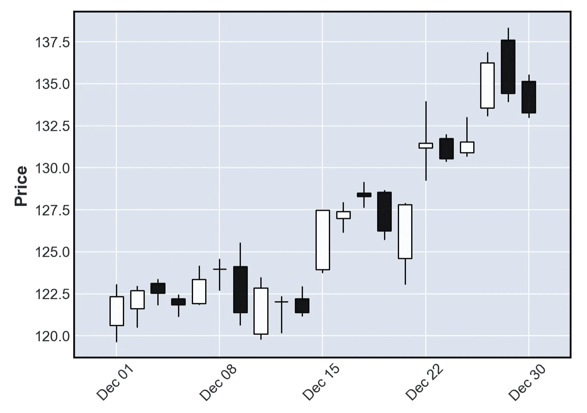
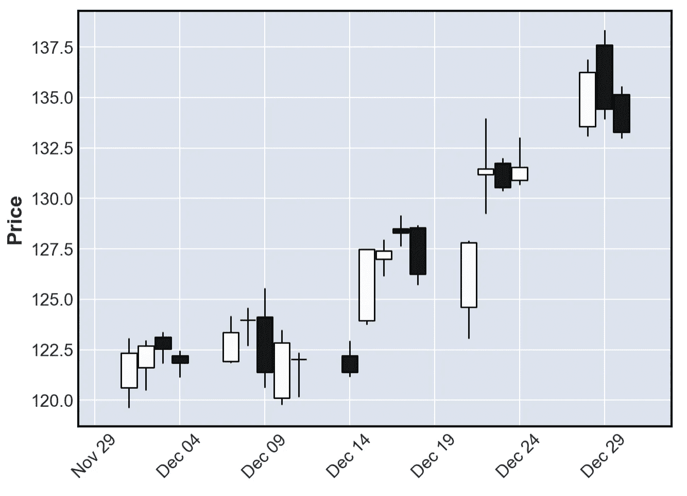
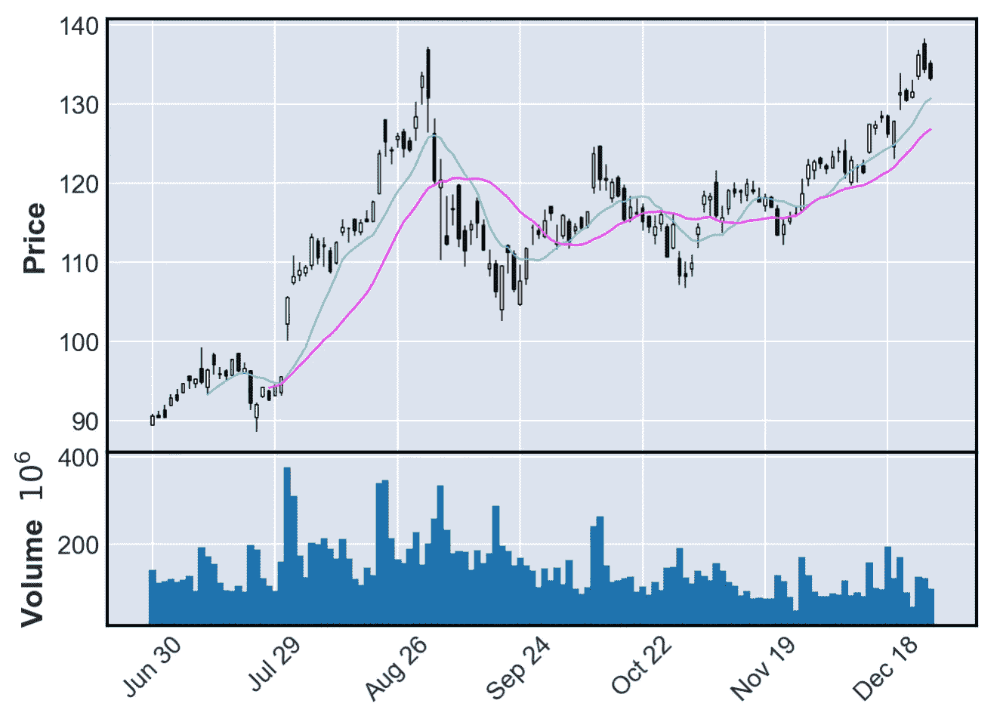
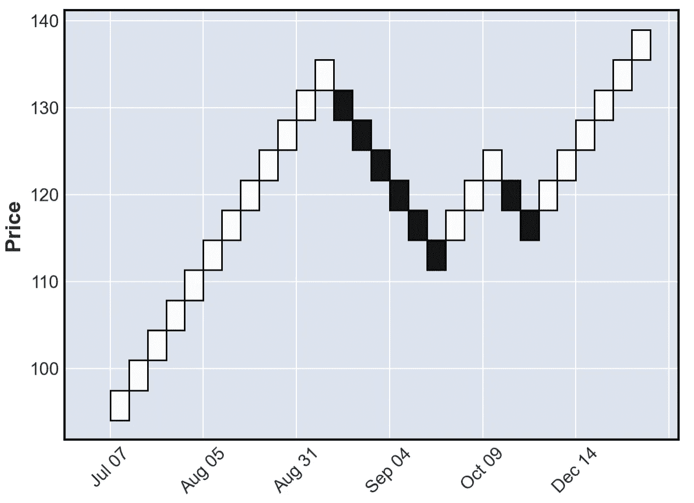
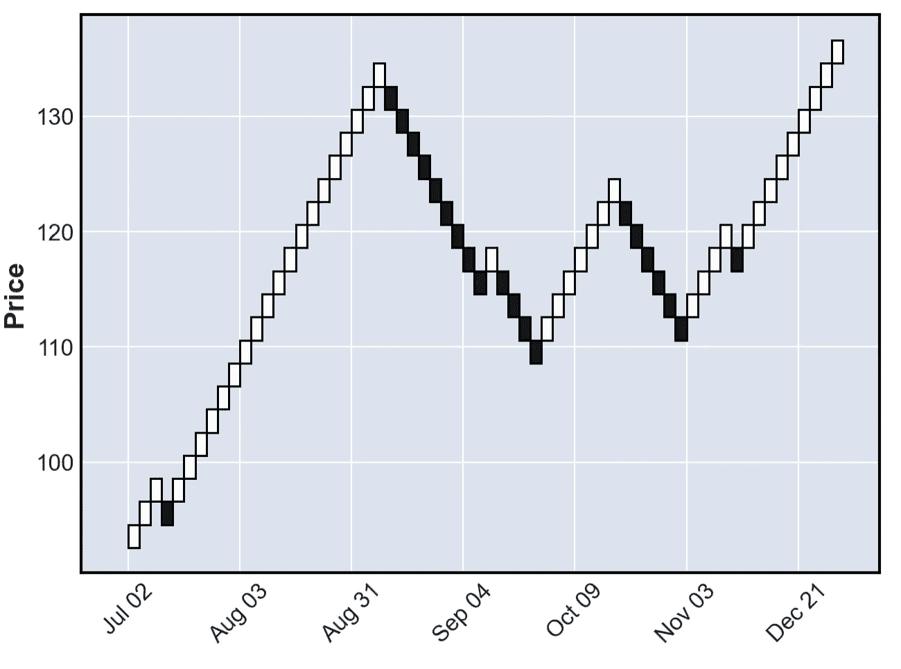
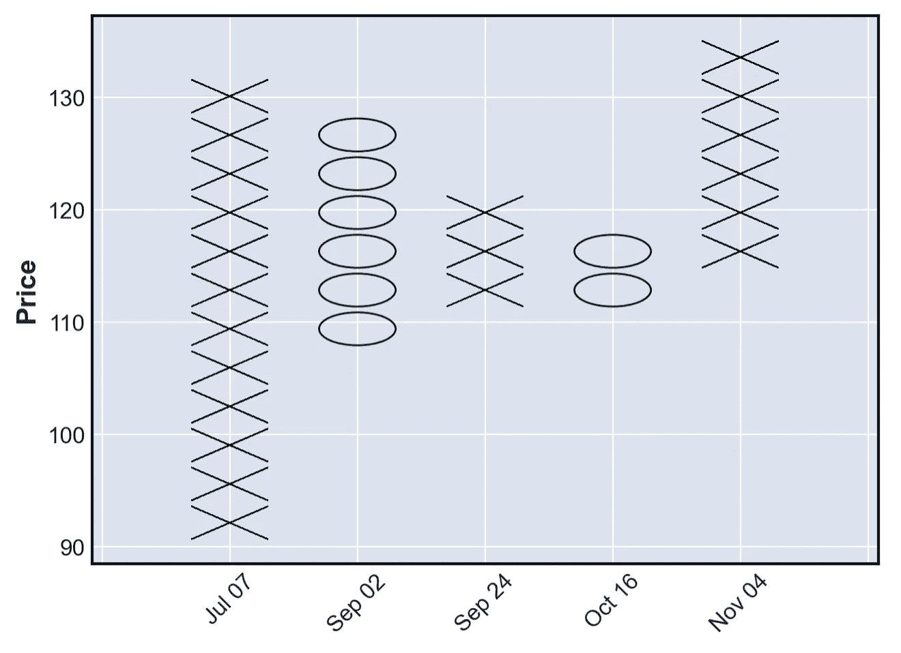
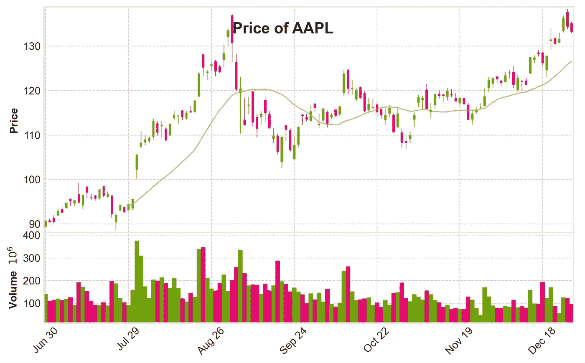

# mpl finance——matplolib 相对不为人知的用于绘制金融数据的库

> 原文：<https://towardsdatascience.com/mplfinance-matplolibs-relatively-unknown-library-for-plotting-financial-data-62c1c23177fd?source=collection_archive---------10----------------------->


照片由 [Yiorgos Ntrahas](https://unsplash.com/@yiorgosntrahas?utm_source=unsplash&utm_medium=referral&utm_content=creditCopyText) 在 [Unsplash](https://unsplash.com/s/photos/stock-market?utm_source=unsplash&utm_medium=referral&utm_content=creditCopyText) 上拍摄

## 包括快速创建图表的方法，如烛台，连科，或点和图

众所周知，`matplotlib`是非常通用的，可以用来创建几乎任何你想要的图表。这可能不是最简单或最漂亮的，但在 StackOverflow 上看了足够多的问题后，它很可能最终会很好地解决。

我知道在纯粹的`matplotlib`中创建像蜡烛图这样的金融图表是可能的，但这不是最愉快的体验，有更简单的方法来使用库，如`plotly`或`altair`(我在[的另一篇文章](/the-simplest-way-to-create-an-interactive-candlestick-chart-in-python-ee9c1cde50d8)中介绍了这一点)。然而，直到最近我才发现`matplotlib`有一个单独的库/模块专门用于金融策划。它叫做`mplfinance`，在这篇文章中，我将展示它的一些漂亮而独特的特性。

# 设置

设置相当标准。首先，我们导入库。

然后，我们下载股票价格来处理——对于本文，我们使用 2020 年下半年的苹果股票价格。如果你对下载股票价格的更多细节感兴趣，你可以看看我的另一篇文章。

# OHLC 海图

`mplfinance`提供了几种有助于分析资产价格模式的图表。第一个，也是库中默认的一个，是 OHLC 图表。我们可以简单地使用`plot`函数来创建它:

```
mpf.plot(df["2020-12-01":])
```

其中`df`是一个包含 OHLC 数据的`pandas`数据帧和一个`DatetimeIndex`。我们将数据限制到上个月，只是为了清楚地看到该图元素的形状。



作者图片

这种解读与蜡烛图非常相似。左边的横线表示开盘价，右边的横线表示收盘价。垂直线代表价格的波动性，我们可以从两个极端读取高/低价格。

在这一点上，值得一提的是`mplfinance`提供了一种在一个图表上堆叠多层信息的简单方法。例如，假设我们想将最高价和最低价作为线添加到先前创建的绘图中。我们可以使用`make_addplot`函数轻松做到这一点，如下所示。我们首先定义附加行，然后将它们作为额外的参数传递给绘图函数。

运行该代码会生成下面的图像，该图像仅确认垂直线的极值对应于给定日期的最高价和最低价。



作者图片

自然，这是一个简化的例子。在更复杂的情况下，我们可能会对添加一些技术指标感兴趣，例如，布林线或简单的移动平均线。我们将很快回到后一个问题。我们也可以使用相同的功能来创建符号，显示我们进入/退出位置。你可以在这里找到一个很好的例子。

# 蜡烛图

下一个可用的图表类型是烛台图表。用`mplfinance`生成它们就像给`plot`函数添加一个额外的参数一样简单。

```
mpf.plot(df["2020-12-01":], type="candle")
```



作者图片

当你看着蜡烛和日期时，很明显有一些遗漏的日期。这自然是因为市场在周末和一些特殊的日子是关闭的。如果你想考虑这一点，你可以给`plot`函数提供一个额外的参数:

```
mpf.plot(df["2020-12-01":], type="candle", show_nontrading=True)
```



作者图片

让我们给情节添加更多的信息。首先，我们可以向`plot`函数传递一个方便的参数—— `mav` ——它会自动添加我们想要的任何简单的移动平均线。对于这个情节，我们来取 10 天和 20 天的 MAs。其次，我们还可以添加交易量。

```
mpf.plot(df, type="candle", mav=(10, 20), volume=True)
```



作者图片

# 伦科图表

老实说，`mplfinance`是我第一次看到以下两种剧情，因为它们不像《OHLC》和《烛台排行榜》那样受欢迎。第一种被称为伦科图表，它是利用价格变动构建的，不像大多数图表那样考虑标准化的时间间隔。

在实践中，它的意思是，当价格移动一个特定的量时，一个新的块被创建，每个后续的块与前一个块成 45 度角添加，或者在它的上面或者在它的下面。

Renko 图表最常见的用途是从价格序列中过滤噪声，并帮助识别价格趋势。这是因为所有小于指定方框大小的价格变动都被过滤掉了。

我们可以通过在使用`plot`函数时简单地指定`type`参数来创建 Renko 图表。

```
mpf.plot(df,type="renko")
```



作者图片

我们也可以根据自己的喜好修改砖块的大小。在下面的代码片段中，我们将其设置为 2。

```
mpf.plot(df, type="renko", renko_params=dict(brick_size=2))
```



作者图片

# 点数图

库中可用的最后一种绘图类型是点数图。与伦科图表类似，它没有考虑时间的流逝。P&F 图使用堆叠的 X 和 O 柱，每个符号代表一个特定的价格变动(由盒子大小决定，我们可以根据自己的喜好调整)。

x 代表价格上升一定的量，而 O 代表下降。我们需要的最后一条信息是创建不同符号的新列的条件(O 跟在 X 后面，反之亦然*)。为了创建一个新的列，价格必须按照冲销金额进行更改，该金额通常设置为盒子大小的三倍(在`mplfinance`中，默认值为 1)。*

```
*mpf.plot(df, type="pnf")*
```

**

*作者图片*

*我们可以很容易地将这张 P&F 图与第一张伦科图进行比较，以发现完全相同的模式。*

# *添加风格和一般美化*

*使用`mplfinance`创建的情节对于一句俏皮话来说已经很好看了，所以肯定是在纯粹的`matplotlib`中不会经常发生的事情。然而，我们可以使用 plot 函数中更多的选项来使我们的绘图更加漂亮。*

*对于下一个情节，我们改变比例的数字，添加一个标题，选择紧凑的布局和应用一种风格。我们使用币安风格，这使得情节类似于流行的加密交换。*

**

*作者图片*

*就我个人而言，我认为对于我们必须编写的额外代码来说，这是一个很大的改进。如果您想知道库中有哪些样式，可以使用以下命令查看所有样式:*

```
*mpf.available_styles()*
```

*最后，我们还可以轻松地将图形保存到本地文件中。为此，我们只需向`plot`函数的`savefig`参数提供文件名。代码将如下所示。*

# *外卖食品*

*   *`mplfinance`是`matplotlib`投资组合中的一个库，专门用于绘制资产价格数据*
*   *API 非常容易使用，我们经常可以用一行程序创建漂亮的图表*
*   *该库提供了一些不常见的绘图类型，如 Renko 图或点和图形图*

*您可以在我的 [GitHub](https://github.com/erykml/medium_articles/blob/master/Quantitative%20Finance/mplfinance.ipynb) 上找到本文使用的代码。此外，欢迎任何建设性的反馈。我也很好奇你是否听说过 Renko/Point 和 Figure 图表，甚至可能在实践中使用过它们。你可以在[推特](https://twitter.com/erykml1?source=post_page---------------------------)或评论中联系我。*

*如果你有兴趣学习如何使用 Python 进行量化金融，你可能想看看 [Quantra](https://www.quantra.quantinsti.com/?ref=eryklewinson) ( *免责声明:一个附属链接*)，它提供了关于这个主题的各种不同的课程。*

****来自《走向数据科学》编辑的注释:*** *虽然我们允许独立作者根据我们的* [*规则和指南*](/questions-96667b06af5) *发表文章，但我们并不认可每个作者的贡献。你不应该在没有寻求专业建议的情况下依赖一个作者的作品。详见我们的* [*读者术语*](/readers-terms-b5d780a700a4) *。**

*如果您喜欢这篇文章，您可能还会对以下内容感兴趣:*

*[](/9-useful-pandas-methods-you-probably-have-not-heard-about-28ff6c0bceee) [## 你可能没听说过的 9 种有用的熊猫方法

### 它们可以让你的日常工作更容易、更快捷。

towardsdatascience.com](/9-useful-pandas-methods-you-probably-have-not-heard-about-28ff6c0bceee) [](/stockstats-a-handy-stocks-oriented-pandas-dataframe-wrapper-a879a06d9c3f) [## stock stats——一个方便的面向股票的熊猫数据框架包装器

### 只需调用列名即可访问各种技术指标！

towardsdatascience.com](/stockstats-a-handy-stocks-oriented-pandas-dataframe-wrapper-a879a06d9c3f) [](/quantra-a-python-coding-platform-to-learn-quantitative-finance-8e5e88c89120) [## quantra——学习量化金融的 Python 编码平台

towardsdatascience.com](/quantra-a-python-coding-platform-to-learn-quantitative-finance-8e5e88c89120)*