# “MRMR”准确地解释了你希望别人如何向你解释

> 原文：<https://towardsdatascience.com/mrmr-explained-exactly-how-you-wished-someone-explained-to-you-9cf4ed27458b?source=collection_archive---------1----------------------->

## 想要改进您的功能选择吗？“最大相关性-最小冗余度”(又名 MRMR)是优步的机器学习平台使用的一种算法，用于寻找“最小最优”的特征子集。

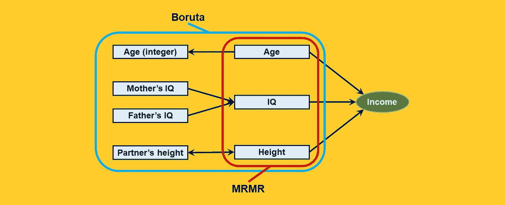

[作者图]

*MRMR*(*最大相关度-最小冗余度*的首字母缩写)是一种特征选择算法，在优步工程师于 2019 年发表这篇论文后获得了新的流行:


截图来自:[来源](https://arxiv.org/pdf/1908.05376.pdf)。

作者展示了他们如何通过*MRMR*在各种营销应用中实现自动特征选择，其中包括:

*   用户获取，
*   交叉销售/追加销售，
*   用户流失和重新激活。

然而，MRMR 并不是最近才被发现的。这是由两位伯克利的研究人员在 2005 年发表的论文中首次提出的:

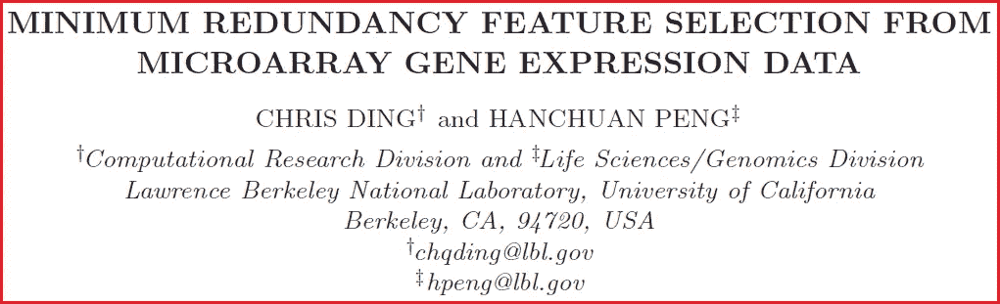

截图来自:[来源](https://pubmed.ncbi.nlm.nih.gov/15852500/)

作者声称，在成千上万的基因中，选择其中的几个(例如 50 个)就足以实现这项任务(预测疾病)的最高准确度。所以关键是:我们如何找到这 50 个幸运儿？这正是 MRMR 最初设计的目的。

从这两个例子中，很明显**MRMR*有多灵活*，这可以在完全不同的领域证明是有用的，从市场营销到基因组学**。

在这篇文章中，我们将看到 *MRMR* 是如何工作的，以及它与其他流行的特征选择算法(如*博鲁塔*)有何不同(如果你想了解更多关于博鲁塔的信息，我已经写了一篇专门的帖子:[博鲁塔准确地解释了你希望别人如何向你解释](/boruta-explained-the-way-i-wish-someone-explained-it-to-me-4489d70e154a))

# 最小最优与所有相关

特征选择算法可以大致分为两类:

*   **极小最优**(如*MRMR*)；
*   **全相关**(如*博鲁塔*)。

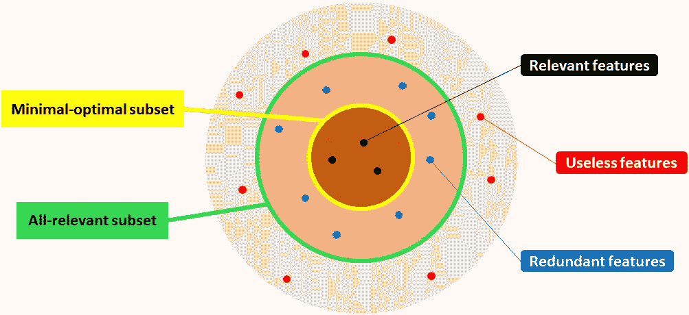

特征选择就像玩飞镖…[作者图]

**最小最优**方法寻求识别一小组特征，这些特征— **放在一起**具有最大可能的预测能力。另一方面，**全相关**算法被设计成选择所有特征，这些特征分别**和**具有任何预测能力。

因此，如果特征 *A* 和特征 *B* 都是相关的，但是它们带来或多或少相同的信息，那么全相关方法将选择它们两个，而最小最优方法将只选择其中一个并丢弃另一个。

这似乎是一个细微的区别，但在实践中却有很大的不同。想象一个场景，我们有一万个特征。你用 *Boruta* 你发现其中的 5000 个和目标变量有某种关系。但是五千仍然是一个难以管理的功能数量。

在丁和彭的例子中，你可以用一个小得多的模型，例如 50 个特征，达到同样的(或者更高的)精度。但是，如何选择它们呢？从 Boruta 拿前 50 的特性是行不通的。事实上，它们中的许多可能彼此高度相关:它们不会添加太多信息。

开发 MRMR 就是为了解决这个问题。

# “K 个最佳特征并不是 K 个最佳特征”

我们举个玩具的例子。假设我们的任务是预测一些人的收入，知道他们(或他们的亲属)的一些特征。我们处理这些特性:

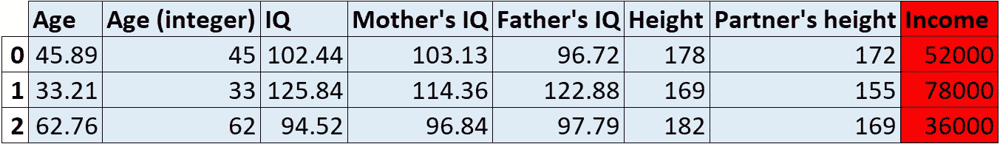

玩具数据集。[作者图]

让我们假设我们知道变量之间的因果关系(这是我们在现实生活中不经常拥有的特权，但是它对理解 MRMR 背后的逻辑很有用)。

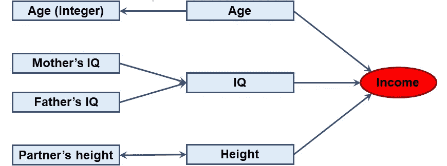

变量之间的因果联系[作者提供的图表]

知道了因果网络将使特征选择变得简单得可笑:**我们将选择{ *年龄*、*智商*、*身高* }，因为这些是唯一与目标变量**有直接因果关系的特征。添加任何其他元素都会带来不必要的噪音。

然而，**这些特征并不一定是对目标变量**具有最强预测价值的特征。总结如下:

> "最好的 K 个特征并不是 K 个最好的特征."(改编自 [T. M .封面](https://www.aminer.cn/pub/558c5224e4b00c3c48e19c51/the-best-two-independent-measurements-are-not-the-two-best))。

这是什么意思？

例如，以*母亲的智商为例:*它与*收入*没有直接联系，但与*智商*有联系，而后者又与*收入*有很大联系。所以，如果你测试一下，你会发现*妈妈的智商*和*收入*之间有相当强的关系。但是既然我们的模型中已经有了*智商*，保留母亲的*智商*就没有意义了。

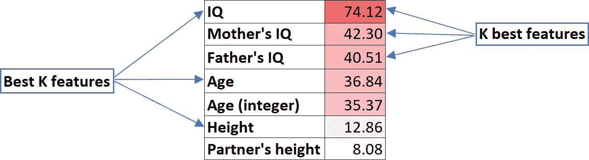

K 最佳特性与 K 最佳特性，K = 3。每个特征都与它与收入关系的“强度”(F-统计量)相关联。[作者图]

一般来说，这意味着**只关注每个特征和目标变量**之间的关联是不够的。

> 我们希望找到 K 个最佳特征，而不是 K 个最佳特征！

这正是 Boruta 的问题所在:它为每个特性提供了单独的评估。事实上，在我们的例子中，Boruta 会选择所有 7 个特征，因为它们都与*收入*有一定的统计相关性。

这在我们没有太多功能的情况下是有意义的。但是，在实际应用中，经常会发生这样的情况:

*   我们不知道特征和目标变量之间的因果关系；
*   我们有太多的特征；
*   特征中有高度的冗余。

在这些情况下，可能是像*博鲁塔*这样的全相关算法太“放纵”了，而 *MRMR* 能够移除不必要的特征。

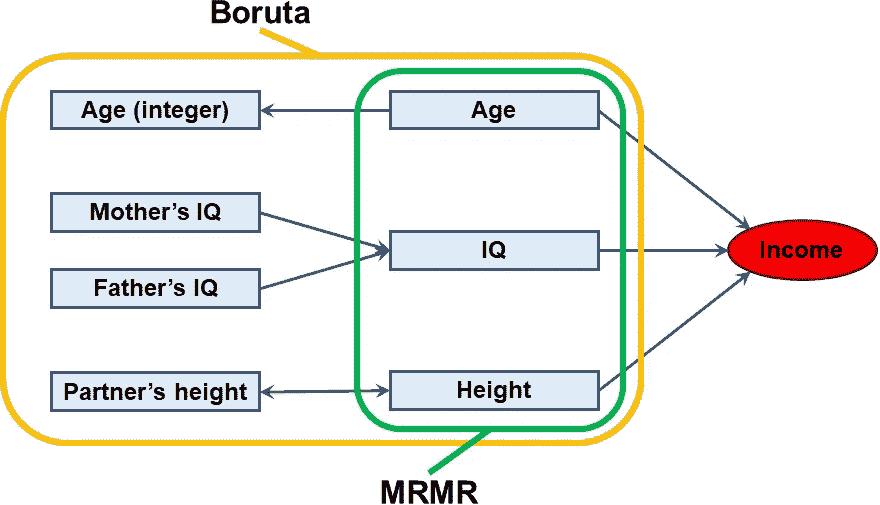

变量之间的因果联系[作者提供的图表]

所以，现在的问题是:MRMR 是如何工作的？

# 在 MRMR 的引擎盖下

使用 *MRMR* 时，你基本上**只需要做一个选择:决定你想要保留的**特性的数量。我们将称这个数字为 K。在我们的例子中，我们将取 *K* =3。

在实际应用中，**人们可以根据领域知识或其他约束来选择 *K* ，例如模型容量、机器内存或可用时间**。

MRMR 迭代地工作。在每一次迭代中，它(根据规则)识别最佳特性，并将其添加到所选特性的篮子中。一旦一个特性被放进桶里，它就再也出不来了。

在我们的例子中，这些是我们在每次迭代结束时得到的结果:

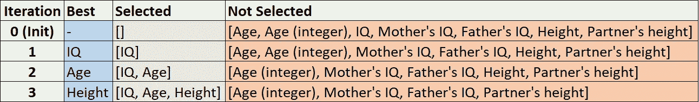

K = 3 时的 MRMR 过程[图由作者提供]

在每次迭代中，决定选择“最佳”特征的规则是什么——即第一步的*智商*，第二步的*年龄*和第三步的*身高*？这是 *MRMR 的核心。*

**“最大相关性-最小冗余度”之所以这样叫是因为——****在每次迭代中——我们希望选择与目标变量具有最大相关性的特征，以及与先前迭代中已经选择的特征具有最小冗余度的特征。**

实际上，在每次迭代 *i* 时，为每个待评估的特征计算分数( *f* ):

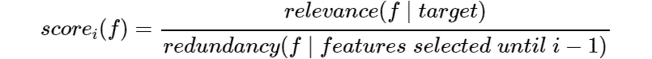

一级方程式赛车。MRMR 概观[作者图]

**迭代 *i* 中的最佳特征是得分最高的特征**。就这么简单。

现在唯一的问题是如何计算分子和分母。基于这一决定，优步论文的作者们识别出了 *MRMR* 的许多变体，如*中旬*、 *MIQ* 、 *FCD* 、 *FCQ* 、 *FRQ* 、 *RFCQ* 和 *RFRQ* 。然而:

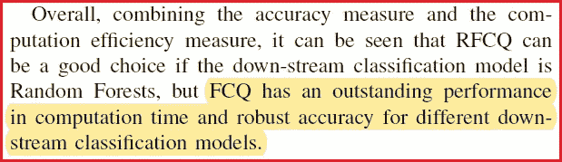

截图来自[来源](https://arxiv.org/pdf/1908.05376.pdf)。[作者强调]

由于 *FCQ* 非常简单和快速，并且通常比其他算法运行得更好，所以我将把重点放在这个变体上(顺便说一下，扩展到其他变体很简单)。

**特征 *f* 在第 *i* 次迭代(分子)的相关性计算为特征和目标变量**之间的 F 统计量(此处[为进一步了解 F 测试)。**冗余度(分母)被计算为该特征和在先前迭代中选择的所有特征之间的平均(皮尔逊)相关性**。所以，公式变成了:](https://en.wikipedia.org/wiki/F-test)

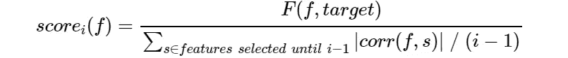

方程式 2。MRMR 公式(FCQ 变体)[作者提供图片]

其中 *i* 是第 *i* 次迭代， *f* 是被评估的特征， *F* 是 F 统计量， *corr* 是皮尔逊相关。请注意，相关性是以绝对值表示的。事实上，如果两个特征具有 0.9 或 0.9 的相关性，这没有什么区别:在这两种情况下，它们都是高度冗余的。

为了让事情变得更清楚，假设我们处于第三次迭代。这是之前发生的事情:

*   *IQ* 已在第一次迭代时选择；
*   *年龄*在第二次迭代时被选中。

**接下来我们应该选择哪个功能？**

计算每个特征的分数只需要 F 统计量和相关性:

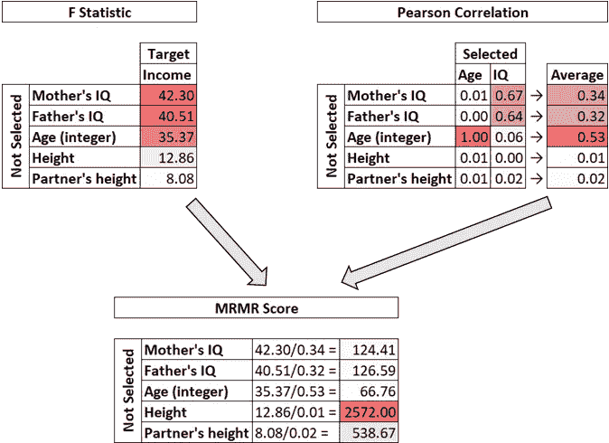

第 3 次迭代中发生的情况的图示。[作者图]

如上所述，**下一个最佳特征是得分最高的特征**，在本例中是高度*。*

# *从头开始的 Python 实现*

*我们上面描述的迭代过程很容易在 Python 中实现:*

*MRMR 的 Python 实现(FCQ 变体)[作者代码]*

*这个实现非常容易理解。然而，这是次优的。你能找出原因吗？*

*在上面的代码中，我们计算了很多我们永远不会用到的相关性。事实上，在第 6 行，我们正在处理所有可能的特征对。这意味着 *F* * ( *F -* 1) / 2 对。对于 *F* = 10，000，这将意味着**5000 万次关联！***

*通过只处理我们在每次迭代中需要的特征对，我们可以节省更多的时间，即**计算“进行中”的相关性**。这可以节省我们很多时间。*

*毕竟，在每次迭代时，我们只需要计算前一次迭代选择的特征与所有从未选择的特征之间的所有相关性，并将它们存储在一个相关矩阵中。这意味着:*

*   *第一次迭代:不需要关联。事实上，还没有选择任何特征:选择具有最高分数(即最高 F 统计量)的特征就足够了。*
*   *第二次迭代: *F -* 需要 1 个相关性。*
*   *第三次迭代: *F -* 需要 2 个相关性。*
*   *…*
*   **K* 次迭代: *F* - *K +* 需要 1 次相关。*

*现在，做数学很容易:这个过程需要计算少于 *F ** ( *K* - 1)的相关性。如果 *F* =1 万， *K* =50，这就得出一个合理得多的数字:**小于 50 万的关联**。*

*这个改进的版本看起来像这样:*

*MRMR 的一个更快的 Python 实现(FCQ 变体)[作者代码]*

*除了第 11 行和第 21–23 行之外，这几乎等同于上一个版本。*

# *给我一个“pip 安装”*

*你可以在[我的 Github](https://github.com/smazzanti/mrmr) 中找到分类问题的现成版本 MRMR。它可以通过以下方式安装:*

```
*pip install mrmr_selection*
```

*这是如何在熊猫数据框架上使用它的一个片段:*

```
*from mrmr import mrmr_classif
from sklearn.datasets import make_classification

# create some data
X, y = make_classification(n_samples = 1000, n_features = 50, n_informative = 10, n_redundant = 40)
X = pd.DataFrame(X)
y = pd.Series(y)

# use mrmr classification
selected_features = mrmr_classif(X, y, K = 10)*
```

# *结论*

*我们已经看到了为什么 *MRMR* 在许多实际问题中是一个有用的特征选择步骤:因为它试图找到一小组与目标变量相关并且彼此几乎没有冗余的特征。*

*MRMR 的价值不仅在于它是有效的(正如优步的论文所证明的)，还在于它的简单性使得它可以在任何管道中快速而容易地实现。*

*感谢您的阅读！我希望这篇文章对你有用。*

*我感谢反馈和建设性的批评。如果你想谈论这篇文章或其他相关话题，你可以发短信给我[我的 Linkedin 联系人](https://www.linkedin.com/in/samuelemazzanti/)。*