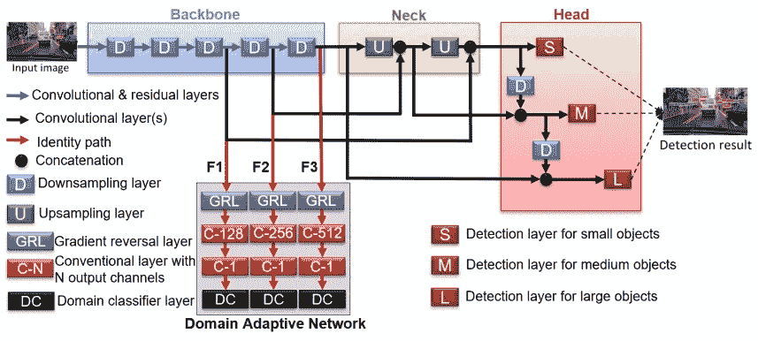
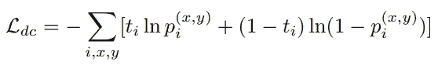
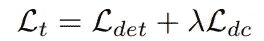
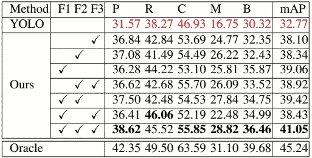
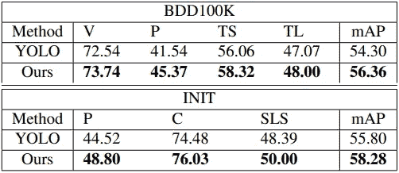
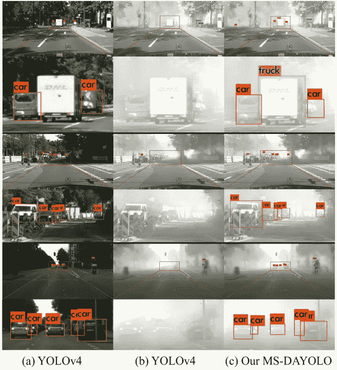

# MS-DAYOLO:用于跨域目标检测的多尺度域自适应 YOLO

> 原文：<https://towardsdatascience.com/ms-dayolo-multiscale-domain-adaptive-yolo-for-cross-domain-object-detection-d7912a9de975?source=collection_archive---------28----------------------->

## 提高检测器对畴变的鲁棒性

当测试数据的分布与训练数据的分布不同时，会发生域转移问题，导致目标检测模型的性能下降。例如，对象检测器是针对在晴朗天气和有利天气下捕获的图像数据进行训练的，但它适用于测试阶段的恶劣天气场景，包括灰尘、雨或雾。虽然已经提出了许多先进的对象检测方法，包括 R-CNN 网络家族(R-CNN，Fast R-CNN，Faster R-CNN，Cascade R-CNN)或 YOLO 系列(YOLOv1-v4)，但研究人员只专注于在基准数据集上的性能，如 COCO，VOC，WAYMO，Cityscapes 等。其中包括干净图像数据和对象检测中的域移动。近年来，这个主题被更广泛地研究，有时它被称为术语*领域适应*。在这篇文章的剩余部分，我将回顾一个新的多尺度域自适应 YOLO (MS-DAYOLO)框架，用于跨域对象检测。

# 戴约洛女士

MS- DAYOLO 的建筑(图片见诸报端[ [来源](https://arxiv.org/abs/2106.01483))

MS-DAYOLO 的架构如上图所示。一般来说，MS-DAYOLO 是基于 YOLOv4 开发的，它几乎采用了 YOLOv4 的主要组件。主要区别在于，有一个域自适应网络(DAN ),它连接到主干上，以鼓励主干学习域不变特征。具体来说，如上图所示，DAN 连接到主干中的特征地图 F1、F2 和 F3。作者已经考虑利用特征图 F1、F2 和 F3，因为这些特征被直接馈送到检测器的颈部，从而它们携带了输入图像的主要信息，这可能有利于训练 DAN。

# **域自适应网络(丹)**

为了避免获得实时对象检测器中最重要的计算，DAN 仅在训练期间被集成到主干中。DAN 的任务是预测输入图像是否在*源域*(完成训练的域)或*目标域*(没有训练模型的新的域)。

DAN 被优化以最小化域分类损失 *L_dc* ，其被计算为以下二元交叉熵损失函数:

其中 *i* 为训练图像的索引， *t_i* 为领域标号( *t_i* = 1:源领域， *t_i* = 0:目标领域)， *p(x，y)* 为特征图位置 *(x，y)* 处的预测领域概率。

另一方面训练骨干最大化 *L_dc* 学习不变特征。也就是说，为了使对象检测器对域的变化具有鲁棒性，应该鼓励检测器学习输入图像中的显著内容(或显著对象),即使图像是在任何条件下捕获的。如果这一过程操作得当，可以提高检测机的性能和稳健性。

丹被优化为最小化 *L_dc* ，而骨干被训练为最大化 *L_dc* ，这导致了联合最小值-最大值问题。

# 总损失

总损失函数公式如下:

其中 *L_det* 是检测损耗，而 *λ* 是用于平衡总损耗的负标量。 *λ* 的负值可以解释为解决前段提到的联合最小-最大问题。换句话说， *λ* 负责控制 DAN 对整个网络性能的影响。关于 *λ* 的进一步详细解释可以在[论文](https://arxiv.org/abs/2106.01483)中找到。

# 结果

表 1 显示了 Cityscapes 数据集上不同适应配置的定量结果。表中， *P* 、 *R* 、 *C* 、 *M* 和 *B* 是代表人、骑手、汽车、摩托车和自行车的类别名称。通过对 DAN 采用所有三个特征映射 F1、F2 和 F3，已经实现了最佳性能。

表 Cityscapes 数据集的定量结果(论文中的表格[ [来源](https://arxiv.org/abs/2106.01483) ])

表 2 显示了在 BDD100K 和 INIT 数据集上验证 YOLOv4 和 MS-DAYOLO 时的性能比较。

表 BDD100K 和 INIT 数据集的定量结果(论文中的表格[ [来源](https://arxiv.org/abs/2106.01483) ])

使用 YOLOv4 和 MS-DAYOLO 对雾状图像数据进行目视检测的结果如下图所示:

视觉检测结果:(a)清晰图像上的 YOLOv4，(b)模糊图像上的 YOLOv4，(c)模糊图像上的 MS-DAYOLO。(论文中的图像[ [来源](https://arxiv.org/abs/2106.01483) ])

# 结论

在这篇文章中，我简要回顾了一种新的多尺度域自适应 YOLO (MS-DAYOLO)框架，用于跨域对象检测。正如论文中提到的，MS-DAYOLO 是第一个提出考虑改进 YOLO 模型来处理畴变问题的工作。在自动驾驶应用的各种测试场景下，MS-DAYOLO 已被证明优于最初的 YOLOv4。

欢迎读者访问我的脸书粉丝页面，这是一个分享关于机器学习的事情的页面:[深入机器学习](https://www.facebook.com/diveintomachinelearning)。我发布的关于物体检测的其他值得注意的帖子包括:

*   [约洛夫 4–5D 评论](/yolov4-5d-an-enhancement-of-yolov4-for-autonomous-driving-2827a566be4a)
*   [达克拉斯](/darkeras-execute-yolov3-yolov4-object-detection-on-keras-with-darknet-pre-trained-weights-5e8428b959e2)
*   [EFPN](/efpn-extended-feature-pyramid-network-for-small-object-detection-980af794a093)
*   [数据增强](/data-augmentation-compilation-with-python-and-opencv-b76b1cd500e0)
*   [雾霾数据合成](/synthesize-hazy-foggy-image-using-monodepth-and-atmospheric-scattering-model-9850c721b74e)

感谢您抽出时间！