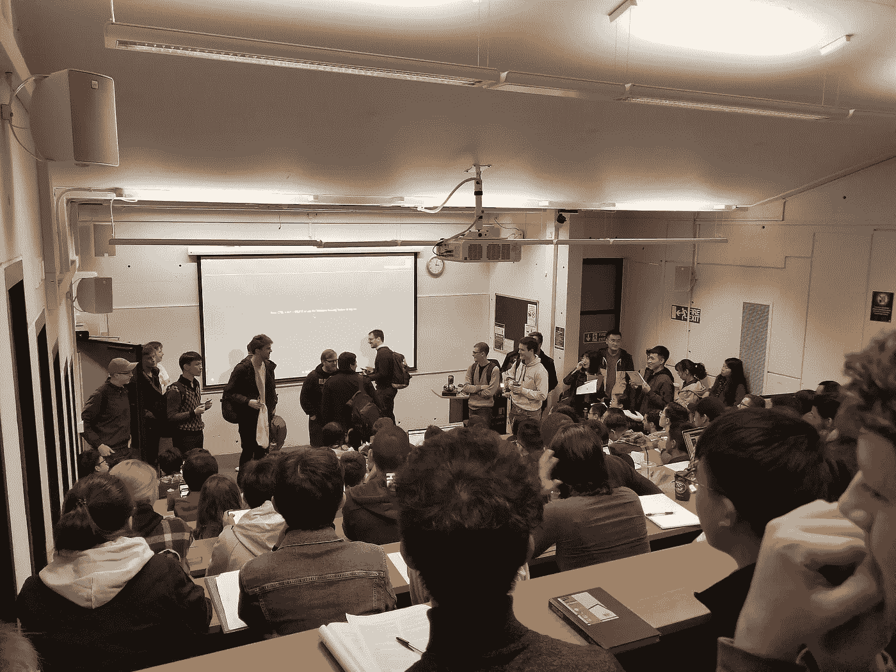
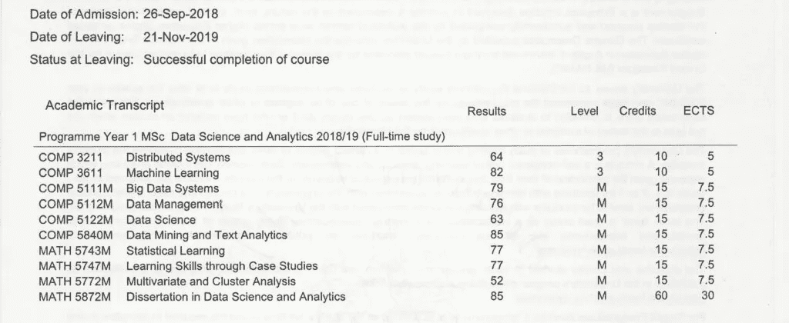
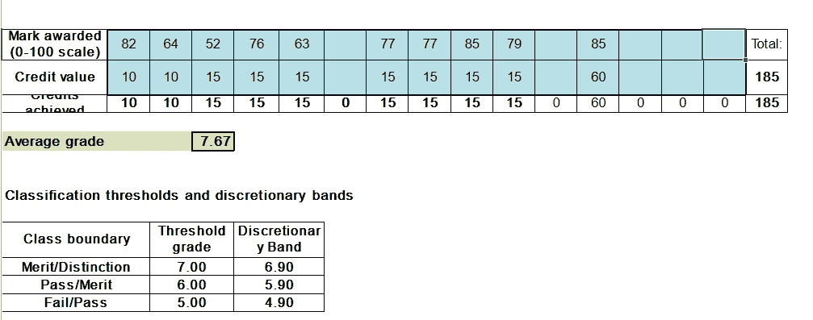

# 利兹大学数据科学硕士:我的经历(2018/19)

> 原文：<https://towardsdatascience.com/msc-data-science-at-leeds-my-experience-2018-19-926e007989b7?source=collection_archive---------31----------------------->

我的数据科学硕士的全面崩溃。

# 介绍

硕士压力大，费用高。我已经在这里讨论了我认为数据科学硕士学位是否值得。这一次，我想谈谈我在利兹大学的数据科学硕士学位会很有帮助。

难怪有人问我，我的数据科学硕士是什么样的。一些人想知道是否值得攻读数据科学硕士学位。其他人特别想知道更多关于利兹大学提供的课程。

我会试着在不太无聊的情况下尽可能深入。以下是我将要讲述的内容:

*   **申请流程:**这是我申请流程的一个非常笼统的概述，因为我记不太清了。
*   **课程结构:**我在利兹一年的整体结构。
*   **模块结构:**不同学校的模块结构不同。
*   **我最喜欢的模块:**我最喜欢的模块。
*   **我的学位论文:**学位论文过程和我的经历。
*   **评分:**利兹如何以我的成绩单为例计算硕士研究生的成绩。
*   **利兹数据科学协会:**一个伟大的协会，提供基于团队的数据科学项目供参与。

现在，我充分意识到，并不是每个阅读这篇文章的人都打算去利兹大学学习。即使你对这门课程不感兴趣，希望你仍能从我在英国攻读数据科学硕士的经历中学到一些东西。

同样值得注意的是，数据科学硕士是一个相对较新的事物。因此，如果全国数据科学硕士的课程结构和模块选择与我学生时代相比发生了显著变化，我不会感到惊讶。

# 应用进程

由 [Kelly Sikkema](https://unsplash.com/@kellysikkema?utm_source=medium&utm_medium=referral) 在 [Unsplash](https://unsplash.com?utm_source=medium&utm_medium=referral) 上拍摄的照片

## 入学要求

在你申请之前，大多数数据科学硕士希望你有某种数学或计算背景。至少，大多数大学希望你至少有一个 2:1(荣誉)的学位。如果你是一名国际学生，那么有一个额外的语言要求，即雅思总分 6.5 分，所有部分都不低于 6.0 分。

我见过一些没有多少数学背景的学生，他们几乎没有任何计算机知识。他们还是通过了申请，所以要求可能没那么严格。这当然取决于大学，因为我想象一些大学(如牛津和剑桥)比其他大学严格得多。

## 应用和成本

我在 2018 年 6 月左右开始申请，我记得申请过程相当简单。要申请，我必须点击官方课程页面上的申请按钮创建一个帐户。然后我记得填写了一堆关于我自己的基本信息。

申请中最耗时的部分是写我的个人陈述。我记得我只是写了我的现状和为什么我想学习数据科学。有趣的是，我的一些留学生朋友说他们甚至不需要写个人陈述。正因为如此，我不确定这个要求有多一致。

几周后，大学通过电子邮件和信件回复了我，并无条件录取。他们解释了基本的课程细节和学费，并指导如何接受提议。当时的学费是 10000，因为我是校友，所以打了 1000 的折扣。如果你是国际学生，学费会贵得多(如今高达 25，000 多英镑)。

接受报价后，他们给我发了一封接受邮件和信。不久之后，我收到了两本小册子，里面有更多关于大学校园和我的提议的信息。

# 课程结构

[万花筒](https://unsplash.com/@kaleidico?utm_source=medium&utm_medium=referral)在 [Unsplash](https://unsplash.com?utm_source=medium&utm_medium=referral) 上拍摄的照片

## 时间线概述

一般来说，英国高等教育的学年大约在九月或十月开始。考试通常在一月和六月举行。

如果你在读硕士课程，那么你就要用这个夏天剩下的时间来写论文。你通常在八月或九月左右完全完成，之后你将等待毕业。

## 信用

在利兹大学，每个模块完成后都有一定的学分。这些课程通常从 10 到 15 学分不等，有些课程相当于 20 学分。唯一的例外是价值 60 学分的论文。

这门课程有必修和选修单元。为了让我通过考试，我的模块必须总计达到 180 或 185 学分。

我还需要通过至少 135 学分的“5M 级”模块。这些模块只有硕士生才能修。然而，5M 级模块也有“3 级”版本，适用于来自不同课程的最后一年本科生。这意味着硕士生和本科生一起分享大部分课程。

参加 5M 级别课程的学生有额外的课程来覆盖更深入的内容。因此，期末考试有额外的问题，完全是让 500 万学生回答的。

## 模块

第一学期有必修的计算机科学模块，第二学期有数学模块。在选修课方面，选择的模块主要包括数学和计算机科学。我记得有一些地理和商业模块，但这些选择较少。事实上，我所有的模块不是数学就是计算机科学。

每学期之前，每个人都必须在设定的时间范围内登录选择他们的选修模块。我必须从三个列表中选择:A、B 和 c。

要求是从列表 A 和 B 中选择至少 30 学分的模块，从这些列表中总共选择至少 60 学分。一旦完成，我们可以从列表 c 中选择更多。

请记住，5M 级模块的 135 学分规则适用于全年。为了平衡我的工作量，我试图将这些模块尽可能均匀地分布在两个学期中。

由于这种结构，由于时间表冲突，不可能总是注册某些模块。有人告诉我们，如果我们能补上错过的课，还是有可能报名的。在这些情况下，方案主管也需要批准。

## 论文

名单:选择论文题目的正式程序要到第二学期才开始。然而，我们在第一学期就意识到要提前计划我们的选择。

第二学期之前也没有正式的名单。就我所能记得的，我相信他们在第二学期开始和中期的某个时候公布了名单。如果没有感兴趣的题目，我们也可以向论文协调员建议我们自己的题目。然后他们会试图找到合适的主管来配合你的主题。

这个列表相当大，大约有 50 个主题。虽然这门课严格来说是在数学学院下，但是这个列表包含了数学和计算机科学的主题。也有来自商业和心理学的话题。

**主题:**每个主题都包含一个描述、目标，有时还包含一个资格要求。在有需求的情况下，我们需要有合适的技能或者已经学习了某些模块。

他们也可以分配一个以上的学生。根据我的经验，最受欢迎的通常是与机器学习有关的计算机科学话题(炒作是真实的)。例如，有一个涉及 Airbnb 数据，我知道很多学生申请只是因为这个名字(我对此感到内疚)。

同样重要的是，我们与其他课程的硕士生分享了一些话题。例如，计算机科学导师可能会优先考虑计算机科学的学生，而不是这门课的学生。我个人曾试图申请计算机科学学院的大型机器学习课题(如 Airbnb 的课题),但都没有成功。

选择截止日期:最终提交的截止日期是三月底。我们必须选择三个偏好，并将其发送给协调员。如果他们不批准任何一个，那么我们必须选择另一个。

正如你所看到的，提前考虑你的论文将涉及的内容是非常有用的。这样做将有助于在第一和第二学期选择模块。

# 模块结构

由 [Dom Fou](https://unsplash.com/@domlafou?utm_source=medium&utm_medium=referral) 在 [Unsplash](https://unsplash.com?utm_source=medium&utm_medium=referral) 上拍摄的照片

根据学校的不同，模块的结构可能会有很大的不同。由于我只修了数学和计算机科学模块，所以我只能对这两个模块进行评论。

数学:数学模块可能非常激烈，尤其是 5 米级的。对于评分，大部分权重是期末考试，通常占 80%。其余的由分散在整个学期的课程组成。根据教授的不同，我们每周或每两周收到一份作业。

每份作业通常由一系列问题组成。这些通常是像证明，“证明这是真的”和计算问题。对于一些模块，我们不得不做一个更重要的统计项目。

在我看来，数学模块给人的感觉更加死板，缺乏创造力。如果你熟悉数学，那么这可能并不奇怪。此外，如果你有其他大项目要做，每周或每两周一次的课程可能会让你不知所措。我认为重考的好处是，即使你弄乱了一些功课，你总体上仍然可以做得很好。

计算机科学:这些模块在期末考试中的权重通常低于数学模块。因此，通常更重视课程，有些课程的权重高达 40%。从我的经验来看，大多数计算机科学模块都有大约两份作业。这些通常在你如何对待他们方面提供了相当大的灵活性。大多数教授只关心你解决了问题，并且它有效。

与数学模块相比，还有更多的实验室会议来帮助完成课程。随着对课程的重视，我想这是有道理的。计算机科学模块的另一个关键区别是，你可以带自己的笔记参加考试。这来自一个数学学位，感觉很神奇。这绝对有助于我不再像记忆数学模块那样感到记忆公式的压力。

# 我最喜欢的模块

由 [Unsplash](https://unsplash.com?utm_source=medium&utm_medium=referral) 上的 [Matese Fields](https://unsplash.com/@tesecreates?utm_source=medium&utm_medium=referral) 拍摄

我觉得提供一些关于我最喜欢的模块的见解可能会有所帮助，因为你们可能也在学习相同的模块。显然，从那时起事情可能已经改变了，所以请记住这一点。我做的大部分模块都是 5M 级的。如果你想看我做的每个模块，你可以跳到[评分](https://leonlok.co.uk/blog/my-data-science-masters-degree-university-of-leeds-2018-19/#h-grading-taught-postgraduate)部分。

由于我过去是一名分析师，我选择了那些我认为在当时有用的模块。我还尝试挑选了一些我认为在我作为数据科学家工作时可能有用的信息。虽然很诱人，但是最好避免选择看起来简单的模块。毕竟硕士学位并不便宜，所以你不妨充分利用它。

## 机器学习(5M 级计算机科学)

这个模块总体上是对机器学习的一个很好的介绍。这位教授对这个话题充满热情，真诚地想帮助学生。我们讨论了决策树、卷积神经网络和强化学习等算法。可能会涉及到相当多的数学知识，我们应该把这些内容牢记在心。因此，线性代数的先验知识对这个模块非常有用，尤其是在学习神经网络的时候。

机器学习非常受欢迎。它是如此受欢迎，以至于第一次讲座没有足够的空间来容纳所有的学生。有些人甚至不得不坐在地板上！

几周后，随着人们转向这个模块，班级变得更大了。如今，我只能想象它会比以前更受欢迎。

第一次机器学习讲座。教授没想到会有这么多学生！

期末考试占 80%的权重，其余的是课程作业。课程之一是使用 Keras 实现一个神经网络架构。教授给了我们一个模板，让我们在上面工作，第一次训练神经网络非常酷。

第二个课程是使用强化学习训练一个人工智能玩游戏。这个很难，需要和很多其他学生一起合作。

我要说的是，尽管有难度，这个模块中的课程作业是最有趣、最令人愉快的。尝试用代码实现数学理论并看到它的工作是很好的。

## 统计学习(5M 级数学)

我想把统计学习看作机器学习的统计方法。统计学习和机器学习都侧重于使用过去的数据来训练模型进行预测。

不同之处在于，统计学习没有从“算法”的角度来处理这个问题。相反，我们学习统计建模和在数学层面评估模型性能的重要性。

令人惊讶的是，该模块对考试和课程的重视程度相当。也就是说，考试和课程各占 50%的权重。这对于一个数学模块来说是很不寻常的，但这一次数学考试压力小了也不错。

在我看来，统计学习很好地补充了机器学习。在模型方面，我们学习了基础知识:线性回归、逻辑回归和带有 boosting 和 bagging 的决策树。然后很大一部分集中在评估这些模型，并知道如何统计选择最好的模型。

教授也很棒，他很好地解释了概念。即使没有统计学背景的人也会发现这个模块是可行的，因为它集中在统计建模的基础上。如果你对机器学习很认真，并且想拥有数据建模的统计学基础，那么我会推荐你学习这个模块。

## 数据挖掘和文本分析(5 级计算机科学)

本模块重点介绍对文本数据使用机器学习算法。随着对图像数据使用机器学习的大肆宣传，我觉得知道如何处理文本数据也很重要。虽然涉及到一些数学，但与机器学习等模块相比，这是最少的。

我们学会了如何使用一种叫做 *Weka* 的工具。自从我毕业后，我还没见过或听说过有人使用这个工具，所以我怀疑它对你的简历有多大用处。基本上，它是一个允许你挑选机器学习算法应用于文本数据的工具。我们将它用于我们的课程作业，它有助于在高层次上了解如何应用这些算法。然而，感觉我只是在挑选魔法药水，看看哪种效果最好，而不需要了解一切。

尽管如此，我还是觉得讲座材料很有趣。我们学习了如何对自然语言和文本分析建模。我们还学习了机器翻译、信息检索、聊天机器人和文本分类。

这位教授很奇怪，但讲课笔记很不错。期末考试占 60%的权重，其余的是课程作业。总的来说，我认为这个模块相对简单。这感觉像是一个“不太严重”的问题，但它仍然是有用的。它为我自己处理文本数据提供了足够好的基础。鉴于文本数据无处不在，这绝对是一件好事。

# 我的论文

尼克·莫里森在 [Unsplash](https://unsplash.com?utm_source=medium&utm_medium=referral) 上拍摄的照片

我不会过多地谈论我的论文是关于什么的，因为我不认为有人会觉得它有趣(如果你感兴趣，你可以在这里[阅读)。相反，我会解释这个过程和我所经历的。注意，我的论文是在数学学院下完成的。](https://leonlok.co.uk/masters-dissertation/)

## 主管会议

正如我之前在[课程结构](https://leonlok.co.uk/blog/my-data-science-masters-degree-university-of-leeds-2018-19/#h-course-structure)部分提到的，我在三月底提交了我的偏好后，就拿到了我的最终题目。从那时起，我试着稍微准备一下论文，但是直到我第一次和我的导师见面时才开始。我说“导师”是因为我有两个导师:一个在论文的前半部分，另一个在论文的后半部分。

第一次见面发生在我五月/六月考试之后。我认为这是我写论文的正式开始。从那以后，我每周都和我的主管开会。这些非常重要，因为主管让我保持在正轨上。

为了充分利用这些会议，我必须向他们展示我一直在做的工作。我花了大部分会议时间来处理我的问题。有时我偏离了论文的主要目标，导师总是确保让我知道。他们会通过阅读我到那时为止所写的东西，然后在上面写笔记，让我知道要修改什么。

不是每个会议都有用，但大多数会议都有用。他们还确保我做了正确的事情来打动外部考官，这非常有帮助。

## 口头介绍

论文的最终提交时间大约在八月底。之后，我们不得不准备一个持续了大约一个小时的口头报告。演示持续了大约 30 分钟，剩下的时间是提问。

观众包括我的导师和论文协调员。他们问的大多数问题都相对简单，但有些问题有点尴尬。不过总的来说，感觉比预期的要容易。可能是因为我已经花了几个月的时间写作，并凭记忆知道了大部分内容。

# 分级(研究生授课)

利兹大学的所有学位都有一个评分标准。基本上，你的成绩是通过对你的单元分数进行加权平均，然后除以 10 计算出来的。

举个例子，如果你的加权平均分是 75，那么你的最终得分是 7.5。请注意，用于计算加权平均值的权重是您的模块的学分。因此，在学分较高的模块中表现良好将对你的期末成绩产生更大的影响。

您的最终奖励取决于您的最终得分属于哪个范围。这些是:

*   **失败:**小于 5.0
*   **过关:**5.0–5.9
*   **优点:**6.0–6.9
*   **区别:**大于 7.0

0.1 的任意范围适用于所有边界线。例如，如果你的最终分数是 6.93，那么你仍然可以得到一个优异的成绩。

这种不及格、及格、优秀和优秀的评分系统是英国研究生教育最常见的。在利兹，他们将加权平均值除以 10，但我认为大多数其他大学不会介意。如果我们忽略这一点，那么我看过的每所大学都有基本相同的界限。

这里有一个计算器，你可以从利兹大学网站[下载](https://students.leeds.ac.uk/info/10111/examinations_and_assessment/856/classification_calculator)。

最后，对于那些好奇的人，我已经扫描了我的成绩单，并在下面放了一个计算器的截图。

我的所有模块，包括他们的分数，水平和学分。

分数计算器与我的模块结果。

# 利兹数据科学学会

利兹大学为学生提供了一个很好的数据科学社团。他们提供以团队为基础的项目，学生可以参加以获得额外的经验。例如，我参加了全国 Hiscox 数据挑战赛，从大学中选出的团队参与解决一个数据科学问题。利兹数据科学协会组建了这个团队，并允许我们代表学校。

这给我的简历带来了奇迹，结果，我出现在 Tableau 的[世代数据](https://tabsoft.co/30KbrPY)博客上。我在采访中被问到这个项目，对于没有太多经验的人来说，这是一个很好的起点。

作为一名学生，很容易忘记数据科学是一个非常基于项目的领域。我认为有一个数据科学协会参加对任何大学来说都是非常有价值的。它会对你的数据科学求职产生巨大影响，尤其是作为一名应届毕业生。当你在寻找合适的硕士课程时，一定要在这方面做些研究。

# 结论

这里有相当多的信息需要消化。希望这是有用的，特别是如果你想在利兹学习同样的课程。总的来说，我对这门课程的体验是相当积极的。虽然肯定有一些我不喜欢的模块和我不喜欢的教授，但我在短时间内学到了很多东西。

无论你是未来的学生还是校友，请联系我，让我知道你的想法。听到别人为什么决定攻读数据科学硕士学位的故事总是很有趣！

*原载于 2021 年 7 月 7 日*[*【https://leonlok.co.uk】*](https://leonlok.co.uk/blog/my-data-science-masters-degree-university-of-leeds-2018-19/)*。*