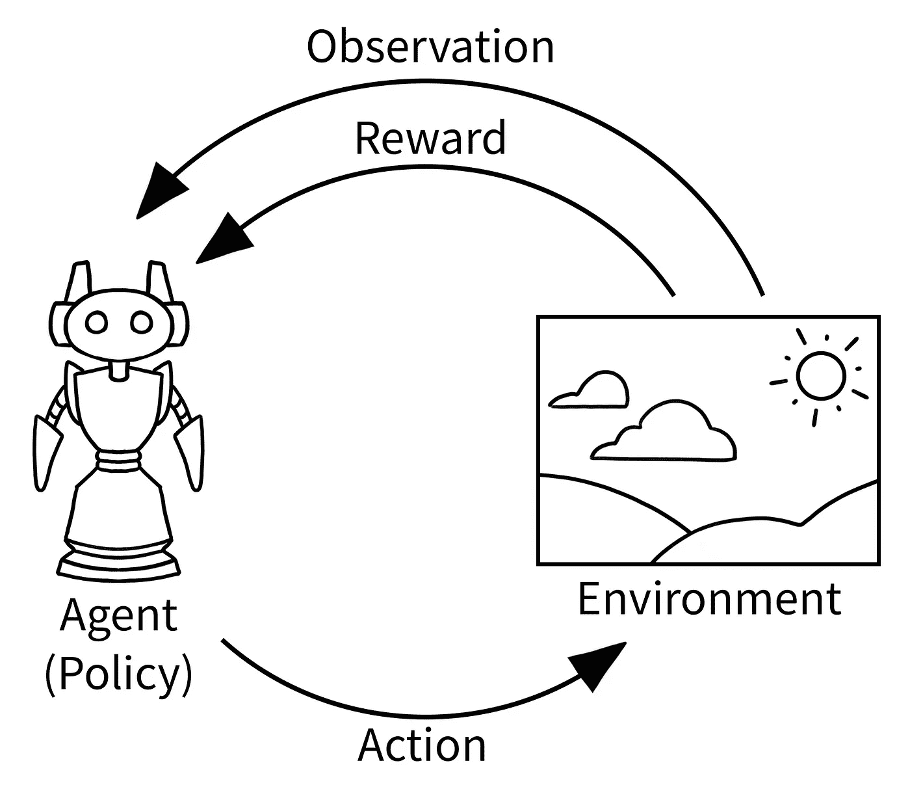
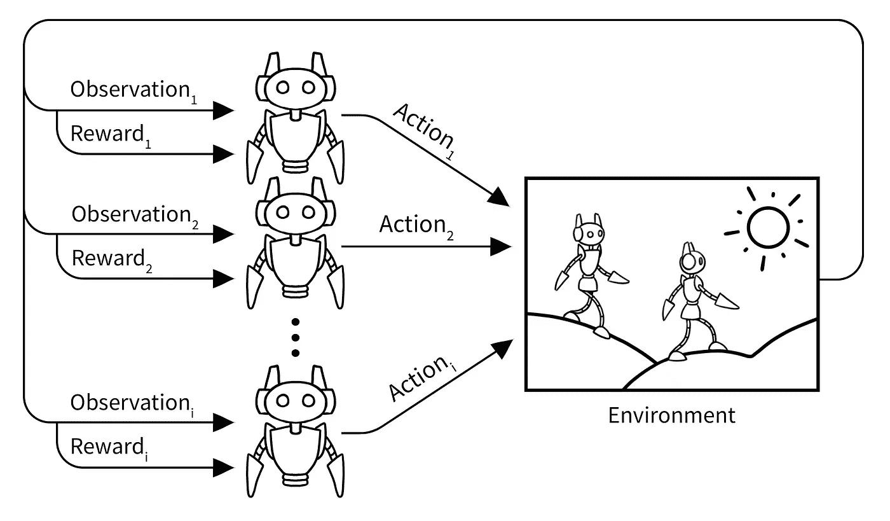
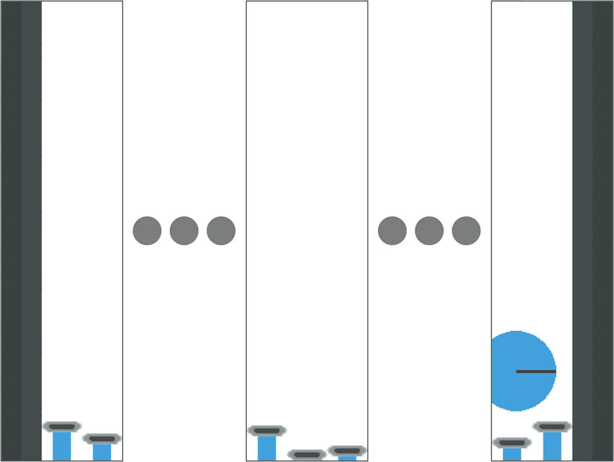
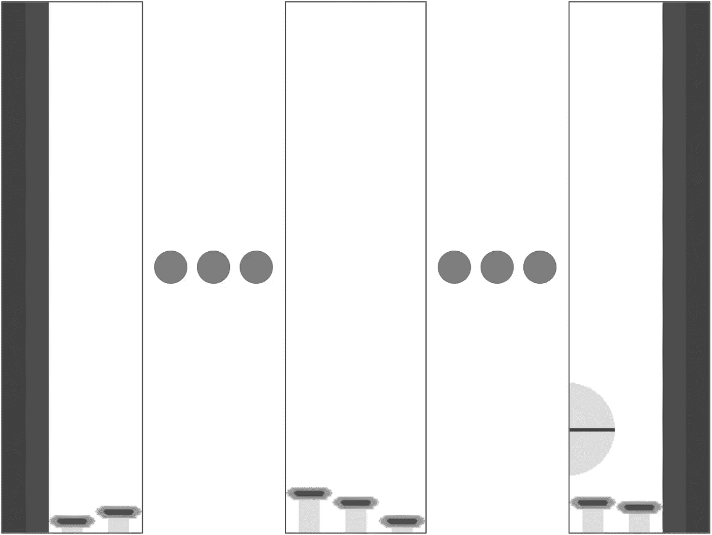
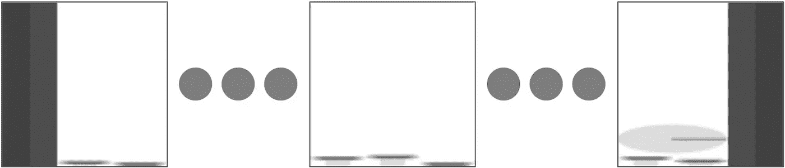
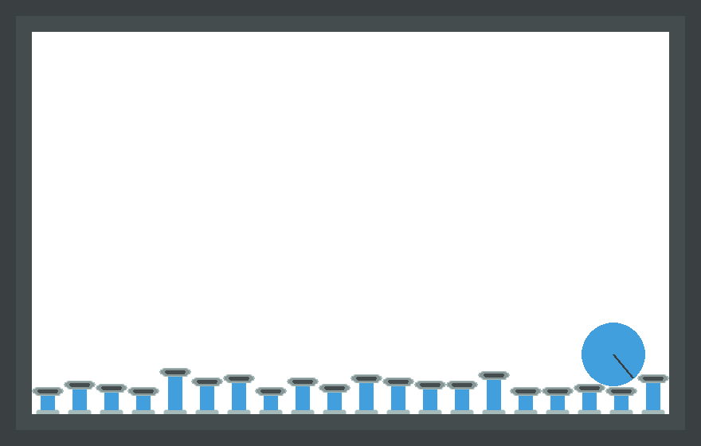

# 使用 PettingZoo 的 13 行代码中的多智能体深度强化学习

> 原文：<https://towardsdatascience.com/multi-agent-deep-reinforcement-learning-in-15-lines-of-code-using-pettingzoo-e0b963c0820b?source=collection_archive---------0----------------------->

## 初学者多智能体深度强化学习教程

**免责声明**

对于 PettingZoo 和 Stable Baselines 3 的新版本，本教程不再是最新的。自从这篇文章发表以来，PettingZoo 经历了一些重大的修改，现在是 [Farama 基金会](https://farama.org/)的一部分。有关最新文档和教程，请参见 https://pettingzoo.farama.org/的[。](https://pettingzoo.farama.org/)

本教程提供了使用多代理强化学习的简单介绍，假设有一点机器学习的经验和 Python 的知识。

## 强化学习简介

强化源于使用机器学习来优化控制环境中的代理。它通过学习一个*策略*，一个函数来工作，该函数将从其环境中获得的一个*观察*映射到一个*动作*。策略函数是典型的深度神经网络，这就产生了“深度强化学习”的名称

强化学习的目标是学习一个*最优策略*，一个在行动时从环境中获得*最大期望回报*的策略。奖励是一个单一的无量纲的值，在一个行动之后立即由环境返回。整个过程可以想象成这样:



版权所有贾斯汀·特里 2021

这种强化学习的范式包含了各种各样令人难以置信的场景，比如电脑游戏中的一个角色(例如，Atari，奖励是分数的变化)，在城市里运送食物的机器人(代理人成功完成一次旅行会得到积极的奖励，花费太长时间会受到惩罚)，或者交易股票的机器人(奖励是获得的金钱)。

## 多智能体强化学习

学习玩多人游戏代表了我们一生中人工智能的许多最深远的成就。这些成就包括学习玩[围棋](https://www.nature.com/articles/nature16961)、 [DOTA 2](https://openai.com/projects/five/) 和[星际争霸 2](https://www.nature.com/articles/s41586-019-1724-z) 到超人的性能水平。不出所料，使用强化学习来控制多个智能体被称为多智能体强化学习。一般来说，这与单个代理强化学习是一样的，每个代理都试图学习自己的策略来优化自己的回报。对所有代理使用中央策略是可能的，但是多个代理必须与中央服务器通信来计算它们的动作(这在大多数真实世界场景中是有问题的)，所以在实践中使用了*分散的*多代理强化学习。这可以想象如下:



版权所有贾斯汀·特里 2021

多智能体深度强化学习，我们今天要做的，同样只是使用深度神经网络来表示多智能体强化学习中的学习策略。

## 宠物动物园和活塞球

[Gym](https://gym.openai.com/) 是 OpenAI 开发的一个著名的强化学习库，它为环境提供了一个标准的 API，这样就可以很容易地用不同的强化学习代码库来学习它们，并且对于相同的学习代码库，可以很容易地尝试不同的环境。 [PettingZoo](https://www.pettingzoo.ml/) 是一个更新的库，它就像一个多代理版本的 Gym。它的基本 API 用法如下:

```
from pettingzoo.butterfly import pistonball_v5
env = pistonball_v5.env()
env.reset()
for agent in env.agent_iter():
    observation, reward, done, info = env.last()
    action = policy(observation, agent)
    env.step(action)
```

我们今天要学习的环境是 [Pistonball](https://www.pettingzoo.ml/butterfly/pistonball) ，一个来自 PettingZoo 的合作环境:


在其中，每个活塞都是一个代理，可以由一个策略单独控制。观察活塞上方和旁边的空间，例如:



策略返回的动作是提升或降低活塞的量(从-4 到 4 个像素)。目标是让活塞学会如何协同工作，尽快把球滚到左边墙。如果球向右移动，每个活塞代理都获得负奖励，如果球向左移动，则获得正奖励，并且在每个时间步长都获得少量负奖励，以激励尽可能快地向左移动。

在强化学习中，有大量的技术可以学习单个代理环境。这些是多智能体强化学习算法的基础。最简单和最流行的方法是在所有代理之间共享一个策略网络，这样所有代理使用相同的功能来选择一个动作。每个代理可以使用任何单个代理方法来训练这个共享网络。这通常被称为*参数共享*。这就是我们今天要用的方法，用 [PPO](https://openai.com/blog/openai-baselines-ppo/) 单代理方法(像这样的连续控制任务的最好方法之一)。

# 代码

首先我们从进口开始:

```
from stable_baselines3.ppo import CnnPolicyfrom stable_baselines3 import PPOfrom pettingzoo.butterfly import pistonball_v5import supersuit as ss
```

我们已经讨论过了，但是让我们来谈谈[稳定基线](https://github.com/hill-a/stable-baselines)。几年前，OpenAI 发布了“[基线](https://github.com/openai/baselines)”存储库，其中包括大多数主要深度强化学习算法的实现。这个存储库变成了稳定的基线库，旨在供强化学习的初学者和实践者轻松使用来学习健身房环境。其中的 CnnPolicy 只是稳定基线包含的深度卷积神经网络对象，它自动调整神经网络的输入和输出层的大小，以适应环境的观察和动作空间。SuperSuit 是一个为健身房和宠物动物园环境提供预处理功能的包，我们将在下面看到。环境和包装器被版本化，以确保在学术研究中精确地再现比较。

首先，我们初始化 PettingZoo 环境:

```
env = pistonball_v5.parallel_env(n_pistons=20, time_penalty=-0.1, continuous=True, random_drop=True, random_rotate=True, ball_mass=0.75, ball_friction=0.3, ball_elasticity=1.5, max_cycles=125)
```

这些参数中的每一个都以不同的方式控制着环境如何运行，并在这里[进行了记录](https://www.pettingzoo.ml/butterfly/pistonball)。这里我们需要使用的另一种 parallel_env 模式在[这里](https://www.pettingzoo.ml/api)有记录。

我们要处理的第一个问题是环境的观测是全彩色图像。我们不需要颜色信息，由于 3 个颜色通道，神经网络处理的计算成本是灰度图像的 3 倍。我们可以通过用超级套装包裹环境来解决这个问题(记得我们在上面把它作为 ss 导入)，如下所示:

```
env = ss.color_reduction_v0(env, mode=’B’)
```

请注意，B 标志实际上采用图像的蓝色通道，而不是将所有通道都转换为灰度，以节省处理时间，因为在训练期间会进行成千上万次。在此之后，观察结果将是这样的:



尽管对每个活塞的观察都是灰度的，但图像仍然非常大，包含的信息比我们需要的更多。让我们把它们缩小。84x84 在强化学习中是一个流行的大小，因为它在 DeepMind 的一篇著名论文中使用过。用超级套装解决这个问题看起来像这样:

```
env = ss.resize_v0(env, x_size=84, y_size=84)
```

在此之后，观察结果将类似如下:



我们要做的最后一件重要的事情在开始时有点奇怪。因为球在运动，我们想给政策网络一个简单的方法来观察它运动和加速的速度。最简单的方法是将过去的几帧叠加在一起，作为每次观测的通道。将 3 叠加在一起，可以给出足够的信息来计算加速度，但 4 更标准。这是你如何用超级套装做到的:

```
env = ss.frame_stack_v1(env, 3)
```

接下来，我们需要稍微转换一下环境 API，这将导致稳定的基线在多代理环境上进行策略网络的参数共享(而不是像普通的那样学习单代理环境)。这方面的细节已经超出了本教程的范围，但是对于那些想知道更多的人来说，在这里记录了。

```
env = ss.pettingzoo_env_to_vec_env_v1(env)
```

最后，我们需要将环境设置为并行运行自身的多个版本。一次多次在环境中玩耍可以使学习更快，这对 PPOs 的学习表现很重要。SuperSuit 提供了许多方法来做到这一点，我们想在这里使用的是这个:

```
env = ss.concat_vec_envs_v1(env, 8, num_cpus=4, base_class=’stable_baselines3’)
```

8 是指我们复制环境的次数，num _ cpus 是运行这些环境的 CPU 核心数。这些是超参数，你可以随意使用它们。根据我们的经验，每个线程运行两个以上的环境会变得很慢，所以请记住这一点。

最后，我们可以开始一些实际的学习。这可以通过稳定的基线和三行代码轻松实现:

```
model = PPO(CnnPolicy, env, verbose=3, gamma=0.95, n_steps=256, ent_coef=0.0905168, learning_rate=0.00062211, vf_coef=0.042202, max_grad_norm=0.9, gae_lambda=0.99, n_epochs=5, clip_range=0.3, batch_size=256)model.learn(total_timesteps=2000000)model.save(“policy”)
```

这将实例化 PPO 学习对象，然后训练策略网络并将其保存到磁盘。所有的参数都是超参数，你可以在这里详细阅读[(它们都已经用 Optuna 调好了)。中的时间步长参数。learn()方法指的是单个代理采取的动作，而不是游戏进行的总次数。](https://medium.com/aureliantactics/ppo-hyperparameters-and-ranges-6fc2d29bccbe)

使用现代 8 核 CPU 和 1080Ti，培训将需要大约 2 个小时(像所有深度学习一样，这是相当密集的 GPU)。如果你没有 GPU，用 T4 的 GPU 在谷歌云平台上训练这个应该不到 2 美元。

## 看着我们的算法玩游戏

一旦我们训练并保存了这个模型，我们就可以加载我们的策略并观看它的运行。首先，让我们重新实例化环境，这次使用普通的 API:

```
env = pistonball_v5.env()
env = ss.color_reduction_v0(env, mode=’B’)
env = ss.resize_v0(env, x_size=84, y_size=84)
env = ss.frame_stack_v1(env, 3)
```

然后，让我们加载策略

```
model = PPO.load(“policy”)
```

我们可以使用策略将其呈现在您的桌面上，如下所示:

```
env.reset()
for agent in env.agent_iter():
   obs, reward, done, info = env.last()
   act = model.predict(obs, deterministic=True)[0] if not done else None
   env.step(act)
   env.render()
```

这应该会产生类似这样的 gif:



请注意，这实际上比开头显示的 gif 更好。这是因为开始的 gif 是用一个手工制作的策略生成的，这里是[这里是](https://github.com/PettingZoo-Team/PettingZoo/blob/master/tutorials/manual_pistonball_policy.py)，而这个是实际学习到的

这篇教程的完整代码可以在[这里](https://github.com/PettingZoo-Team/PettingZoo/blob/master/tutorials/13_lines.py)找到。如果你觉得这个教程有用，可以考虑主演相关的项目([宠物动物园](https://github.com/PettingZoo-Team/PettingZoo)、[超级套装](https://github.com/PettingZoo-Team/SuperSuit)和[稳定基线](https://github.com/DLR-RM/stable-baselines3) 3)。