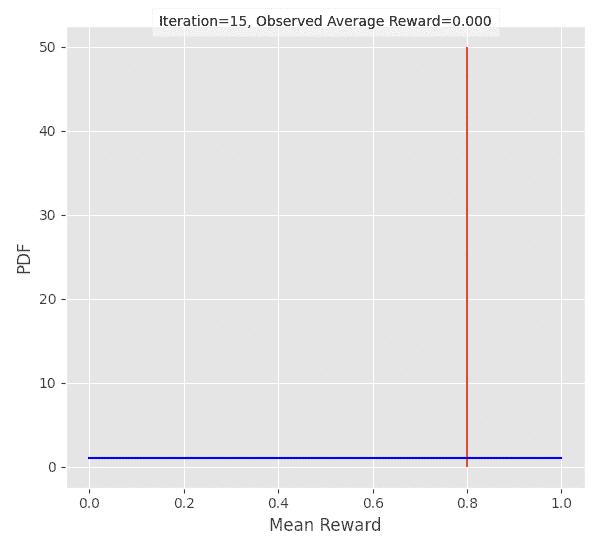
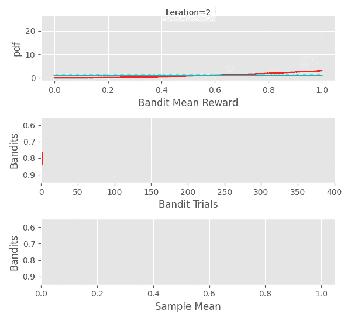
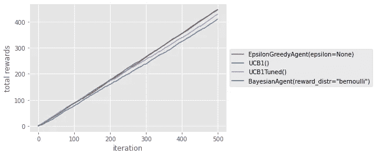

# 多臂强盗:带 Python 代码的 Thompson 采样算法

> 原文：<https://towardsdatascience.com/multi-armed-bandits-thompson-sampling-algorithm-fea205cf31df?source=collection_archive---------4----------------------->

## 了解汤普森采样(贝叶斯土匪)算法。


丹尼斯·简斯在 [Unsplash](https://unsplash.com/s/photos/movie?utm_source=unsplash&utm_medium=referral&utm_content=creditCopyText) 拍摄的照片

# 介绍

在这一系列的帖子中，我们尝试了不同的 bandit 算法来优化我们的电影之夜——更具体地说，我们如何选择电影和餐馆来送餐！

对于新人来说，土匪这个名字来自老虎机(被称为独臂土匪)。你可以把它想成每次和它互动(拉它胳膊)都能奖励你(或者不奖励你)的东西。目标是，给定一群给出不同奖励的强盗，尽可能快地找出给出最高奖励的强盗。当我们开始玩游戏并不断收集关于每个强盗的数据时，强盗算法会帮助我们在利用迄今为止给我们最高奖励的强盗和探索其他强盗之间进行选择。

<https://medium.com/analytics-vidhya/multi-armed-bandits-part-1-epsilon-greedy-algorithm-with-python-code-534b9e2abc9>  </multi-armed-bandits-upper-confidence-bound-algorithms-with-python-code-a977728f0e2d>  

你和你的朋友一直在使用 bandit 算法来优化每周电影之夜选择哪家餐馆和哪部电影。到目前为止，你已经尝试了不同的强盗算法，如[ε贪婪](https://medium.com/analytics-vidhya/multi-armed-bandits-part-1-epsilon-greedy-algorithm-with-python-code-534b9e2abc9)、[乐观初始值](https://medium.com/swlh/multi-armed-bandits-optimistic-initial-values-algorithm-with-python-code-3970e611b5ab)和[置信上限](/multi-armed-bandits-upper-confidence-bound-algorithms-with-python-code-a977728f0e2d) (UCB)。您已经发现 **UCB1 调整的**算法在伯努利和普通奖励方面都比其他算法稍好，并且已经在过去几个月中使用了它。

尽管你的电影之夜因 UCB1-Tuned 做出的选择而进展顺利，但你错过了尝试新算法的兴奋感。

“你听说过汤普森抽样吗？”你的朋友问。

兴奋的你拿起手机开始阅读。

# 该算法

汤普森抽样，也称为贝叶斯土匪，是多武装土匪问题的贝叶斯方法。基本思想是把每个强盗的平均报酬𝛍视为一个随机变量，并使用我们目前收集的数据来计算它的分布。然后，在每一步，我们将从每个强盗的平均奖励分布中抽取一个点，并选择其样本值最高的一个。我们随后从选中的强盗那里得到奖励，并更新它的平均奖励分布。

我听到你问我们如何计算/更新分布？贝叶斯强盗这个名字可能已经泄露了，但是我们将使用**贝叶斯定理**。

```
Bayes Theorem
 P(A|B) = P(B|A) P(A) / P(B)where
 A, B: events in sample space
 P(A|B): conditional probability of A given B
 P(B|A): conditional probability of B given A
 P(A): probability of A
 P(B): probability of B
```

以上定义是针对离散变量，对于[连续变量](http://galton.uchicago.edu/~eichler/stat24600/Handouts/l06.pdf)是针对概率密度函数定义的。

在我们的例子中，对于每一个土匪，我们想计算他们的 P( 𝛍 |数据)，也就是说，给定我们到目前为止收集的数据，𝛍的不同值的可能性有多大。

```
P( 𝛍 | data ) = P(data | 𝛍) P(𝛍) / P(data)
              ∝ P(data | 𝛍) P(𝛍)
    posterior ∝ likelihood x prior
```

具有许多数据点的土匪将具有狭窄的分布，因此我们采样的数据点将有很高的机会接近真实平均值。然而，拥有很少数据点的盗匪将会有一个广泛的分布，给高值一个被选择的好机会。这种机制平衡了探索和开发。



图 1:更新单个伯努利强盗的平均奖励分布，奖励概率为 0.8。平均回报遵循贝塔(成功+ 1，失败+ 1)分布，假设贝塔(1，1)先验和二项式可能性。作者制作的动画。

现在，计算 P( 𝛍 |数据)是棘手的，除非可能性和先验是 [**共轭先验**](https://en.wikipedia.org/wiki/Conjugate_prior) 。这意味着，当我们结合似然性和先验时，我们得到的后验分布与先验分布来自同一个家族。这很方便，原因有二:

*   我们可以避免计算后验概率的麻烦，因为它有一个封闭的表达式。
*   我们可以使用步骤 *i-1* 的后验概率作为步骤 *i* 的先验概率。这使得从 P( 𝛍 |直到步骤 *i-1* 的数据)到 P( 𝛍 |直到步骤 *i* 的数据)变得容易，并确保我们只使用共轭先验。

## 伯努利奖励

在这篇文章的其余部分，我们将假设一个强盗给𝛍的概率是 1，否则是 0，即

```
ith bandit rewards ~ Bernoulli(prob = 𝛍_i)
```

现在我们需要为𝛍.选择一个先验分布由于𝛍是成功的概率，它只能取 0 到 1 之间的值。因此，我们需要一个支持[0，1]的分布。一种这样的分布是具有参数`a`和`b`的贝塔分布。在我们收集任何数据之前，𝛍的所有值都是同样可能的，因此[0，1]上的统一先验是有意义的。选择`a = 1`和`b = 1`给了我们这样的机会。

接下来，我们需要选择一个可能性，最好是β分布是共轭先验的可能性。二项式分布满足这一点，它对我们的用例也有意义，因为它用成功概率`p`(这是我们试图估计的𝛍)模拟了从`N`试验(我们玩强盗的次数)中获得`k`成功的概率(强盗奖励的总和)。

```
If
  Prior is 𝛍 ~ Beta(𝛼, 𝛽)
  Likelihood is k | 𝛍 ~ Binomial(N, 𝛍)
Then
  Posterior is 𝛍 ~ Beta(𝛼 + successes, 𝛽 + failures)
Where
  N = successes + failures
```

这是一个简单的更新规则，如果强盗的奖励是 1，我们增加它的`a`，如果是 0，我们增加它的`b`。



图 2:使用 Thompson 抽样的实验，四个强盗获得奖励的概率(0.6，0.7，0.8，0.9)等于 1。我们可以看到，随着我们为每个土匪收集更多的数据，分布变得越来越窄。作者的动画。

# 给我看看代码

在之前的文章中，我们已经定义了你将在这里看到的基类，但是为了完整起见，我们再次将它们包括在内。

下面的代码定义了代表强盗的类`BernoulliBandit`，代表代理的基类`Agent`和跟踪奖励的助手类`BanditRewardsLog`。

现在，剩下的唯一事情就是子类化`Agent`类并实现 Thompson 采样。

…我们完成了！现在，让我们看看它如何与以前帖子中的算法相比较，即[ε贪婪](https://medium.com/analytics-vidhya/multi-armed-bandits-part-1-epsilon-greedy-algorithm-with-python-code-534b9e2abc9)、[乐观初始值](https://medium.com/swlh/multi-armed-bandits-optimistic-initial-values-algorithm-with-python-code-3970e611b5ab)和[置信上限](/multi-armed-bandits-upper-confidence-bound-algorithms-with-python-code-a977728f0e2d) (UCB)。

# 实验

我们将使用下面的代码来比较不同的算法。

首先，我们来定义一下我们的土匪。

```
probs = [0.6, 0.7, 0.8, 0.9]
bernoulli_bandits = [BernoulliBandit(p) for p in probs]
```

在这之后，我们可以简单地运行

```
compare_agents(
  get_agents(), 
  bernoulli_bandits, 
  iterations=500, 
  show_plot=True,
)
```

这给了我们以下。



Tota 每个代理的累积奖励。图片由作者提供。

嗯…不是很清楚，但是好像 Epsilon-Greedy 和 Bayesian 土匪有类似的表现。为了找到最好的一个，让我们重复上面的实验，并计算每个算法得到最佳结果的次数。

```
wins = run_comparison(bernoulli_bandits)
for g, w in zip(get_agents(), wins):
    print(g, w)
```

我的结果是 Epsilon-Greedy 为 397，UCB1 为 0，UCB1-Tuned 为 220，Thompson Sampling 为 383。看起来 Thompson 采样和 Epsilon-Greedy 是我们特定设置的赢家。UCB1-Tuned 获得第三名有点令人惊讶，因为在之前的实验中，它的表现超过了ε-Greedy 算法。这可能是由于 Thompson Sampling 窃取了它的一些成果，但这需要更多的调查。

# 结论

在这篇文章中，我们研究了汤普森采样算法是如何工作的，并为伯努利强盗实现了它。然后，我们将它与其他多臂强盗算法进行比较，发现它的性能与 Epsilon-Greedy 差不多。

[**成为 Medium**](https://eminik355.medium.com/membership)**的会员，获得所有故事的全部权限。你的会员费直接支持你读的作家。**

**出自同一作者。**

</going-bayesian-testing-rate-metrics-82e872b79175>  <https://medium.com/analytics-vidhya/calculating-using-monte-carlo-simulations-337cff638ac5>  

# 参考

[1]汤普森采样教程。(未注明)。检索于 2021 年 9 月 25 日，来自[https://web.stanford.edu/~bvr/pubs/TS_Tutorial.pdf.](https://web.stanford.edu/~bvr/pubs/TS_Tutorial.pdf.)