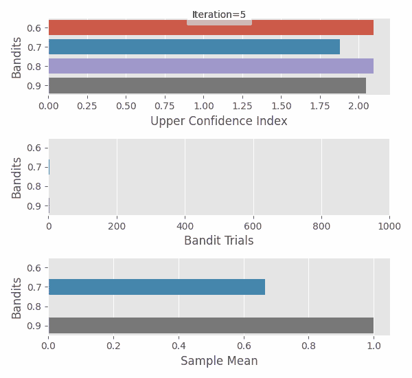
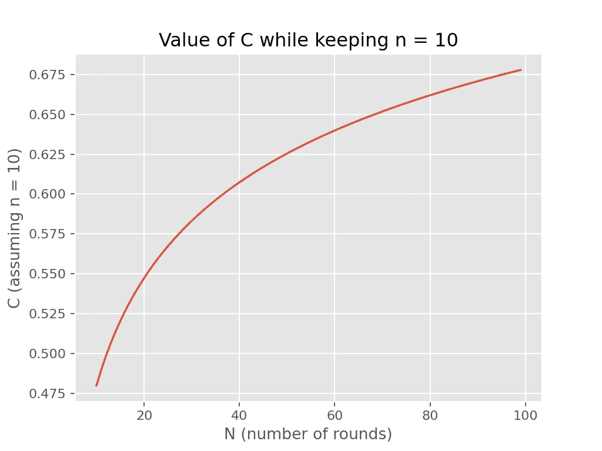
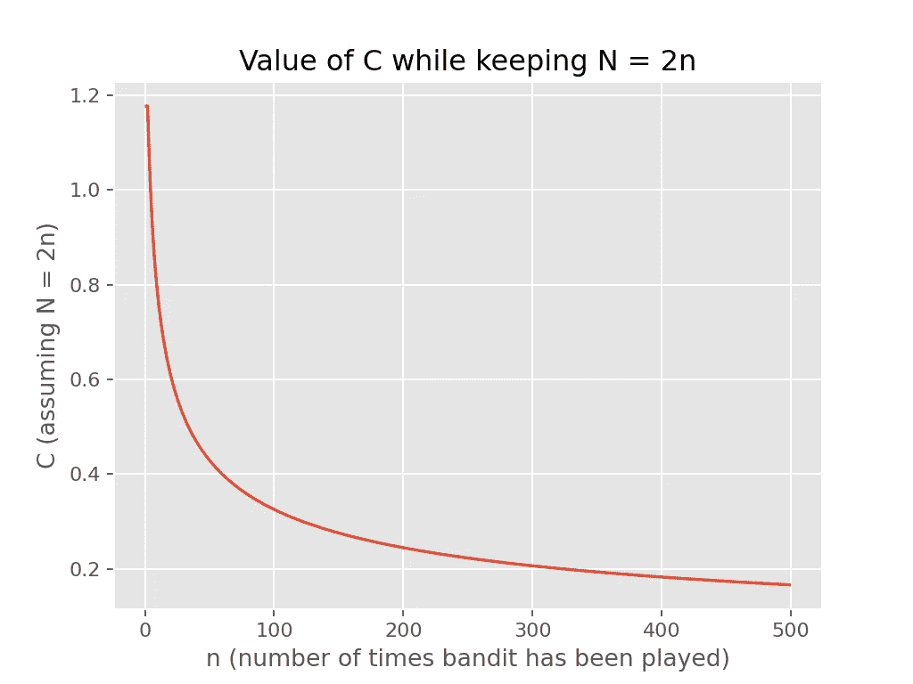
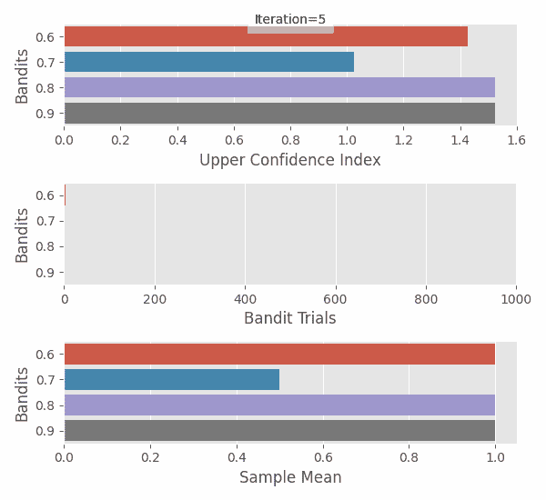
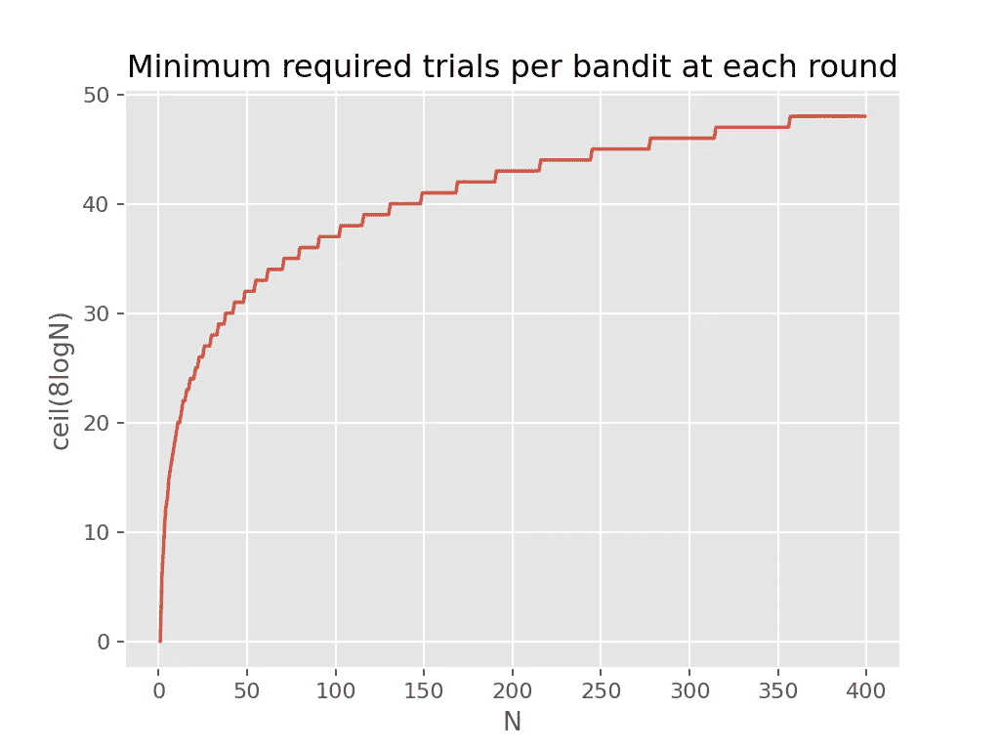
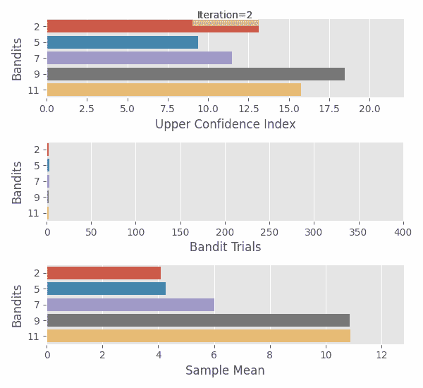
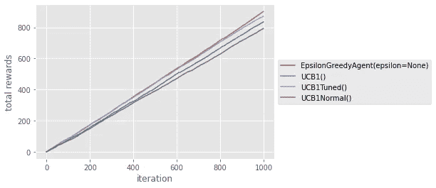
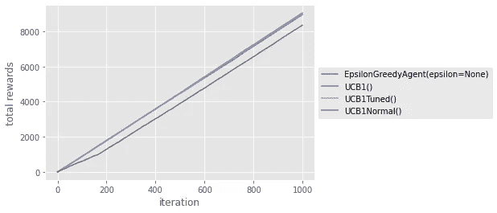

# 多臂强盗:带 Python 代码的置信上限算法

> 原文：<https://towardsdatascience.com/multi-armed-bandits-upper-confidence-bound-algorithms-with-python-code-a977728f0e2d?source=collection_archive---------7----------------------->

## [实践教程](https://towardsdatascience.com/tagged/hands-on-tutorials)

## 了解不同的置信上限 bandit 算法(UCB1、UCB1-Tuned、UCB1-Normal)。为所有实验提供的 Python 代码。


由[丹尼斯·简斯](https://unsplash.com/@dmjdenise?utm_source=unsplash&utm_medium=referral&utm_content=creditCopyText)在 [Unsplash](https://unsplash.com/s/photos/film?utm_source=unsplash&utm_medium=referral&utm_content=creditCopyText) 上拍摄的照片

# 介绍

在这一系列的帖子中，我们尝试了不同的 bandit 算法来优化我们的电影之夜——更具体地说，我们如何选择电影和餐馆来送餐！

对于新来的人来说，bandit 这个名字来自吃角子老虎机(被称为独臂强盗)。你可以把它想成每次和它互动(拉它胳膊)都能奖励你(或者不奖励你)的东西。目标是，给定一群给出不同奖励的强盗，尽可能快地找出给出最高奖励的强盗。当我们开始玩游戏并不断收集关于每个强盗的数据时，强盗算法会帮助我们在利用迄今为止给我们最高奖励的强盗和探索其他强盗之间进行选择。

在我们的故事中，我们使用餐馆而不是强盗，我们的回报是食物的满足感！:)

<https://medium.com/analytics-vidhya/multi-armed-bandits-part-1-epsilon-greedy-algorithm-with-python-code-534b9e2abc9>  <https://medium.com/swlh/multi-armed-bandits-optimistic-initial-values-algorithm-with-python-code-3970e611b5ab>  

你和你的朋友已经有一段时间没有使用 bandit 算法来优化你的电影之夜了。到目前为止，你一直在使用 [Epsilon-Greedy](https://medium.com/analytics-vidhya/multi-armed-bandits-part-1-epsilon-greedy-algorithm-with-python-code-534b9e2abc9) (与𝛆=1/#actions 一起)来帮助寻找最好的餐馆，而你的朋友一直固执地使用[乐观初始值](https://medium.com/swlh/multi-armed-bandits-optimistic-initial-values-algorithm-with-python-code-3970e611b5ab)算法来挑选电影导演(即使你的模拟已经表明它可能不适合你的用例)。

当你在互联网上消磨时间，因为封锁而被困在里面时，你会遇到一些基于**置信上限** (UCB)的强盗算法。你兴奋地发现有可能改进对最佳餐馆的搜索，并更有效地解决剥削-探索的困境，你开始阅读，期待着下一个电影之夜。

他们中有谁会比ε-Greedy 更好吗？让我们来了解一下！

# 算法

这个想法是利用我们目前收集的数据，用概率论得出每个土匪平均报酬的上限。我们就把这个上界叫做土匪的**上置信** **指标**，就像[原论文](https://link.springer.com/article/10.1023/A:1013689704352) **里一样。**与置信区间一样，如果我们没有大量数据，样本均值的边界会很宽。在每一步，我们选择具有最高上置信指数的强盗，获得奖励并随后更新其指数。

这听起来有点类似于[乐观初始值算法](https://medium.com/swlh/multi-armed-bandits-optimistic-initial-values-algorithm-with-python-code-3970e611b5ab)吧？提出这个指数似乎比仅仅选择一个乐观的初始值更复杂，但是实现仍然相对简单(我发誓)。实际上，它们使用起来更简单，因为它们没有任何需要我们选择的参数！

一般来说，每个 bandit 的置信上限指数具有以下形式。

```
Bandit Upper Confidence Index = X_sample_mean + Cwhere
 X_sample_mean:  sample mean for rewards so far
 C > 0:          size of one sided confidence interval
```

随着我们为强盗收集更多的数据，它应该减少，这是有意义的，因为我们变得更加确定平均奖励的可能值。没有被充分探索的强盗会有一个更大的`C`，这将导致我们选择他们进行探索。

在伪代码中:

```
Choose n # number of iterationsInitialisation step. # for UCB1 & UCB1-Tuned we play each bandit oncefor i = 1 to n do:
  current_bandit = pick bandit with greatest upper confidence index
  reward = current_bandit.pull_arm()    Update upper confidence index for current_bandit
```

好的……我们知道如何计算样本均值，但是我们如何计算`C`？嗯，看情况吧！

在[原始论文](https://link.springer.com/article/10.1023/A:1013689704352)中提出了几个 UCB 算法，每个算法对`C`都有不同的定义。 **UCB1** 和 **UCB1-Tuned** 设计用于奖励为 0 或 1，即来自伯努利分布的奖励(参见[本文](https://docs.microsoft.com/en-us/archive/msdn-magazine/2019/august/test-run-the-ucb1-algorithm-for-multi-armed-bandit-problems))。如果你的回报来自正态分布，有另一个算法，叫做**UCB-正态**，就是为此设计的。你*可以*使用 UCB1 获得其他发行版的奖励，但是据说性能没有那么好(我们将测试这一点)。

## UCB1

UCB1 的 bandit 置信指数上限等于

```
Bandit Upper Confidence Index = Sample Mean + √(2logN / n)where 
  N = total rounds (e.g. number of movie nights so far)
  n = number of times we've played the bandit (
    e.g. number of times we've ordered from a restaurant
  ).
```



使用 UCB1 与四个获得奖励的概率等于 1 的强盗(0.6，0.7，0.8，0.9)进行实验。我们可以看到上置信指数是如何变化的，每个强盗玩了多少次，以及我们对每一步的样本均值的估计。作者的动画。

它是使用 [**切尔诺夫-赫夫丁界限**](https://people.eecs.berkeley.edu/~sinclair/cs271/n13.pdf) 推导出来的，即

```
P( Sample Mean + t ≤ True Mean) ≤ exp(-2nt²) for t > 0
```

其中`n`是我们迄今为止从特定的土匪那里收集的数据点的数量。这意味着，样本均值的误差大于`t`的概率随着`n`的增加而降低。

为了推导上限，我们首先设置右侧等于`b`，并求解`t`。

```
Let 
 b = exp(-2nt²).Then
 logb = -2nt² <=> t = √(-logb / (2n))Choose(this is a heuristic)b = (1 / N⁴)Then
 t = √(2logN / n)
```

在上面，`n`是我们玩特定强盗的次数，`N`是我们玩的总次数(回合数或电影夜数，如果你喜欢的话)。你可以把`b`看成一个超参数。

```
We know 
 P( Sample Mean + t ≤ True Mean) ≤ exp(-2nt²) for t > 0Substitute for t
 P( Sample Mean + √(2logN / n) ≤ True Mean) ≤ 1 / N⁴**Define**
  **Upper Confidence Index = Sample Mean + √(2logN / n)****Hence 
  C = √(2logN / n)**
```

从上面我们可以推断出，真实平均值大于置信指数上限的概率小于 1/n⁴——随着回合数`N`的增加，这收敛到 0。因此，使用它作为上限是有意义的。

有一点需要注意的是比例`logN / n`。随着回合数`N`和我们玩强盗的次数`n`之间的差距增加，界限也增加。



保持 N 不变，增加 N，我们可以看到，当我们玩不涉及强盗的回合时，C 增加。图片由作者提供。



保持 N / n 比不变，我们可以看到，随着 N 和 N 都增加，界限减小。这是因为作者在 N. Image 上的对数。

## UC B1-调谐

对于 UCB1-Tuned，我们用以下内容替换`C`

```
C = √( (logN / n) x min(1/4, V(n)) )where V(n) is an upper confidence bound on the variance of the bandit, i.e.V(n) = Σ(x_i² / n) - (Σ x_i / n)² + √(2log(N) / n) and x_i are the rewards we got from the bandit so far.
```

在[原始论文](https://link.springer.com/article/10.1023/A:1013689704352)(见第 4 节)中，UCB1 调优的在每个实验中都优于 UCB1。



实验使用 UCB1-Tuned 与四个土匪的概率(0.6，0.7，0.8，0.9)获得奖励等于 1。我们可以看到上置信指数是如何变化的，每个强盗玩了多少次，以及我们对每一步的样本均值的估计。作者的动画。

## UC B1-正常

对于 UCB1-Normal，`C`基于[样本方差](https://www.saddleback.edu/faculty/pquigley/math10/shortcut.pdf)，与前两种算法不同，它是为正态分布的奖励而设计的。

```
C = √( 16 SV(n) log(N - 1) / n )where the sample variance is
  SV(n) = ( Σ x_i² - n (Σ x_i / n)² ) / (n - 1)

x_i are the rewards we got from the bandit so far
```

UCB1-Normal 通常没有初始化步骤。相反，在每一轮`N`中，它会检查是否有一个土匪的出牌次数少于`8logN`的上限，然后就打那个土匪，而不是看上面的信心指数。然而，为了计算`C`，我们需要`n`至少为 2，这样我们就不会被零除。因此，我们将每个强盗玩两次作为初始化步骤。



在每一个强盗被玩了将近 50 次之前，我们不会在大多数回合中使用较高的信心指数来选择强盗。



使用 UCB1-Normal 对五个土匪进行实验，奖励均值为(2，5，7，9，11)，标准差为 2.5。作者的动画。

# 给我看看代码

唷…那是很多界限。这些代码中的一部分已经在以前的帖子中出现过，但是为了完整起见，我还是将它包含在这里。首先，我们需要一些类来代表强盗，一个用于伯努利奖励，一个用于普通奖励。

接下来，我们将为代理定义一些基类(以及一个助手类来跟踪奖励——如果您已经阅读过上一篇文章的话,`BanditRewardsLog`已经被修改为跟踪奖励平方的总和)。

我们仍然需要定义ε贪婪代理的类，因为我们将使用它来进行比较，以及 UCB 代理。它们将从`Agent`类继承，并且需要实现`take_action`，因为它是一个抽象方法。

我们现在有了强盗和特工的所有必要职业。娱乐时间到了！

# 算法战场

我们将直接把所有的 UCB 算法和ε贪婪算法投入战场。我们将考虑两种情况，一种奖励来自伯努利分布，另一种奖励来自正态分布。

我们将利用以下实用函数。

```
*def* compare_agents(
    *agents*: List[Agent], 
    *bandits*: List[Bandit], 
    *iterations*: int,
    *show_plot*=*True*,
):
    *for* agent *in agents*:
        logger.info("Running for agent = %s", agent)
        agent.bandits = *bandits
        if* isinstance(agent, ucb.UCBAgent):
            agent.initialise()

        N = *iterations* - agent.rewards_log.total_actions
        agent.take_actions(N)
        *if show_plot*:
            cumulative_rewards = np.cumsum(
                agent.rewards_log.all_rewards,
            )
            plt.plot(cumulative_rewards, label=str(agent))

    *if show_plot*:
        plt.xlabel("iteration")
        plt.ylabel("total rewards")
        plt.legend(loc='center left', bbox_to_anchor=(1, 0.5))
        plt.show() def get_agents():
    agents = [
        EpsilonGreedyAgent(),
        ucb.UCB1Agent(),
        ucb.UCB1TunedAgent(),
        ucb.UCB1NormalAgent(),
    ]
    return agents def run_comparison_ucb(bandits):
    win_count = [0, 0, 0, 0]

    for _ in range(1000):
        agents = get_agents()
        iterations = 1000
        compare_agents(agents, bandits, iterations, show_plot=False)

        rewards = [
            agent.rewards_log.total_rewards 
            for agent in agents
        ]
        win_count[np.argmax(rewards)] += 1

    return win_count
```

愿最好的算法胜出！

## 伯努利奖励

我们来定义一下我们的土匪和特工。

```
probs = [0.6, 0.7, 0.8, 0.9]
bernoulli_bandits = [BernoulliBandit(p) for p in probs]
agents = get_agents()
```

那么我们可以简单地做

```
compare_agents(agents, bernoulli_bandits, 1000, show_plot=True)
```



每个代理的总累积奖励。图片由作者提供。

看起来 Epsilon-Greedy 和 UCB1-Tuned 比其他两个做得更好，但它很接近。我们将重复这个实验 1000 次，并记录下哪个代理得到了最多的奖励。

```
run_comparison_ucb(bernoulli_bandits)
```

我的结果是 Epsilon-Greedy 497 胜，UC B1 3 胜，UC B1-Tuned 500 胜，UC B1-Normal 0 胜。看起来选择 Epsilon-Greedy 或 UCB1-Tuned 是正确的选择。

## 正常奖励

我们重复了同样的实验，但这次是对按照正态分布给予奖励的强盗。

```
means = [3, 5, 7, 9]
normal_bandits = [Bandit(m=m, sigma=1) for m in means]
```



每个代理的总累积奖励。图片由作者提供。

令人惊讶的是，最差的一个好像是 UC B1——正常……丢人。不清楚哪一个是其他三个中最好的，所以我们将重复实验很多次，并记录哪个代理获得了最多的奖励。

我为 Epsilon-Greedy 赢得了 156 场胜利，为 UCB1 赢得了 364 场胜利，为 UCB1-Tuned 赢得了 480 场胜利，为 UCB1-Normal 赢得了 0 场胜利。

# 结论

在这篇文章中，我们研究了置信上限 bandit 算法是如何工作的，用 Python 对它们进行了编码，并将它们与其他算法以及 Epsilon-Greedy(与𝛆=1/#actions).)算法进行了比较

我们发现 UCB1-Tuned 在伯努利和普通奖励方面表现最佳，尽管它不是为普通奖励设计的。其中最差的是 UC B1——到目前为止还算正常——这可能是它不如其他产品受欢迎的原因。

# 参考

[1] Auer，p .，Cesa-Bianchi，n .和 Fischer，p .，多臂 Bandit 问题的有限时间分析。*机器学习* **47、**235–256(2002)。[https://doi.org/10.1023/A:1013689704352](https://doi.org/10.1023/A:1013689704352)

<https://eminik355.medium.com/subscribe>  

[**成为 Medium**](https://eminik355.medium.com/membership)**会员，获得全部故事权限。你的会员费直接支持你读的作家。**

**更多来自同一作者。**

</multi-armed-bandits-thompson-sampling-algorithm-fea205cf31df>  <https://medium.com/analytics-vidhya/calculating-using-monte-carlo-simulations-337cff638ac5>  <https://medium.com/analytics-vidhya/multi-armed-bandits-part-1-epsilon-greedy-algorithm-with-python-code-534b9e2abc9>  <https://medium.com/swlh/multi-armed-bandits-optimistic-initial-values-algorithm-with-python-code-3970e611b5ab> 