# 根据胸部 x 射线对各种胸部状况进行多类别分类

> 原文：<https://towardsdatascience.com/multi-category-classification-of-various-chest-conditions-from-chest-x-rays-1d6428522997?source=collection_archive---------12----------------------->

## 使用 fast.ai 和 NIH CXR 数据集将 x 射线分类为各种胸部疾病

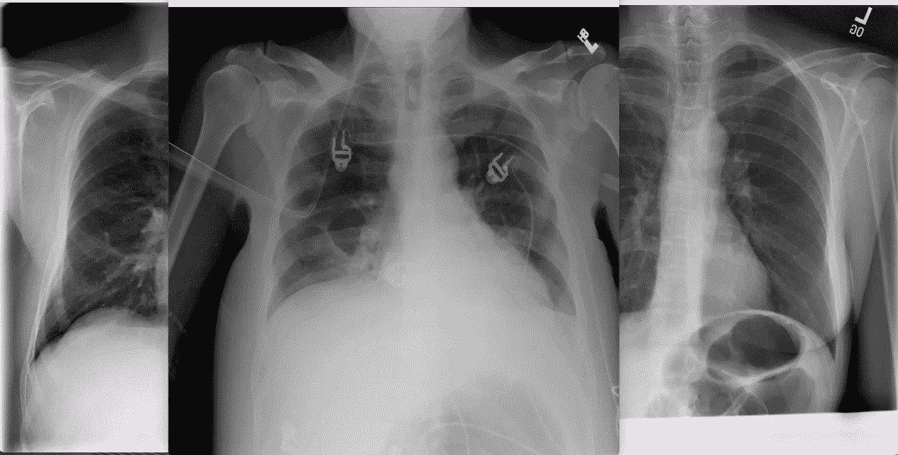

描述几种情况的胸部 x 光图像。图片作者。

# 简介

[随着医疗需求呈指数级增长](https://www.theatlantic.com/health/archive/2020/11/third-surge-breaking-healthcare-workers/617091/)，对快速诊断疾病的需求空前高涨。正如新冠肺炎疫情所表明的，检测、诊断和识别症状是防止疾病进一步传播的第一道防线。然而，这些诊断工具[仅占全球医疗支出的 2%](https://www.weforum.org/agenda/2020/09/diagnostics-best-weapon-against-infectious-diseases/)，尽管它影响了超过 70%的临床决策。

根据皇家放射科医师学会在 2018 年发布的[报告，英国只有“2%的放射科能够在合同时间内满足他们的成像报告要求。”在美国，预计到 2032 年将会短缺近 122，000 名医生。](https://www.aidoc.com/blog/is-radiologist-shortage-real/)

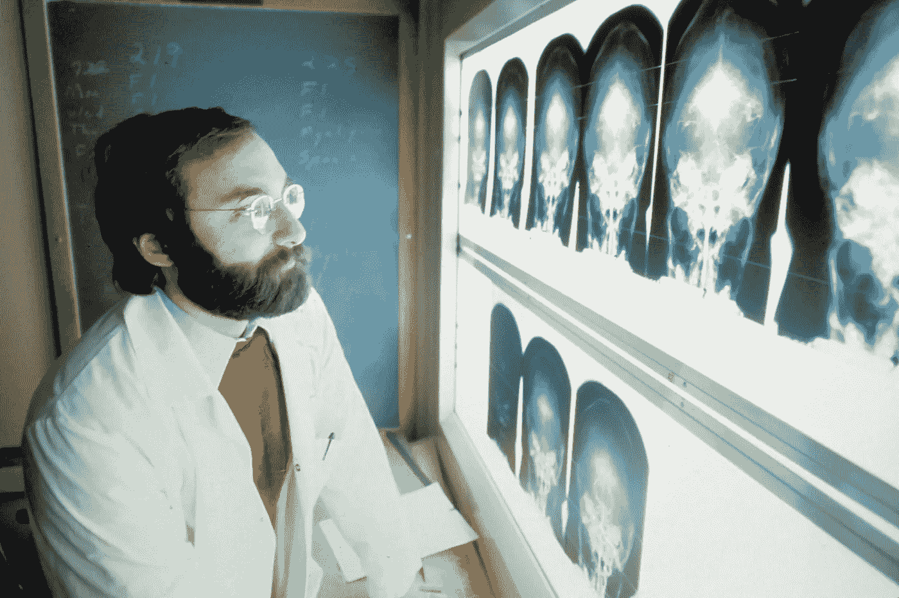

图片由国家癌症研究所的 Unsplash 提供

这是来自发达国家的消息。低收入国家和高收入国家之间的差距是巨大的:后者的放射技师比前者多近 100 倍。例如，在非洲，传染病造成超过 2 . 27 亿年的健康寿命损失。缺乏对此类传染病的快速、准确的诊断导致大量不必要的生命损失。

## 将涵盖哪些内容:

1.  [确定问题范围——识别医学成像中的不同情况](#0a3b)
2.  [利用 fast.ai 给我们一个多类别分类器](#d1d7)
3.  [准备数据](#f5ab)
4.  [训练模特](#969e)
5.  [创建交互式图形用户界面，根据真实数据测试模型](#0ce2)
6.  [限制](#ec1b)
7.  [学习要点](#e4c7)

# 医学成像中不同条件的识别👨‍⚕

对肺的损害是无法逆转的。然而，**早期发现和治疗严重的胸部疾病对于防止任何传染病进一步传播是至关重要的**。通过识别指示某些疾病的指示性条件(例如，在胸部 x 射线中)，具有快速、准确预测的医疗专业人员将能够对患者进行分类，并以更有针对性和更有效的方式执行后续步骤。

由于诊断这种疾病的紧迫性，再加上严重的人力短缺(尤其是在发展中国家)，这种[导致无数人丧生](https://www.thehindu.com/news/cities/puducherry/late-diagnosis-delay-in-reporting-to-hospitals-caused-75-of-fatalities/article34339596.ece)，有时是不必要的。

这就是人工智能——特别是深度学习——可以在防止这些生命消失方面发挥关键作用的地方。

# 严重胸闷多分类器— [fast.ai](http://fast.ai/)

为了部分缓解诊断人力的缺乏，我们可以使用计算机视觉模型，在寻求进一步的医疗帮助之前，为医生和内科医生提供患者的初步分类。

最大限度地减少操作计算机系统中的挫折和麻烦的理想目标是创建一个端到端的应用程序，医生可以快速准确地获得预测。

为此，我们可以利用 [fast.ai](http://fast.ai/) 库来帮助我们对多类别条件进行分类——这意味着给定一幅具有多种条件的图像，该模型能够预测每种条件出现的相对可能性。

# 数据🔂

我们正在[使用 NIH 胸部 x 光数据集](https://www.kaggle.com/nih-chest-xrays/sample)的一个更小的‘样本’版本来训练我们的模型。数据从最初的 112，000 张缩减到 5606 张。但是，该数据集保留了与其父数据集**相同的结构和各种类别中图像的相对分布**(例如，两个数据集中约 54%的 x 射线都有“无发现”标签)。因此，这保留了原始数据集的偏差。

为了从 kaggle 获取数据集，我们利用:

然后将包含数据集的压缩文件下载到 Google Colab 实例(我们在这个项目中使用的主要平台)。)

## 数据处理

由于该示例最初是以 zip 文件的形式下载的，我们必须将其解压缩:

```
! unzip sample.zip
```

为了从较高层面概述数据在下载的文件夹中的结构，我们可以仔细看看云存储中的内容:

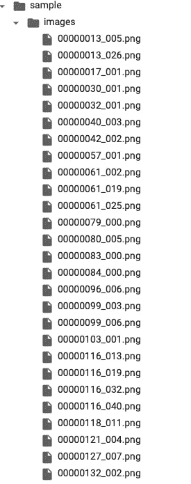

图像的文件结构，嵌套在/sample/images 下，按作者排序。

如您所见，这些图像嵌套在/sample/images 下，还有一个“sample_labels.csv ”,其中存储了不同图像的标签。

然后，我们可以通过读取 csv 文件创建一个[数据帧](https://pandas.pydata.org/docs/reference/api/pandas.DataFrame.html)以及[数据集](https://docs.fast.ai/data.core.html#Datasets)。

```
df = pd.read_csv(path/f"sample_labels.csv")
dsets = dblock.datasets(df)
```

完成这一步后，我们必须在**将标签与相应的图像**匹配之前，将**索引到 csv 文件中以提取标签**。

我们可以通过构造*助手函数*来做到这一点，我们可以在我们的数据块中使用这些函数。 [fast.ai](http://fast.ai/) 文档提供了数据块可以接受的参数列表:

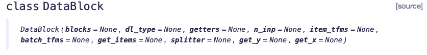

作者图片

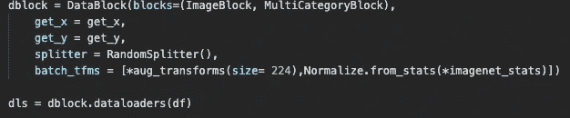

创建我们的数据块，作者图像

我们的块是 ImageBlocks(基本上是告诉模型我们正在处理自变量的图像)，以及因变量的 MultiCategoryBlocks 告诉模型一个图像可以有几个类别。这防止了模型仅识别*一个类别*，而实际上它应该检测胸部 x 光中的多个问题。

在这种情况下，我们必须定义自变量和因变量的标签—自变量是图像，因变量是“查找标签”。对于图像，我们必须从。csv 文件。对于因变量，我们必须使用简单的正则表达式提取标签。

这封装在下面显示的 get_x 和 get_y 函数中:

然后，我们必须使用函数 RandomSplitter()将数据分成训练集和验证集。

然后，我们必须使用 aug_transforms 将所有图像转换为相同的大小。

我们使用。数据加载器(df)，其中 df 是包含 csv 文件所需值的数据帧。

在训练模型之前，我们最后看一下图像，看看它们的格式是否正确:

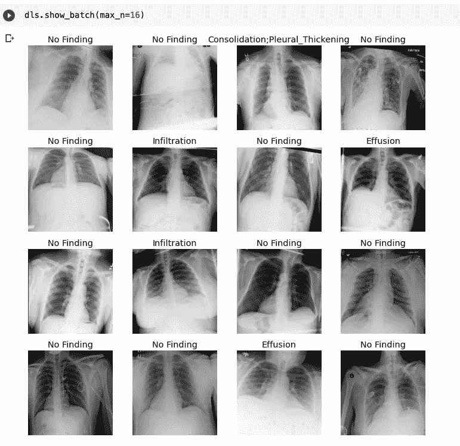

作者图片

# 训练模型🚄


训练多分类模型。作者图片

**阐述阈值的概念:**

在将 sigmoid 应用于我们的激活后(你可以在此处阅读 sigmoid 用于[的内容),我们遇到了一个问题——我们不能简单地选择被预测为具有最高激活的类别(因为可以将不同的类别分配给一张照片)。相反，我们必须通过选取阈值来决定哪些标签不对应于图像。高于阈值的每个值都将被通过(即该标签将被附加到图像上)，而低于阈值的每个值都不会被通过。](https://danielching.medium.com/under-the-hood-how-do-neural-networks-really-work-7b48b171dc8c#5750)

**选择阈值至关重要** —选择过低的阈值将影响模型的整体准确性，因为我们将无法选择正确标记的对象，这意味着如果注册了激活度相当低的标签，它将被错误地添加到图像上的多个标签之一。另一方面，选择过高的阈值意味着我们的模型只会在非常有把握的时候附加标签，因此再次降低了准确性。

我们可以使用一个方便的函数，通过绘制图表并检查对应于最高精度的点来选择阈值:

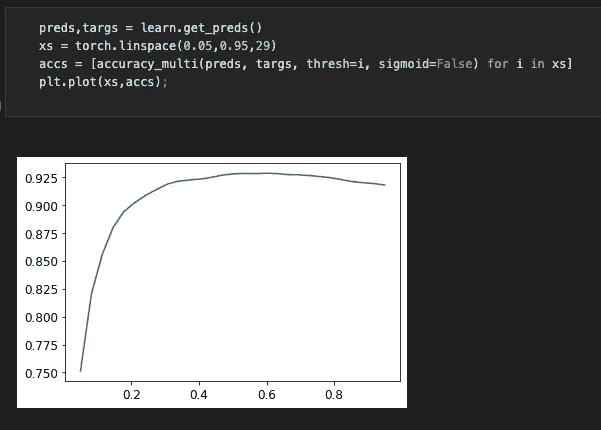

作者图片

然后，我们选择一个基本学习速率(可以使用学习速率探测器进一步优化)和 freeze_epochs(迁移学习的一个实例)来修改神经网络的后面几层，而不改变前面几层，从而减少模型训练时间。

这个模型花了大约 19 到 20 分钟来训练，并且返回了大约 92.8% 的**准确度。**

理想情况下，我们希望简单地调用 learn.predict()来给出最高的诊断可能性。然而，在测试模型时，我意识到标签的对应值超过 0.5 的情况非常罕见(这似乎是标签必须等于的默认值，才能出现在预测中)。因此，在向用户显示之前，我编写了几行代码来编译所有与相应标签匹配的预测。

然后，这将返回一个与发生的相关概率相匹配的胸部状况列表。

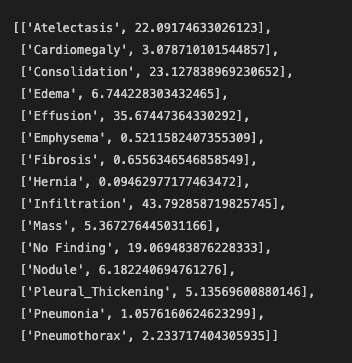

作者图片

然后，用户可以对预测进行排序，并对模型预测的条件进行排名。他或她还可以设置一个任意值，以查看哪些条件返回的概率大于设置值。

# 创建一个 GUI 来根据真实世界的数据✍️测试模型

下一步是根据真实世界的数据测试该模型，看看该模型是否能够根据从互联网上获得的胸部 x 光片来检测胸部状况。

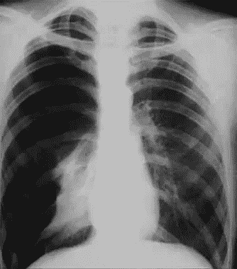

作者图片

在这个场景中，我上传了一张标记为“渗透”的图片。这是通过创建一个简单的用户按钮来完成的，用户可以在这里上传文件。

```
btn_upload = widgets.FileUpload()btn_upload
```

然后我们称之为预测:

```
img = PILImage.create(btn_upload.data[-1])list_preds(img)
```

让我们看看模型返回什么:

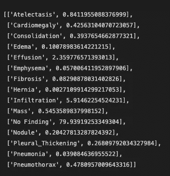

作者图片

因为从业者希望看到不同条件的不同概率，所以增加了一行代码来根据模型的置信度进行排序。

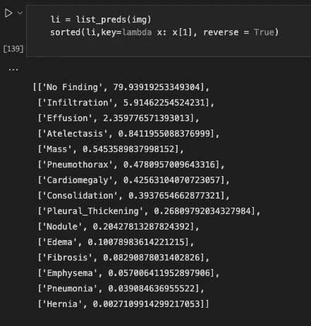

作者图片

它以最大的概率返回“没有发现”，其次是“渗透”和“渗出”。因此，渗透被列为第二个预测，这证明了这个模型实际上可以用来解释数据，*在监督医生的监督下。*

在一天结束时，这个工具可能最适合于加速放射科医生或医生处理诊断成像的过程。

## 要查看我原来的谷歌 Colab 笔记本，请随意查看这里的！

# ⛑的局限性

尽管如此，在完成这个简短的项目后，我仍然遇到了一些限制:

1.  虽然创建一个令人愉快的 UI 的目标没有完全实现，但是仍然创建了一个图形用户界面，用户可以在其中上传胸部 x 射线的图像以获得他们的预测。要采取的进一步措施可能是使用 [streamlit](https://streamlit.io) 或 [bindr](https://mybinder.org) 将这个模型推送到网络上。
2.  数据的固有偏差(其结构使得其具有超过大多数的“无发现”)—可能已经基于医生接收到的内容进行了结构化，但是这仅仅意味着模型将会有偏差，以预测对于所预测的大多数图像来说“无发现”
3.  目前不能正确地分割和识别胸部 x 射线的哪些部分代表什么情况，具有这种功能或者绘制边界框以向医生突出显示情况将进一步减少用于诊断严重胸部情况的时间。

# 学习要点💡

在整个过程中，我收集了一些智慧的金块。

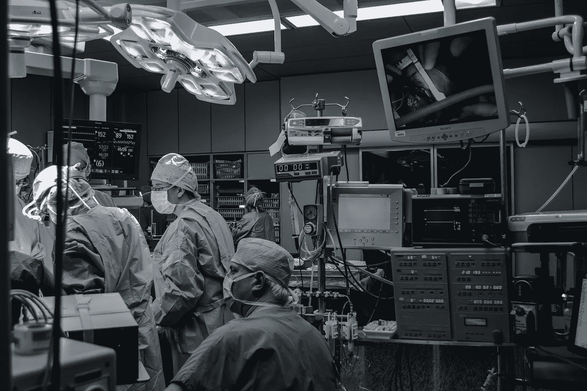

图片由[un splash](https://unsplash.com/photos/y5hQCIn1c6o)Piron Guillaume[拍摄](https://unsplash.com/@gpiron)

这个过程让我瞥见了知道深度学习和计算机视觉在医学领域的各种应用。人工智能在医学上的应用有着惊人的潜力。根据 Mihaela van der Schaar 的说法，当我们在医学中使用人工智能时，我们只是[“触及了可能的表面”](https://www.vanderschaar-lab.com/revolutionizing-healthcare-an-invitation-to-clinical-professionals-everywhere/)。我们还没有充分利用人工智能的可能性，使医疗保健生态系统更加强大和有效，我对这一领域将出现的突破感到非常兴奋。这些是我感兴趣的医疗保健和人工智能交叉领域的一些研究:

1.  [confidence care:个性化乳腺癌筛查的临床决策支持系统](https://arxiv.org/abs/1602.00374)
2.  [改进自主乳房 x 光诊断](http://proceedings.mlr.press/v106/kyono19a.html)
3.  [利用深度神经网络对皮肤癌进行皮肤科医生级别的分类](https://www.nature.com/articles/nature21056)

关于如何使用人工智能来重塑医疗保健的未来，请查看 van der Schaar 的这篇深度文章:[https://www . vanderschaar-lab . com/revolution izing-health care-an-invitation-to-clinical-professionals-everywhere/](https://www.vanderschaar-lab.com/revolutionizing-healthcare-an-invitation-to-clinical-professionals-everywhere/)

毫无疑问，在医疗保健领域全面采用人工智能会遇到一些阻力([可能是因为医生和计算机之间的不良历史](https://www.newyorker.com/magazine/2018/11/12/why-doctors-hate-their-computers))，但我已经开始相信人工智能永远无法完全取代医生(至少在不久的将来)。

在我看来，人工智能更像是一种工具，我们可以利用它来做出更准确、更快速的预测。用巴斯蒂安·特龙自己的话来说:“认知革命将允许计算机扩大人类思维的能力……正如机器使人类肌肉强大一千倍，机器将使人类大脑强大一千倍。”因此，人工智能只会增强医生的职业，而不会完全取代它。(这里有一篇[很棒的文章](https://www.newyorker.com/magazine/2017/04/03/ai-versus-md)知道 AI 会在多大程度上取代医生)。Maxfield 和 van der Schaar 提出了类似的观点:“如果医疗保健没有(1)以人为本和(2)完全以人为本，就没有可行的愿景。这不是非此即彼的问题。人类和人工智能/机器学习各有独特的优势，必须结合起来……而不是单独应用。”

个人认为，让数据更具可读性和可解释性是值得花时间去做的事情。由 [fast.ai](http://fast.ai/) 中的开箱即用方法返回的原始预测不会给(理论上的)用户任何他或她在看什么的想法。今年在探索了 [UI 和 UX 之后](https://careercontact.cc/)，我将它付诸实践，扩充了结果，现在它对数据的概率进行了排序，与左边条件的预测相匹配。

# 结论

通过这个项目，我学到了很多东西——从启动我的第一个多类别分类项目，到探索医学成像和人工智能之间的交叉——尽管最初再次掌握 Python 有些困难，但我还是设法**弄明白了**！

通过获得对利用人工智能的细微差别(老实说，挑战)的更深入的见解，我开始意识到在现实世界中部署一个准确的模型并不简单——有太多的原因可以解释为什么事情会变得可怕(或者正确！).了解用例，以及行业需要什么，仍然是最重要的。这个项目只是一个开始；探索 AI 能给世界带来的积极影响，我太炒作了。

## 随时联系我[这里](https://danielching.netlify.app)！！