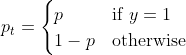
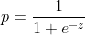
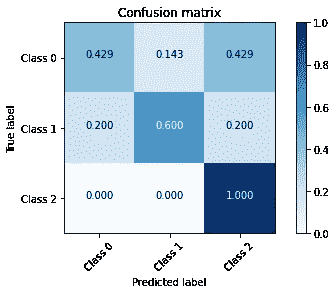
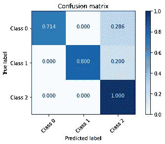

# 使用焦点损失和光照 GBM 的多类分类

> 原文：<https://towardsdatascience.com/multi-class-classification-using-focal-loss-and-lightgbm-a6a6dec28872?source=collection_archive---------5----------------------->

## 在多类分类器中引入聚焦损失有几种方法。这是其中之一。

# 动机

许多现实世界的分类问题具有不平衡的类别分布。当数据严重不平衡时，分类算法倾向于预测多数类。有几种方法可以缓解阶级不平衡。

一种方法是分配与类别频率成反比的样本权重。另一种方法是使用过采样/欠采样技术。为少数类生成人工样本的常用技术是合成少数过采样技术(SMOTE)和自适应合成(ADASYN)，这两种技术都包含在 imblearn Python 库中。

最近，提出了使用聚焦损失目标函数。该技术被宗-林逸等人用于二元分类。

在这篇文章中，我将演示如何将焦点损失合并到 LightGBM 分类器中进行多类分类。该代码可在 [GitHub](https://github.com/lucacarniato/MultiClassLightgbmWithFocalLoss) 上获得。

# 二元分类

对于二元分类问题(标签 0/1 ),焦点损失函数定义如下:

等式 1 聚焦损失函数

其中 *pₜ* 是真实标签的函数。对于二元分类，该函数定义为:

等式 2 类别概率

其中 pₜ是通过将 sigmoid 函数应用于原始边距而获得的 *z:*

等式 3 用于将原始边距 z 转换成类别概率 p 的 Sigmoid 函数

聚焦损失可以被解释为二元交叉熵函数乘以调制因子(1- *pₜ* )^ *γ* ，这减少了易于分类的样本的贡献。加权因子 *aₜ* 平衡调制因子。引用作者的话:*“当γ = 2 时，与 CE 相比，pt = 0.9 的示例的损耗低 100 倍，pt ≈ 0.968 的示例的损耗低 1000 倍”。减少容易分类的例子的损失允许训练更多地集中在难以分类的例子上”。*

在 Max Halford 的博客[ [2](https://maxhalford.github.io/blog/lightgbm-focal-loss/) ]中可以找到一篇关于在二进制 LigthGBM 分类器中合并焦点损失的精彩文章。

# 多类分类

在多类分类器中引入聚焦损失有几种方法。形式上，调制和加权因子应该应用于分类交叉熵。这种方法要求提供多级损失的一阶和二阶导数作为原始利润 *z* 。

另一种方法是使用一个对其余的(OvR)，其中为每个类 *C* 训练一个二元分类器。来自类别 *C* 的数据被视为正值，所有其他数据被视为负值。在这篇文章中，使用了 OvR 方法，采用了 Halford 开发的二元分类器。

下面显示的 OneVsRestLightGBMWithCustomizedLoss 类封装了这种方法:

此类重新实现 sklearn.multiclass 命名空间的 OneVsRestClassifier 类。重新实现最初的 OneVsRestClassifier 类的动机是能够向 fit 方法转发附加参数。这有助于传递评估集(eval_set)以提前停止，从而减少计算时间并避免过拟合。

此外，该类使用通用的 LightGBM 训练 API，在处理原始利润 *z* 和定制损失函数时，需要使用该 API 来获得有意义的结果(有关更多详细信息，请参见[ [2](https://maxhalford.github.io/blog/lightgbm-focal-loss/#first-order-derivative) )。如果没有这些约束，就有可能实现更一般的类，不仅接受任何损失函数，还接受任何实现 Scikit Learn 模型接口的模型。

该类的其他方法是 Scikit 学习模型接口的一部分:fit、predict 和 predict_proba。在 predict 和 predict_proba 方法中，基本估计量返回原始毛利 *z* 。请注意，当使用定制的损失函数时，LightGBM 会返回原始边距 *z* 。使用 sigmoid 函数从边距计算类别概率，如等式所示。3.

# 一个例子

让我们首先创建一个包含 3 个类的人工不平衡数据集，其中 1%的样本属于第一类，1%属于第二类，98%属于第三类。通常，数据集分为训练集和测试集:

为了使实验简单，放弃了早期停止。训练后产生的混淆矩阵如下所示:

图 1 使用标准 LightGBM 分类器的测试集上的混淆矩阵

对于第一个实验，在测试集上获得了 0.990 的准确度和 0.676 的召回值。使用具有焦点损失的 OneVsRestLightGBMWithCustomizedLoss 分类器重复相同的实验。

从上面的代码可以看出，损失函数可以在分类器之外配置，并且可以注入到类构造函数中。通过向 fit 方法提供一个包含 eval_set 的字典，可以启用提前停止，如上面的注释行所示。对于第二个实验，产生的混淆矩阵如下所示:

图 2 使用 LightGBM 和定制的多类焦损失类(OneVsRestLightGBMWithCustomizedLoss)的测试集上的混淆矩阵

在这种情况下，获得了 0.995 的准确度和 0.838 的召回值，比使用默认对数损失的第一个实验有所改进。这一结果在混淆矩阵中也很明显，其中类别 0 的假阳性和类别 1 的假阴性显著减少。

# 结论

在这篇文章中，我演示了一种在多类分类器中合并焦点损失的方法，使用的是一个对其余部分(OvR)的方法。

不需要使用聚焦损失目标函数、样品重量平衡或人工添加新样品来减少不平衡。在人工生成的多类不平衡数据集上，焦点损失的使用增加了召回值，并消除了少数类中的一些假阳性和假阴性。

该方法的有效性必须通过探索真实世界的数据集来确认，其中噪声和非信息特征预期会影响分类结果。

[1]林，T. Y .，戈亚尔，p .，吉尔希克，r .，何，k .，&多拉尔，P. (2017)。密集物体探测的聚焦损失。IEEE 计算机视觉国际会议论文集(第 2980–2988 页)。

[2]马克斯·哈尔福德(2020)。LightGBM 的聚焦损耗实现。[https://maxhalford . github . io/blog/light GBM-focal-loss/#一阶导数](https://maxhalford.github.io/blog/lightgbm-focal-loss/#first-order-derivative)