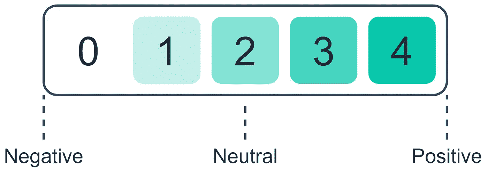

# 变压器的多级分类

> 原文：<https://towardsdatascience.com/multi-class-classification-with-transformers-6cf7b59a033a?source=collection_archive---------6----------------------->

## 用 BERT 进行预处理、训练和预测

作者图片

T 转换器被描述为深度学习的第四大支柱[1]，与卷积和递归神经网络类似。

然而，从自然语言处理的角度来看——变形金刚远不止这些。自 2017 年推出以来，它们已经主导了大多数 NLP 基准，并继续每天给人留下深刻印象。

问题是，变形金刚太酷了。有了像 HuggingFace 的变形金刚这样的库，用它们来构建不可思议的解决方案已经变得*太容易了。*

那么，有什么不爱呢？令人难以置信的性能与极致的易用性。

在本文中，我们将从头到尾使用 transformers 构建一个多类分类模型。

# 预处理

我们将使用烂番茄电影评论数据集。这里，我们给出了从 0 到 4 的五个输出标签。每个标签代表一个情感类别。

烂番茄数据集标记和衡量从消极到积极的情绪。

这里我们将简单介绍几个预处理步骤(完整的笔记本链接在本节末尾)。

总的来说，我们有六个预处理步骤:

*   使用**语句 Id** 删除“段”重复。

*   初始化空数组以存储标记化的文本。

*   一个热点编码的情绪。

*   使用我们的输入构建一个`tf.data.Dataset`对象，并标记张量。然后转换成我们模型的正确格式。

*   批处理和打乱我们的数据。

*   90–10 分为培训和验证数据。

所有这些步骤结合起来创建了[这个预处理脚本](https://github.com/jamescalam/transformers/blob/main/course/project_build_tf_sentiment_model/00_preprocessing.ipynb)和[这个输入管道脚本](https://github.com/jamescalam/transformers/blob/main/course/project_build_tf_sentiment_model/01_input_pipeline.ipynb)。

# 建造和训练

现在我们有了正确格式的数据，我们可以设置模型并开始训练。

## 构建模型

首先，我们需要初始化预训练的 BERT 模型，如下所示:

我们将使用典型的`tf.keras`层围绕 BERT 构建一个*框架*。这个框架有几个部分:

*   **两个**输入层(一个用于输入 id，另一个用于注意屏蔽)。
*   用于减少过度拟合的可能性并提高泛化能力的后 BERT 丢弃层。
*   Max pooling layer 将 BERT 输出的 3D 张量转换为 2D 张量。
*   最终输出激活使用 softmax，这样我们就可以得到我们的获奖类预测。

所有这些都写成了:

然后，我们初始化新的`model`，并将输入/输出层提供给初始化函数。一旦完成，我们可以冻结 BERT 层来加速训练(以可能的性能下降为代价)。这里，我们将注释掉图层冻结线。

我们冻结 BERT 参数的原因是它们有很多，更新这些权重会显著增加训练时间。

因为 BERT 是预先训练过的，进一步训练的潜在性能提高是很小的，因此不值得额外的训练时间。

## 培养

现在我们已经建立了模型架构，我们可以初始化我们的训练参数并开始训练。

首先，我们用合适的训练参数编译模型。

这里，我们使用一个带有加权衰减的 Adam 优化器。对于我们的损失和准确性，我们分别使用分类交叉熵和分类准确性。

我们在这里使用分类度量是因为我们的一次性编码多类输出标签是分类的。

现在，我们从`model.fit`开始训练:

仅仅几个时期后，我们应该得到接近 75%的准确度。最后，我们可以使用以下方法保存我们的模型:

([全训脚本](https://github.com/jamescalam/transformers/blob/main/course/project_build_tf_sentiment_model/02_build_and_train.ipynb))。

# 做预测

我们已经预处理了数据，构建、训练并保存了模型。现在，我们可以开始用它做一些预测。

如果您在单个笔记本或脚本中跟随，您不需要这样做——但是正如我向您展示了如何保存模型，我们也将加载它:

## 准备输入数据

我们希望从像`"hello world"`这样简单的字符串中做出预测。为此，我们需要添加一些处理步骤，将一个简单的字符串转换成正确的格式，以便我们的模型使用和预测。

为此，我们将使用一个名为`prep_data`的函数。该函数将获取一个字符串，使用一个`BertTokenizer`对其进行标记，并将这些标记张量作为一个字典返回，该字典包含`'input_ids'`和`'attention_mask'`键-值对:

## 预言；预测；预告

一旦我们的输入字符串被格式化为正确的 dictionary-tensors 格式，我们就可以将它们传递给我们的`model.predict`方法——该方法将返回每个输出标签的概率的 Numpy 数组:

([满载和预测脚本](https://github.com/jamescalam/transformers/blob/main/course/project_build_tf_sentiment_model/03_load_and_predict.ipynb))。

这就是我们完整的多类分类变压器模型演练，从开始到结束！

我希望你喜欢这篇文章。如果您有任何问题或建议，请通过 [Twitter](https://twitter.com/jamescalam) 或在下面的评论中告诉我。如果你对更多类似的内容感兴趣，我也会在 [YouTube](https://www.youtube.com/c/jamesbriggs) 上发布。

感谢阅读！

# 参考

[1] J. Wang，[变形金刚构成深度学习的第四支柱](https://ark-invest.com/articles/analyst-research/transformers-comprise-the-fourth-pillar-of-deep-learning/) (2021)，方舟研究

[🤖带变压器的 NLP 课程](https://bit.ly/nlp-transformers)

**所有图片均由作者提供，除非另有说明*