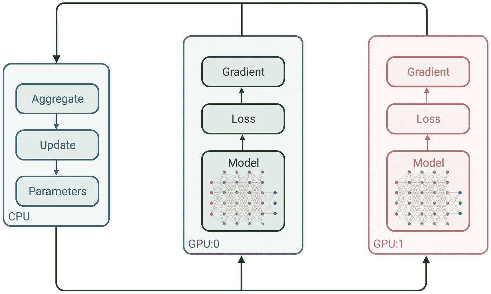
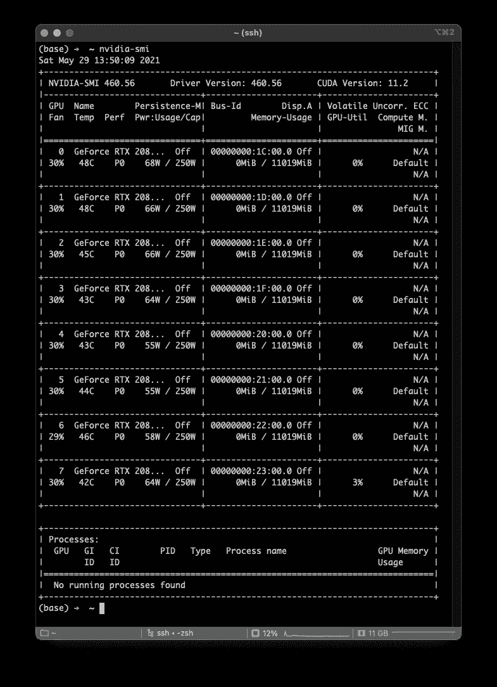
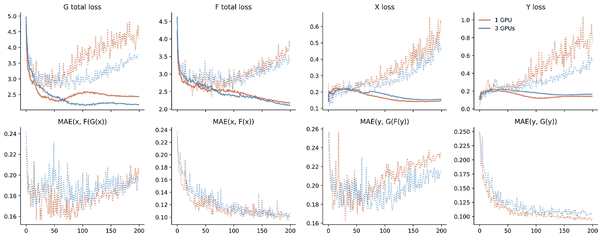
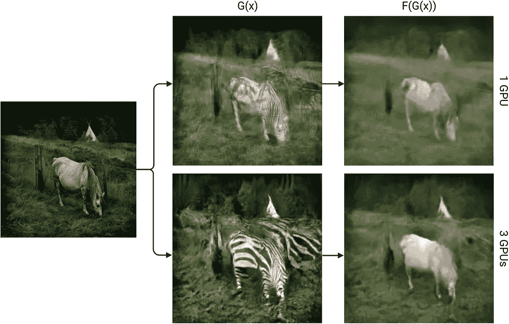
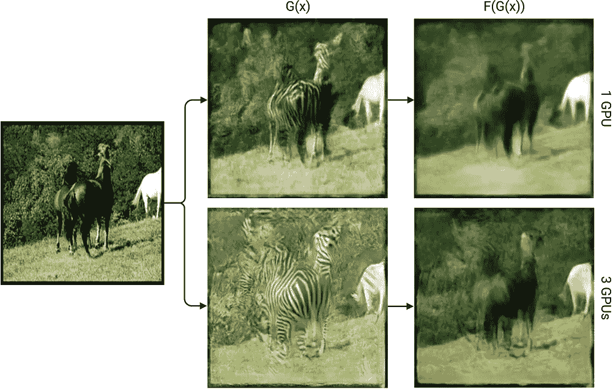
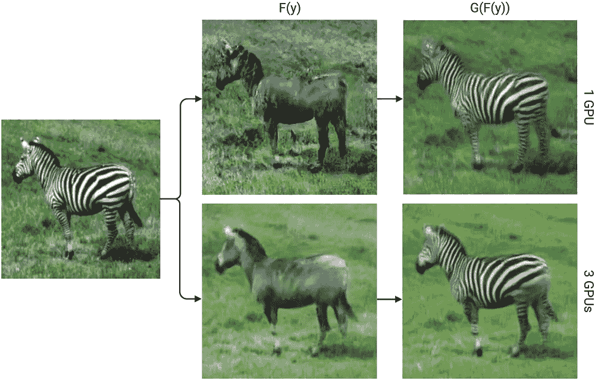
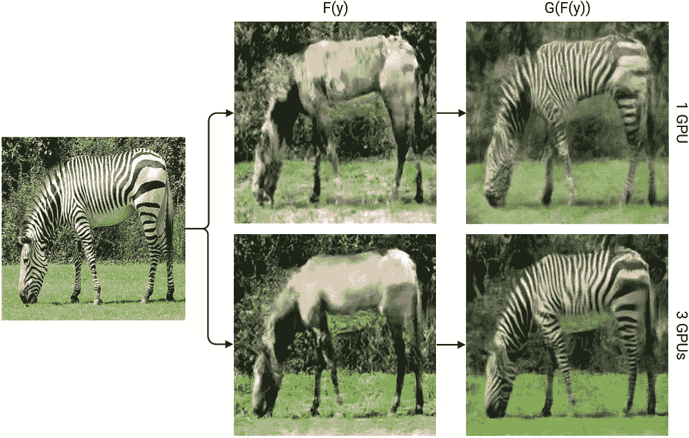

# TensorFlow 2 中的多 GPU 和自定义训练循环

> 原文：<https://towardsdatascience.com/multi-gpus-and-custom-training-loops-in-tensorflow-2-15b4b86b53bd?source=collection_archive---------13----------------------->

## 如何使用 tf.distribute.MirroredStrategy 在多个 GPU 上训练自定义训练循环模型的简明示例。



使用`tf.distribute.MirroredStrategy`在 2 个 GPU 上进行分布式训练【图片由作者提供】

TensorFlow 提供了许多关于如何执行分布式训练的优秀教程，尽管这些示例中的大多数严重依赖于 Keras API，这可能会限制想要实现更复杂模型和训练过程的用户。本教程提供了如何在 TensorFlow 2.4 中将`tf.distribute.MirroredStategy`与自定义训练循环一起使用的简明示例。为此，我们改编了由 [Keras](https://keras.io/examples/generative/cyclegan/) 和 [TensorFlow](https://www.tensorflow.org/tutorials/generative/cyclegan) 编写的 CycleGAN [1]教程，并支持多 GPU 训练。

请记住，尽管本指南不是关于 CycleGAN 本身的，但与大多数关于该主题的现有教程相比，CycleGAN 由于其(相对)复杂的损耗计算和培训程序而被用作示例。

本教程中使用的完整代码可在 github.com/bryanlimy/tf2-cyclegan[获得。](https://github.com/bryanlimy/tf2-cyclegan)

## 摘要

一般来说，TensorFlow 2 中任何现有的自定义训练循环代码都可以通过 6 个步骤转换为与`[tf.distribute.Strategy](https://www.tensorflow.org/api_docs/python/tf/distribute/Strategy)`一起工作:

1.  初始化`tf.distribute.MirroredStrategy`
2.  分发`tf.data.Dataset`
3.  每个副本的损失计算和聚合
4.  用`tf.distribute.MirroredStrategy`初始化模型、优化器和检查点
5.  将计算分配给每个副本
6.  聚合返回值和指标

## 包装要求

本教程需要以下 Python 包:

```
tqdm==4.61.0
yapf==0.31.0
matplotlib==3.4.2
tensorflow==2.4.1
tensorflow_addons==0.13.0
tensorflow_datasets==4.3.0
```

此外，还需要 CUDA、cuDNN 和 NCCL。有关 TensorFlow 中 GPU 支持的更多信息，请参见[tensorflow.org/install/gpu](https://www.tensorflow.org/install/gpu)。如果您使用的是`conda`虚拟环境，您可以使用以下命令安装上述库:

```
conda install -c nvidia *cudatoolkit*=11.0 *cudnn* nccl
```

您可以使用命令`nvidia-smi`来检查系统中可用的 GPU 数量。例如，我使用的系统配有 8 个 Nvidia GeForce 2080Ti GPUs:



`nvidia-smi`输出【图片作者】

## 初始化`tf.distribute.MirroredStrategy`

我们首先导入所需的包:

然后我们可以初始化`tf.distribute.Strategy`:

请注意，当`devices=None`时，TensorFlow 将自动检测所有可用设备。我更喜欢在每次运行开始时手动设置环境变量`CUDA_VISIBLE_DEVICES`，而不是以编程方式设置`devices`参数。请注意，`nvidia-smi`中的 GPU ID 不一定与`CUDA_VISIBLE_DEVICES`的编号相关。

使用 3 个 GPU(即`CUDA_VISIBLE_DEVICES=0,1,2`)运行上述代码片段将会打印出以下内容:

```
Number of devices: 3
```

## 数据集设置

我们从 [TensorFlow 数据集](https://www.tensorflow.org/datasets)加载`horse2zebra`数据集，并以与 [Keras 教程](https://keras.io/examples/generative/cyclegan/)相同的方式预处理 4 个数据集(`train_horses`、`train_zebras`、`test_horses`和`test_zebras`)，包括归一化和增强。此外，我们从测试集中提取前 5 个样本，并创建`plot_ds`用于绘图目的。

在为分布式培训构建`tf.data.Dataset`时，记住以下几点很重要:

*   使用`tf.data.Dataset.zip`压缩前，确保所有数据集具有相同数量的样本。`horse2zebra`数据集由奇数匹马和斑马图像组成，因此我们必须调用下面的`tf.data.Dataset.take`。
*   用`GLOBAL_BATCH_SIZE`而不是`BATCH_SIZE`批处理每个数据集。
*   `tf.data.Dataset.cache`和`tf.data.Dataset.prefetch`数据集，以确保在不停止计算的情况下向 GPU 提供足够的数据量。
*   可以查看 TensorFlow 的 tf.data API 关于[更好性能的优秀教程。我还打算写一篇关于`tf.data`的教程，包括高效写作和阅读`TFRecords`，敬请关注。](https://www.tensorflow.org/guide/data_performance)

在构建数据集之后，我们可以通过简单地调用`strategy.experimental_distribute_dataset`方法来分发它们。请注意，我们没有分发`plot_ds`,因为我们将在单个设备上执行推理。

## 构建生成器和鉴别器

发生器和鉴别器的架构与 [Keras 教程](https://keras.io/examples/generative/cyclegan/)中的模型相同。

## 每样本损失计算

`tf.losses`和`tf.keras.losses`中的损失函数默认返回给定批次的平均损失。用分布式训练计算的平均损失应该是相对于全局批量大小，而不是每个复制品。因此，我将定义自己的损失计算，其中函数返回每个样本的损失。例如，如果标签张量具有形状`(32, 256, 256, 3)`，那么返回的平均损失具有形状`(32,)`。还需要一个额外的步骤来计算整体批次平均损失。

为分布式训练编写损失函数时要记住的事情:

*   验证损失函数的形状。
*   如果使用`[tf.keras.losses](https://www.tensorflow.org/api_docs/python/tf/keras/losses)`中的损失函数，损失减少必须是`NONE`或`SUM`中的一个。
*   请注意，`tf.losses`和`tf.keras.losses`中的一些函数，如`[tf.losses.mean_squared_error](https://www.tensorflow.org/api_docs/python/tf/keras/losses/MSE)`和`[tf.losses.binary_crossentropy](https://www.tensorflow.org/api_docs/python/tf/keras/losses/binary_crossentropy)`，会减少输出的最后一个维度，因此我们必须扩展标签和预测的最后一个维度，以确保在每样本减少之前正确的输出形状。请参考下面的功能`BCE`。

然后，我们可以定义 CycleGAN 中使用的损失函数。我添加了一个助手函数`reduce_mean`，它返回全局平均损失。您也可以使用`[tf.nn.compute_average_loss](https://www.tensorflow.org/api_docs/python/tf/nn/compute_average_loss)`来执行相同的操作。

## 初始化模型、优化器和检查点

我们现在可以在`tf.strategy.MirroredStrategy`范围内初始化我们的模型、优化器和`tf.train.Checkpoint`。

下面的内容与分布式培训教程无关，但是为了让生活更简单，我添加了`Summary`类，用于简单的 TensorBoard 日志记录和一个绘制图像周期的辅助函数。这里我们创建一个目录`OUTPUT_DIR='runs/'`来存储模型检查点和 TensorBoard 摘要。

## 定制培训和测试步骤

这里的`train_step`函数与[张量流教程](https://www.tensorflow.org/tutorials/generative/cyclegan)中的函数非常相似，除了它返回一个张量字典。利用分布式训练，每个复制品将单独调用`train_step`。

`train_step`的输出示例:

```
{'loss_G/loss': <tf.Tensor: shape=(), dtype=float32, numpy=0.99999964>, 'loss_G/cycle': <tf.Tensor: shape=(), dtype=float32, numpy=5.1983647>, 'loss_G/identity': <tf.Tensor: shape=(), dtype=float32, numpy=2.5991883>, 'loss_G/total': <tf.Tensor: shape=(), dtype=float32, numpy=8.797552>, 'loss_F/loss': <tf.Tensor: shape=(), dtype=float32, numpy=1.0>, 'loss_F/cycle': <tf.Tensor: shape=(), dtype=float32, numpy=3.6904013>, 'loss_F/identity': <tf.Tensor: shape=(), dtype=float32, numpy=1.8451972>, 'loss_F/total': <tf.Tensor: shape=(), dtype=float32, numpy=6.5355983>, 'loss_X/loss': <tf.Tensor: shape=(), dtype=float32, numpy=0.49949202>, 'loss_Y/loss': <tf.Tensor: shape=(), dtype=float32, numpy=0.49720365>}
```

然后我们调用`strategy.run`将计算分布到所有副本上，每个副本计算并从`train_step`返回相应的结果。由于我们的`train_step`函数返回一个张量字典，因此，`strategy.run`的返回值将成为一个张量字典。我添加了一个助手函数`reduce_dict`，它简单地迭代字典中的每一项，并对每个键的所有值求和。

分发计算时要记住的事情:

*   我们可以在`tf.function`内外迭代数据集。
*   由于每个副本的结果都与全局批量大小有关，因此我们用`strategy.reduce`计算`SUM`而不是`MEAN`。
*   检查从`train_step`返回的值(或您计划分配计算的任何函数)。例如，如果您的函数返回一个张量，那么从`strategy.run`返回的值将是一个张量字典。

3 个 GPU 上`strategy.run(train_step, args=(x, y))`的输出示例(即`CUDA_VISIBLE_DEVICES=0,1,2`):

```
{'loss_G/loss': PerReplica:{
  0: <tf.Tensor: shape=(), dtype=float32, numpy=0.33333334>,
  1: <tf.Tensor: shape=(), dtype=float32, numpy=0.33333334>,
  2: <tf.Tensor: shape=(), dtype=float32, numpy=0.33333334>
}, 'loss_G/cycle': PerReplica:{
  0: <tf.Tensor: shape=(), dtype=float32, numpy=1.2934016>,
  1: <tf.Tensor: shape=(), dtype=float32, numpy=1.4167924>,
  2: <tf.Tensor: shape=(), dtype=float32, numpy=1.2807639>
}, 'loss_G/identity': PerReplica:{
  0: <tf.Tensor: shape=(), dtype=float32, numpy=0.6467091>,
  1: <tf.Tensor: shape=(), dtype=float32, numpy=0.70838636>,
  2: <tf.Tensor: shape=(), dtype=float32, numpy=0.6403792>
}, 'loss_G/total': PerReplica:{
  0: <tf.Tensor: shape=(), dtype=float32, numpy=2.2734442>,
  1: <tf.Tensor: shape=(), dtype=float32, numpy=2.458512>,
  2: <tf.Tensor: shape=(), dtype=float32, numpy=2.2544765>
}, 'loss_F/loss': PerReplica:{
  0: <tf.Tensor: shape=(), dtype=float32, numpy=0.33333334>,
  1: <tf.Tensor: shape=(), dtype=float32, numpy=0.33333334>,
  2: <tf.Tensor: shape=(), dtype=float32, numpy=0.33333334>
}, 'loss_F/cycle': PerReplica:{
  0: <tf.Tensor: shape=(), dtype=float32, numpy=0.6893108>,
  1: <tf.Tensor: shape=(), dtype=float32, numpy=1.1769139>,
  2: <tf.Tensor: shape=(), dtype=float32, numpy=1.5197902>
}, 'loss_F/identity': PerReplica:{
  0: <tf.Tensor: shape=(), dtype=float32, numpy=0.34465796>,
  1: <tf.Tensor: shape=(), dtype=float32, numpy=0.58845943>,
  2: <tf.Tensor: shape=(), dtype=float32, numpy=0.75989777>
}, 'loss_F/total': PerReplica:{
  0: <tf.Tensor: shape=(), dtype=float32, numpy=1.3673022>,
  1: <tf.Tensor: shape=(), dtype=float32, numpy=2.0987067>,
  2: <tf.Tensor: shape=(), dtype=float32, numpy=2.6130214>
}, 'loss_X/loss': PerReplica:{
  0: <tf.Tensor: shape=(), dtype=float32, numpy=0.16675813>,
  1: <tf.Tensor: shape=(), dtype=float32, numpy=0.16679758>,
  2: <tf.Tensor: shape=(), dtype=float32, numpy=0.16684371>
}, 'loss_Y/loss': PerReplica:{
  0: <tf.Tensor: shape=(), dtype=float32, numpy=0.16681099>,
  1: <tf.Tensor: shape=(), dtype=float32, numpy=0.1668036>,
  2: <tf.Tensor: shape=(), dtype=float32, numpy=0.16669472>
}}
```

`reduce_dict`输出示例:

```
{'loss_G/loss': <tf.Tensor: shape=(), dtype=float32, numpy=1.0>, 'loss_G/cycle': <tf.Tensor: shape=(), dtype=float32, numpy=3.990958>, 'loss_G/identity': <tf.Tensor: shape=(), dtype=float32, numpy=1.9954746>, 'loss_G/total': <tf.Tensor: shape=(), dtype=float32, numpy=6.986433>, 'loss_F/loss': <tf.Tensor: shape=(), dtype=float32, numpy=1.0>, 'loss_F/cycle': <tf.Tensor: shape=(), dtype=float32, numpy=3.386015>, 'loss_F/identity': <tf.Tensor: shape=(), dtype=float32, numpy=1.6930151>, 'loss_F/total': <tf.Tensor: shape=(), dtype=float32, numpy=6.07903>, 'loss_X/loss': <tf.Tensor: shape=(), dtype=float32, numpy=0.5003994>, 'loss_Y/loss': <tf.Tensor: shape=(), dtype=float32, numpy=0.5003093>}
```

测试步骤遵循相同的程序。

## 训练循环

剩下的工作就是以与任何典型的定制训练循环相同的方式构建训练和测试循环。我们保存一个检查点，每 10 个时期在 TensorBoard 上绘制 5 个样本。请注意，在恢复检查点时，必须在策略范围内调用`checkpoint.read`。

一个时期后打印语句示例:

```
Epoch 001/200
Train: 100%|██████████████████████| 178/178 [12:29<00:00,  4.21s/it]
Test: 100%|█████████████████████████| 20/20 [00:24<00:00,  1.22s/it]
MAE(X, F(G(X))): 0.2599  MAE(X, F(X)): 0.2823
MAE(Y, G(F(Y))): 0.2492  MAE(Y, G(Y)): 0.2793
Elapse: 773.84s
```

## 1 个 GPU 对比 3 个 GPU 的结果

为了验证我们可以在分布计算后获得类似的结果，我在 1 个 GPU 和 3 个 GPU 上用相同的超参数训练了 2 个模型。一般来说，我们可以用更大的批量来使用更大的学习速率，尽管为了简单起见，我将所有的学习速率都保持在`2e-4`。平均而言，1 个 GPU 完成一个纪元需要大约 325 秒，而 3 个 GPU 需要大约 167 秒。使用多个 GPU 时，分析输入管道和训练过程以确保适当的加速非常重要，分布式训练的开销可能会超过并行化的优势。

下面的图和图像显示了 200 个时期后发生器和鉴别器的训练统计和结果。



上图:发生器和鉴别器的训练(实线)和测试(虚线)损失|下图:测试集上的循环和同一性平均绝对误差[图片由作者提供]



x -> G(x) -> F(G(x))样本[图片由作者提供]



y -> F(y) -> G(F(y))样本[图片由作者提供]

我们有了它，一个关于如何通过`tf.distribute.MirroredStrategy`将多 GPU 训练与 TensorFlow 2 中的自定义训练循环集成的端到端示例。

由于本教程的博客性质，一些编程风格相当糟糕(例如，大量使用全局变量，训练验证测试分割而不是训练测试分割，等等。).请查看[github.com/bryanlimy/tf2-cyclegan](https://github.com/bryanlimy/tf2-cyclegan)获取更完整的示例，包括正确的检查点保存和加载，以及 TensorBoard 集成。

## TensorFlow 和 Keras 中有关分布式培训的其他参考资料

*   TensorFlow - [使用 TensorFlow 进行分布式训练](https://www.tensorflow.org/guide/distributed_training)
*   TensorFlow - [带 Keras 的分布式训练](https://www.tensorflow.org/tutorials/distribute/keras)
*   TensorFlow - [用 tf.distribute.Strategy](https://www.tensorflow.org/tutorials/distribute/custom_training) 定制训练
*   Keras - [多 GPU 和分布式培训](https://keras.io/guides/distributed_training/)

## 参考

[1]朱，严军，等.“利用循环一致对抗网络进行不成对的映象对映象翻译”IEEE 计算机视觉国际会议论文集。2017.