# 使用电子表格在 fast.ai 中进行多标签分类

> 原文：<https://towardsdatascience.com/multi-label-classification-in-fastai-using-spreadsheets-25ae570c8ff9?source=collection_archive---------17----------------------->

## *识别单个图像中的多个实体*


[Philippe Bout](https://unsplash.com/@flipboo?utm_source=medium&utm_medium=referral) 在 [Unsplash](https://unsplash.com?utm_source=medium&utm_medium=referral) 上的照片(人/椅子/桌子)

# 目录

1.  [简介](#98d5)
2.  [数据集](#d26f)
3.  [型号、激活功能和损耗](#2537)
4.  [模型评估](#6315)
5.  [结论](#ed1d)
6.  [参考文献](#e4d8)

# 介绍

很多时候，我们会遇到这样的图像，其中包含我们想要识别的多个感兴趣的对象。例如，在下图中，我们可以看到我们有一把椅子和一台电视显示器。


图片由 Vinayak 提供

为了解决上述问题，我们需要能够检测给定图像中的多个类别/标签。这就是多标签分类。给定一幅图像，将其分为多个类别/标签/种类。

由于`fastai`是围绕`Pytorch`的一个非常方便的包装器，从代码的角度来看，我们需要做的改变很少，但是解决这个问题背后的逻辑会有些不同。我们不能仅仅使用我们常规的`softmax`激活和`cross-entropy loss`功能；此外，这里的评估位比单标签分类问题要复杂得多。我们将在下面的章节中详细讨论每一点。让我们首先从数据集开始。

# 资料组

我们将在这个任务中使用`PASCAL_2007`数据集。这是一个总共包含 20 个标签的数据集，注意一个图像可以有多个标签！

只需使用 fastai 的`untar_data`将数据集下载到您的磁盘。它将存储在您的主目录/根目录下一个名为`.fastai`的特殊目录中

```
from fastai.vision.all import *
path = untar_data(URLs.PASCAL_2007)
```

如果我们从训练数据集的标签视点查看统计信息，我们将获得以下内容。

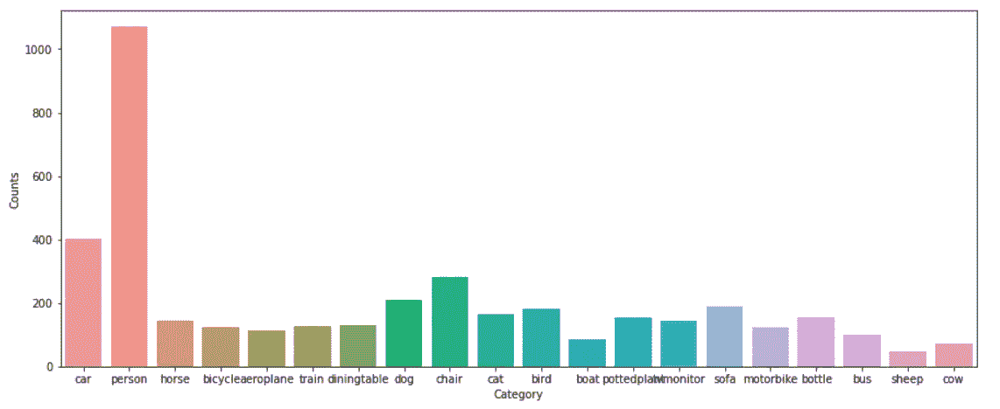

图片由 Vinayak 提供

从上图中我们可以看到,“人”是训练数据集中出现频率很高的类别，其他类别也或多或少地出现了。因此，我们的数据集中存在不平衡。

另一个值得注意的有趣的事情是**标签计数的总和与数据点的数量**不同。在单标签中，这曾经是正确的，因为每个图像有一个且只有一个标签，但是在多标签分类器的情况下，由于每个数据点不一定只有一个对象，值得注意的是标签可以多于图像的数量。这将导致我们改变构建分类器的策略，而不是单一标签分类。

在这个数据集中，我们以数据帧的形式给出标签，而不是像 Imagenet 那样以文件夹结构给出。因此，我们必须从数据帧中读取每个条目，并定义 getter 方法来检索输入和输出的值。此外，使用数据帧中名为`is_valid`的列来定义分割。我们将定义一个自定义函数，为数据集中的所有点分别提供分割，即训练和验证集的索引。

在代码中，如下所示

现在，我们可以定义一个数据加载器，一旦我们有了三个主要任务的合适的 getters，即获取因变量和自变量，以及如何将它们分成训练和验证文件。与单标签分类任务不同，对于这个任务，我们将不得不使用`MultiCategoryBlock`来读取我们的因变量作为一个热码编码向量。其余的负载保持不变。我们可以如下加载数据

*   我们的自变量是一个图像，因此`ImageBlock`作为输入，后跟一个`MultiCategoryBlock`用于一次性编码和加载因变量。
*   上面定义了我们的拆分器，它从我们的数据帧中取出`is_valid`列，并基于该布尔变量来分隔训练和验证条目
*   `get_x`函数读取列`fname`中的文件名，并将基本路径附加到要加载的文件中
*   `get_y`函数从 dataframe 中读取列`labels`,由于我们的标签是空格分隔的，所以它使用空格分隔符分割标签字符串。
*   `item_tfms`和`batch_tfms`:我们使用 fastai 的`presizing`技巧来避免有损图像裁剪(如填充边框等)。)和标准增强方法，然后使用`imagenet_stats`进行标准化，因为我们将使用预训练的`resnet50`进行分类任务。

现在，如果我们看一个批次的例子，我们可以观察到以下情况。看看我们如何在这些例子的图像中有多个标签。

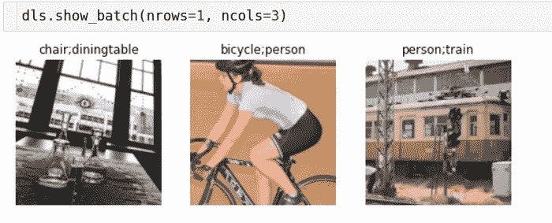

图片由 Vinayak 提供

# 模型和激活函数

虽然使用 fast.ai API 定义模型和损失非常简单，但我们应该暂停一下，看看损失函数和模型，尤其是详细的损失函数。

我们将对模型头部做一些改动。我们不会像以前一样使用 softmax，而是使用 sigmoid 激活。

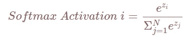

图片由 Vinayak 提供

softmax 所做的是将来自最终分类线性图层的逻辑值转换为总和 1。这对于多标签分类来说意味着，当我们遇到具有多个标签的例子时，我们会遭受很高的损失。例如，考虑下面的场景

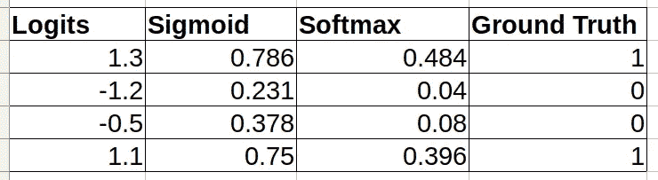

图片由 Vinayak 提供

> 我们看到，在这个假设的例子中，数据点实际上属于类别 1 和 4，但我们的 softmax 最多只能将这两个类别的概率分数推至 0.5，而将其余两个类别的概率分数推至 0，但也不会比这更好。这是因为概率总和必须始终为 1。想象一下，如果这是一个三类的例子，那么 softmax 可以做的最好的事情就是将三个概率分数推至 0.33，将剩余的 1 个概率分数推至 0。

现在，让我们看看乙状结肠激活。

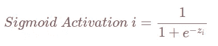

图片由 Vinayak 提供

现在，我们看到激活函数并不关心其他标签是什么。与 softmax 不同，它只关注相关标签的 logit。

> 这些逻辑都是解耦的，它们之间不会像 softmax 那样相互影响。

这就是为什么在上图中，你可以看到类别 1 和 3 的 Sigmoid 激活概率可以攀升到接近 1，而另外两个可以独立地接近 0。

现在，你可以更好地理解为什么我们不能使用`softmax activation function`而是需要一个单独的`sigmoid activation function`来解决这个问题。

既然我们已经改变了激活函数，我们应该重新考虑我们对损失函数的选择。

对于单标签分类，我们使用如下定义的交叉熵损失函数

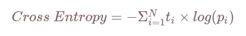

图片由 Vinayak 提供

*其中 ti 是真实值，pi 是标签的预测概率*

如果我们继续将这个损失函数应用于我们的 sigmoid 激活输出，我们就有麻烦了。我们将不会惩罚任何事实标签为 0 的东西。对于上面的同一个示例，如果我们计算 CE 损失，我们会看到如下图

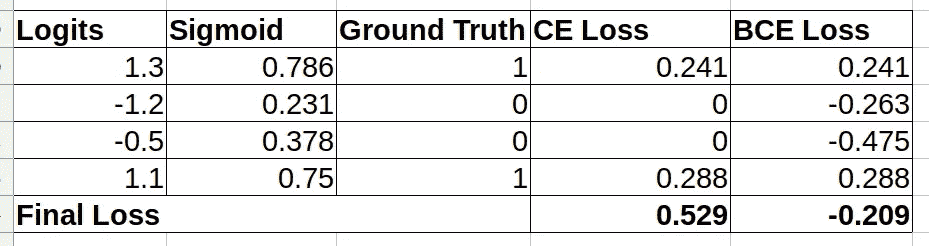

图片由 Vinayak 提供

另一方面，二元交叉熵定义如下

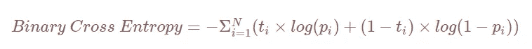

图片由 Vinayak 提供

*其中 ti 是真实值，pi 是标签的预测概率*

这真的很有趣。它确保了无论标签是什么(0/1 ),总会有一些损失来惩罚模型的错误预测。永远不会是零。当地面真实值为 1 时，损失为-log(p ),当地面真实值为 0 时，损失为 log(1-p)。这对于模型通过分类器头中的不同神经元针对它们的错误预测单独惩罚模型是非常有用的。

在上图中，我们可以看到，即使地面真实标签为 0，我们也可以获得这些神经元的有限损失值，以及单标签分类中使用的普通交叉熵损失。

对于模型，我们仍然可以继续使用我们的 imagenet 预训练主干，并从迁移学习开始。

**为什么即使任务不同，模型也是一样的——单标签而不是多标签分类？**

> 虽然最终我们必须预测每个输出的多个标签，但是我们仍然可以利用预先训练的相同过滤器来识别人、动物、物体等。这是大型 imagenet 数据集的一部分。已经智能地学习了这 1000 个类的预训练主干具有过滤器，可以检测人脸、猫毛、狗尾巴等。PASCAL_2007 数据集中也有类似的类。因此，以此为起点来利用我们已经拥有的资源是有意义的！

因此，我们现在可以定义一个`fastai learner`来进行培训。内容如下:

```
learn = cnn_learner(dls, resnet50, metrics=partial(accuracy_multi, thresh=0.5))
```

在这里，我们更改了指标，使用 accuracy_multi 代替了原来的 accuracy。我们将在模型评估中详细讨论这一点，但除此之外，我们还没有从我们做单标签分类时开始做任何改变，是吗？

*事实上，fastai 选择 BCE loss 是因为我们已经在 dls 中指定，我们的因变量是一个多类别块。我们可以明确地指定它，但我们至少需要知道它。*

然后，训练和 lr_find 以及其他内容保持不变，如下面的代码片段所示。

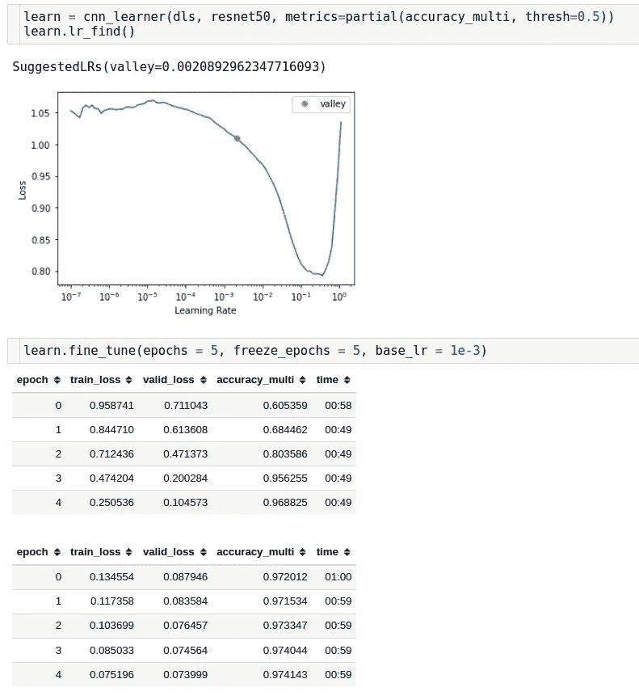

图片由 Vinayak 提供

# 模型评估

这是最重要的部分，因为这与多标签分类有很大不同。

***首先，什么是精度 _ 多？***

如果是多标签分类，我们的目标是`one-hot encoded`。同样，我们得到的输出与目标的形状相同，但它们是逻辑的。所以我们对这些应用 sigmoid 激活，并得到概率。

在单标签分类中，我们只比较一个数据点的一个标签，如果它匹配，我们的结果是准确的，否则就不是。但是，对于多标签分类，对于每个数据点，我们预测一个向量，输出也是一个向量。所以我们需要比较这些向量，而不是每个数据点的单个标量。因为我们必须比较多个值，然后取这些比较的平均值；因此得名`accuracy_multi`。下表将对此进行更好的总结。

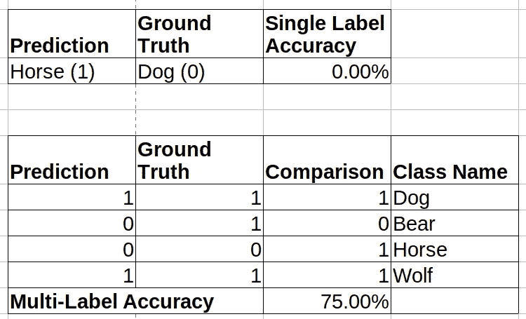

图片由 Vinayak 提供

***预测- >出席/缺席概率***

正如我们在上面的例子中看到的，我们假设预测是一个二进制字段，但是神经网络本身并不能为每个类/标签提供一个离散值。它给了我们一个浮点数组，我们需要将它转换成一个概率分布，然后转换成一个离散值，代表一个类/标签的存在/不存在。

第一部分很简单，我们已经介绍过，即从神经网络输出的逻辑值到概率分布，只涉及对各个类别的概率值应用 sigmoid 激活。

对于下一部分，即将概率转换成离散值；我们必须设定阈值。这意味着我们选择一个概率值，并以此为支点，将连续概率转换成离散分布。下面的例子将更好地解释这一现象。

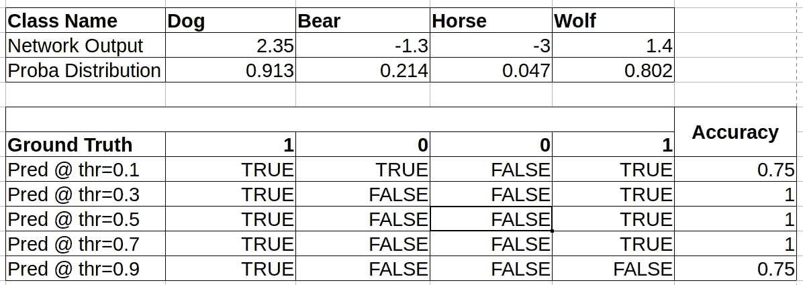

图片由 Vinayak 提供

如图所示，我们首先获取网络输出，并应用 sigmoid 激活，从而获得概率。接下来，我们任意挑选 5 个阈值`[0.1, 0.3, 0.5, 0.7, 0.9]`。现在，我们要做的是将这些概率与阈值进行比较。当`probability > threshold`时，我们将其标记为真，否则标记为假。然后取预测值的平均值，就可以得到该数据点的精确度。

> 在单标签分类中，单个数据点的精度可以是 0 或 1，而在多标签分类中，精度可以是 0 和 1 之间的连续值，包括 0 和 1。

现在，既然我们在讨论阈值，那么在评估过程中找出最佳阈值就变得很重要。此外，目前我们对所有类别/标签使用相同的阈值。我们可以分别调整每个类的阈值，以得出每个类的最佳分数，然后使用这些阈值来获得整个数据集的多精度。让我们看看如何做到这一点。

# 全局阈值

我们上面所做的在某种意义上可以称为`Global Thresholding`,我们对所有的类使用一个阈值，比较每个数据点的精确度，得出一个比较精确度和阈值的图，并选择一个给出最好精确度的。

下面是我们如何用代码实现它

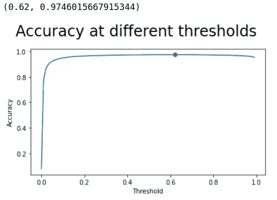

图片由 Vinayak 提供

上述函数为我们提供了最佳精度点和发生该点的阈值，该阈值可以简单地保存为模型的人工制品，并且在推断过程中，当我们想要获得单个标签的预测时，我们可以将它们的概率与该阈值进行比较，并获得离散结果来表示某个类别的存在/不存在。

然而，我们可以做得更好。

# 类别/标签级别阈值

实际上，准确性并不总是最好的评估标准。例如，假设世界上只有 1%的人是富人，预测每个人都是穷人会让你 99%准确，但这真的好吗？

不是吧？当您创建一个分类器时，如果存在严重的类不平衡，您会希望您的性能在所有类中都很好，而不仅仅是在数据集中占主导地位的一两个类。准确性不能告诉我们这样的信息。在这里，有其他度量，如`Precision`、`Recall/TPR`、`FPR`、`f1-score`等。变得非常有用。这篇文章并不打算深入研究这些指标，但让我们粗略地看一下，我将在最后提供良好的资源来深入研究每一个指标。

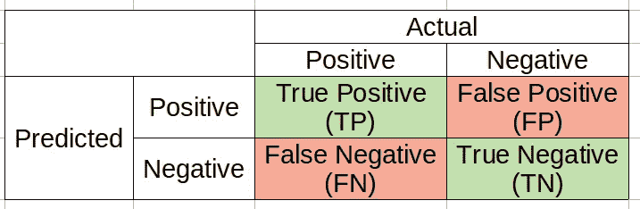

图片由 Vinayak 提供(混淆矩阵)

*   `Precision`:这个量基本上告诉你所有那些被预测为某种类型的例子，实际上有多少是那种类型的。如果我们看看上面的混淆矩阵，我们可以将精度定义为


图片由 Vinayak 提供

*   `Recall/TPR`:这个数量基本上指定分类器正确识别了多少个特定类别的样本。也简称为`True Positive Rate`或 TPR。它是由


图片由 Vinayak 提供

*   当我们定义一个分类器时，我们希望这两个值尽可能的高，最好是 1，但是它们之间有一种反比关系。因此，我们定义了一个度量标准，它找到了两者的最佳平衡点。这是 f1 分数，原则上是召回率和精确度之间的调和平均值，定义如下

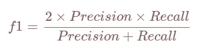

图片由 Vinayak 提供

*   `FPR`:假阳性率是被错误分类的阴性样本的数量。它是由

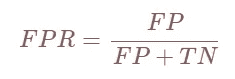

图片由 Vinayak 提供

对分类器的评估可以从几个方面进行。对一些人来说,`accuracy`仍然是评估的黄金标准；对于其他一些人来说，`f1-score`可能是确保分类器跨多个类别性能的重要数字。在许多情况下，`ROC`或接收器操作特性图可用于计算分类器性能。我们将使用所有三种技术评估我们的模型，以获得给定特定标准的最佳性能模型。

下面是我们用来训练模型的`PASCAL_2007`数据集的`bus`类别的 ROC 图

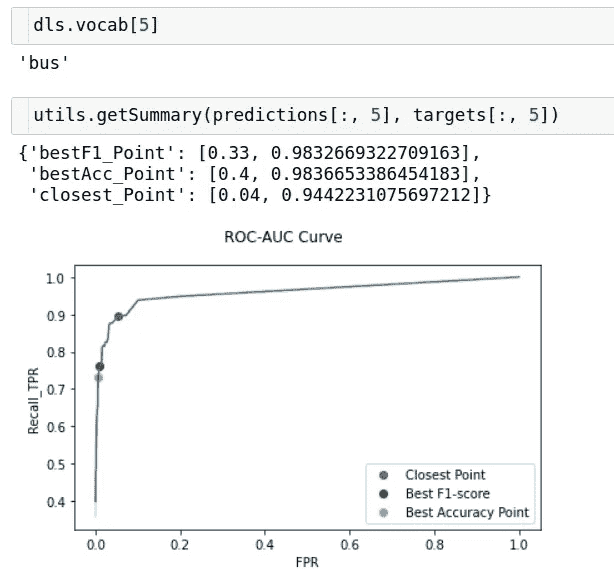

图片由 Vinayak 提供

X 轴表示 FPR，Y 轴表示召回/TPR。我们需要确定在不增加 FPR 的情况下 TPR 尽可能高的点。我们可以通过找到最接近`(0, 1)`点的点来解决这个问题，即 FPR 为 0 而 TPR 为 1。这显示在带有红点的曲线中。对于一个完美的分类器，我们应该有一个单位矩形类型的图，但实际上在大多数情况下，这两类的分布从来没有完全区分。

完成这项工作的完整代码会变得非常大，但可以在 GitHub 上找到，我已经在[参考资料部分](https://elisonsherton.github.io/fastbook/deep%20learning/2021/08/18/fastbook-multilabel-classification-1.html#references)附上了它。我将勾画出伪代码做这个局部阈值，然后最终的预测汇总。

> 1.从 fastai 学习者那里获得预测和目标
> 
> 2.分离出每个标签的预测和目标。fastai 预测的形状为“N_EXAMPLES x N_CLASSES ”,因此将它们分成 N _ CLASSES 个长度为“N_EXAMPLES”的向量。对目标也进行类似的操作。
> 
> 3.选择一系列阈值，并评估每个类别/标签的所有示例的指标精度、召回率、fpr、f1-得分，并构建 ROC-AUC 曲线。
> 
> 4.在您改变阈值的所有点中，选择最接近的点、最佳准确度和最佳 f1 得分点。记录您获得这些指标最佳值的每个点的阈值。
> 
> 5.使用从 4 中获得的每个类别的记录阈值，将概率分布转换为离散分布，并找到多标签分类器的总体精度。

如果我们要进行比较，对于每个类别，使用 bestAccuracy 策略的单个类别/标签的阈值调整使我们在准确性上比全局阈值略有提高，这也使我们在默认阈值 0.5 上有所提高，默认阈值 0.5 通常用于所有分类问题。

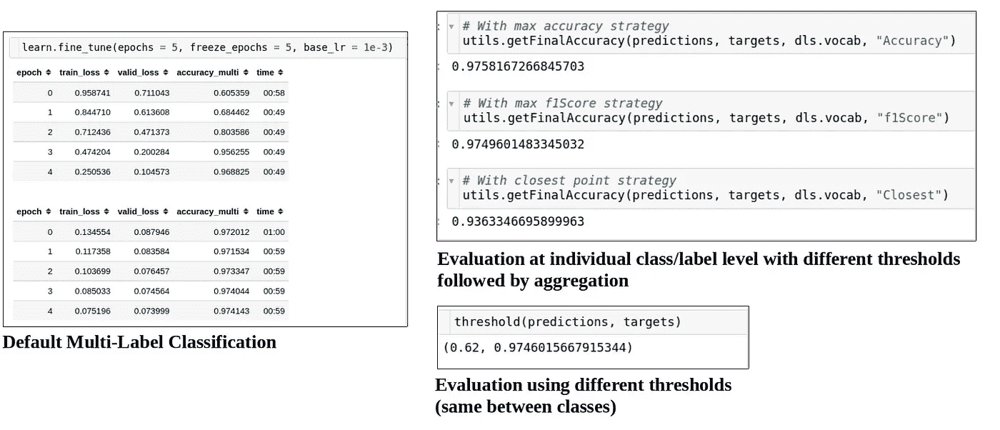

图片由 Vinayak 提供

# 结论

1.  多标签分类器(MLC)可以用多个类别/标签标记给定的数据点。
2.  MLC 中使用的激活是`sigmoid`而不是`softmax`。
3.  用于 MLC 的损失函数是`BinaryCrossEntropy`而不是`CrossEntropy`。
4.  一个好的阈值可以在获得更好/更差的 MLC 精度方面产生显著的差异。
5.  在模型评估过程中，准确性可能不是黄金标准，回忆/精度/f1 分数等指标将非常有用，尤其是在训练模型时存在类别不平衡的情况下。

我希望你喜欢阅读这篇博文！我很高兴在推特上与你联系。如果你有任何意见/建议/想法，欢迎在下面评论或在 Twitter 上联系我。

如果你喜欢你所读的，请随意查看[我在这里的其他帖子。](https://nayakvinayak95.medium.com/)

# 参考

1.  [wandb fastbook sessions 链接](https://www.youtube.com/watch?v=SfzNEz5ASAY)
2.  [在帖子](https://github.com/ElisonSherton/fastbook_sessions/tree/master/ch6MultiLabel)中创建的应用程序的 Github 代码
3.  [对评估指标的良好解释](/accuracy-precision-recall-or-f1-331fb37c5cb9)