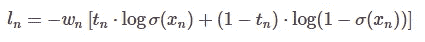

# 使用 PyTorch + HuggingFace 的 Transformers 和 W&B 进行跟踪的多标签情感分类

> 原文：<https://towardsdatascience.com/multi-label-emotion-classification-with-pytorch-huggingfaces-transformers-and-w-b-for-tracking-a060d817923?source=collection_archive---------6----------------------->

## [实践教程](https://towardsdatascience.com/tagged/hands-on-tutorials)

## 把拥抱脸和 W&B 的力量加入到你的 PyTorch 代码中！

[腾雅特](https://unsplash.com/@tengyart)在 [Unsplash](https://unsplash.com) 上的照片

# 介绍

自然语言处理(NLP)正在以前所未有的速度在工业 4.0 中大步前进，并以一种闪烁的速度前进。它被广泛用于将非结构化文本处理成各种商业案例的有意义的知识。它已经被用于多种任务，如分类、主题建模、文本生成、问答、推荐等。一种很少被提及的特殊分类是多标签分类。

多标签文本分类涉及预测给定文本的多个可能标签，不像*多类*分类，其仅具有来自“N”个可能类的单个输出，其中 N > 2。多标签文本分类是许多 ML 库中很少涉及的主题，对于某些任务，如日志度量等，您需要自己编写大部分代码。您还需要了解某些变通方法，以获得一些有意义的结果。

二元对多类对多标签分类。作者图片

我想做这个项目的一个关键原因是让我自己熟悉[Weights and bias(W&B)](https://wandb.ai)库，这个库和 [HuggingFace](https://huggingface.co) 库一起在我的技术 Twitter 上引起了热议。在 PyTorch 中使用多标签分类及其与 W & B 的集成方面，我没有找到很多好的参考资料。因此，我想整理一篇文章以方便参考。不要担心，我会在我们进行的过程中讨论什么是 W & B，你会很幸运地知道，有了这个令人敬畏的图书馆，我们的生活变得多么方便！在本文中，我们将讨论以下内容:

1.  与…一起工作🤗用于加载数据集的数据集库
2.  使用构建经典 PyTorch 训练器🤗变形金刚图书馆的 SqueezeBERT 模型
3.  用 PyTorch 集成 W&B 库
4.  用🧹w & b 扫描执行超参数扫描

所以，不要浪费任何时间，让我们开始吧！

# 数据集使用🤗数据集

HuggingFace 的网站有一个几乎所有类型的 NLP 任务的巨大数据集集合！它还允许用户通过使用 [Streamlit](https://streamlit.io/) 制作的内置数据集可视化工具来可视化数据集的某些方面。在浏览数据集列表时，一个特殊的多标签分类引起了我的注意:<https://huggingface.co/datasets/go_emotions>**。其摘要指出:**

> **GoEmotions 数据集包含 58k 条精心策划的 Reddit 评论，标记为 27 种情感类别或中性。包括原始数据以及具有预定义训练/val/测试分割的数据集的较小简化版本。**

**在他们的可视化工具上浏览了这个数据集中的几个例子后，我意识到这是一个极其重要的数据集，因为很难找到超过 5-6 种情绪的情绪分类器数据集。但是在这里，我们有 27 种情绪被分配，有非常罕见和接近的情绪，如失望、不赞成、悲伤、悔恨、悲伤等。在典型的数据集中，检测如此接近的情绪通常是困难的。这让我明白这是一个非常好的数据集，可以在许多涉及文本分析的应用程序中扩展使用。**

****

**数据集中的情感标签列表。作者图片**

# **权重和偏差介绍(W&B)**

**日志度量一直是许多数据科学家和 AI/ML 爱好者头疼的问题。编写计算指标、存储指标和绘制图表的代码是一项非常普通的任务。此外，当您在一个专业的环境中工作时，您不希望您的客户或团队领导浏览整个代码来找到那些图。因此，您必须截取屏幕截图，然后准备一份单独的报告或演示文稿来分享您的结果。想象一下你花在所有这些步骤上的时间。**

**值得庆幸的是，有人听到了我们的抱怨和咆哮，并决定建立一个库，使所有这些自动化，并在组织我们的代码、数据、指标和运行方面走得更远，比我们组织我们的卧室更好👀。欢迎，重量和偏见(W&B)🙌。**

**W&B 允许我们使用几行代码实时监控我们的数据、代码、超参数、指标和培训。它提供了一个直观的仪表板，并与 PyTorch、Tensorflow、fast.ai、Keras、JAX 等流行的库集成。它允许我们以更有组织的方式找到最好的模型，而不是使用打印语句和手工记录。首先，你需要在他们的[网站](https://wandb.ai/login?signup=true)上注册一个账户，然后你的项目跟踪就可以在你的账户上使用了！**

# **好了，理论讲够了，我们来编码吧！**

****

**这是你对吗？来源:男高音**

**现在，让我们用编码来弄脏我们的手。我使用 PyTorch 是因为它简单易懂，并且能够从头开始构建东西，这让我感觉更舒服。我已经在 Google Colab 上编码了整个东西，所以我只需要做一些额外的安装。但是，如果您在本地运行它，请注意下面的导入，您的系统中可能没有安装这些导入。然而，我强烈建议你使用 Google Colab，因为它允许你在网络上进行深度学习实验，而无需在笔记本电脑上加载任何负载。**

> **从这一点开始，这篇文章可能会有点长，因为我将同时讨论 W & B 和多标签分类。所以，在我们踏上这个奇妙的旅程时，请耐心等待！🙈**

****全部代码在我的资源库** [**这里**](https://github.com/arghyadeep99/Multi-label-Emotion-Classification) **都有。****

## **1.安装依赖项⏬**

**我们可以使用以下命令在 Google Colab 中进行必要的安装:**

**`!pip3 install datasets transformers -q`**

**`!pip3 install wandb --upgrade`**

**现在，我们可以使用以下方式登录我们的 wandb 帐户:**

**`import wandb`**

**`wandb.login()`**

**系统会提示您单击一个链接，复制您的授权令牌并将其粘贴到文本框中，以将您的项目与您的 WandB 帐户连接起来。**

## **2.必要的进口🚀**

## **3.播种一切可复制性！🌱**

**播种是一个非常重要的概念，我经常在许多中等代码教程中发现缺失。我发现帮助读者重现和匹配结果是一个重要的实践。所以，让我们播种一切吧！**

## **4.定义超参数扫描🧹的扫描配置**

**为了执行超参数调整，我们从定义的列表中尝试不同的配置，然后尝试在我们的主训练循环中运行它们，并手动记录每个组合的结果，以找到最佳的超参数集。告别这种中世纪(就 AI 进步而言)的做法，用超参数横扫🧹做同样的事情！我们将定义一组我们想要使用的超参数，并设置它们可能的值。我们还定义了我们想要最大化或最小化的指标。**

**最后，我们定义了一个扫描 ID，它将使用不同的超参数组合对训练函数进行扫描。**

## **5.从加载数据集🤗数据集和一次性编码**

****

**train.head()输出。作者图片**

**我们可以看到数据集有与每个样本相关联的文本、id 和标签。然而，为了将数据输入到我们的模型中，我们需要执行一次热编码，它有一个非常常见的代码:**

## **6.定义 PyTorch 数据集**

**我们没有在类中定义记号赋予器，而是将其作为参数传递，以便于使用不同的记号赋予器进行实验。我们按照定义 PyTorch 数据集类的标准方式来定义 GoEmotionsDataset 类，以指示如何加载和处理数据集。**

**在我们的例子中，我们获取输入文本，将其标记化，然后返回通过标记化获得的标记 id 和注意掩码。令牌 id 只是模型的输入序列的数字表示，而注意掩码用于指示模型应该注意哪些段。**

## **7.使用神经网络定义分类器模型。组件**

**这里，我们将 dropout probability (do_prob)作为一个超参数，将由 W&B 处理。其余的代码非常标准:用所需的架构初始化模型，并定义向前传递。**

## **8.定义返回数据集、数据加载器和模型的函数**

**对于我们的超参数跟踪和 W&B 的集成，重要的是我们大量使用函数编程来确保我们成功地跨函数传递所有对象，并且它们都可以从我们稍后将定义的主训练器函数中调用。**

**在这里，我们首先定义我们的 **SqueezeBERT** 记号化器(与 bert-uncased 相比非常快，性能几乎相似),然后定义 3 个函数来返回数据集、数据加载器和我们的模型。所有这些都遵循标准 PyTorch 管道。同样，将它们定义为函数的主要动机是使我们能够方便地传递我们的超参数，而不是将它们硬编码在模型定义本身中。**

## **9.定义要记录的优化程序、调度程序、损失函数和度量**

**我从 [Abhishek Thakur 的](https://www.youtube.com/c/AbhishekThakurAbhi) [知识库](https://github.com/abhishekkrthakur/tez/blob/main/examples/text_classification/binary.py)中获取了优化器和调度器代码，用于使用 BERT 进行情感分类。**

****优化器功能:****

****调度程序功能:****

****损失函数或准则:****

**对于损失函数，我们选择了具有 Logits 损失的**二元交叉熵(BCE)**。BCE **将每个预测概率与实际类输出进行比较，实际类输出可以是 0 或 1** 。然后，它根据与期望值的距离计算惩罚概率的分数。这意味着离实际值有多近或多远。当与 Sigmoid 层结合时，会在 PyTorch 中产生 BCEWithLogitsLoss()。也可以使用 MultiLabelSoftMarginLoss()来解决多标签问题。**

****

**具有 Logits 损失函数的 BCE**

****要记录的度量:****

**[ROC-AUC](https://www.scikit-yb.org/en/latest/api/classifier/rocauc.html#:~:text=A%20ROCAUC%20(Receiver%20Operating%20Characteristic,the%20classifier's%20sensitivity%20and%20specificity.) 评分是衡量我们多类分类性能的好方法。但是，通过对每个目标分别应用它，可以将其推广到多标签场景。然而，这对于我们的大脑来说太多了，因此，我们可以简单地使用微 AUC。PyTorch 中用于这种多标签分类的一个巧妙技巧是使用 ravel()函数展开目标和标签，然后我们应用 micro AUC 函数。**

## **10.定义培训和验证步骤功能**

**我再次从 Abhishek Thakur 的知识库中提取了这些代码片段，并根据我的问题陈述对它们进行了修改:**

## **11.定义培训师职能⭐️**

**为了将所有内容整合在一起，我们现在将定义执行培训的培训师职能。在我们的分类器模型中，我们将使用 SqueezeBERT 作为 BERT 层。这个教练功能也是 W&B 魔法发生的地方！**

**你在这里观察到一些新的东西吗？是的，旺德贝线！您可以看到，我们在开始时使用了上下文管理器和 with **wandb.init()** 语句来初始化运行。训练功能的每次执行是一次运行。我们将扫描配置传递给训练器函数，该函数用于设置不同的超参数，如 batch_size、dropout、epochs 等。另一个基于 wandb 的行是 **wandb.watch()** ，它用于观察模型的梯度，以及它们如何随着训练而演变。这有助于尽可能提供更多的可解释性。**

**wandb 的下一次出现在 **wandb.log()** 中，它帮助我们记录相关参数，我们希望看到这些参数随着训练的进行而变化。在我们的案例中，我们记录了时期、训练和验证损失以及 AUC 分数。最后，为了开始不同超参数组合的扫描，我们将调用`wandb.agent()`，在这里我们传递配置和训练器函数的 sweep_id。我们还传递 count=6，以限制我们想要执行的运行次数。这仅在进行随机搜索而非网格搜索时使用。一旦训练开始，你可以在 W & B 宏伟的仪表盘中实时监控训练！🤌🏻**

# **跳上你的 W&B 仪表板，看看神奇的展开！**

****

**W&B 仪表板的概述。作者图片**

**在这里，您可以看到扫掠中的每个管路都有一个唯一的名称，您可以轻松地对其进行重命名或删除。您还会注意到参数对于我们正在监控的指标的重要性(此处为 AUC 得分)。这是一个极其重要的特征，因为它告诉我们哪些超参数对我们的分数影响最大。在我们的例子中，我们可以看到辍学对 AUC 分数有很大的影响。当我们想要设置最佳超参数设置时，这是一条需要注意的关键信息。当我们向下滚动时，我们看到了扫描图，它显示了每个超参数组合如何产生特定的 AUC 分数。这是 W&B 在 Sweeps 中提供的我特别喜欢的图表类型！**

****

**扫描图表。太酷了！作者图片**

**这里，图表清楚地向我显示了产生最佳 AUC 分数的组合(黄色图)。如果你渴望用老派的方式查看数据，你还可以得到一个不错的表格格式！**

****

**扫地台。作者图片**

**除此之外，我们还获得了我们记录的度量的图表，并获得了所有不同运行的比较图。您甚至可以关闭某些运行的可视化，以比较其余的期望运行！**

****

**其他度量图。作者图片**

**如果您已经被 4-5 行 wandb 所能做的事情弄得不知所措，请耐心等待，因为我将向您展示更多内容！还记得 **wandb.watch(型号)**那条线吗？你认为我们为什么要观察这个模型？嗯，你可以去每次跑步，看看在训练中模型的梯度是什么样的！这对模型可解释性和可解释性研究人员来说极其重要！**

****

**模型梯度演化。作者图片**

**但就这样了吗？再说一次，不！您甚至可以使用 W&B 观察系统指标，它显示各种图表，如内存使用情况、CPU/GPU 使用情况、温度、磁盘使用情况等。**

****

**系统指标图。作者图片**

**如果你认为这些是你能绘制的唯一的库驱动图，你就错了。您可以混合匹配您记录的任何参数，然后轻松地绘制它们，以查看它们的比较。您可以根据需要灵活地制作图表，甚至使用 W&B 生成报告！然而，与团队共享它需要团队的 *W & B。***

**它还记录它在训练脚本中看到的所有输出，以及通过版本控制记录代码和数据集。不仅如此，它还根据训练脚本自己生成一个 requirements.txt 文件。所以，现在你甚至不需要 pip 冻结，你可以直接下载这个文件，并与他人分享！**

****

**作者在黑白图像中自动生成的文件**

**wandb 库不断增加越来越多的特性，如表格等。因为这篇文章已经太长了，所以我把它留到以后讨论。因此，长话短说，训练信息现在在 W&B 的仪表板上有一个漂亮的庇护所，这将使我们能够随时复制实验。这样，我们现在可以使用最佳超参数组合来训练模型，然后使用派生的模型进行推理。从我的训练中，我能够得到一个非常好的模型，AUC 分数为 0.9459。使用该模型测试非常稳健的 AUC 分数，其中 27/28 个类别的标签式 AUC 分数大于 0.8！对于如此复杂的数据集来说，这的确是一个非常令人印象深刻的分类器。**

****

**标签式 AUC-ROC 评分。作者图片**

# **结论**

****

**来源:男高音**

**唷，我们终于可以结束了！本教程展示了如何在多标签数据集上应用 SqueezeBERT，该数据集包含超过 50K 条评论和 28 个类。使用 PyTorch 和变形金刚库。我们还能够通过 wandb 库实时监控我们的培训。在公开您的项目后，您还可以通过共享“公开”项目链接与他人共享您的整个仪表板！这是我的仪表盘[链接](https://wandb.ai/arghyadeep/bhaavnaye/sweeps/sjgmegk5)。在未来，我们可以使用 Streamlit 部署这个多标签情感分类器，并在此基础上构建一个 web 服务！**

****的全部代码可以在我的资源库** [**这里**](https://github.com/arghyadeep99/Multi-label-Emotion-Classification) **中找到。****

**感谢您的耐心让我们走到这一步！如果你想了解更多关于 wandb 库和 HuggingFace 库的信息，我已经把它们链接到下面了，看看吧！**

**<https://wandb.ai>  <https://docs.wandb.com>  <https://huggingface.co>  <https://www.youtube.com/c/AbhishekThakurAbhi>  

我看得出你是个有文化的人，能走到这一步！我很高兴你能走到这一步！别忘了关注我更多这样的 ML 相关文章！查看我的[网站](https://www.arghyadeepdas.me/)，关注我的 [LinkedIn](https://www.linkedin.com/in/arghyadeep-das/) 、 [GitHub](https://github.com/arghyadeep99) 和 [Instagram](https://www.instagram.com/third_root_of_quadratic_eqn/) ！✨**