# AWS Sagemaker | MLOPS | Pytorch 中的多模型部署

> 原文：<https://towardsdatascience.com/multi-model-deployment-in-aws-sagemaker-mlops-pytorch-baf0fa08be42?source=collection_archive---------12----------------------->

如果你曾经部署过一个计算繁重的人工智能模型，你可能知道它的部署价格。不一定是 AI 模型；它可以是在生产中全天候运行的任何模型。

solébikes 在 [Unsplash](https://unsplash.com?utm_source=medium&utm_medium=referral) 上拍摄的照片

我生产的 pytorch 型号很少，不管我使用什么平台，随着时间的推移，它都非常昂贵。所以我决定降低模型部署的成本。我发现 AWS sagemaker 有一个多模型部署选项。然而，这些文档并不是非常友好，而且经常令人困惑。所以我决定在这篇文章中多解释一些。

如果您正在通读这篇文章，我假设您知道 AWS sagemaker，并且能够在平台中部署模型。如果没有，请参考这篇文章来详细了解一下。

## 设置时需要的东西

1.  具有 sagemaker 访问权限的 AWS 帐户
2.  ECR 码头集装箱入口
3.  Sagemaker 笔记本或本地 jupyter 笔记本环境

## 多模型如何工作？

当您使用 sagemaker 部署单个模型时，它将启动一个实例，启动一个 docker 容器，从 S3 桶中加载模型的 tar 文件，最后从创建的代码中创建一个端点。

1.  当一个模型被调用时，它将请求路由到部署的端点后面的实例。
2.  每个多模型实例包含处理所有请求的容器。传入的请求被路由到容器。
3.  当请求到达容器时，它将模型下载到该实例上的容器内存中。
4.  如果内存不足以容纳多个模型，它将卸载第一个或未使用的模型。

对于每个模型类型和库，多模型的底层 docker 容器和模型是不同的。关键是当有多个模型时，它会根据端点请求将模型加载到容器内存中。

不同类型的多模型部署:

1.  **使用预制集装箱**
2.  **自定义集装箱相似输入**
3.  **带有其他类型输入的定制容器——这通常不包含在 AWS 文档中。**

# 使用预制容器—不复杂

只有当您有一个已经由 AWS 预构建的容器时，这种类型的方法才有帮助。这个[链接](https://docs.aws.amazon.com/sagemaker/latest/dg/pre-built-containers-frameworks-deep-learning.html)包含可以在 sagemaker 中使用的容器列表。AWS 基于 xgboost 模型打造了一款笔记本。此链接详细介绍了所使用的[代码](https://github.com/aws/amazon-sagemaker-examples/blob/master/advanced_functionality/multi_model_xgboost_home_value/xgboost_multi_model_endpoint_home_value.ipynb)。

1.  从 sagemaker 中检索现有容器
2.  准备和培训每个模型

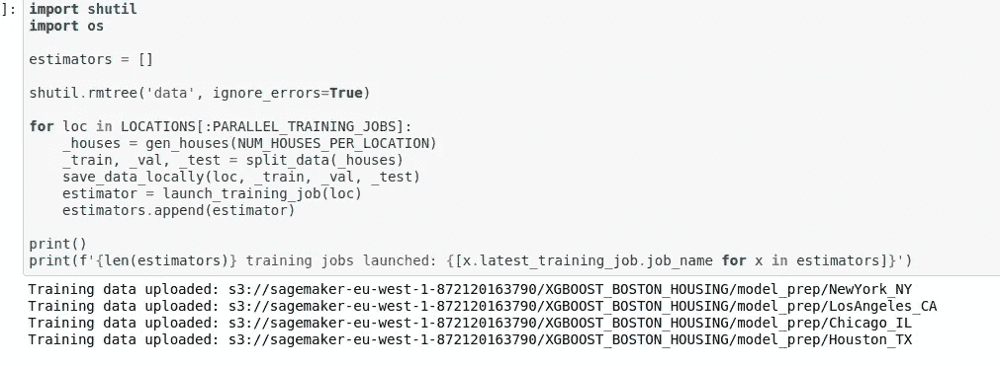

3.使用 sagemaker 内置调用创建多数据模型端点。

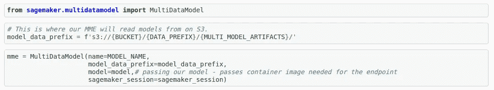

点 S3 数据和训练好的模型

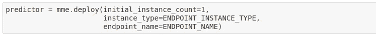

部署多个模型

4.最后，下面是从 API 调用中调用模型的代码。

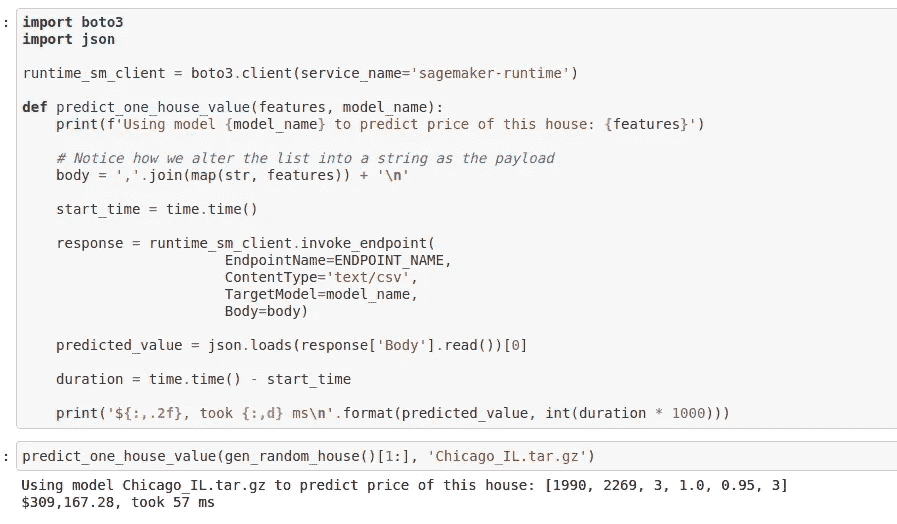

优点/缺点:

1.  除了数据准备和模型训练，多模型部署更加简单。
2.  如果你仔细看看代码，你会发现我们是在用不同的名字部署相同类型的模型。这在大多数情况下是没有用的。
3.  相似类型的输入被传递给不同的模型进行预测。如果你想节约成本，一般情况下是不会的。
4.  容器已经预制好了。所以我们不能对它做任何定制。

# 自定义容器类似输入处理

上一节提到的方法对我们大多数人都不起作用。Sagemaker 提供了一个定制容器的选项。这是你可以定制的[容器列表](https://github.com/aws/deep-learning-containers/blob/master/available_images.md)。在这种方法中，您可以部署多个模型，并根据需要定制容器。

然而，它不像前一个那样直截了当。它需要一些码头集装箱的工作。在幕后，sagemaker 使用开源工具[多模型服务器](https://github.com/awslabs/multi-model-server)。让我带你经历每一步。

作为第一步，我们需要有一个创建定制容器的模型和理由。很多时候，容器中构建的包不够用，会和其他包冲突。

1.  创建一个包含所需包的 docker 文件

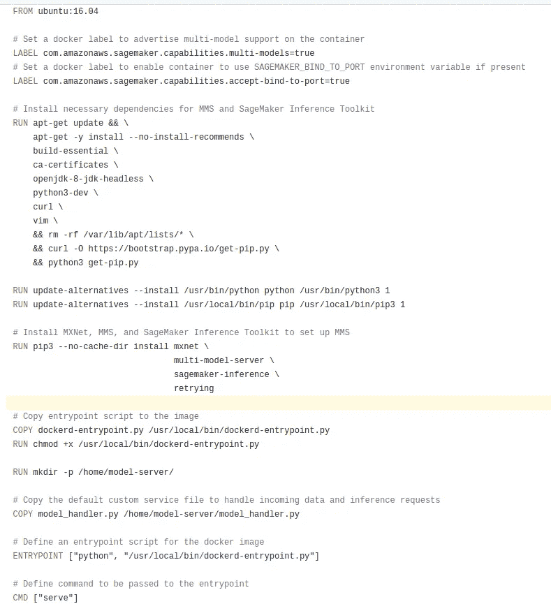

2.如果你注意到，有一个 python 入口点。这个入口点启动多模型服务器流程，该流程被包装在 sagemaker 中。

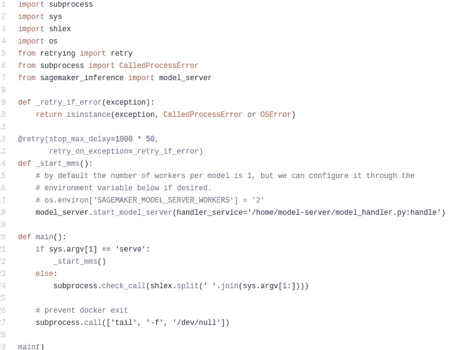

3.下一步，将多个模型上传到 S3 存储桶中，并作为常规流程创建端点。

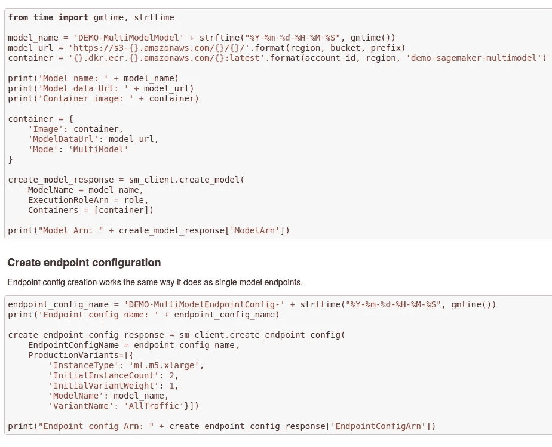

如果您看到这个[代码](https://github.com/aws/amazon-sagemaker-examples/blob/master/advanced_functionality/multi_model_bring_your_own/multi_model_endpoint_bring_your_own.ipynb)，您可能已经注意到模型是用 mxnet 创建的。这并不是非常流行，而且需要对 python 文件进行不同的更改。

从我的经验来看，我尝试过这种方法，部署模型有点乱。

优点/缺点:

1.  上面提到的例子是在 mxnet 上。PyTorch/TensorFlow 没有很好的例子。
2.  它仍然可以处理相似类型的输入。例如，您不能为另一个模型传递文本和图像。
3.  当我们试图部署多个模型时，这个过程有点混乱。

# 具有不同输入处理的自定义容器

由于提到的两个选项都有一些缺点，我决定为我的项目做一点不同的选择。我不得不部署微调的 GPT-2 和巴特-大-cnn 模型。对于这个例子，我将使用预先训练的模型作为例子。

这两个预先训练的模型都可以作为拥抱脸模型管道的一部分。下面是我为简化和部署多个模型所遵循的步骤。

1.  在这里，我们正在更新 sagemaker 的预构建容器，并根据我们的需要定制容器。

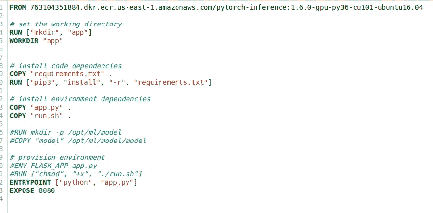

在第一行中，我们从 sagemaker 导入现有的容器。然后我们向它添加所需的包并对其进行定制。最后，我们将向 docker 容器添加一个入口点。

2.将所需的模型上传到 S3 存储桶。在这里，我们必须将这两个模型合并到 model.tar.gz 文件中。

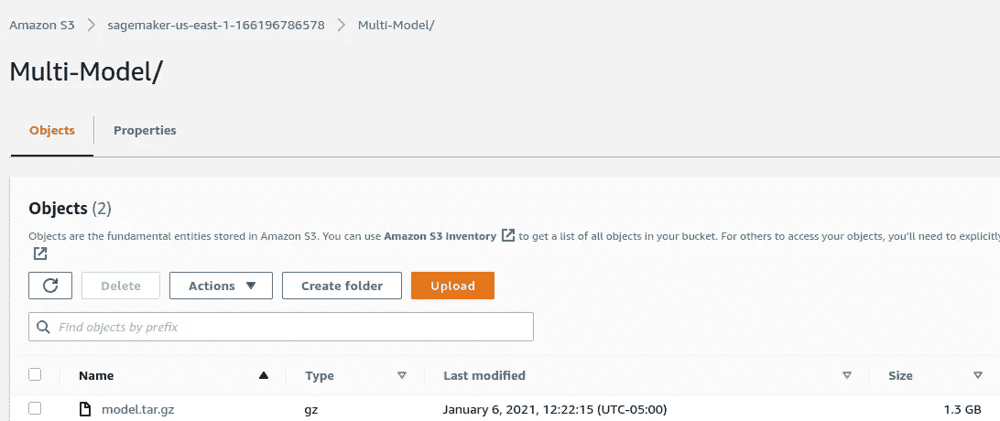

3.现在，我们需要 app.py，来自 docker 容器的主入口点。它基本上是一个 flask API。

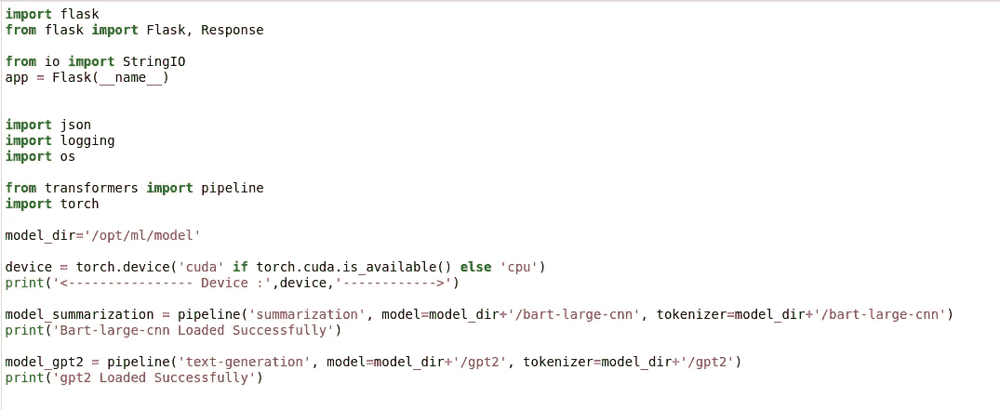

如果你看到上面的截图，我们使用两种不同的拥抱面部管道，创建不同的模型。为了调用模型，我们需要指定模型类型。在函数 run_model 中，我们会提到使用哪个模型。这里流程提到了模型类型。

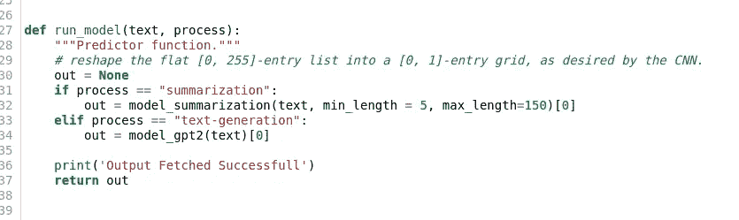

4.其余的代码将不会花哨或任何不同。我们必须在大型服务器上部署这个模型。我使用 ml.c5.2xlarge 在一台服务器上部署这两种模型。当我们调用模型时，我们需要指定模型类型和输入。

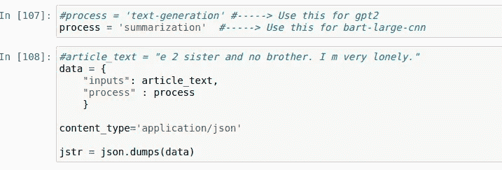

准备端点的输入

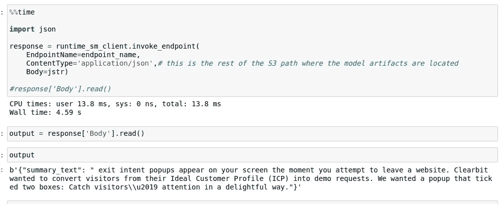

汇总模型的输出

从上面的截图可以看出，我们可以通过在端点中传递模型类型(流程)来调用不同的模型。

优点/缺点:

1.  我们可以为不同的模型传递不同类型的输入。输入不再限制我们。
2.  模型操作过程是干净的，可以很容易地开发和维护。
3.  部署这两种型号可以节省大量资金。

# 获取代码

*请订阅我的* [***简讯***](https://makemoneywithcode.substack.com/welcome) *获取我的文章和其他更新的免费工作代码。*