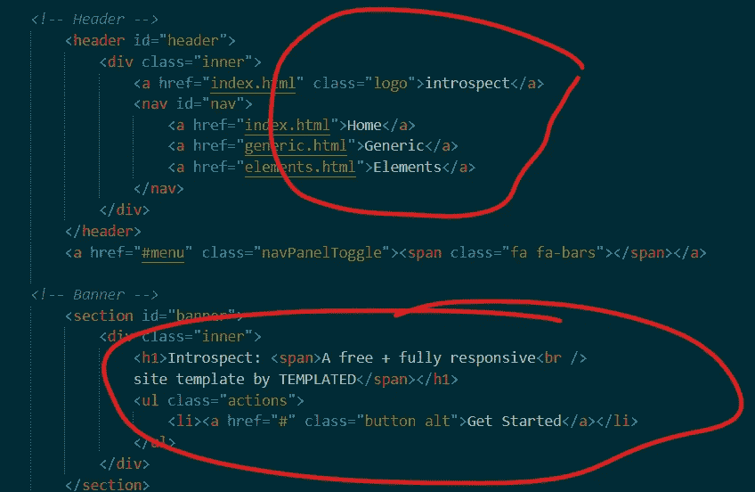
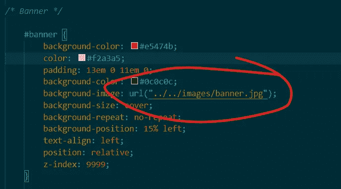
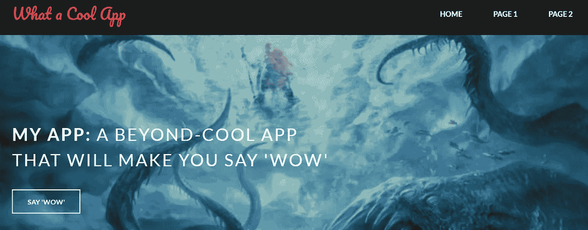
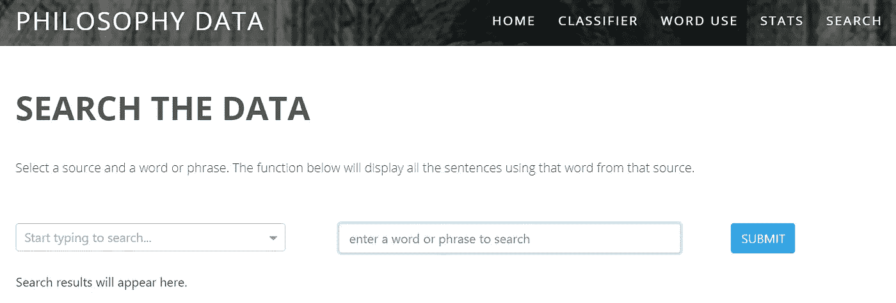
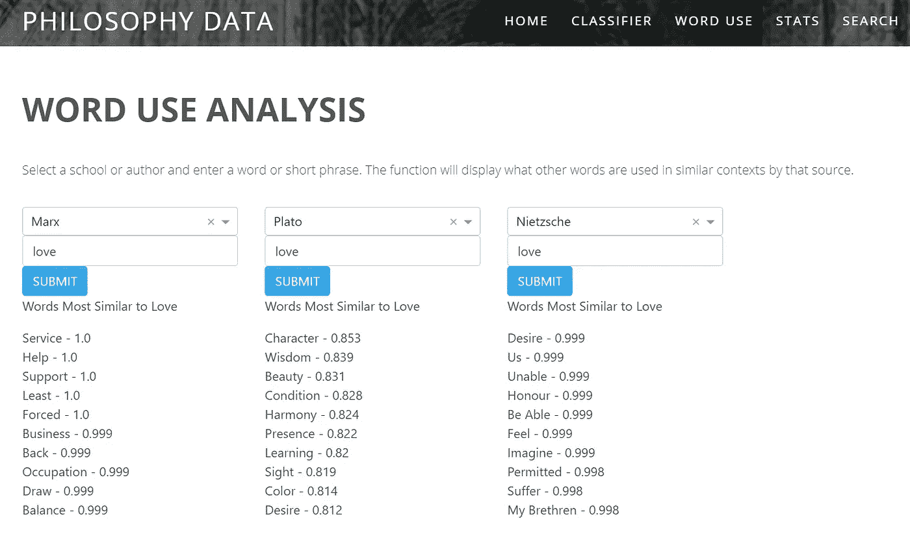

# 通过 Heroku 和 HTML 实现“多页”应用

> 原文：<https://towardsdatascience.com/multi-page-apps-done-right-via-heroku-4537cd196f2?source=collection_archive---------24----------------------->


多梅尼科·洛亚在 [Unsplash](https://unsplash.com?utm_source=medium&utm_medium=referral) 上拍摄的照片

比方说，你想建立一个有多个不同页面的 Heroku web 应用程序——也许你有一些不同的可视化效果，你想让人们能够与之交互，但这并不完全适合一个页面。但是，当你在 Dash 或其他软件中构建一个普通的多页面应用程序时，你可能会发现你使用了比你真正需要的更多的内存，并且整个界面可能没有你想要的那么漂亮。

所以这篇文章会帮你解决两个相关的问题。首先，Heroku 自由层帐户在内存和内存块大小上有一些非常实际的限制，这可能会阻止你的应用程序一次做太多事情。第二，在 Dash 或 Flask 中使用 Python 代码设计应用程序可能有点痛苦。毕竟，这些工具必须同时完成应用程序*和*的实际工作。他们倾向于关注第一项任务，而让第二项任务变得更加棘手或混乱。

我将带大家了解的解决方案是托管多个独立的 Heroku 应用程序(不要担心，这不会让你付出任何额外的代价),并使用 HTML 在几个相连的网页上访问它们。这使我们能够削减内存和 slug 大小的要求，因为我们可以在我们不同的应用程序之间分割这些。这也意味着我们可以使用 HTML 和 CSS 的所有工具来流畅轻松地设计我们的应用程序。要查看这个解决方案的运行情况，您可以在[philosophydata.com](http://philosophydata.com/)查看我的实现。

要跟进，你需要(1)一个功能正常的 Heroku 应用，(2)愿意学习一些超级基础的 HTML，(3)一个 Github 账户。

这个过程有三个核心步骤。创建你的网站。在您的网站中显示您的应用程序
3。托管你的网站

所以事不宜迟，我们开始吧！

# **1。创建您的网站**

这可能是最恐怖的一步。你刚刚建立了一个完整的应用程序，你真的需要建立一个网站吗？你可能甚至不知道任何 HTML 或 CSS——这将是一场噩梦！

别害怕，我的朋友。这会花费你更多的时间，但这比尝试在 Dash 中设计你的应用要容易得多，它给你一个学习新技能的机会，并且它会给你带来更多完美的结果。

这样做的关键是找到一个你喜欢的现有 HTML 模板，并简单地根据你的需要修改它。你可以在 templated.co[找到一个很棒的模板库。](https://templated.co/)


这可能是你的应用程序

一旦你找到一个你喜欢的，只需下载带有模板的文件夹。如果你打开它，你会发现一些 HTML 页面，一个保存相关 CSS 和 Javascript 的 assets 文件夹(所有东西都已经为移动设备进行了样式化和优化，没有必要强调)，以及一个保存图片等的文件夹。

此时，你只需要在空白处填入你喜欢的信息。打开 index.html 文件，将标题更改为您喜欢的标题，并给标签添加新标签。



您的可能看起来略有不同，但这些是您想要更改的部分

好了，现在你已经修改了标题和标签。要更改登录页面图像，您需要进入 style.css 文件(有时也称为 main.css)并找到它引用当前横幅图像的位置。用你选择的图像替换它，你就可以开始了。



以下是 5 分钟修改代码中一些单词的结果:



像冰一样凉。哇！

你可能想用更具描述性的标题重新标记一些 html 文件，一般来说只是浏览和添加新的页面，弄乱图像，诸如此类的事情。要在进行过程中查看更改，请在浏览器中打开 HTML 文件并刷新页面。有很多尝试和错误，但设计是有趣的！

我把实验留给你，但是如果你遇到任何困难，请随时联系我。现在让我们来看看好东西:在网页中设置你的应用程序。

# 2.通过 HTML 显示您的应用

如果你已经在 Heroku 上托管了你的应用，那么你也有了一个链接。从这里开始，通过 HTML 将应用程序的结果显示为页面中的页面是一件简单的事情。

以下是 HTML 的外观:

```
<iframe src=”YOUR HEROKU URL", width=100%, height=500></iframe>
```

你当然可以根据自己的需要调整宽度和高度。点击[此处](https://www.w3schools.com/tags/tag_iframe.asp)深入了解 iframe。

结果将是这样的:



HTML & CSS 设置标签和标题，但是搜索栏和按钮是 Heroku 应用程序

请注意，Heroku 应用程序本身根本不需要任何样式。但是它看起来仍然非常干净和清晰，因为 CSS，一种为设计风格而设计的语言*，正在做所有的工作。*

此时另一个很酷的技巧是多次显示同一个应用程序，按列或行排列。这意味着一个相对简单的应用程序可以在一个页面上多次使用，从而可以对输出进行比较。

这里有一个例子。首先是 HTML:

```
# adjusting the width makes these display as three columns, with some space between them<iframe src=”https://w2v-data.herokuapp.com/", width=300, height=450, scrolling=’no’></iframe><iframe src=”https://w2v-data.herokuapp.com/", width=300, height=450, scrolling=’no’></iframe><iframe src=”https://w2v-data.herokuapp.com/", width=300, height=450, scrolling=’no’></iframe>
```

然后结果是:



该应用程序返回指定作者和单词的单词向量相似性结果；有三个栏目，你可以比较三个不同的作者。

现在您的工具箱中已经有了这个工具，您可以在任意多个选项卡上使用它。这不应该占用你的应用程序的内存，因为每个应用程序都托管在一个单独的 dyno 上，而一个常规的多页面应用程序必须在一个 dyno 上保存所有的应用程序。我的实现能够托管 4 个不同的应用程序，有时在一个网页上可以托管三倍，同时永远不会突破 Heroku 50%的内存限制。使用通常的多页面方法，我很难加载多个应用程序。

现在我们有了一个漂亮的网站。让我们看看如何让全世界都知道这个。

# 3.托管您的网站

有许多托管服务，但有一个简单的是 Github Pages。每个 Github 帐户都可以免费托管一个网页。

要设置它，首先创建一个名为 <username>.github.io 的 repo。</username>

```
git clone [https://github.com/*username*/*username*.github.io](https://github.com/username/username.github.io)
```

现在你有你的网站回购，你可以复制所有你一直在工作的文件，添加它们，并提交更改。

Github 会看到你创建了一个格式为 <username>.github.io 的 repo，并会自动寻找一个 index.html 文件作为网站托管。这很像 Github 让你用自己的用户名创建一个 repo 来为你的页面设置一个 readme。</username>

一旦你建立了回购，你基本上就完成了！干得好！如果你想添加最后一层润色，你可以为你的站点设置一个自定义域名，这样 URL 就不会指向 github.io 名称。这很容易做到，一旦你买了你想要的域名，你就可以按照[这里](https://docs.github.com/en/github/working-with-github-pages/managing-a-custom-domain-for-your-github-pages-site)的步骤来设置它。

现在你有了一个漂亮的多页面应用程序，具有出色的造型和低内存使用。精彩！

让我知道这是否有帮助，或者如果你遇到任何困难，我很乐意帮忙。关于我自己的 Github 网站是如何建立的，查看这里的回购。