# 使用机器学习和自然语言处理的多页文档分类

> 原文：<https://towardsdatascience.com/multi-page-document-classification-using-machine-learning-and-nlp-ba6151405c03?source=collection_archive---------0----------------------->

## 一种对具有不同变化形状、文本和页面大小的文档进行分类的方法。

来源:https://unsplash.com/photos/5cFwQ-WMcJU

本文描述了一种新颖的**多页文档分类**解决方案，它利用高级机器学习和文本分析来解决抵押贷款行业的一个主要挑战。

# 摘要

即使在今天的技术时代，大部分业务都是使用文档完成的，涉及的文书工作数量会因行业而异。这些行业中的许多需要通过**扫描文档图像** ( *通常包含不可选择的文本*)来获得关键索引字段的信息，以操作他们的日常任务。

为了实现这一点，第一个主要任务是索引不同类型的文档，这有助于从各种复杂的文档中提取信息和元数据。这篇博文将展示如何利用*高级机器学习和 NLP 技术*来解决这个难题的主要部分，正式名称为**文档分类。**

# 介绍

在**抵押贷款行业**，不同的公司执行**数千人的抵押贷款审核**。

每个单独的审计都是针对各种文件进行的，这些文件作为一个捆绑包提交，称为**贷款包**。一个包是扫描页面的组合，可以从**(100–400 ~)页**变化。包内有多个子组件，可能由**(1–30 ~)页**组成。这些子组件被称为**文档**或**文档类别**。下表直观地说明了这一点。

第二行代表一个包，数字显示该包中存在的有序页面。第三行显示包中不同种类文档的出现。

## 背景和问题陈述

传统上，在评估贷款审计时，**文档分类**是人工工作的主要部分之一**。**抵押贷款公司大多将这项工作外包给第三方 BPO 公司，这些公司通过使用手动或部分自动化的分类技术(即规则引擎、模板匹配)来执行这项任务。当前实现所面临的根本问题是业务流程外包( **BPO** )人员必须手动查找和分类包中存在的文档。

尽管很少有第三方公司使用关键字搜索、正则表达式等来实现某种程度的自动化。这种解决方案的准确性和鲁棒性是有问题的，并且它们的人工工作量减少仍然不令人满意。 ***关键字搜索和正则表达式*** 意味着这些解决方案需要考虑所呈现的每个新文档或文档变体，并且还需要为此添加规则。这本身就变成了手工操作，只能实现部分自动化。系统仍有可能将文档类标识为“ **Doc** **A** ”，但实际上它是“ **Doc** **B** ”，因为两者中存在共同的规则。此外，身份识别也没有确定性。通常情况下，仍然需要手动验证。

有几百种文档类型，BPO 人员需要有一个“ ***的知识库，知道某个文档是什么样子，同一文档有哪些不同的变体？”，*** 以便对文档进行分类。最重要的是，如果人工工作太多，人为错误往往会增加。

## 目标

> 文档分类解决方案应该能够显著减少人工工作量。它应该在最少人工干预的情况下实现更高水平的准确性和自动化

我们将在这一系列博客中讨论的解决方法不仅限于**抵押贷款**行业，它可以应用于任何需要扫描文档图像并对此类文档进行分类的地方。几个可能的行业有 ***金融机构、学术界、研究机构、零售店***

# 文件的特点

为了做一个解决方案管道，第一步就是要知道什么是数据，它的不同特征是什么。由于我们一直在抵押贷款领域工作，我们将定义我们在抵押贷款行业中处理的数据的特征。

在一个*包中，*有许多类型的页面，但是一般来说，这些可以分为三种类型:

**结构化|** 一致的表单和模板

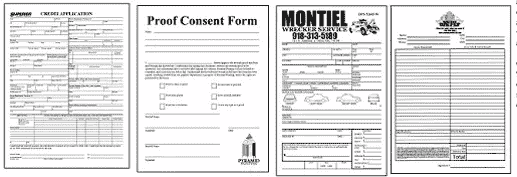

例如:调查、问卷、测试、索赔表

**非结构化|** 文本化，无格式和表格

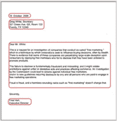

例如:合同、信件、文章、笔记

**半结构|** 以上两者的杂交，可能有部分结构

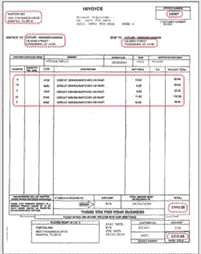

例如:发票、采购订单、账单、eob

就文件而言，以下是在数据中观察到的特征。

*   包裹中的文件顺序不一致。例如，在一个包文档**“A”**可能在文档**“B”**之后，而在另一个包文档中则相反
*   同一个文档类有许多变体。一个文档类可以有不同的外观变化，例如，一个**文档类“A”**页面模板/格式可能因美国不同的州而异。在抵押贷款领域，这些表示相同的信息，但在格式和内容上有所不同。换句话说，如果“猫”是一个文件，不同品种的猫就是“变种”。
*   **文件类型有不同种类的扫描变形**，即噪声、2D 和 3D 旋转、扫描质量差、页面方向，这些会扰乱这些文件的 OCR。

# 解决方法

在这一节中，我们将抽象地解释我们的解决方案管道是如何工作的，以及每个组件或模块是如何组合在一起产生一个端到端的管道的。下面是解决方案的流程图。

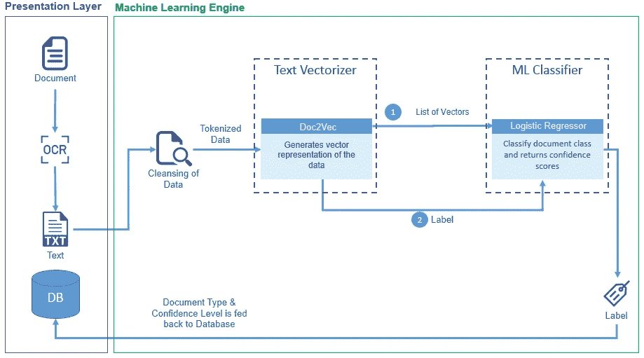

解决方案|流程图

既然目标是识别包内的文档，我们就必须识别 ***一个文档内的什么样的特征，使它不同于另一个？*** 。在我们的例子中，我们认为文档中的文本是关键，因为直觉上我们人类也是这样做的。下一个挑战是找出文档在包中的位置。在多页文档的情况下，边界页(开始、结束)最有意义。因为使用这些页面，可以识别一系列文档。

## 机器学习课程

在**机器学习**方面，我们把这个问题当成了**分类问题。**我们决定在这里标识出 ***每个文档的第一页和最后一页*** 。我们将我们的 ***机器学习类*** (ML 类)分为三种类型:

*   **首页类**:这些类是每个文档类的首页，负责标识文档的开始。
*   **末页类**:这些类是每个文档类的末页，负责标识文档的结尾。这些类仅适用于包含多页样本的文档类。
*   **Other Class:** 这个类是一个单独的类，包含所有文档类的中间页面，合并成一个类。拥有这个类有助于后面阶段的管道，它减少了文档的中间页面被分类为同一文档的第一页或最后一页的情况，这在直觉上是可能的，因为在所有页面(如页眉、页脚和模板)之间可能存在相似性。这允许模型学习更健壮的特征。

下图展示了这些不同类型的 ML 类在包和文档方面的表现

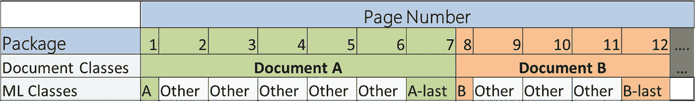

这里 A、B 是文档 A、B 的第一个页面类。此外，A-last、B-last 是相同文档的最后一个页面类。任何文档类的所有中间页面都被视为另一个类

## 机器学习引擎

一旦定义了 ML 类，下一步就是准备用于训练机器学习引擎的数据集(*数据准备部分将在接下来的章节中详细讨论)*。下图解释了**机器学习引擎**的内部工作原理，是解决方案管道的一个更技术性的视图。

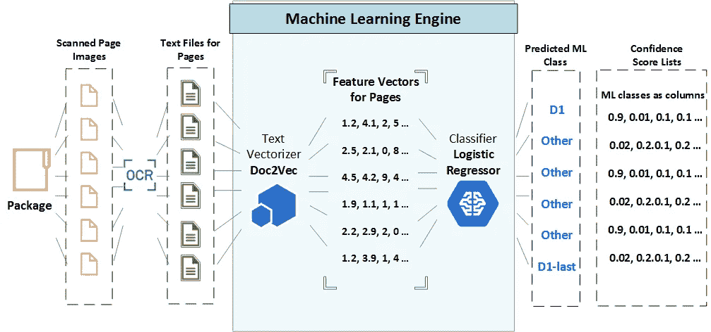

端到端分类周期。

让我们一步一步地描述解决方案的不同阶段。

**第一步**

*   包(pdf 格式)被分割成单独的页面(图像)

**第二步**

*   通过从图像中提取文本并生成文本文件的 **OCR** (光学字符识别)**、**处理各个页面。我们使用了最先进的 OCR 引擎来生成我们案例中的文本。有许多免费的在线 OCR 产品可以在这个步骤中使用。

**第三步**

*   对应于每个页面的文本然后被传递到**机器学习引擎**，在那里**文本矢量器(Doc2Vec)** 生成其特征向量表示，本质上是一个浮点列表。

第四步

*   然后将特征向量传递给分类器(**逻辑回归**)。分类器然后预测每个特征向量的类别。这些基本上是我们之前讨论过的 **ML 类别**之一(**第一、最后或其他**

此外，分类器返回所有 **ML 类**(图表最右边的部分)**的置信度得分。**例如让(D1，D2..)是 ML 类，那么对于单个页面，结果可能如下所示。

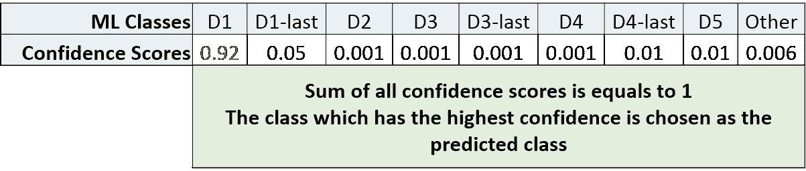

## 后加工

一旦整个包被处理，我们使用结果/预测来识别文档的边界。结果包含包中所有页面的预测类和预测的置信度得分。请参见下表

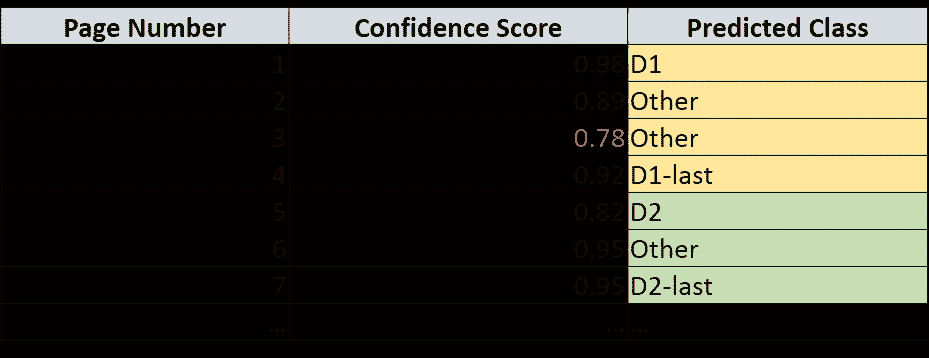

下面是使用来自**机器学习引擎**的输出来识别**文档边界**的简单算法和步骤。

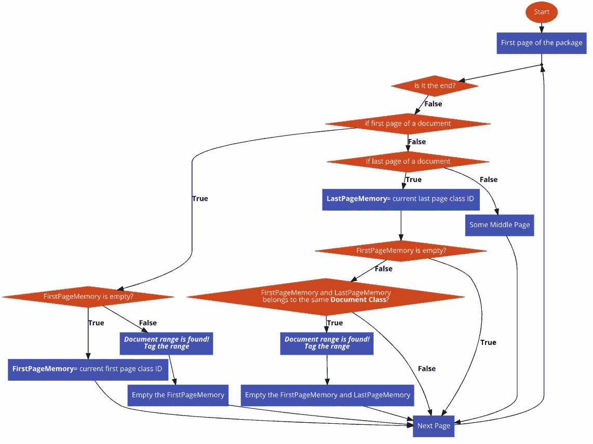

文档范围识别|后处理算法

# 解决方案详情(深度挖掘 TL；博士)

## 数据准备

致力于开发一个端到端的文档分类管道。第一步，也可以说是最重要的一步是数据准备，因为解决方案和它使用的数据一样好。我们用于实验的数据是来自抵押贷款领域的文档。我们采用的策略可以以类似的方式应用于任何形式的文档数据集。以下是执行的步骤。

> ***定义:文档样本*** *是一个特定文档的实例。通常它是一个(****pdf)****文件，只包含该文档的页面。*

**第一步**

*   第一步是决定，*包中的哪些文档要被识别和分类？*。理想情况下，应该选择包中存在的所有文档。一旦决定了文档类，我们就进入提取部分。在我们的例子中，我们决定分类(44)文档类。

第二步

*   为了获得数据集，我们收集了数百个包的 pdf，并从这些包中手动提取所选文档。一旦文档在包中被识别，该文档的页面被分离并以 pdf 文件的形式连接在一起。例如，如果我们在包的第 4 页到第 10 页发现了“ **Doc A** ”。我们将提取 6 页(第 4-10 页)并将其合并成一个 6 页的 pdf。这个 6 页的 pdf 构成了一个**文档样本。为特定文档类别提取的所有样本都放在单独的文件夹中。下图显示了文件夹结构。我们为每个文档类收集了 300 多个文档样本。每个文档类都有一个惟一的标识符，我们称之为" **DocumentIdentifierID** "**

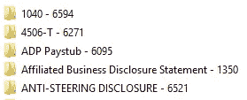

**第三步**

*   下一步是应用 **OCR** 和**从文档样本中的所有页面提取文本。OCR 遍历所有文件夹并生成 excel 文件，其中包含摘录文本和一些元数据。下面显示了 excel 文件的格式，每行代表一页**

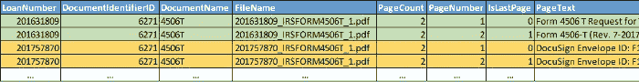

带有示例行的数据集表。

> ***贷款号，文件名:*** *这些都是唯一的样本(pdf)标识符。表格中有两个(绿色、黄色)样本。*
> 
> ***文档标识符 ID，文档名:*** *代表这些样本所属的文档类。*
> 
> ***页数:*** *一个特定样本中的总页数。(两个样本都有 2 页)*
> 
> ***页码:*** *是样本内每一页的有序页码。*
> 
> ***IsLastPage:****如果为 1，则表示该页面是该特定样本的最后一页。*
> 
> ***页面文本:*** *是从特定页面的 OCR 返回的文本。*

## 数据转换

一旦数据以上述格式生成，下一步就是转换它。在转换阶段，数据被转换/处理成对训练机器学习模型至关重要的格式。以下是应用于数据集的转换。

**步骤 1 |** 生成 ML 类

*   转换的第一步是生成*第一页、最后一页和其他页面类*。为此，使用了*页码*和*页面*列值。下面显示了所用逻辑的条件表示。

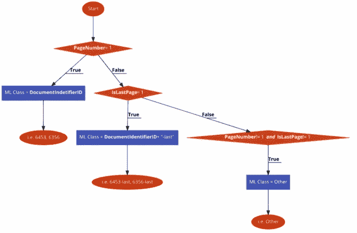

*   此外，下表代表各列。注意黄色栏，其中 **6853** 表示第一个页面类，**6853-最后一个**表示最后一个页面类，而中间页面被视为**其他**类

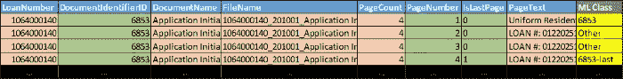

**步骤 2 |** 数据分割用于训练和测试管道

*   一旦步骤 1 完成，从那时起我们只需要两列“**页面文本**和“ **ML 类**”来创建培训管道。其他列用于测试评估。
*   下一步是拆分用于训练和测试管道的数据，数据的拆分方式是 **80%** 用于训练， **20%** 用于测试。数据也是随机打乱的，但每一类都是分层的。更多信息请点击[链接](https://scikit-learn.org/stable/modules/generated/sklearn.model_selection.StratifiedShuffleSplit.html)。

**第三步|** 数据清理和转换

*   包含每个页面的 OCR 文本的“**页面文本**”列被清理，该过程应用于训练和测试。以下是执行的过程。

1.  **大小写修正**:所有文字转换成大写或小写。
2.  **非字母数字字符的正则表达式**:删除所有非字母数字的字符。
3.  **单词标记化**:所有单词都被标记化，这意味着一个*页面文本*字符串成为单词列表
4.  **停用词移除**:停用词是在英语中过于常见的词，可能对单个文档的分类没有帮助。例如像“这个”、“是”、“一个”这样的词。这些词也可以是特定领域的。它可以用来删除许多不同文档中常见的冗余单词。即就金融或抵押而言,“价格”一词可出现在许多文件中。

下表显示了转换前后的情况

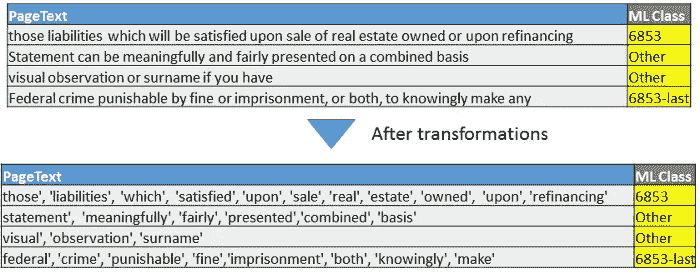

## 培训渠道

在前面的**机器学习引擎部分，**我们抽象地讨论了机器学习引擎的内部工作原理。两个主要组成部分是。

1.  **文本矢量器:**在我们的例子中，我们使用了 **Doc2Vec**
2.  **分类器模型:**使用逻辑回归器进行分类。

## 文本矢量器(Doc2Vec)

自从自然语言处理 (NLP)开始以来，就有了将文本转换成机器可以理解的东西的需求。这意味着，将文本信息转换成有意义的表示，通常称为数字向量(或数组)。研究界一直在开发不同的方法来完成这项任务。在我们的研发中，我们尝试了不同的技术，发现 **Doc2Vec** 是所有技术中最好的。

Doc2Vec 基于 **Word2Vec** 模型。Word2Vec 模型是一个**预测向量空间模型。**为了理解 Word2Vec，让我们从**向量空间模型开始。**

> ***向量空间模型(VSM):****将单词嵌入到连续的向量空间中，其中语义相似的单词被映射到附近的点*

**VSM 的两种做法:**

2.  *****预测方法:*** 根据学习到的小而密的嵌入向量(例如 Skip-Gram，CBOW)从其邻居预测一个单词。Word2Vec 和 Doc2Vec 就属于这一类机型**

****Word2Vec 型号****

**这是一个计算高效的预测模型，用于从原始文本中学习单词嵌入。 **Word2Vec** 可使用以下两种模型创建:**

1.  ****Skip-Gram** :围绕当前单词(目标单词)创建一个滑动窗口。然后使用当前单词来预测所有周围的单词(上下文单词)。(例如从**“垫子”**预测**“猫坐在”**)**
2.  ****连续词袋** ( **CBOW** ):在当前词(目标词)周围创建一个滑动窗口。然后从周围的单词(上下文单词)中预测当前单词。(如从**“猫坐在”**上预测**“垫子”**)**

**更多详情，请阅读这篇[文章](/introduction-to-word-embedding-and-word2vec-652d0c2060fa)。它详细解释了它的不同方面。**

****Doc2Vec 型号****

**这种文本矢量化技术在科研论文 [**句子和文档的分布式表示**](https://cs.stanford.edu/~quocle/paragraph_vector.pdf) **中有所介绍。**此外，进一步的技术细节可在[这里](http://linanqiu.github.io/2015/10/07/word2vec-sentiment/)找到。**

****定义*|*|***it***是一种从变长文本块中学习* ***定长特征向量表示*** *的* ***无监督算法*** *。然后，这些向量可以在任何机器学习分类器中使用，以预测类别标签。****

***它类似于 Word2Vec 模型，只是它使用每个文本文件中的所有单词在一个矩阵中创建一个唯一的列(称为**段落矩阵**)。然后，将训练单层 NN，如在 Skip-Gram 模型中看到的，其中输入数据都是当前单词的周围单词以及当前段落列，以预测当前单词。其余与 Skip-Gram 或 CBOW 模型相同。***

***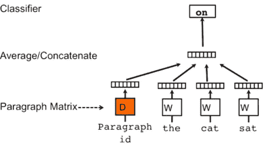***

***Doc2Vec |分布式单词包|来源:[句子和文档的分布式表示](https://cs.stanford.edu/~quocle/paragraph_vector.pdf)***

***Doc2Vec 模型的优点:***

*   ***在**情感分析任务**上，Doc2Vec 取得了新的最先进的结果，优于复杂的方法，在错误率方面产生了超过 **16%** 的相对改善。***
*   ***在**文本分类任务**上，Doc2Vec 令人信服地击败了词袋模型，给出了大约 **30%** 的相对提升。***

## ***分类器模型(逻辑回归)***

***一旦文本被转换成矢量格式。机器学习分类器已经准备好学习不同文档类型的向量中存在的模式，并识别正确的区别。因为有许多分类技术可以在这里使用，我们尝试了最好的分类技术并评估了它们的结果。即随机森林、SVM、多层感知器和逻辑回归器。为获得最佳结果，每个分类器尝试了许多不同的参数。**逻辑回归器**被发现是所有这些模型中最好的。***

## ***培训程序***

*   ***一旦数据被转换。首先，我们在训练分割上训练 Doc2Vec 模型(如数据转换一节中所讨论的)。-***
*   ***训练完 Doc2Vec 模型后。训练数据再次通过它，但是这一次不训练模型，而是我们推断训练样本的向量。最后一步是将这些向量和实际的 ML 类标签传递给分类模型(逻辑回归)。***
*   ***一旦根据训练数据对模型进行了训练，这两个模型都被保存到磁盘上，以便可以将它们加载到内存中，用于测试和最终的生产部署。下图显示了该协作方案的基本流程。***

***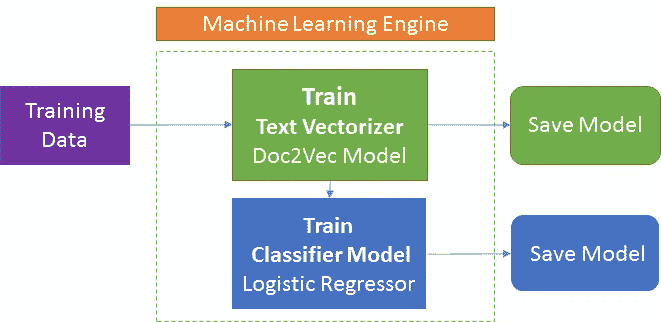***

## ***测试和评估管道***

***一旦训练了管道(包括 **Doc2Vec** 模型和**分类器)，下面的流程图显示了如何使用它来预测测试数据分割的文档类。*****

***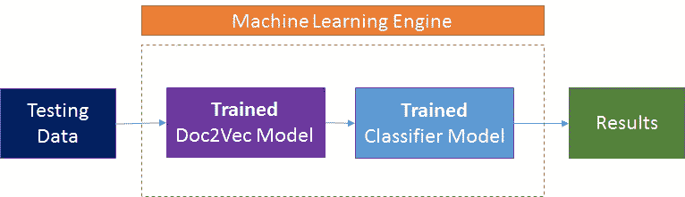***

***转换后的测试数据通过经过训练的 Doc2Vec 模型，在这里提取并推断出测试数据中所有页面的矢量表示。然后通过分类器对这些向量进行分类，该分类器返回所有 ML 类别的预测类别和置信度得分。***

***对于机器学习引擎的详细评估，我们根据结果生成一个 excel 文件。下表显示了测试阶段生成的列和信息。***

***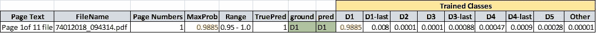***

***测试阶段生成的评估 excel 文件。***

> ******页面文本、文件名、页码:*** *这些* *都是我们在数据准备阶段就有的相同的列，这些只是从源数据集中照原样取来的。****
> 
> ******ground，pred :*** ground *显示该页面的实际 ML 类，而* pred *显示 ML 引擎预测的 ML 类。****
> 
> ******已训练类列*** *:此部分中的列表示模型被训练的 ML 类以及这些类的置信度得分。****
> 
> ******MaxProb，Range :*** MaxProb *显示“已训练的类”部分中任何列达到的最大置信度得分。参见红色文本，*范围*显示 MaxProb 落入的范围。****

***目前有三个等级的结果评估。***

1.  *****累积误差**评价指标***
2.  *****混淆矩阵*****
3.  *****班级水平置信度分数分析*****

## ***累积误差评估度量***

***该评估计算两个指标，**准确性**和**F1-分数**。更多细节请看这个[博客](/accuracy-precision-recall-or-f1-331fb37c5cb9)。这些让我们对管道的优点有了一个抽象的认识。分数可以在(1-100)之间。其中较高的数字表示管道在文档分类方面的好坏。在我们的实验中，我们得到了下面的准确度和 f1 值。***

***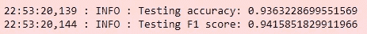***

## ***混淆矩阵***

***混淆矩阵是一个表格，通常用于描述一个分类模型(或“分类器”)对一组真实值已知的测试数据的性能。***

******本质上，它更容易理解:******

*   ****哪些班级表现不好？****
*   ****个别班级的准确率分数是多少？****
*   ****哪些阶层互相混淆？****

***下图代表了我们测试后生成的混淆矩阵。这是一个嵌入链接，所以点击查看混淆矩阵。***

***混淆矩阵图***

*****X 轴(真实标签)**和 **Y 轴(预测标签)**上的值代表我们训练的文档类别。单元格内的数字显示属于左边和底部的类的测试数据集的百分比。***

*****对角线上的值代表预测类别正确的数据百分比。**百分比越高越好。即，如果 0.99，则意味着该特定类别的 99%的测试数据被正确预测。所有其他单元格显示错误的预测，百分比显示某个类被另一个类混淆的程度。***

***可以看出，该模型能够以超过 **90%** 的准确度正确地分类大多数 ML 类别。***

## ***类别级置信度得分分析***

***虽然混淆矩阵给出了关于类混淆的细节，但是它不代表预测的置信度分数。也就是说***

*   ****“在对一个文档类进行预测时，模型的可信度如何？”****

*****需要什么？*****

***在理想情况下，模型在预测正确的 ML 类时应该具有高置信度，而在预测错误的 ML 类时应该具有低置信度。但是这不是严格的行为，并且取决于许多因素，即特定类的性能、文档类之间的实际领域相似性等。为了评估这种行为是否存在以及置信度得分是否可以作为真实预测的有用指标，我们设计了一种额外的评估方法。***

*****接近*****

***因为任务是减少人工工作，所以决定只选择具有高置信度的预测。这样错误的预测就不会发生(因为那些人不会有很高的信心)。其余的文档和页面将由 BPO 手动验证。***

*****阈值*****

***在该步骤中，计算类别的置信度得分并定义阈值，阈值是一个百分比，即 **80%，75%** ，其中基于以下条件确定。***

*   ***什么是置信分值，其中，错误的预测是无关紧要的数字，而正确的预测是较高的数字。换句话说，这是关于 ***找到甜蜜点*。*****

***下图显示了真阳性(蓝线)和假阳性(红线)。***

***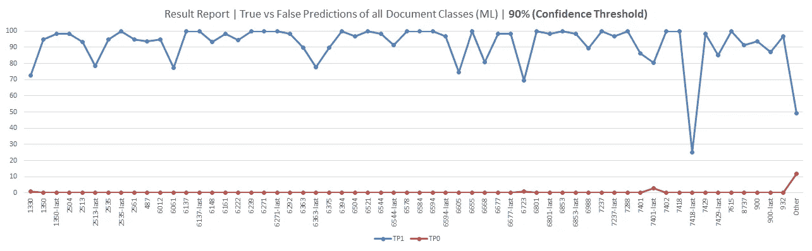***

*****X 轴**显示了 ML 类， **Y 轴**显示了特定类的测试数据的百分比，其被真阳性或假阳性所覆盖。***

***例如:在 ML 类 **1330 的情况下，**真实预测几乎覆盖了该类的整个测试数据集的 70%。这意味着 ML 引擎能够正确预测 **70%** 的数据，置信度得分大于 **90%。**此外，假阳性仅占测试数据集的 1%，这意味着只有 **1%** 的测试数据被预测为错误，置信度高于 **90%。*****

***虽然，由于阈值的原因，有时我们会丢失真正的阳性(当置信度得分小于阈值时)。但这并不像高置信度的误报那样糟糕。此类页面/文档将被手动验证。***

***前面的图是用阈值( **90%及以上)制作的。**在 **t** he 以下图中，阈值为( **80%及以上)。**注意，即使阈值降至 **80%** 假阳性也不会增加，而真阳性会显著增加。这意味着，在 90%和 80%阈值之间， **80%** 是最佳的。***

***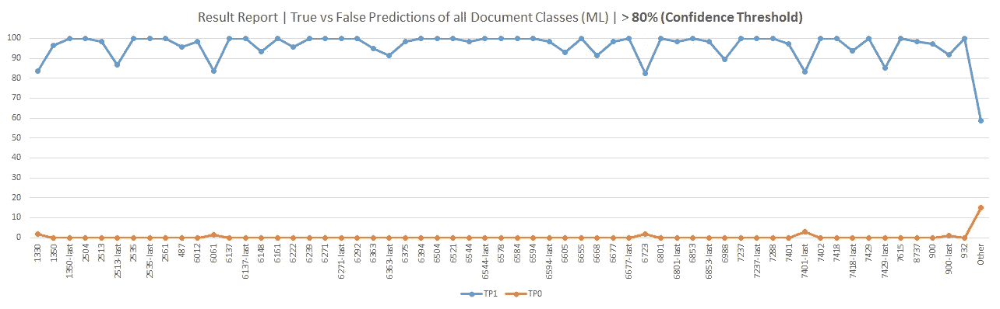***

***进行该分析时，检查所有水平，即 50%、60%、70%。使用该评估度量来选择最佳阈值。***

# ***解决方案功能***

*   *****快速预测|** 一个页面的分类时间在(~ **300ms** )以下。如果算上 OCR 的时间，一页在 **1 秒之内就可以很好的分类了。此外，如果采用多重处理，*****
*   *****高准确度|** 当前的解决方案管道能够以高准确度和高置信度识别和分类文档。在大多数类别中，我们获得了超过 95%的准确率。***
*   *****标记数据需求|** 在我们的实验中，我们观察到管道可以很好地处理每个文档类的大多数 **300 个样本**。(就像我们在这些博客中讨论的实验一样)。但是这取决于文档类的变化和类型。此外，我们看到随着样本数的增加，准确度和置信度得分也在增加。***
*   *****置信度得分阈值|** 管道提供预测置信度得分，这实现了调整方法，并允许在真阳性和假阳性之间进行调整。***
*   *****多处理|**doc 2 vec 实现允许多处理，而且我们的数据转换脚本是高度并行的。***

# ***结论***

***机器学习和自然语言处理已经在许多领域创造了奇迹，我们直接看到了它如何帮助减少人工劳动和自动化文档分类任务。求解不仅快，而且非常准确。***

***因为这一过程中使用的数据具有敏感性。代码库不可用。我会在一些虚拟数据的基础上重做代码，这将允许我把它上传到我的 github。请在 [github](https://github.com/QaisarRajput) 上关注我，了解更多更新。也看看我的一些其他项目；)***