# 用 ARIMA、LightGBM 和 Prophet 进行多步时间序列预测

> 原文：<https://towardsdatascience.com/multi-step-time-series-forecasting-with-arima-lightgbm-and-prophet-cc9e3f95dfb0?source=collection_archive---------1----------------------->

## [实践教程](https://towardsdatascience.com/tagged/hands-on-tutorials)

## 使用 Python 对不同类型的时间序列进行建模，以比较模型算法

由[马库斯·温克勒](https://unsplash.com/@markuswinkler?utm_source=medium&utm_medium=referral)在 [Unsplash](https://unsplash.com?utm_source=medium&utm_medium=referral) 上拍摄

时间序列预测是数据科学领域中一个非常常见的话题。公司使用预测模型来更清楚地了解他们未来的业务。在开发时间序列预测模型时，选择正确的算法可能是最困难的决定之一。在本文中，我们在不同类型的时间序列数据集上比较了三种不同的算法，即 SARIMA 萨里玛、LightGBM 和 Prophet。SARIMA 萨里玛是最受欢迎的经典时间序列模型之一。 [Prophet](https://facebook.github.io/prophet/) 是脸书在 2017 年开发的较新的静态时间序列模型。 [LightGBM](https://lightgbm.readthedocs.io/en/latest/) 是一种流行的机器学习算法，一般应用于表格数据，可以捕捉其中的复杂模式。

我们使用以下四种不同的时间序列数据来比较这些模型:

1.  循环时间序列(太阳黑子数据)
2.  没有趋势和季节性的时间序列(Nile 数据集)
3.  趋势强劲的时间序列(WPI 数据集)
4.  具有趋势和季节性的时间序列(航空数据集)

虽然我们将在所有四个不同的时间序列上尝试 SARIMA 萨里玛和 LightGBM，但我们将只在航空数据集上模拟 Prophet，因为它是为季节性时间序列设计的。

# 1.循环时间序列(太阳黑子数据)

周期性时间序列的上升和下降不是固定频率的，这不同于具有固定和已知频率的季节性时间序列。下面的数据集是来自国家地球物理数据中心的太阳黑子年度(1700-2008)数据。

太阳黑子数据集

首先，我们检查时间序列的平稳性。平稳性意味着时间序列不会随着时间的推移而改变其统计特性，特别是其均值和方差。具有周期行为的时间序列基本上是平稳的，而具有趋势或季节性的时间序列则不是平稳的([详见此链接](https://otexts.com/fpp3/stationarity.html))。我们需要平稳的时间序列来发展稳定的线性模型，如 ARIMA。

下面，我们将设置并执行一个显示自相关(ACF)和偏自相关(PACF)图的函数，同时执行扩展的 Dickey-Fuller 单元测试。

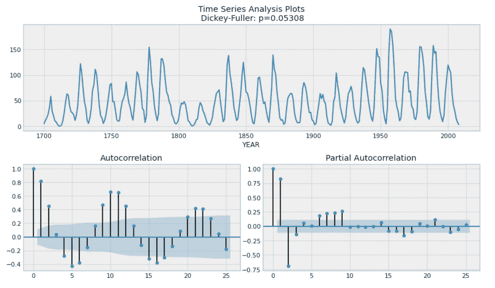

自相关(ACF)图可以用来判断时间序列是否平稳。这也有助于找到 ARIMA 模型中移动平均线部分的阶数。偏自相关(PACF)图有助于识别 ARIMA 模型中自回归部分的阶数。增强的 Dickey-Fuller 单元测试检验时间序列是否是非平稳的。零假设是序列是非平稳的，因此，如果 p 值很小，这意味着时间序列不是非平稳的。

上图中，Dickey-Fuller 检验 p 值不够显著(> 5%)。我们将取第一个差值，使级数更加平稳。

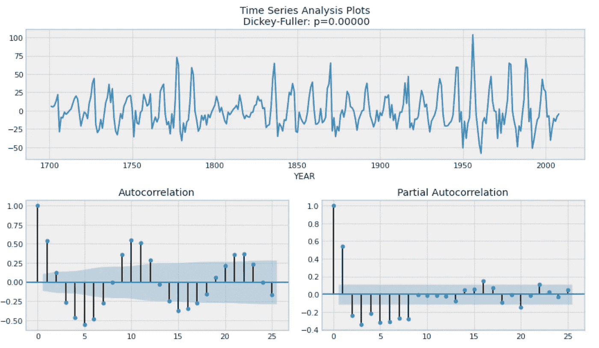

这一次，Dickey-Fuller 测试 p 值是显著的，这意味着该序列现在更有可能是平稳的。

ACF 图显示了正弦曲线模式，并且在 PACF 图中直到滞后 8 都有显著的值。这意味着 ARIMA(8，1，0)模型(我们取第一个差，因此 *d=1* )。您可以在此链接中看到从 ACF/PACF 图[确定 ARIMA 参数顺序的一般规则。下一步，我们将使用`sktime`包中的`AutoARIMA`，它会自动优化 ARIMA 参数的顺序。考虑到这一点，上面查找 ARIMA 参数的正确顺序的图形分析看起来是不必要的，但它仍然有助于我们确定参数顺序的搜索范围，并使我们能够验证 AutoARIMA 的结果。](https://otexts.com/fpp3/non-seasonal-arima.html#acf-and-pacf-plots)

在建模之前，我们将数据分为训练集和测试集。该系列的前 80%将作为训练集，其余 20%将作为测试集。

## 1.1 太阳黑子数据集上的 ARIMA

ARIMA 是最流行的时间序列预测模型之一，它在一个类似回归的模型中同时使用序列的过去值(自回归)和过去的预测误差(移动平均)。模型有三个不同的参数 *p，d* ，和 *q* 。 *p* 是自回归部分的阶次， *d* 是涉及的一阶差分的程度， *q* 是移动平均部分的阶次。我们需要找到这些参数的正确值，以获得我们的时间序列上最合适的模型。我们这里用的是`[sktime](https://www.sktime.org/en/latest/api_reference/modules/auto_generated/sktime.forecasting.arima.AutoARIMA.html)` [的](https://www.sktime.org/en/latest/api_reference/modules/auto_generated/sktime.forecasting.arima.AutoARIMA.html) `[AutoARIMA](https://www.sktime.org/en/latest/api_reference/modules/auto_generated/sktime.forecasting.arima.AutoARIMA.html)`，它是`[pmdarima](http://alkaline-ml.com/pmdarima/)`的包装器，可以自动找到那些 ARIMA 参数( *p，d，q* )。`pmdarima`是一个 Python 项目，它复制了 [R 的 auto.arima](https://www.rdocumentation.org/packages/forecast/versions/8.15/topics/auto.arima) 功能。你可以在[链接](https://otexts.com/fpp2/arima-r.html)中看到 auto.arima 是如何自动调整参数的。由于上面的分析建议 ARIMA(8，1，0)模型，我们将 start_p 和 max_p 分别设置为 8 和 9。

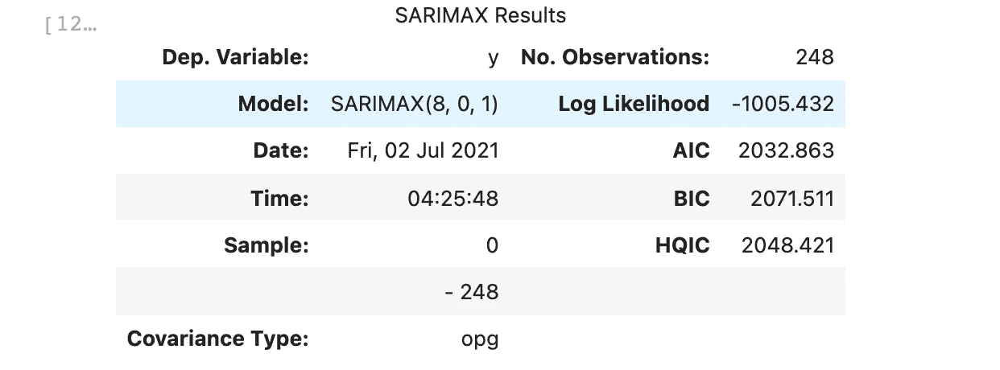

结果是`AutoARIMA`选择的参数与我们之前的预期略有不同。

接下来，我们将设置一个函数，在该函数下绘制模型预测并评估模型性能。我们使用[平均绝对误差(MAE)](https://en.wikipedia.org/wiki/Mean_absolute_error) 和[平均绝对百分比误差(MAPE)](https://en.wikipedia.org/wiki/Mean_absolute_percentage_error) 作为性能指标。MAE 对预测期内的绝对预测误差进行平均:

𝑡是时间，𝑦𝑡是𝑡的实际值，𝑦̂ 𝑡是预测值，𝑛是预测范围。

MAPE 是 MAE 的缩放度量，它是绝对误差除以实际𝑦:

## 黑子数据集上的 1.2 LightGBM

要使用 [LightGBM](https://lightgbm.readthedocs.io/en/latest/) 进行预测，我们需要首先将时间序列数据转换为表格格式，其中的特征是用时间序列本身的滞后值创建的(即 *𝑦𝑡−1、𝑦𝑡−2、𝑦𝑡−3* 、…)。由于模型只能预测一步预测，当我们创建多步预测时，预测值将用于下一步的特征，这称为多步预测的递归方法(您可以在本文中找到多步预测的不同方法[)。软件包为我们提供了这些功能和一个方便的 API。在下面的`create_forecaster`函数中，`make_reduction`包装`LGBMRegressor`，并在我们拟合预测器时将输入时间序列转换成表格格式。](https://www.researchgate.net/publication/236941795_Machine_Learning_Strategies_for_Time_Series_Forecasting)

我们也在使用`ForecastingGridSearchCV`来寻找最好的滞后特征`window_length`。

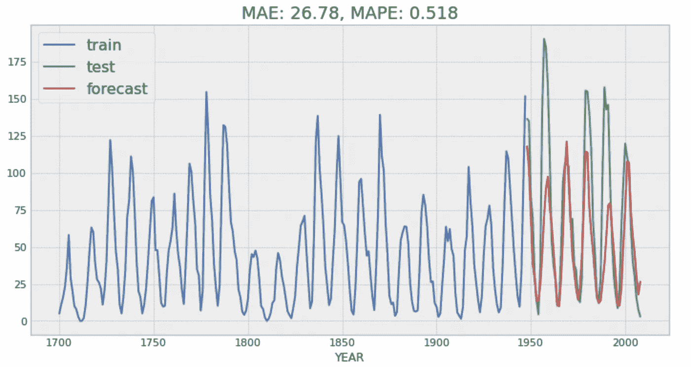

下表总结了两种不同模型的结果。对于这个时间序列数据，LightGBM 的表现优于 ARIMA。

**太阳黑子数据上的模型性能**

# 2.没有趋势和季节性的时间序列(Nile 数据集)

尼罗河数据集包含从 1871 年到 1970 年的 100 年间在阿什万测量的尼罗河年流量。时间序列没有任何季节性，也没有明显的趋势。

虽然 Dickey-Fuller 测试表明它是稳定的，但在 ACF 图中可以看到一些自相关。我们正试图了解它的第一个不同之处。

这看起来比原来更稳定，因为 ACF 图显示立即下降，并且 Dicky-Fuller 测试显示更显著的 p 值。从这个分析中，我们期望 ARIMA 在 *p* 和 *q* 上具有(1，1，0)，(0，1，1)或任何组合值，并且 *d = 1* ，因为 ACF 和 PACF 在滞后 1 处显示了重要值。让我们看看 AutoARIMA 选择什么参数值。

## 2.1 尼罗河数据集上的 ARIMA

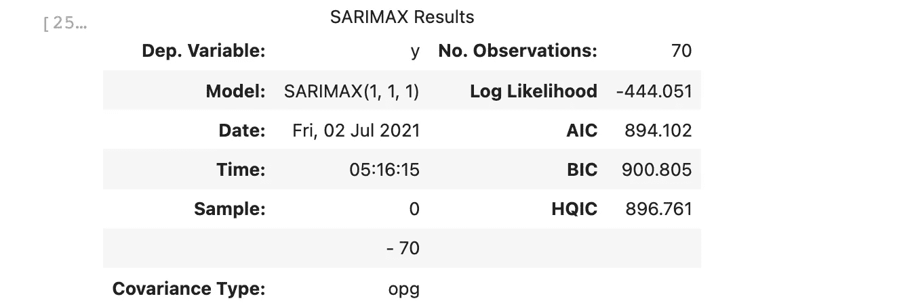

该模型按照预期选择了 *d = 1* ，并且在 *p* 和 *q* 上都有 1。然后，我们创建一个带有评估的预测。

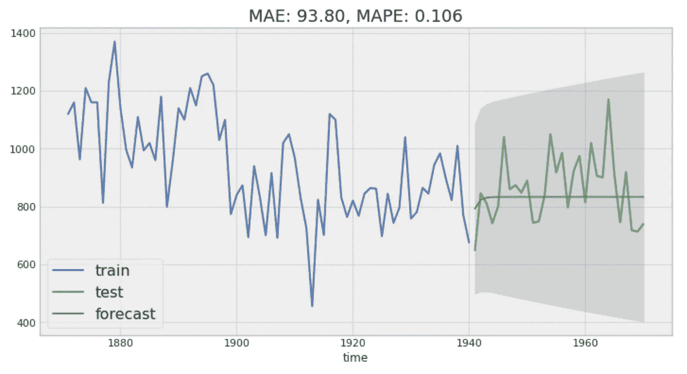

由于时间序列中没有明确的模式，该模型预测随着时间的推移，值几乎保持不变。

## Nile 数据集上的 2.2 LightGBM

我们使用与前面的数据相同的函数来开发 LightGBM。

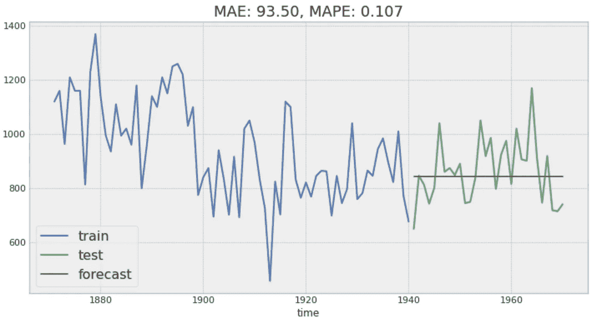

原来 LightGBM 创造了一个与 ARIMA 相似的预报。下面的汇总表显示这两种型号之间没有太大的区别。

**Nile 数据的模型性能**

# 3.趋势强劲的时间序列(WPI 数据集)

美国批发价格指数(WPI)从 1960 年到 1990 年有一个强劲的趋势，如下图所示。

我们取第一个差值，使它保持不变。

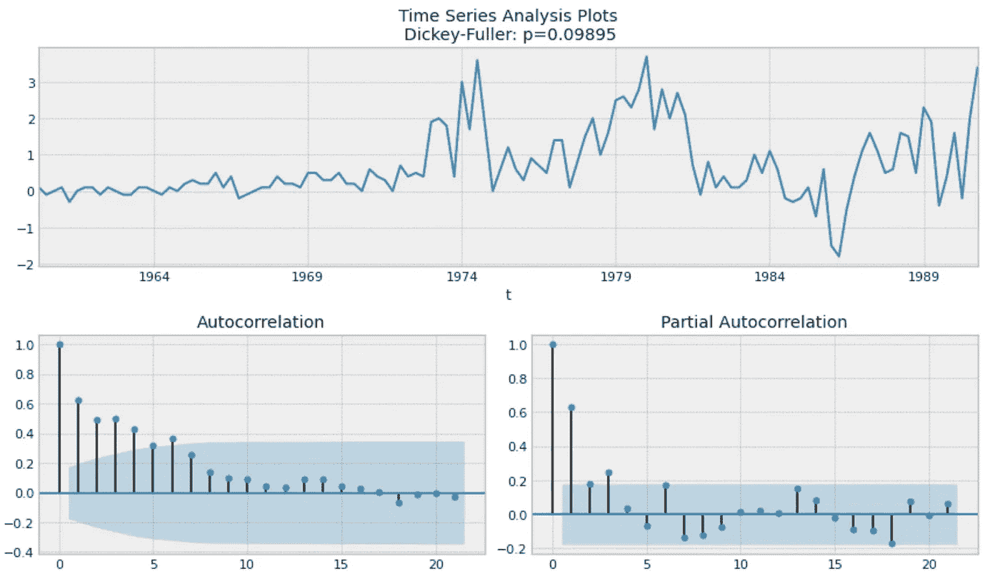

它仍然看起来不稳定，因为 ACF 随时间缓慢下降，Dicky-Fuller 也没有显示出显著的 p 值。因此，我们又多了一个不同点。

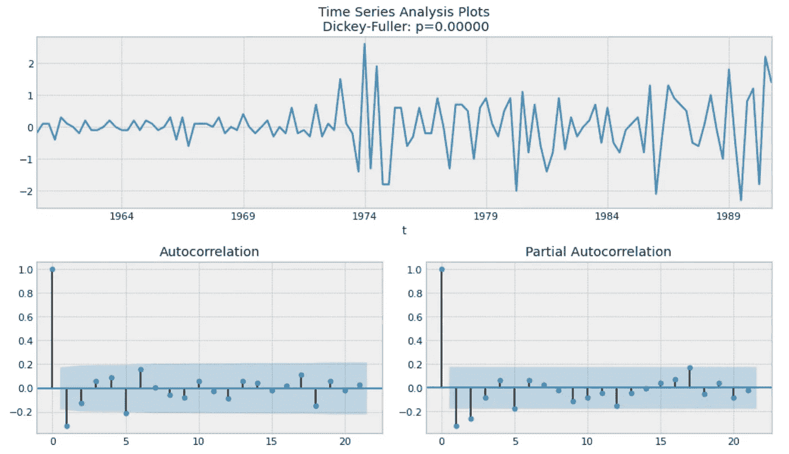

现在，随着 Dicky-Fuller 的显著值和 ACF 图显示快速下降，它看起来是稳定的。从这个分析中，我们期望 *d = 2* 因为it 需要二阶差分来使其稳定。由于 ACF 在滞后 1 时具有重要值，而 PACF 在滞后 2 之前具有重要值，我们可以预期 *q = 1 或 p = 2* 。

## 3.1 WPI 数据集上的 ARIMA

我们将时间序列分成训练集和测试集，然后在其上训练 ARIMA 模型。

正如前面的分析所证实的，该模型有二级差异。接下来，我们将创建一个预测及其评估。

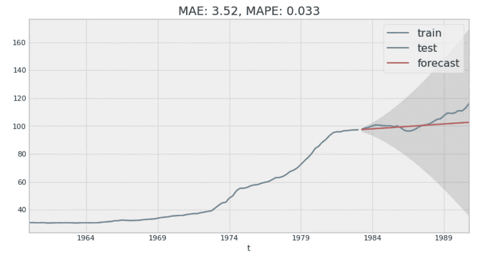

## 3.2 WPI 数据集上的 LightGBM

我们用和以前一样的方式对 LightGBM 建模，看看它在这个时间序列上是如何工作的。

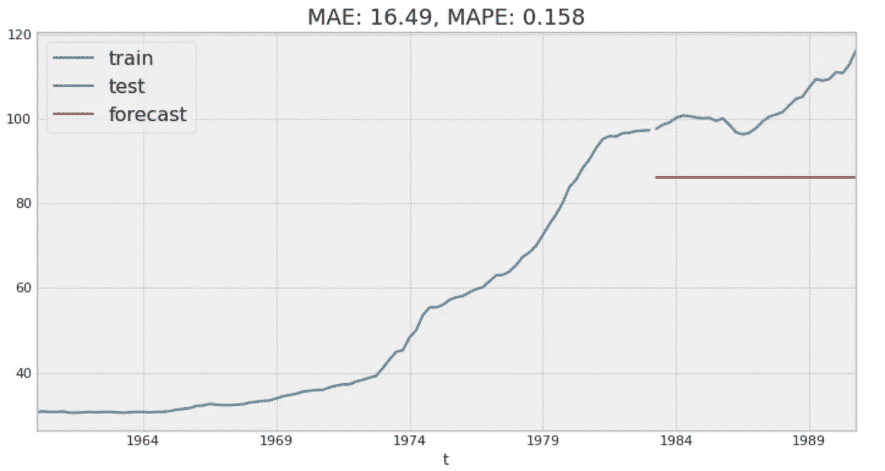

LightGBM 显然不太好用。由于回归树算法无法预测超出其在训练数据中看到的值，因此如果时间序列有很强的趋势，它就会受到影响。在这种情况下，我们需要在建模之前取消时间序列的趋势。`sktime`提供了一个方便的工具`Detrender`和`PolynomialTrendForecaster`,用于还原可包含在培训模块中的输入序列。

在将其纳入培训模块之前，我们将在下面演示`PolynomialTrendForecaster`，看看它是如何工作的。

线性去趋势

在上图中，你可以看到趋势预测者捕捉到了时间序列中的趋势。

接下来，我们使用`TransformedTargetForecaster`创建一个预测器，它包括包装`PolynomialTrendForecaster`的`Detrender`和包装在`make_reduction`函数中的`LGBMRegressor`，然后在`window_length`上用网格搜索训练它。

这一次，LightGBM 在 detrender 的帮助下预测超出训练目标范围的值。

下表总结了两种不同模型在 WPI 数据上的表现。LightGBM 的表现再次优于 ARIMA。

**WPI 数据的模型性能**

# 4.具有趋势和季节性的时间序列(航空数据集)

Box-Jenkins 航空公司数据集由 1949-1960 年间国际航空公司乘客的月度总数(千单位)组成。如下图所示，该数据具有趋势性和季节性。

首先，我们取一个季节差异(滞后 12)使其稳定。

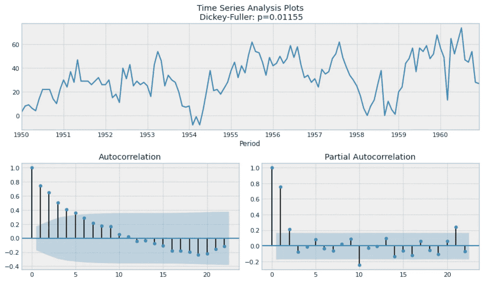

随着 ACF 缓慢下降，它看起来仍然不是稳定的，所以我们对它进行额外的一阶差分。

现在，它看起来是稳定的，因为 Dickey-Fuller 的 p 值是显著的，ACF 图显示随着时间的推移快速下降。这一分析的结果表明，当 ACF 和 PACF 图在滞后 1 时显示显著值时，SARIMA 与 *d = 1* 和 *D* (季节差异的顺序) *= 1.p* 或 *q* 可以是 1。

## 4.1 航空数据集上的 SARIMA

接下来，我们将数据分为训练集和测试集，然后在其上开发 SARIMA(季节性 ARIMA)模型。SARIMA 模型具有 ARIMA 上空的附加季节参数(P，D，Q)。p、D 和 Q 分别代表季节自相关的阶、季节差异的程度和季节移动平均的阶。为了对 SARIMA 建模，我们需要指定`sp`参数(季节周期。在这种情况下，它是 12)在`AutoARIMA`上。

正如所料，创建的模型有 *d = 1* 和 *D = 1* 。接下来，我们创建一个带有评估的预测。

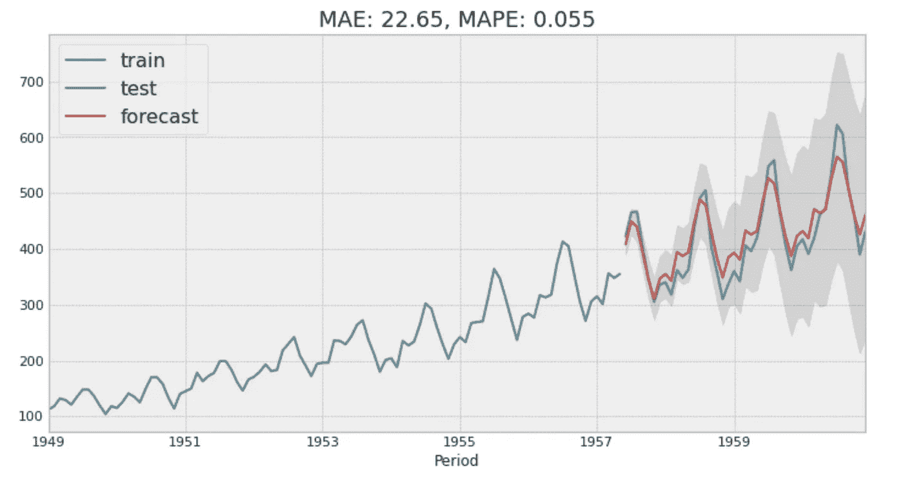

## 4.2 航空数据集上的 LightGBM

由于时间序列具有季节性，我们在 LightGBM 预测模块中增加了`Deseasonalizer`。由于季节性效应会随着时间的变化而变化，我们在`Deseasonalizer`模块上设置了`“multiplicative”`。

## 4.3 航空数据集上的预言者

[Prophet](https://facebook.github.io/prophet/) 是脸书在 2017 年开发的一个时间序列预测模型，可以有效处理多个季节性(年、周、日)。它还具有整合节假日影响和在时间序列中实现自定义趋势变化的功能。由于我们的时间序列不需要所有这些功能，我们只是在打开年度季节性的情况下使用 Prophet。

下表比较了航空公司数据集上三种不同模型的性能指标。虽然这三款车型之间的性能差异不大，但 ARIMA 的表现略好于其他车型。

**航空公司数据上的模型性能**

# 结论

在这篇博文中，我们对不同类型的时间序列比较了三种不同的模型算法。除了季节性时间序列(航空公司)之外，LightGBM 的表现与 ARIMA 相当或更好。

**通过时间序列数据集建立模型预测 MAE**

由于 LightGBM 是一个非线性模型，它比线性模型有更高的过度拟合数据的风险。您可能希望在使用它时设置可靠的交叉验证。如果你的数据有许多不同的时间序列(例如，公司的股票价格或按产品的销售)，机器学习方法也比线性模型有优势，因为你可以用一个机器学习模型预测多个时间序列(我们在这篇博客中没有挖掘这一优势。如果你感兴趣的话，请看一些来自 [M5 游戏竞赛](https://www.kaggle.com/c/m5-forecasting-accuracy)的实现。

机器学习方法的一个缺点是，它没有任何计算预测区间的内置功能，而大多数静态时间序列实现(即 ARIMA 或预言家)都有。您可能想编写自己的模块来计算它。

虽然 Prophet 在我们的数据中并不比其他人表现得更好，但如果您的时间序列有多个季节性或趋势变化，它仍然有很多优势。

您可以在下面的 Google Colab 链接或 Github 链接中看到完整的工作代码。

 [## 谷歌联合实验室

### 用 ARIMA、LightGBM 和 Prophet 进行多步时间序列预测

colab.research.google.com](https://colab.research.google.com/drive/1Z4zNI_bVXoFQBsCHUtxBDCBno6yhXceB?usp=sharing)  [## 时间序列预测

### 使用 ARIMA、LightGBM 和 Prophet-tomonori-masui/时间序列预测进行多步时间序列预测

github.com](https://github.com/tomonori-masui/time-series-forecasting/blob/main/multi_step_time_series_forecasting.ipynb) 

# 参考

[1] [用 sktime 预测— sktime 官方文档](https://www.sktime.org/en/latest/examples/01_forecasting.html)

[2][Python 中的时间序列分析](https://www.kaggle.com/kashnitsky/topic-9-part-1-time-series-analysis-in-python)

[3][light GBM 自回归器—使用 Sktime](/a-lightgbm-autoregressor-using-sktime-6402726e0e7b)

[4] Rob J Hyndman 和 George Athanasopoulos，[预测:原则和实践(第 3 版)——第 9 章 ARIMA 模型](https://otexts.com/fpp3/arima.html#arima)

*2023 年 3 月 9 日-更新代码(包括链接的 Colab 和 Github)以使用当前最新的包*