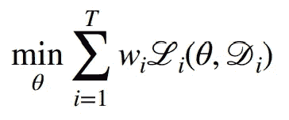

# 机器学习中的多任务学习

> 原文：<https://towardsdatascience.com/multi-task-learning-in-machine-learning-20a37c796c9c?source=collection_archive---------5----------------------->

## [实践教程](https://towardsdatascience.com/tagged/hands-on-tutorials)

## 基于神经网络的深度多任务学习

[阿瑟尼·托古列夫](https://unsplash.com/@tetrakiss?utm_source=medium&utm_medium=referral)在 [Unsplash](https://unsplash.com?utm_source=medium&utm_medium=referral) 上的照片

# 介绍

在大多数机器学习环境中，我们关心的是一次解决一个*单个*任务。不管任务是什么，问题通常都是用数据来解决单个任务或一次优化一个指标。然而，这种方法最终会遇到性能上限，通常是由于数据集的大小或模型从中学习有意义的表示的能力。

另一方面，多任务学习是一种机器学习方法，其中我们试图同时学习*多个*任务，同时优化多个损失函数。我们不是为每项任务训练独立的模型，而是让一个模型学习一下子完成所有的任务。在此过程中，模型使用不同任务中的所有可用数据来学习在多种上下文中有用的数据的通用表示。

多任务学习已经广泛应用于多个领域，如自然语言处理、计算机视觉和推荐系统。由于它能够有效地利用大量数据来解决相关任务，因此在行业中也经常被利用，例如在谷歌。

# 何时使用多任务学习

在进入如何实现多任务学习模式的细节之前，首先要了解多任务学习适合和不适合的情况。

通常，当任务具有某种程度的**相关性**时，应使用多任务学习。换句话说，当任务之间有潜在的原则或信息共享时，多任务学习可以提高绩效。

例如，涉及对动物图像进行分类的两个任务很可能是相关的，因为这两个任务都将涉及学习检测皮毛图案和颜色。这将是多任务学习的一个很好的用例，因为学习这些图像特征对于两个任务都是有用的。

另一方面，有时多任务培训会导致任务间的负迁移，其中多任务模式比等效的单任务模式表现更差。这通常发生在不同的任务彼此不相关的时候，或者在一个任务中学到的信息与在另一个任务中学到的信息相矛盾的时候。

# 构建多任务模型

现在我们知道了何时应该使用多任务学习，我们将通过一个简单的多任务模型架构。这将集中于神经网络架构(深度多任务学习)，因为神经网络是迄今为止多任务学习中使用的最常见的模型类型。

## 学习共享表示

其核心是，深度多任务学习旨在学习产生通用的表示，这些表示足够强大，可以在不同的任务之间共享。这里我将重点讨论硬参数共享，其中不同的任务使用输入数据的完全相同的基本表示。

[来源](https://ruder.io/multi-task/index.html#twomtlmethodsfordeeplearning)

正如我们所看到的，硬参数共享迫使模型学习一种中间表示，这种表示为所有任务传达了足够的信息。网络的特定任务部分都从最后一个共享层的相同基础表示开始。

多任务学习提高了这种表示的概化能力，因为学习多任务会迫使模型关注对所有任务都有用的特征。假设任务是相关的，对任务 A 重要的特征也可能对任务 c 重要，反之亦然；不重要的功能可能在所有任务中都不重要。

多任务学习也有效地增加了你的数据集的大小，因为你是在组合每个任务的数据集。通过向来自不同任务的训练集添加更多样本，模型将学会更好地忽略每个单独数据集中特定于任务的噪声或偏差。

## 针对多项任务进行优化

一旦决定了模型的架构，我们需要决定优化什么损失函数。

最简单的方法是最小化单个任务损失函数的线性组合。每个任务都会有自己单独的损失函数 **L_i** 。因此，在我们的多任务模型中，我们简单地对每个损失函数进行加权，并最小化这些加权损失的总和。

[来源](https://cs330.stanford.edu/slides/cs330_multitask_transfer_2020.pdf)

# 寻找辅助任务

现在我们知道了如何构建多任务模型，我们需要确定如何将这种方法应用到给定的任务中。在许多情况下，看起来你真的只有一个任务要解决，如何将你的问题融入到多任务学习环境中并不明显。

如果您没有明确地拥有多个任务，您可以创建**辅助任务**，旨在解决与您的单个原始任务相关但不相同的问题。通过创建一个辅助任务，你仍然可以将多任务学习应用到你的单一主要任务中，并有望提高它的性能。

确定一个辅助任务通常是特定领域的，没有一个放之四海而皆准的方法。然而，它们有一些共同的一般原则。一般来说，辅助任务应该与主要任务相关，并且应该推动网络学习主要任务的重要特征。

例如，如果主要任务是对数据序列进行分类，我们可以创建一个辅助任务，用自动编码器重建序列。这个辅助任务明确地迫使网络学习序列编码器，该序列编码器产生足够信息的表示，以便能够重构原始序列。这很可能提高原始任务的性能，对序列进行分类，简单地通过产生序列的更多信息的中间表示。