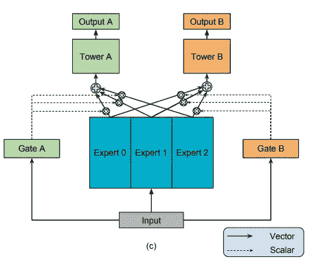

# 多专家混合多任务学习

> 原文：<https://towardsdatascience.com/multi-task-learning-with-multi-gate-mixture-of-experts-b46efac3268?source=collection_archive---------24----------------------->

## 谷歌的内容推荐神经网络模型

[附身摄影](https://unsplash.com/@possessedphotography?utm_source=medium&utm_medium=referral)在 [Unsplash](https://unsplash.com?utm_source=medium&utm_medium=referral) 上拍照

# 介绍

多任务学习是一种机器学习方法，其中一个模型学习同时解决多个任务。假设通过学习用相同的模型完成多个相关的任务，每个任务的性能将比我们在每个任务上训练单独的模型更高。

 [## 机器学习中的多任务学习

### 基于神经网络的深度多任务学习

towardsdatascience.com](/multi-task-learning-in-machine-learning-20a37c796c9c) 

然而，这一假设并不总是正确的。简单的多任务学习方法没有考虑任务之间的关系和学习完成所有任务的权衡。

[谷歌的多门专家混合模型](https://dl.acm.org/doi/pdf/10.1145/3219819.3220007) (MMoE)试图通过明确学习任务之间的关系来改善基线多任务学习方法。

# 结构

我们将讨论多任务学习的三种架构:1)共享底层模型，2)单门专家混合模型(MoE)，以及 3)多门专家混合模型(MMoE)。前两个架构提供了上下文，并展示了最终 MMoE 架构的渐进步骤。

[来源](https://dl.acm.org/doi/pdf/10.1145/3219819.3220007)

## 共享底层模型

共享底层模式是最简单和最常见的多任务学习架构。该模型有一个单一的基础(共享的底层),所有特定于任务的子网都从这个基础开始。这意味着这种单一的表征用于所有的任务，个体任务没有办法相对于其他任务来调整它们从共享底层中得到什么信息。

[来源](https://dl.acm.org/doi/pdf/10.1145/3219819.3220007)

## 专家混合模型

专家混合架构通过创建多个专家网络并添加门控网络来加权每个专家网络的输出，对共享底层模型进行了改进。

[来源](https://www.researchgate.net/figure/The-architecture-of-the-mixture-of-experts-model_fig1_220216747)

每个专家网络本质上都是一个唯一的共享底层网络，每个网络都使用相同的网络架构。假设每个专家网络能够学习数据中的不同模式，并专注于不同的事情。

门控网络然后产生加权方案，使得任务能够使用专家网络输出的加权平均值，以输入数据为条件。门控网络的最后一层是 softmax 层( **g(x)** )，用于产生专家网络输出的线性组合( **y** )。

[来源](https://dl.acm.org/doi/pdf/10.1145/3219819.3220007)

这种架构的主要创新是，该模型能够在每个样本的基础上不同地激活网络的部分。由于门控网络以输入数据为条件(由于门控网络作为训练整个模型的一部分而被训练)，该模型能够学习如何基于输入数据的属性对每个专家网络进行加权。

## 多门专家混合模型(MMoE)

最后，我们继续讨论多门专家混合(MMoE)模型架构。

[来源](https://dl.acm.org/doi/pdf/10.1145/3219819.3220007)

MMoE 体系结构类似于 MoE 体系结构，只是它为每个任务提供了一个单独的门控网络，而不是为整个模型提供一个单独的门控网络。

这允许模型学习每个专家网络的每个任务和每个样本的权重，而不仅仅是每个样本的权重。这允许 MMoE 学习对不同任务之间的关系进行建模。彼此几乎没有共同点的任务将导致每个任务的门控网络学习使用不同的专家网络。

MMoE 的作者通过在具有不同任务相关性水平的合成数据集上比较共享底层、MoE 和 MMoE 架构来验证这一结论。

[来源](https://dl.acm.org/doi/pdf/10.1145/3219819.3220007)

首先，我们看到，相对于 MoE 和 MMoE 模型，共享底部模型在所有情况下都表现不佳。

接下来，我们可以看到，随着任务之间的相关性降低，MoE 和 MMoE 模型之间的性能差距增大。

这表明 MMoE 能够更好地处理任务互不相关的情况。任务多样性越大，MMoE 相对于共享底层或 MoE 架构的优势就越大。