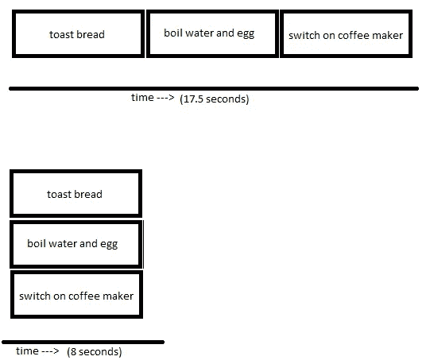

# Python 中的多任务处理:通过同时执行，将程序速度提高 10 倍

> 原文：<https://towardsdatascience.com/multi-tasking-in-python-speed-up-your-program-10x-by-executing-things-simultaneously-4b4fc7ee71e?source=collection_archive---------2----------------------->

## 应用线程和进程加速代码的分步指南


帮助我们更快执行的工人大军(图片由 [Brian McGowan](https://unsplash.com/@sushioutlaw) 在 [Unsplash](https://images.unsplash.com/photo-1579566346927-c68383817a25?ixid=MnwxMjA3fDB8MHxwaG90by1wYWdlfHx8fGVufDB8fHx8&ixlib=rb-1.2.1&auto=format&fit=crop&w=1000&q=80) 上提供)

本文着重于通过让程序同时做多件事来加速程序。当我们的程序等待 API 响应时，我们不必空闲，例如:我们可以在同一时间做其他事情！我们还将探讨如何应用更多的 CPU 来加快计算速度。在本文结束时，您将:

*   理解多任务处理的不同方式
*   知道何时应用哪种技术
*   能够通过使用代码示例来加速您自己的代码

在我们开始之前，我强烈建议看看下面的文章。它解释了 Python 是如何工作的，以及为什么它没有其他语言快。它还揭示了为什么 Python 一开始就不是多线程的？你会对我们在这篇文章中试图解决的问题有更好的理解。我们来编码吧！

[](/why-is-python-so-slow-and-how-to-speed-it-up-485b5a84154e) [## Python 为什么这么慢，如何加速

### 看看 Python 的瓶颈在哪里

towardsdatascience.com](/why-is-python-so-slow-and-how-to-speed-it-up-485b5a84154e) 

# 线程和进程

Python 可以通过两种方式处理多任务:线程和多重处理。从表面上看，他们非常相似，但根本不同。在下面的部分中，我们将通过使用两个简单的比喻来检验这两者。我们的目标是了解线程和进程之间的区别，以便我们知道何时使用哪一个。

## 线程就像做早餐

让我们做一些早餐:我们需要一个煮鸡蛋，一些烤面包和一杯咖啡，所以我们有 4 个任务:

1.  烤面包
2.  烧开水
3.  煮鸡蛋
4.  打开咖啡机


这是我们试图在尽可能短的时间内完成的(图片由 [Eiliv-Sonas Aceron](https://unsplash.com/@shootdelicious) 在 [Unsplash](https://unsplash.com/photos/uAm1CZMdPCw) 上拍摄)

你会怎么做？一种方法是顺序执行每个任务；首先烤面包，然后烧开水和一个鸡蛋，然后打开咖啡机。虽然这个过程很容易理解，但最终留给我们的只是一些冷吐司、一个冷鸡蛋和一杯热咖啡。或者，我们可以同时执行一些任务；我们将打开咖啡机和烤面包机，同时煮些水。

让我们用一些代码来模拟一下。

我们将按顺序(一个接一个)运行这段代码，如下所示:

```
toast_bread()
boil_water_and_egg()
make_some_coffee()
```

**依次做早餐大约需要 17.5 秒**。这涉及到很多等待！让我们使用线程进行多任务处理:

代码非常简单:我们将创建一些任务，并将它们添加到一个列表中。然后，我们将启动列表中的每个线程，并等待所有线程完成(这就是 t.join()所做的)。**同时做早餐大约需要 8 秒钟！**



我们做早餐的方式(图片由作者提供)

*的主要收获*是如果有很多等待(典型的 I/O 任务，比如下载数据、API 请求、写文件..)我们可以使用线程来执行多任务。在本文的后面，我们将研究为什么线程是 I/O 任务的最佳选择。

## 多重处理就像做作业一样

当我们用同样的早餐制作原则来做作业时，我们遇到了一个问题；做数学作业是一项需要持续关注的任务；我们不能开始它，然后等它结束！为了同时做多门功课，我们需要克隆自己，对吗？多重处理正是这样做的。


对焦和开始处理的时间(图片由 [Annie Spratt](https://unsplash.com/@anniespratt) 在 [Unsplash](https://unsplash.com/photos/ORDz1m1-q0I) 上拍摄)

让我们先把作业的例子翻译成一些代码。我们将通过一些 CPU 密集型处理来模拟做作业；将从 0 到 1 亿的所有数字相加:

这些都是 CPU 密集型函数；我们必须进行大量的计算。我们将首先顺序执行这些函数，然后线程化(与上一部分相同的代码)，然后使用下面的代码来生成进程。请注意，代码看起来很像上一部分的线程代码。

基准:

*   依次:14.22 秒
*   使用线程:13.89 秒
*   使用进程:6.00 秒

您将会看到使用进程大大加快了执行速度！这是因为我们可以使用更多的 CPU。

在这个例子中我们要进行 3 亿* 3 次计算。线程化并不能提高它的速度，因为它仍然是一个必须执行 3 亿次计算的 CPU。然而，当使用进程时，我们会在不同的 CPU 上产生一个全新的 Python 实例。换句话说，我们将使用 3 个 CPU，每个 CPU 可以执行 1 亿次计算！

## 摘要

线程是用来做类似早餐的任务的:它需要大量的等待，因此一个“人”(或 CPU)可以同时做一些事情。过程是为了“思考-任务”；他们需要你在那里做重活。多重处理就像创造一个你自己的克隆体，这样它就可以在你工作的时候做其他的事情。

# 引擎盖下的线程和多重处理

现在我们对线程和进程的工作原理有了更清晰的理解，让我们来谈谈两者之间的区别。


让我们来看看他们是如何跑的(图片由埃里克·麦克莱恩在 [Unsplash](https://unsplash.com/photos/ioEjMWHn2nY) 上[拍摄)](https://unsplash.com/@introspectivedsgn)

## GIL——为什么线程更适合 I/O

如前所述，线程适用于 I/O 任务，而进程适用于 CPU 密集型任务。原因是 Python 臭名昭著的 GIL；全局解释器锁。这个锁确保 Python 是单线程运行的，阻塞了没有持有锁的其他进程。许多 I/O 进程在空闲时释放 GIL，使得线程化成为可能。查看 [**这篇文章**](https://mikehuls.medium.com/why-is-python-so-slow-and-how-to-speed-it-up-485b5a84154e) 了解 Python 为什么应用 GIL。

在作业示例中，线程没有意义，因为所涉及的任务不是 I/O 任务。由于 GIL，任何时候只有一个线程可以执行，所以它不提供加速。当多重处理时，我们创建一个新的 Python 实例，它有自己的 GIL。这样，进程并行运行，大大加快了程序的执行速度。

## 进程不能共享资源

主要的一点是，进程不能共享资源，而线程可以。这是因为一个进程使用多个 CPU，而一个线程只是一个 CPU 在多个线程之间来回移动。

您可以将线程视为一个 CPU，它首先执行 thread1 中的几行代码，然后执行 thread2 中的几行代码，然后继续执行 thread3。然后，它执行线程 1 中的下一行，然后是线程 2，依此类推。线程并发执行多个任务*；一个在任务间切换的工人。对于用户来说，事情看起来好像是同时发生的，但从技术上来说并非如此。*

*当您生成一个新进程时，会创建一个全新的 python 实例，并将其分配给不同的 CPU。这就是两个进程不能共享一个公共资源的原因。 ***中的流程运行*并行****；有多个工作人员同时从事多项任务。*

## *开销*

*进程需要更多的时间来生成。这就是为什么家庭作业的例子不是快三倍，而是稍微慢一点；首先，我们必须生成进程，然后才能从并行性中获益。*

# *更快的速度*

*在 Python 中，多任务处理可以解决很多速度问题，但有时这还不够。查看 [**这篇**](https://mikehuls.medium.com/getting-started-with-cython-how-to-perform-1-7-billion-calculations-per-second-in-python-b83374cfcf77) 或 [**这篇**](https://mikehuls.medium.com/write-your-own-c-extension-to-speed-up-python-x100-626bb9d166e7) 文章，向您展示如何编译一小部分代码以获得 100 倍的速度提升。*

*[](/cython-for-absolute-beginners-30x-faster-code-in-two-simple-steps-bbb6c10d06ad) [## 面向绝对初学者的 Cython:通过简单的两步将代码速度提高 30 倍

### 为速度惊人的应用程序轻松编译 Python 代码

towardsdatascience.com](/cython-for-absolute-beginners-30x-faster-code-in-two-simple-steps-bbb6c10d06ad)* 

# *结论*

*在许多情况下，线程和多重处理可以用来加速代码的执行。在本文中，我们探讨了什么是线程和进程，它们如何工作以及何时使用它们。不要忘记查看本文 中关于如何应用池和基准的 [**！**](https://mikehuls.medium.com/advanced-multi-tasking-in-python-applying-and-benchmarking-threadpools-and-processpools-90452e0f7d40)*

*如果你有建议/澄清，请评论，以便我可以改进这篇文章。同时，看看我的其他关于各种编程相关主题的文章，比如:*

*   *[Python 为什么慢，如何加速](https://mikehuls.medium.com/why-is-python-so-slow-and-how-to-speed-it-up-485b5a84154e)*
*   *[Python 中的高级多任务处理:应用线程池和进程池并进行基准测试](https://mikehuls.medium.com/advanced-multi-tasking-in-python-applying-and-benchmarking-threadpools-and-processpools-90452e0f7d40)*
*   *[编写自己的 C 扩展来加速 Python x100](https://mikehuls.medium.com/write-your-own-c-extension-to-speed-up-python-x100-626bb9d166e7)*
*   *[cyt hon 入门:如何用 Python 执行>每秒 17 亿次计算](https://mikehuls.medium.com/getting-started-with-cython-how-to-perform-1-7-billion-calculations-per-second-in-python-b83374cfcf77)*
*   *[用 FastAPI 用 5 行代码创建一个快速自动归档、可维护且易于使用的 Python API](https://mikehuls.medium.com/create-a-fast-auto-documented-maintainable-and-easy-to-use-python-api-in-5-lines-of-code-with-4e574c00f70e)*
*   *[创建并发布你自己的 Python 包](https://mikehuls.medium.com/create-and-publish-your-own-python-package-ea45bee41cdc)*
*   *[创建您的定制私有 Python 包，您可以从您的 Git 库 PIP 安装该包](https://mikehuls.medium.com/create-your-custom-python-package-that-you-can-pip-install-from-your-git-repository-f90465867893)*
*   *[完全初学者的虚拟环境——什么是虚拟环境，如何创建虚拟环境(+示例)](https://mikehuls.medium.com/virtual-environments-for-absolute-beginners-what-is-it-and-how-to-create-one-examples-a48da8982d4b)*
*   *[通过简单的升级大大提高您的数据库插入速度](https://mikehuls.medium.com/dramatically-improve-your-database-inserts-with-a-simple-upgrade-6dfa672f1424)*

*编码快乐！*

*—迈克*

*页（page 的缩写）学生:比如我正在做的事情？跟我来！*

*[](https://mikehuls.medium.com/membership) [## 通过我的推荐链接加入媒体-迈克·赫斯

### 作为一个媒体会员，你的会员费的一部分会给你阅读的作家，你可以完全接触到每一个故事…

mikehuls.medium.com](https://mikehuls.medium.com/membership)*