# Python 中的多元异常检测

> 原文：<https://towardsdatascience.com/multi-variate-outlier-detection-in-python-e900a338da10?source=collection_archive---------7----------------------->

## 能够检测数据集中异常值/异常值的六种方法


[davisuko](https://unsplash.com/@davisuko?utm_source=medium&utm_medium=referral) 在 [Unsplash](https://unsplash.com?utm_source=medium&utm_medium=referral) 上拍摄的照片

在我之前的[媒体文章](/univariate-outlier-detection-in-python-40b621295bc5)中，我介绍了五种不同的单变量异常值检测方法:分布图、Z 分数、箱线图、Tukey fences 和聚类。这突出了一个事实，即可以使用几种不同的方法来检测数据中的异常值，但每种方法都会导致不同的结论。因此，在选择使用哪种方法时，您应该注意数据的上下文，以及哪些领域知识会被归类为异常值。

然而，通常情况下，数据是从多个来源、传感器和时间段收集的，从而产生多个变量，这些变量可能会与您的目标变量相互作用。这意味着分析或机器学习方法通常应用于需要分析多个变量的情况。这意味着，由于这些变量之间的相互作用，能够检测出异常值往往比仅仅从单个变量中检测出异常值更为重要。因此，本文试图确定几种不同的方法来实现这一目的。

像以前一样，神奇宝贝数据集用于演示这些方法，数据来自 7 季的 801 只神奇宝贝。这将侧重于该数据集中的攻击和防御属性，以便能够检测任何潜在的异常，如下图所示。当然，通过这些方法在数据集中发现的任何异常实际上可能不是异常，但是我们可以根据这些结果做出选择。

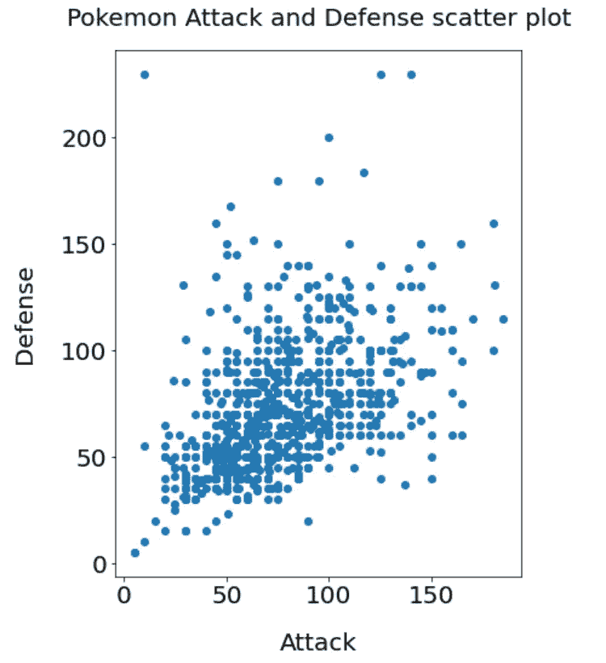

作者图片

正如我们从该图中看到的，在该数据集中，防御和攻击之间通常存在正线性关系，但似乎有一些异常值。

**箱线图和 Tukey 栅栏图**

箱线图和 Tukey fences 图是能够从多变量数据集中检测异常值的第一种方法。虽然这些方法能够检测单个变量分布中的异常值，而不是它们之间的相互作用，但我们可以将此作为基线来与其他方法进行比较。我们可以首先把它想象成:

```
#create the plot
ax = sns.boxplot(data = pokemon[["attack", "defense"]], orient = "h", palette = "Set2")
#add labels
ax.set_xlabel("Value", fontsize = 20, labelpad = 20)
ax.set_ylabel("Attributes", fontsize = 20, labelpad = 20)
ax.set_title("Boxplot of pokemon Attack \nand Defense attributes", fontsize = 20,
            pad = 20)
#edit ticks
ax.tick_params(which = "both", labelsize = 15)
```

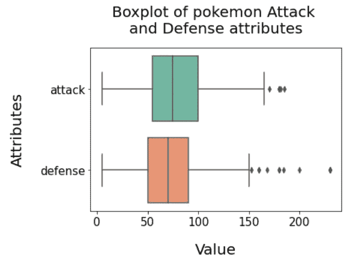

作者图片

这表明在两种分布的上端都可能有异常值。为了提取这些值，我们可以使用 Tukey fences，其值高于上四分位数的上限加上 1.5 倍的四分位数间距，低于下四分位数的下限减去 1.5 倍的四分位数间距:

```
#create a function to calculate IQR bounds
def IQR_bounds(dataframe, column_name, multiple):
    """Extract the upper and lower bound for outlier detection using IQR

    Input:
        dataframe: Dataframe you want to extract the upper and lower bound from
        column_name: column name you want to extract upper and lower bound for
        multiple: The multiple to use to extract this

    Output:
        lower_bound = lower bound for column
        upper_bound = upper bound for column"""

    #extract the quantiles for the column
    lower_quantile = dataframe[column_name].quantile(0.25)
    upper_quantile = dataframe[column_name].quantile(0.75)
    #cauclat IQR
    IQR = upper_quantile - lower_quantile

    #extract lower and upper bound
    lower_bound = lower_quantile - multiple * IQR
    upper_bound = upper_quantile + multiple * IQR

    #retrun these values
    return lower_bound, upper_bound#set the columns we want
columns = ["attack", "defense"]
#create a dictionary to store the bounds
column_bounds = {}#iteratre over each column to extract bounds
for column in columns:
    #extract normal and extreme bounds
    lower_bound, upper_bound =  IQR_bounds(pokemon, column, 1.5) #send them to the dictionary
    column_bounds[column] = [lower_bound, upper_bound]#create the normal dataframe
pokemon_IQR_AD = pokemon[(pokemon["attack"] < column_bounds["attack"][0]) | 
                         (pokemon["attack"] > column_bounds["attack"][1]) |
                         (pokemon["defense"] < column_bounds["defense"][0]) | 
                         (pokemon["defense"] > column_bounds["defense"][1])
                        ]
```

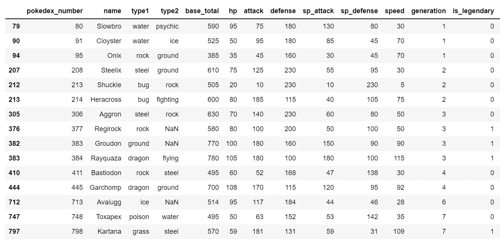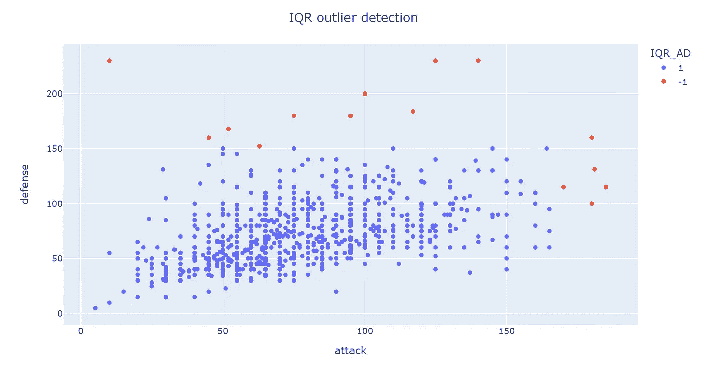

作者提供的图片

我们从整个数据集中检测出 15 个潜在的异常值。正如我们所见，这导致了高于 180 攻击和/或高于 150 防御的异常值。因此，这表明识别这些异常值的线性截止值，但这是基于单个变量，而不是相互作用。

**隔离林**

能够处理这些变量之间相互作用的第一种方法是隔离林。这通常是一个很好的起点，尤其是对于高维数据集。它是一种建立在决策树基础上的树集成方法，就像随机森林一样，通过首先随机选择一个特征，然后在所选特征的最大值和最小值之间选择一个随机分割值来划分树。原则上，异常值没有常规观测值频繁，并且价值不同。因此，通过使用随机分区，它们应该被识别为更靠近树的根，需要更少的分裂。

为此，算法要求我们指定污染参数，该参数告诉算法预计有多少数据是异常的。在我们的例子中，根据 Tukey fences 分析，这可以设置为 0.02，表示我们认为 2%的数据可能是异常的，相当于 16 个点。这可以通过以下方式实现:

```
from sklearn.ensemble import IsolationForest#create the method instance
isf = IsolationForest(n_estimators = 100, random_state = 42, contamination = 0.02)
#use fit_predict on the data as we are using all the data
preds = isf.fit_predict(pokemon[["attack", "defense"]])
#extract outliers from the data
pokemon["iso_forest_outliers"] = preds
pokemon["iso_forest_outliers"] = pokemon["iso_forest_outliers"].astype(str)
#extract the scores from the data in terms of strength of outlier
pokemon["iso_forest_scores"] = isf.decision_function(pokemon[["attack", "defense"]])#print how many outliers the data suggests
print(pokemon["iso_forest_outliers"].value_counts())# Out:
1    785
-1   16
```

我们有 16 个异常值。然后，我们可以将其绘制为:

```
#this plot will be repeated so it is better to create a function
def scatter_plot(dataframe, x, y, color, title, hover_name):
    """Create a plotly express scatter plot with x and y values with a colour

    Input:
        dataframe: Dataframe containing columns for x, y, colour and hover_name data
        x: The column to go on the x axis
        y: Column name to go on the y axis
        color: Column name to specify colour
        title: Title for plot
        hover_name: column name for hover

    Returns:
        Scatter plot figure
    """
    #create the base scatter plot
    fig = px.scatter(dataframe, x = x, y=y,
                    color = color,
                     hover_name = hover_name)
    #set the layout conditions
    fig.update_layout(title = title,
                     title_x = 0.5)
    #show the figure
    fig.show()#create scatter plot
scatter_plot(pokemon, "attack", "defense", "iso_forest_outliers",
             "Isolation Forest Outlier Detection",
            "name")
```

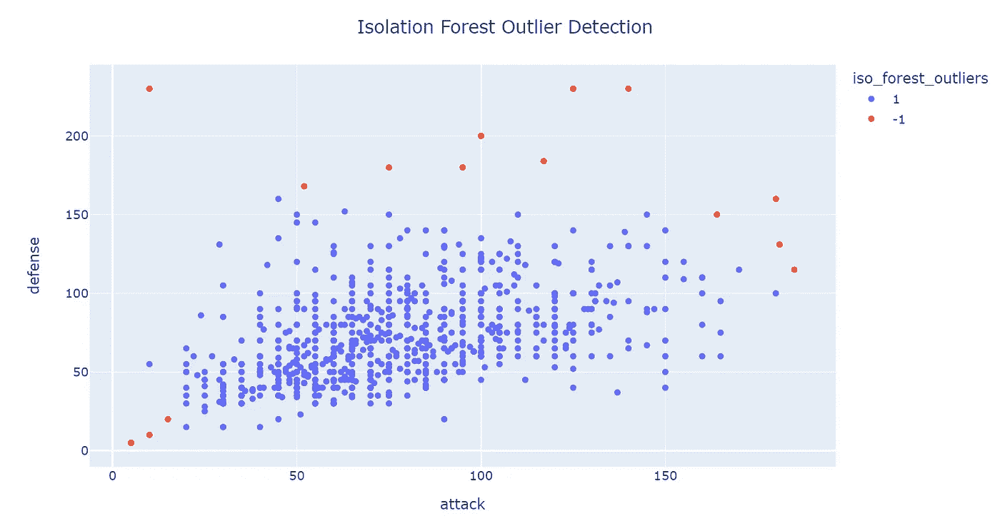

作者图片

我们可以看到，与 Tukey Fences 不同，每个变量的顶部或底部没有明显的分界线，左下角的点也被识别为异常值。我们还可以根据这些变量在决策树中的位置，看到它们的得分范围。

```
#create the same plot focusing on the scores from the dataset
scatter_plot(pokemon, "attack", "defense", "iso_forest_scores",
             "Isolation Forest Outlier Detection Scores",
            "name")
```

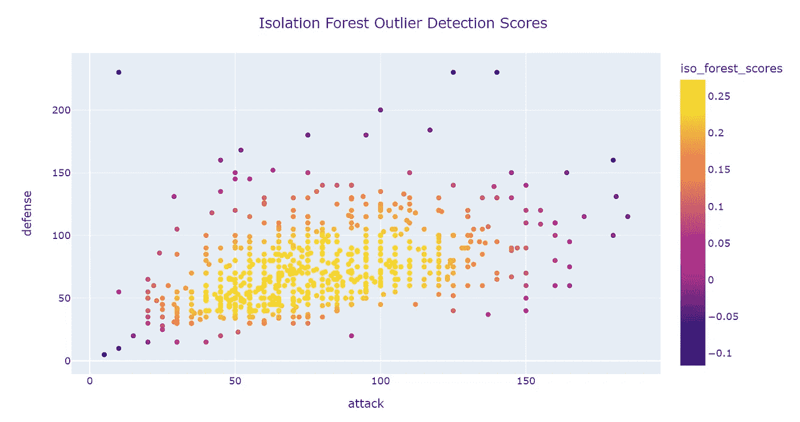

作者图片

我们可以看到哪些点可能被归类为异常值，位于中心的点得分较高，表明这些点是核心点，而位于外围的点得分较低，表明它们可能是异常值。

我们还可以使用单变量异常检测方法，通过识别分数结果中的异常值来选择污染百分比，如下所示:

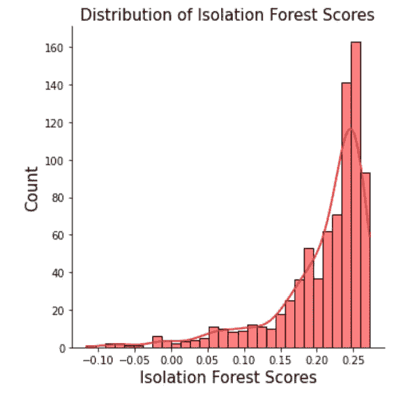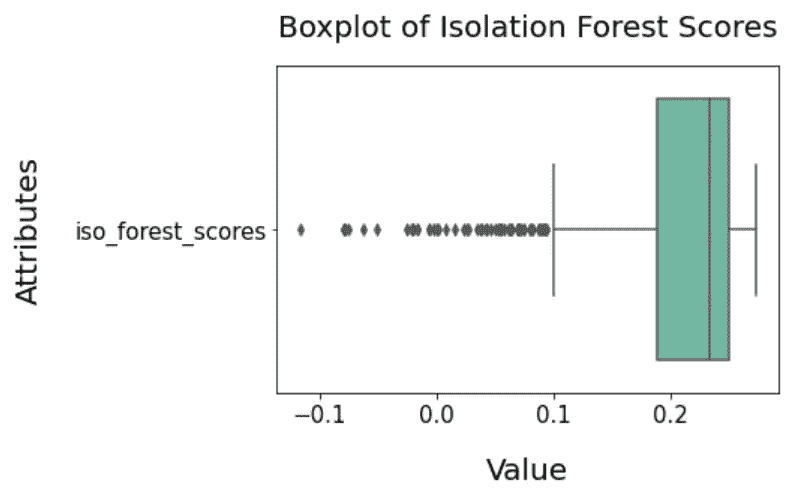

作者提供的图片

这些方法可以用来建议在哪里设置污染参数的截止值，并且可以以相同的方式用于所有随后的算法，在这些算法中可以提取分数。

**局部异常因素**

另一种可以使用的算法是局部离群因子算法。这是一种计算方法，它通过检查一个点的相邻点来找出该点的密度，然后将其与其相邻点的密度进行比较。如果发现一个点的密度比其相邻点的密度小得多，表明是孤立的，那么这个点可以被识别为异常值。

该算法的优势在于，它将数据集的局部和全局属性都考虑在内，因为它关注的是样本相对于其相邻样本的孤立程度。为此，我们需要指定要比较密度的邻居数量(默认为 20)以及要使用的距离度量(默认为“minkowski ”,它概括了欧几里德距离和曼哈顿距离)。因此，这可以应用为:

```
#import the algorithm
from sklearn.neighbors import LocalOutlierFactor#initialise the algorithm
lof = LocalOutlierFactor(n_neighbors = 20)
#fit it to the training data, since we don't use it for novelty than this is fine
y_pred = lof.fit_predict(pokemon[["attack", "defense"]])#extract the predictions as strings
pokemon["lof_outliers"] = y_pred.astype(str)
#print the number of outliers relative to non-outliers
print(pokemon["lof_outliers"].value_counts())
#extract the outlier scores
pokemon["lof_scores"] = lof.negative_outlier_factor_#Out:1   767
-1  34
```

其中使用 20 个邻居的默认值给我们 39 个潜在的异常值。我们可以再次检查异常值和分数的分布:

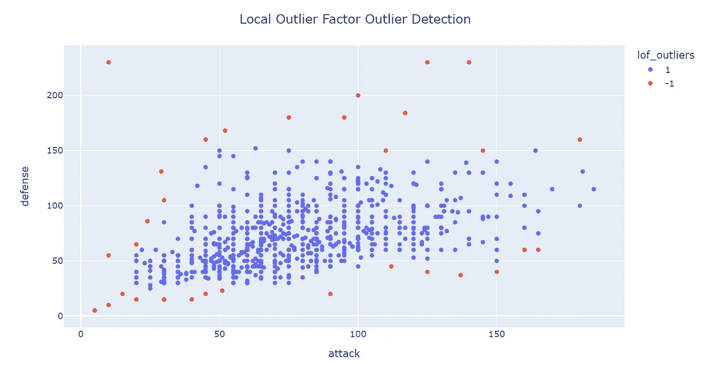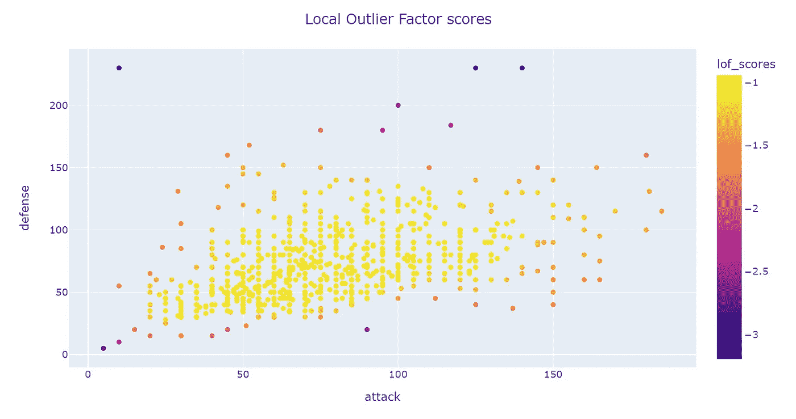

作者提供的图片

同样，我们可以看到，与前面的算法类似，离群点是在点的主要质量的边缘上检测到的。这是因为强调了密度，位于主要区域之外的点很可能被识别为异常值，因为它们周围没有完全包围它们的点。如前所述，我们还可以使用单变量异常检测方法来分析分数，以调整原始算法中的超参数。

**数据库扫描**

类似地，DBScan 是另一种算法，它也可以基于点之间的距离来检测异常值。这是一种聚类算法，其行为与 LOF 不同，通过选择尚未分配给聚类的点，通过查看在给定距离内是否至少有给定数量的样本来确定它是否是核心点。如果是，那么它与由距离度量识别的在该点的直接到达范围内的所有点一起被指定为核心点。然后，对聚类内的每个点重复这一过程，直到识别出聚类的边缘，在该边缘处，在指定距离内不再有可被识别为核心点的点(在指定距离内具有最小数量的点)。

如果一个点不属于任何潜在的聚类，那么它被认为是异常值，因为它不适合现有的密度或点的聚类。这可以通过以下方式实现:

```
#import the algorithm
from sklearn.cluster import DBSCAN#initiate the algorithm
#set the distance to 20, and min_samples as 5
outlier_detection = DBSCAN(eps = 20, metric = "euclidean", min_samples = 10, n_jobs = -1)
#fit_predict the algorithm to the existing data
clusters = outlier_detection.fit_predict(pokemon[["attack", "defense"]])#extract the labels from the algorithm
pokemon["dbscan_outliers"] = clusters
#label all others as inliers 
pokemon["dbscan_outliers"] = pokemon["dbscan_outliers"].apply(lambda x: str(1) if x>-1 else str(-1))
#print the vaue counts
print(pokemon["dbscan_outliers"].value_counts())# Out:
1    787
-1   14
```

结果如下:


作者图片

这里的关键区别是，只有两个属性的上边缘被选为该算法的异常值，类似于 Tukey Fences。这是因为它们将超出核心点的范围，而左下角的点将在核心点的最小距离内。

这样做的好处是，当特征空间中的值的分布无法假设时，可以使用它，它很容易在 Sklearn 中实现，并且理解起来很直观。但是，选择最佳参数通常是困难的，并且难以用于预测能力。

**椭圆形信封**

椭圆包络是另一种异常检测算法，但它假设数据的一部分是高斯分布。这是通过在给定数据集周围创建一个假想的椭圆区域来实现的，其中落在椭圆内的值被视为正常数据，落在椭圆外的值被视为异常值。

与隔离林一样，该模型的实现需要指定参数`contamination`来表明该模型预期有多少异常值。如前所述，我们可以将其设置为 0.02，这可以实现为:

```
#import the necessary library and functionality
from sklearn.covariance import EllipticEnvelope#create the model, set the contamination as 0.02
EE_model = EllipticEnvelope(contamination = 0.02)
#implement the model on the data
outliers = EE_model.fit_predict(pokemon[["attack", "defense"]])#extract the labels
pokemon["EE_outliers"] = outliers
#change the labels
pokemon["EE_outliers"] = pokemon["EE_outliers"].apply(lambda x: str(-1) if x == -1 else str(1))
#extract the score
pokemon["EE_scores"] = EE_model.score_samples(pokemon[["attack", "defense"]])
#print the value counts for inlier and outliers
print(pokemon["EE_outliers"].value_counts())#out:
1   785
-1  16
```

然后，我们可以将结果和分数可视化如下:

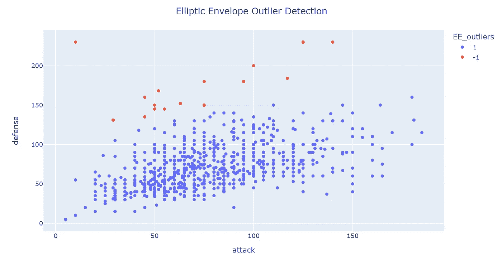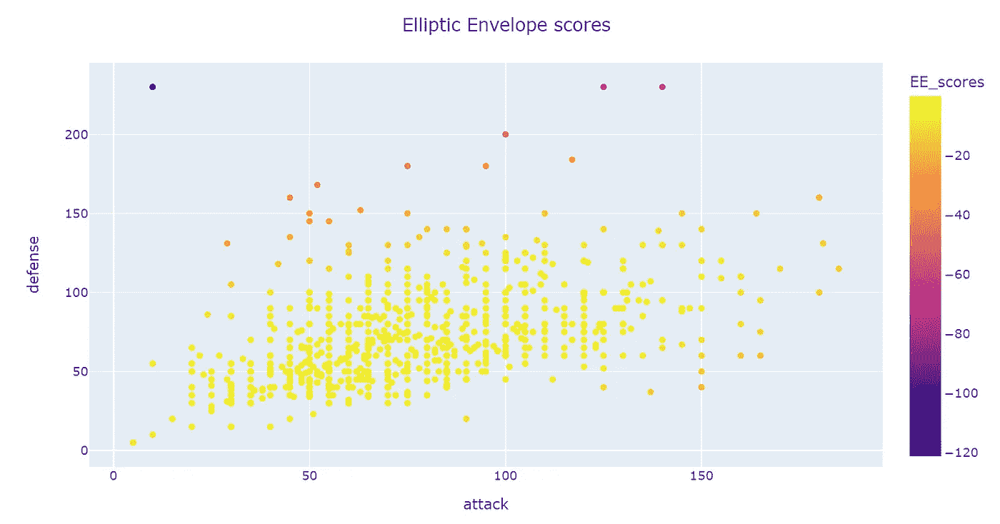

作者提供的图片

我们可以看到，围绕点分布中心(即中心质量)的椭圆已经确定。分数本身是负的 Mahalanobis 距离，它是点和分布(椭圆)之间的距离度量的倒数。因此，远离分布的点得到较低的分数。

与之前相比，由该算法检测到的点之间的主要区别在于，朝向中心左侧的点在这里没有被识别为异常值，这表明这些点已经被计算在椭圆内。

这种方法的困难包括变量分布的正态性要求，以及像以前一样我们不知道污染参数的精确值。然而，假设正态性，如前所述，可以对分数进行单变量分析以识别异常值。

**合奏**

最后，增强对这些方法的信心的一种方法是，不仅使用单一的一种方法，而且将所有方法的预测结合起来。这可以通过以下方式实现:

```
#extract the sum of the outlier count
pokemon['outliers_sum'] = (pokemon['iso_forest_outliers'].astype(int)+
                           pokemon['lof_outliers'].astype(int)+
                           pokemon['dbscan_outliers'].astype(int)+
                          pokemon['EE_outliers'].astype(int))
#print the value counts for each scale
print(pokemon["outliers_sum"].value_counts())# out:
 4    758
 2     24
 0      9
-4      8
-2      2
```

其中在所有算法中只有 8 个被识别为异常值。因此，我们可以把这想象成:

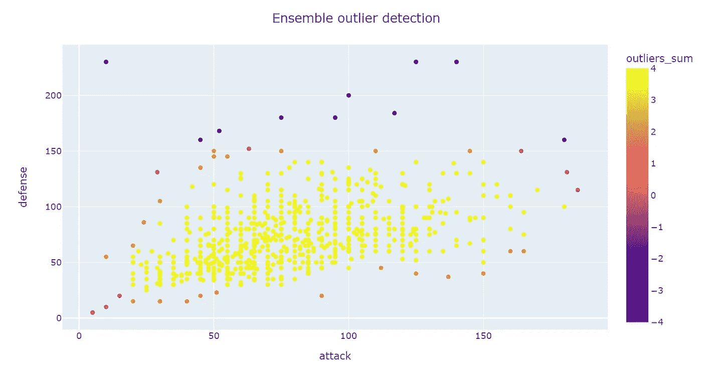

作者图片

我们可以看到不同算法的预测重叠的地方。在这一点上，信任哪个算法是主观判断，是单个算法还是多个算法，这将取决于特定上下文中的领域专业知识。

在本例中，确定的八个神奇宝贝如下所示:

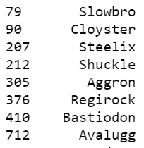

其中集合结果被视为关键度量。

除此之外，还可以使用其他算法，包括:一类 SVM、PCA 和自动编码器。当然，这种选择取决于领域、可用的工具和数据集的维度。然而，这些结果表明，并非所有算法都会产生相同的结果，并且需要一些主观判断。

可用代码:[https://github.com/PhilipDW183/Outlier_detection](https://github.com/PhilipDW183/Outlier_detection)

可用数据集:[https://www.kaggle.com/rounakbanik/pokemon?select=pokemon.csv](https://www.kaggle.com/rounakbanik/pokemon?select=pokemon.csv)

[](https://philip-wilkinson.medium.com/membership) [## 通过我的推荐链接加入媒体-菲利普·威尔金森

### 作为一个媒体会员，你的会员费的一部分会给你阅读的作家，你可以完全接触到每一个故事…

philip-wilkinson.medium.com](https://philip-wilkinson.medium.com/membership) [](/univariate-outlier-detection-in-python-40b621295bc5) [## Python 中的单变量异常检测

### 从数据集中检测异常值的五种方法

towardsdatascience.com](/univariate-outlier-detection-in-python-40b621295bc5) [](/introduction-to-decision-tree-classifiers-from-scikit-learn-32cd5d23f4d) [## scikit-learn 决策树分类器简介

towardsdatascience.com](/introduction-to-decision-tree-classifiers-from-scikit-learn-32cd5d23f4d) [](/london-convenience-store-classification-using-k-means-clustering-70c82899c61f) [## 使用 K-均值聚类的伦敦便利店分类

### 伦敦的便利店怎么分类？

towardsdatascience.com](/london-convenience-store-classification-using-k-means-clustering-70c82899c61f)