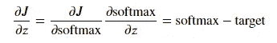
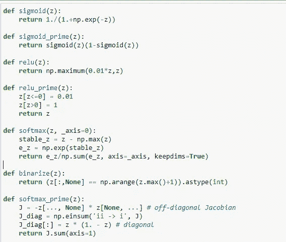

# 用 Numpy 的 einsum 实现多类分类神经网络

> 原文：<https://towardsdatascience.com/multiclass-classification-neural-network-implementation-using-numpys-einsum-3675a7e1e703?source=collection_archive---------31----------------------->

## 用 Numpy 的 einsum 实现两层多类分类神经网络。


鸢尾花——照片由[希拉·斯威兹](https://unsplash.com/@frozenmoments)从 [Unsplash](https://unsplash.com/) 拍摄

我们都通过实现一个小的分类或回归问题来开始我们的机器学习之旅。今天我将使用 pure numpy 实现一个多类分类神经网络。我将使用虹膜数据集。下面是我在 colab 笔记本上的代码的链接。

[](https://colab.research.google.com/drive/1RacUOXLadYAHfq_VSLy8NDcMui_APlPI?usp=sharing) [## 谷歌联合实验室

多类分类神经网络](https://colab.research.google.com/drive/1RacUOXLadYAHfq_VSLy8NDcMui_APlPI?usp=sharing) 

我将创建一个 2 层神经网络。第一个隐藏层将使用`leaky_relu`激活函数，第二个隐藏层将使用`softmax`激活函数。

> Softmax 函数返回属于每个类的概率。

`softmax`的导数实现起来有点棘手，因为它涉及到创建一个雅可比矩阵。出于所有实际目的，`softmax`将始终用于多类分类神经网络的最外层，因此计算其导数并不重要，只要我们能够获得成本函数 J 相对于 logits z 的导数即可。与计算 softmax 函数本身的导数相比，计算该导数相当简单。我在下图中展示了导数:



最外层中成本函数 J w r t logit z 的偏导数。

如果你还执着于得到 softmax 的导数，它的实现就写在下图所示的`softmax_prime`函数中。



实现神经网络的效用函数(图片归作者所有)

> 如上图所示，特别注意 *softmax* 和*二进制化*功能。

现在让我们来理解`binarize`功能。它转换标签 0，1，2 等。一个热编码数组，比如:

```
+=======+===========+
| Label | Binarize |
+=======+===========+
| 0      | [1,0,0,0] |
+ — — — -+ — — — — — -+
| 1      | [0,1,0,0] |
+ — — — -+ — — — — — -+
| 2      | [0,0,1,0] |
+ — — — -+ — — — — — -+
| 3      | [0,0,0,1] |
+ — — — -+ — — — — — -+
```

这很重要，因为在多类分类中，目标将属于数据中存在的多个类之一。此外，最终的 softmax 图层将返回记录属于这些分类标签的概率。因此，将类标签转换成一个热编码记录是很重要的。在实现中，`binarize`函数巧妙的利用了 numpy 的广播概念。

# 我们现在可以看代码了吗？

> 我在开始时使用了 numpy 的可怕的、臭名昭著的步进函数来创建数组的滑动窗口视图，该视图包含每层中的单元数。使用这个函数的风险更大，因为它在创建视图时不检查给定数组的边界，这很容易导致缓冲区溢出。尽管使用起来风险更大，但我还是用了，因为为什么不呢。在灵巧的手中，它就像一把瑞士军刀。但愿 tensorflow 有类似`as_strided`函数的等价东西。

```
def murals_batch(units_count, x, y, lr, epochs, bias=False, _seed=42):
    batch_size, ni = x.shape[-2:]
    units_count.insert(0,ni)
    units_count_arr = np.array(units_count)
    L, = units_count_arr.shape # Number of layers + 1
    # RED ALERT - `as_strided` function is like a LAND-MINE ready to explode in wrong hands!
    arr_view = as_strided(units_count_arr, shape=(L-1,2), strides=(4,4))
#     print(arr_view)
    rng = np.random.default_rng(seed=_seed)
    wghts = [None]*(L-1)
    intercepts = [None]*(L-1)
    # WEIGHTS INITIALIZATION
    for i in range(L-1):
        w_cols, w_rows = arr_view[i,:]
        wghts[i] = rng.random((w_rows, w_cols))
        if bias:
            intercepts[i] = rng.random((w_rows,))
    costs = np.zeros(epochs)
    # Gradient Descent
    for epoch in range(epochs):
        # FORWARD PROPAGATION
        # hidden layer 1 implementation, relu activation   
        h1a = np.einsum('hi,Bi -> Bh', wghts[0], x)
        if bias:
            h1a = h1a + intercepts[0]
        h1 = relu(h1a)
        # hidden layer 2 implementation, softmax activation
        h2a = np.einsum('ho,Bo -> Bh', wghts[1], h1) 
        if bias:
            h2a = h2a + intercepts[1]
        hyp = softmax(h2a, _axis=1)
        current_epoch_cost = -np.einsum('Bi,Bi', y, np.log(hyp))/batch_size
#         print(current_epoch_cost)
        costs[epoch] = current_epoch_cost
        # BACKWARD PROPAGATION
        # layer 2
        dJ_dH2a = hyp - y
        dJ_dW1 = np.einsum('Bi,Bj -> ij',dJ_dH2a, h1)/batch_size
        # layer 1
        dJ_dH1 = np.einsum('Bi,ij -> Bj', dJ_dH2a, wghts[1])
        dJ_dH1a = dJ_dH1*relu_prime(h1a)
        dJ_dW0 = np.einsum('Bi,Bj -> ij',dJ_dH1a, x)/batch_size
        if bias:
            dJ_dB1 = np.einsum("Bi -> i", dJ_dH2a)/batch_size
            dJ_dB0 = np.einsum("Bi -> i",dJ_dH1a)/batch_size
        # WEIGHTS ADJUSTMENT
        wghts[1] = wghts[1] - lr*dJ_dW1
        wghts[0] = wghts[0] - lr*dJ_dW0
        if bias:
            intercepts[1] = intercepts[1] - lr*dJ_dB1
            intercepts[0] = intercepts[0] - lr*dJ_dB0
    if bias:
        return (costs, wghts, intercepts)
    else:
        return (costs, wghts)iris = load_iris()
x = iris.data
y = iris.target# NORMALIZE
x_norm = normalize(x)
x_train, x_test, y_train, y_test = train_test_split(x_norm, y, test_size=0.33, shuffle=True, random_state=42)# BINARIZE
y_train = binarize(y_train)
y_test = binarize(y_test)unit_per_layer_counts = [10,3]
costs, fw, fb = murals_batch(unit_per_layer_counts, x_train, y_train, lr=0.01, epochs=19000, bias=True)plt.plot(costs)def predict(x,fw,fb):
    h1a = np.einsum(’hi,Bi -> Bh’, fw[0], x)+fb[0]
    h1 = relu(h1a)
    h2a = np.einsum(’ho,Bo-> Bh’,fw[1],h1)+fb[1]
    return softmax(h2a)
```


分类交叉熵损失随时期的变化(图片归作者所有)

> 还要看看高效代码执行 19000 个纪元所花费的惊人时间！！！


执行 2 层多类分类神经网络 19000 个时期所花费的时间(图片归作者所有)

这种效率是由于 numpy 的爱因斯坦求和函数用于实现神经网络。我在之前的博客[https://manishankar . medium . com/batch-gradient-descent-algorithm-using-numpy-einsum-f 442 ef 798 ee 2](https://manishankar.medium.com/batch-gradient-descent-algorithm-using-numpy-einsum-f442ef798ee2)中已经详细讨论过了

请让我知道你对这篇博文和代码实现的看法以及你的评论。

我是 TCS 的机器学习工程师，我的(数字软件和解决方案)团队正在开发令人惊叹的产品。点击下面的链接，了解更多关于我们产品的信息:

[](https://www.tcs.com/dss) [## 数字软件和解决方案:提供高度个性化的体验

### Digital Software & Solutions 的互联智能解决方案将帮助您转变产品和服务…

www.tcs.com](https://www.tcs.com/dss)