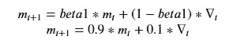
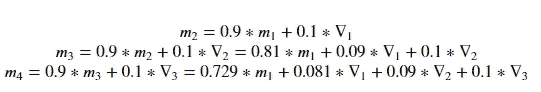
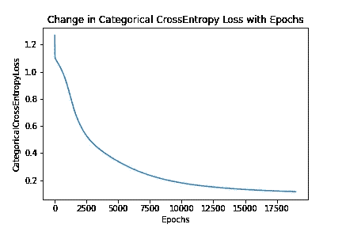
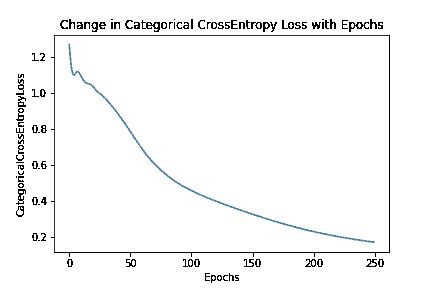
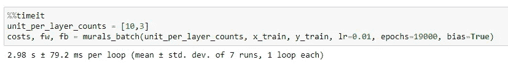

# 使用 Adam 优化器的多类分类神经网络

> 原文：<https://towardsdatascience.com/multiclass-classification-neural-network-using-adam-optimizer-fb9a4d2f73f4?source=collection_archive---------15----------------------->

## 这是我的博客系列的继续，在我的博客系列中，我使用 numpy 的 einsum 来实现完整的模型。


爱德华·豪厄尔在 [Unsplash](https://unsplash.com?utm_source=medium&utm_medium=referral) 上拍摄的照片

我想以一种更实际的方式来看看 Adam 优化器和梯度下降优化器之间的区别。所以我决定改为实现它。

在这里，我采用了虹膜数据集，并实现了一个多类分类 2 层神经网络，就像我在[以前的博客中所做的那样。](/multiclass-classification-neural-network-implementation-using-numpys-einsum-3675a7e1e703)这次唯一不同的是我用了 Adam 优化器，而不是梯度下降。

```
def leaky_relu(z):
    return np.maximum(0.01*z,z)def leaky_relu_prime(z):
    z[z<=0] = 0.01
    z[z>0] = 1
    return zdef softmax(z, _axis=0):
    stable_z = z - np.max(z)
    e_z = np.exp(stable_z)
    return e_z/np.sum(e_z, axis=_axis, keepdims=True)def binarize(z):
    return (z[:,None] == np.arange(z.max()+1)).astype(int)def pasapali_batch(units_count, x, y, lr, epochs, bias=False, _seed=42):
    beta1 = 0.9
    beta2 = 0.999
    eps = np.nextafter(0, 1)
    batch_size, ni = x.shape[-2:]
    units_count.insert(0,ni)
    units_count_arr = np.array(units_count)
    L, = units_count_arr.shape # Number of layers + 1
    # RED ALERT - `as_strided` function is like a LAND-MINE ready to explode in wrong hands!
    arr_view = as_strided(units_count_arr, shape=(L-1,2), strides=(4,4))
#     print(arr_view)
    rng = np.random.default_rng(seed=_seed)
    wghts = [None]*(L-1)
    intercepts = [None]*(L-1)
    M_W = [None]*(L-1)
    M_B = [None]*(L-1)
    V_W = [None]*(L-1)
    V_B = [None]*(L-1)
    # WEIGHTS & MOMENTS INITIALIZATION
    for i in range(L-1):
        w_cols, w_rows = arr_view[i,:]
        wghts[i] = rng.random((w_rows, w_cols))
        M_W[i] = np.zeros((epochs+1, w_rows, w_cols))
        V_W[i] = np.zeros((epochs+1, w_rows, w_cols))
        if bias:
            intercepts[i] = rng.random((w_rows,))
            M_B[i] = np.zeros((epochs+1, w_rows))
            V_B[i] = np.zeros((epochs+1, w_rows))

    # COSTS INITIALIZATION
    costs = np.zeros(epochs)

    # Gradient Descent
    for epoch in range(epochs):
        # FORWARD PROPAGATION
        # hidden layer 1 implementation, relu activation   
        h1a = np.einsum(’hi,Bi -> Bh’, wghts[0], x)
        if bias:
            h1a = h1a + intercepts[0]
        h1 = leaky_relu(h1a)
        # hidden layer 2 implementation, softmax activation
        h2a = np.einsum(’ho,Bo -> Bh’, wghts[1], h1) 
        if bias:
            h2a = h2a + intercepts[1]
        hyp = softmax(h2a, _axis=1)
        current_epoch_cost = -np.einsum(’Bi,Bi’, y, np.log(hyp))/batch_size
#         print(current_epoch_cost)
        costs[epoch] = current_epoch_cost
        # BACKWARD PROPAGATION
        # layer 2
        dJ_dH2a = hyp - y
        dJ_dW1 = np.einsum(’Bi,Bj -> ij’,dJ_dH2a, h1)/batch_size
        # layer 1
        dJ_dH1 = np.einsum(’Bi,ij -> Bj’, dJ_dH2a, wghts[1])
        dJ_dH1a = dJ_dH1*leaky_relu_prime(h1a)
        dJ_dW0 = np.einsum(’Bi,Bj -> ij’,dJ_dH1a, x)/batch_size
        # numerical optimization
        beta1_denom = (1.0 - beta1**(epoch+1))
        beta2_denom = (1.0 - beta2**(epoch+1))
        if bias:
            dJ_dB1 = np.einsum("Bi -> i", dJ_dH2a)/batch_size
            dJ_dB0 = np.einsum("Bi -> i",dJ_dH1a)/batch_size
            # MOMENTS ADJUSTMENT
            M_B[0][epoch+1,:] = beta1 * M_B[0][epoch,:] + (1.0 - beta1)*dJ_dB0
            M_B[1][epoch+1,:] = beta1 * M_B[1][epoch,:] + (1.0 - beta1)*dJ_dB1

            V_B[0][epoch+1,:] = beta2 * V_B[0][epoch,:] + (1.0 - beta2)*dJ_dB0**2
            V_B[1][epoch+1,:] = beta2 * V_B[1][epoch,:] + (1.0 - beta2)*dJ_dB1**2
            # BIAS CORRECTION
            mhat_b0 = M_B[0][epoch+1,:] / beta1_denom
            vhat_b0 = V_B[0][epoch+1,:] / beta2_denom

            mhat_b1 = M_B[1][epoch+1,:] / beta1_denom
            vhat_b1 = V_B[1][epoch+1,:] / beta2_denom
            # BIAS ADJUSTMENT with numerical stability
            intercepts[1] = intercepts[1] - lr*mhat_b1/(np.sqrt(vhat_b1) + eps)
            intercepts[0] = intercepts[0] - lr*mhat_b0/(np.sqrt(vhat_b0) + eps)

        # MOMENTS ADJUSTMENT
        M_W[0][epoch+1,:] = beta1 * M_W[0][epoch,:] + (1.0 - beta1)*dJ_dW0
        M_W[1][epoch+1,:] = beta1 * M_W[1][epoch,:] + (1.0 - beta1)*dJ_dW1

        V_W[0][epoch+1,:] = beta2 * V_W[0][epoch,:] + (1.0 - beta2)*dJ_dW0**2
        V_W[1][epoch+1,:] = beta2 * V_W[1][epoch,:] + (1.0 - beta2)*dJ_dW1**2
        # BIAS CORRECTION
        mhat_w0 = M_W[0][epoch+1,:] / beta1_denom
        vhat_w0 = V_W[0][epoch+1,:] / beta2_denom

        mhat_w1 = M_W[1][epoch+1,:] / beta1_denom
        vhat_w1 = V_W[1][epoch+1,:] / beta2_denom
        # WEIGHTS ADJUSTMENT with numerical stability
        wghts[1] = wghts[1] - lr*mhat_w1/(np.sqrt(vhat_w1) + eps)
        wghts[0] = wghts[0] - lr*mhat_w0/(np.sqrt(vhat_w0) + eps) if bias:
        return (costs, wghts, intercepts)
    else:
        return (costs, wghts)iris = load_iris()
x = iris.data
y = iris.target
#NORMALIZE
x_norm = normalize(x)
x_train, x_test, y_train, y_test = train_test_split(x_norm, y, test_size=0.33, shuffle=True, random_state=42)
#BINARIZE
y_train = binarize(y_train)
y_test = binarize(y_test)unit_per_layer_counts = [10,3]
costs, fw, fb = pasapali_batch(unit_per_layer_counts, x_train, y_train, lr=0.01, epochs=200, bias=True)plt.plot(costs)def predict(x,fw,fb):
    h1a = np.einsum(’hi,Bi -> Bh’, fw[0], x)+fb[0]
    h1 = relu(h1a)
    h2a = np.einsum(’ho,Bo-> Bh’,fw[1],h1)+fb[1]
    return softmax(h2a)
```

在代码中，不同之处在于我已经为每一层初始化了两个矩数组，并根据 [Adam 优化](https://arxiv.org/abs/1412.6980)算法更新了这些矩(*或者我应该编写适应的* …)。

在正常的梯度下降优化器中，基于在同一时期中计算的梯度来调整权重。


梯度下降中的权重调整仅取决于当前梯度。—图片归作者所有

在 Adam optimizer 中，权重根据当前和先前时段中计算的梯度移动平均值进行调整。根据 Adam 算法的矩调整被计算为先前和当前梯度的移动平均，然后这些矩被用于更新权重。


Adam 优化器中的权重调整取决于当前和先前的梯度。—图片归作者所有

本文中，β1 = 0.9， ***m*** 根据公式更新:



自适应一阶矩公式根据作者拥有的论文图像

让我们对每个时期逐步展开上述公式。



三个历元中一阶矩 m 公式的扩展。—图片归作者所有

我们看到，在每个时期，先前的梯度被包括在更新中，但是分配给远离当前时期梯度的梯度的权重变得越来越小。这有助于向最小值移动，同时抑制搜索最小值时的梯度振荡。这给了我们穿越鞍点的速度。

让我们谈一谈二阶矩 ***v*** 。在权重调整期间，学习率除以**的均方根*v*。这有助于调整每个重量*的学习率。具有相对较大幅度的权重将具有较大的值 ***v*** ，因此在该方向上具有较小的学习步长。这有助于我们放慢速度，这样我们就不会超过最小值。***

*最后，我们来谈谈偏差校正部分。在原始论文中，他们给出了数学推导并给出了解释。对于门外汉来说，知道引入这种偏差校正在梯度稀疏时有所帮助就足够了，如果不进行校正会导致较大的阶跃。*

*让我们比较一下梯度下降优化器和 Adam 优化器方法中成本函数的收敛性。*

**

*使用梯度下降的成本函数衰减—图片归作者所有*

**

*使用 Adam optimizer 的成本函数衰减—图片归作者所有*

> *Adam optimizer 仅用了 250 个历元就达到了最佳成本值，而梯度下降则用了 19000 个历元。让我想起了超级英雄闪电侠！！*

**

*梯度下降优化器完成 19000 个历元所用的时间为 2.98 秒-图片归作者所有*

**

*Adam optimizer 完成 250 个时期所用的时间大约为 87.3 毫秒—图片归作者所有*

*这是收敛速度的巨大进步。亚当不仅速度快。它也适用于稀疏和非常嘈杂的渐变。*

*请让我知道你对这篇博文和代码实现的看法以及你的评论。*

*我是 TCS 的机器学习工程师，我的(数字软件和解决方案)团队正在开发令人惊叹的产品。*