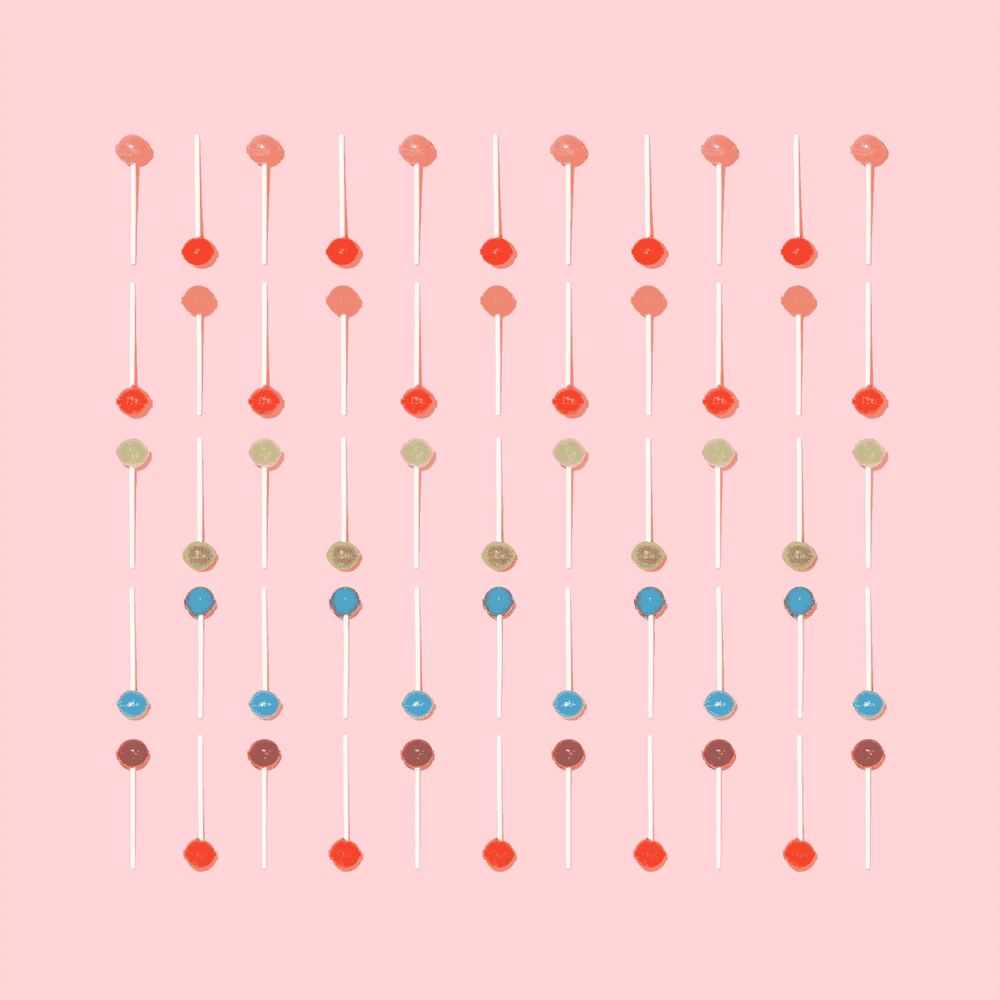
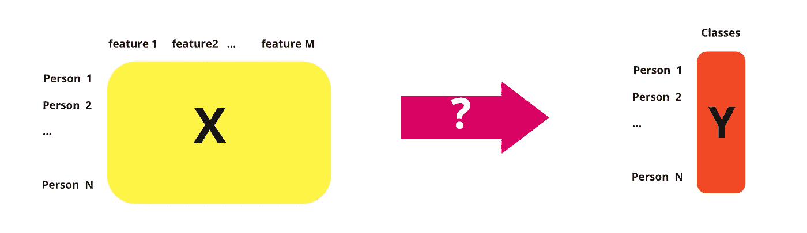
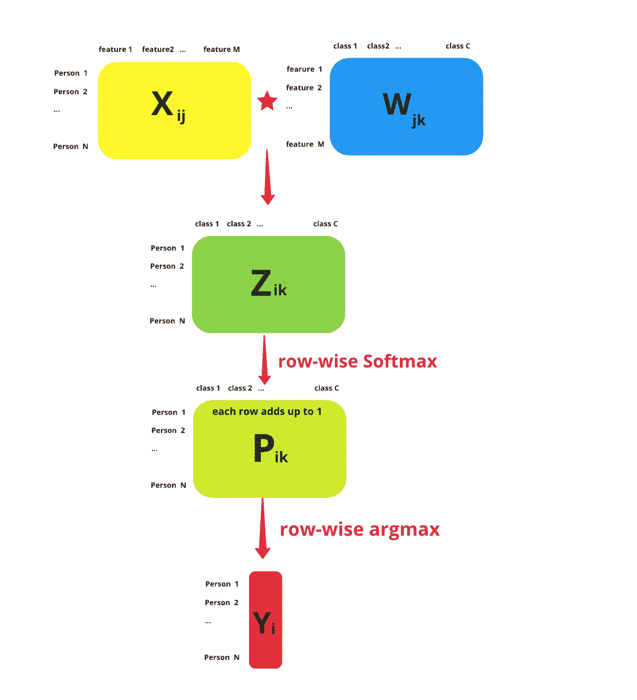
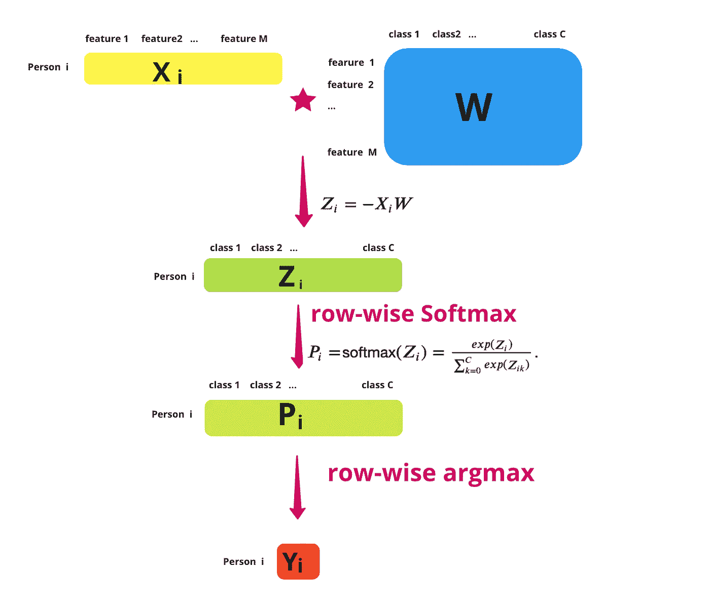
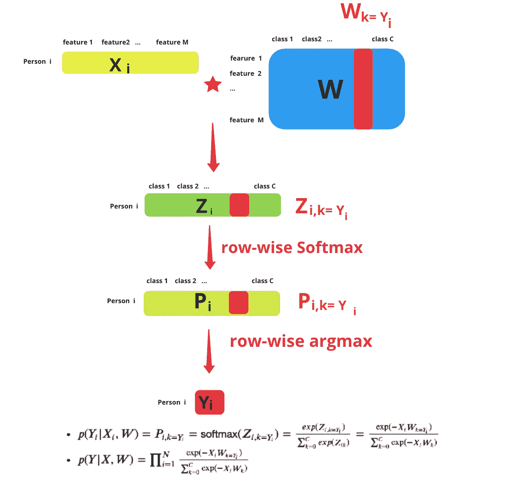
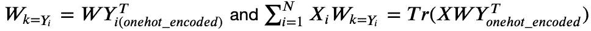
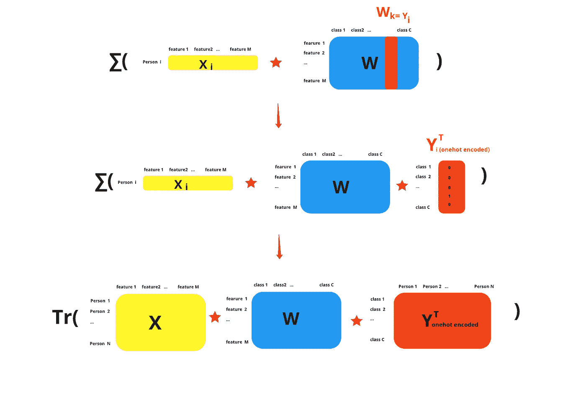
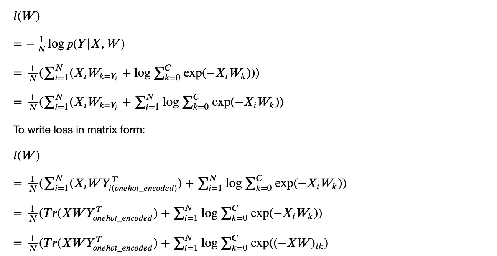
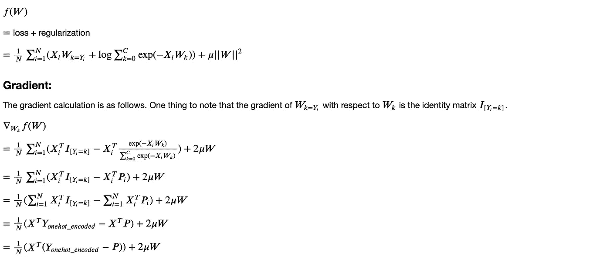
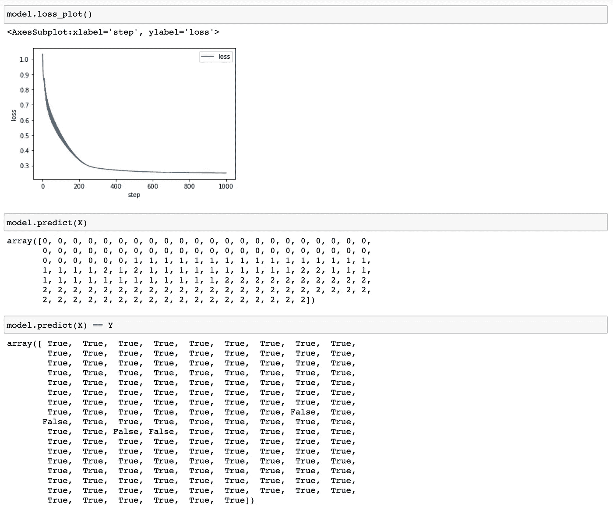

# 从零开始的多类逻辑回归

> 原文：<https://towardsdatascience.com/multiclass-logistic-regression-from-scratch-9cc0007da372?source=collection_archive---------6----------------------->

## *数学和梯度*下降*用 Python 实现*

照片由 [Amy Shamblen](https://unsplash.com/@amyshamblen?utm_source=unsplash&utm_medium=referral&utm_content=creditCopyText) 在 [Unsplash](https://unsplash.com/?utm_source=unsplash&utm_medium=referral&utm_content=creditCopyText) 上拍摄

多类逻辑回归也称为多项逻辑回归和 softmax 回归。当我们想要预测两个以上的类时，就使用它。很多人一直在使用多类逻辑回归，但并不真正知道它是如何工作的。所以，我将向你们展示数学是如何工作的，并使用 Python 中的梯度下降从头开始实现它。

免责声明:关于这个主题有各种各样的符号。我使用了我认为容易理解和形象化的符号。你可以在其他地方找到其他的符号，比如矩阵和向量被转置。

# 问题陈述

作者图片

假设我们有 N 个人/观测值，每个人有 M 个特征，他们属于 C 类。我们被给予:

*   矩阵𝑋是ℝ𝑁×𝑀.𝑋𝑖𝑗代表具有特征 j 的人 I
*   𝑌是ℝ𝑁.的一个载体属于 k 类的𝑌𝑖represents 人 I

我们不知道:

*   权重矩阵𝑊是ℝ𝑀×𝐶.𝑊𝑗𝑘表示特征 j 和类别 k 的权重

我们想找出𝑊，并使用𝑊来预测任何给定的观察值 x 的类成员

# 多类逻辑回归工作流

如果我们知道𝑋和𝑊(比如说我们给𝑊的初始值都是 0)，图 1 显示了多类逻辑回归正向路径的工作流程。

*   首先，我们计算𝑋和𝑊的乘积，这里我们让𝑍=−𝑋𝑊.

有时人们在这里不包括负号。这里有没有负号并不重要。

有时我们还会添加一个偏差项。为简单起见，我们只看本文中的权重。

*   第二，我们取每行𝑍𝑖: 𝑃𝑖=softmax(𝑍𝑖)=𝑒𝑥𝑝(𝑍𝑖)/∑𝑒𝑥𝑝(𝑍𝑖𝑘).的 softmax𝑍𝑖的每一行应该是𝑋(i.e.、𝑋𝑖的每一行和𝑊.的整个矩阵的乘积现在𝑃的每一行加起来应该是 1。
*   第三，我们获取每行的 argmax，并找到概率最高的类。

*图一。多类逻辑回归正向路径(*图片由作者提供)

当我们一次只看一个观察值时，图 2 显示了多类逻辑回归前向路径的另一个视图:

*   首先，我们计算𝑋𝑖和 w 的乘积，这里我们让𝑍𝑖=−𝑋𝑖𝑊.
*   其次，我们对这一行𝑍𝑖: 𝑃𝑖=softmax(𝑍𝑖)=𝑒𝑥𝑝(𝑍𝑖)/∑𝑒𝑥𝑝(𝑍𝑖𝑘).取软最大值
*   第三，我们取这一行𝑃𝑖的 argmax，并找到概率最高的索引作为𝑌𝑖.

*图二。一行上的操作。(*图片作者)

# 可能性

回想一下，在问题陈述中，我们说我们得到了𝑌.所以对于一个给定的观察，我们知道这个观察的类别，这就是𝑌𝑖.𝑌𝑖给定𝑋𝑖和𝑊的似然函数是观测值 I 和𝑘=𝑌𝑖类的概率，是𝑍𝑖,𝑘=𝑌𝑖.的 softmax 而𝑌给出的𝑋和𝑊的似然函数是所有观测的产物。图 3 帮助我们理解这个从𝑌𝑖追溯到𝑊𝑘=𝑌𝑖.的过程

*图 3。计算可能性。(*图片由作者提供)

# 损失函数

接下来，我们计算损失函数。我们使用负对数似然函数，并根据样本大小将其归一化。这里需要注意的一点是

𝑇r 意味着主对角线上元素的总和。图 3 显示了这种计算。

*图四。矩阵计算。(*图片由作者提供)

我们经常在损失函数中加入一个𝑙2 正则项，并试图最小化组合函数。事实上，scikit-learn 的缺省设置使用了𝑙2 惩罚。𝑙1 正则化也是非常常用的。这里我们使用𝑙2 正则化。

# 梯度下降实现

现在我们已经计算了损失函数和梯度函数。我们可以用 Python 实现 loss 和 gradient 函数，实现一个非常基本的梯度下降算法。

我们在 iris 数据集上尝试了我们的模型。我们拟合模型，然后绘制损失与步骤的关系，我们看到损失函数随着时间的推移而下降。当我们查看我们数据的预测时，我们看到该算法正确地预测了大多数类。

这是多类逻辑回归的数学和梯度下降的基本概述。希望这篇文章对你有所帮助。

作者索菲亚·杨 2021 年 4 月 18 日