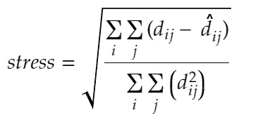
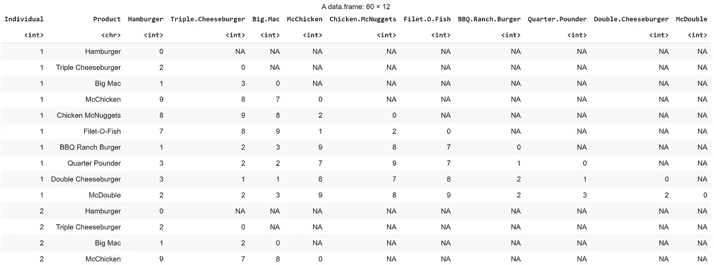
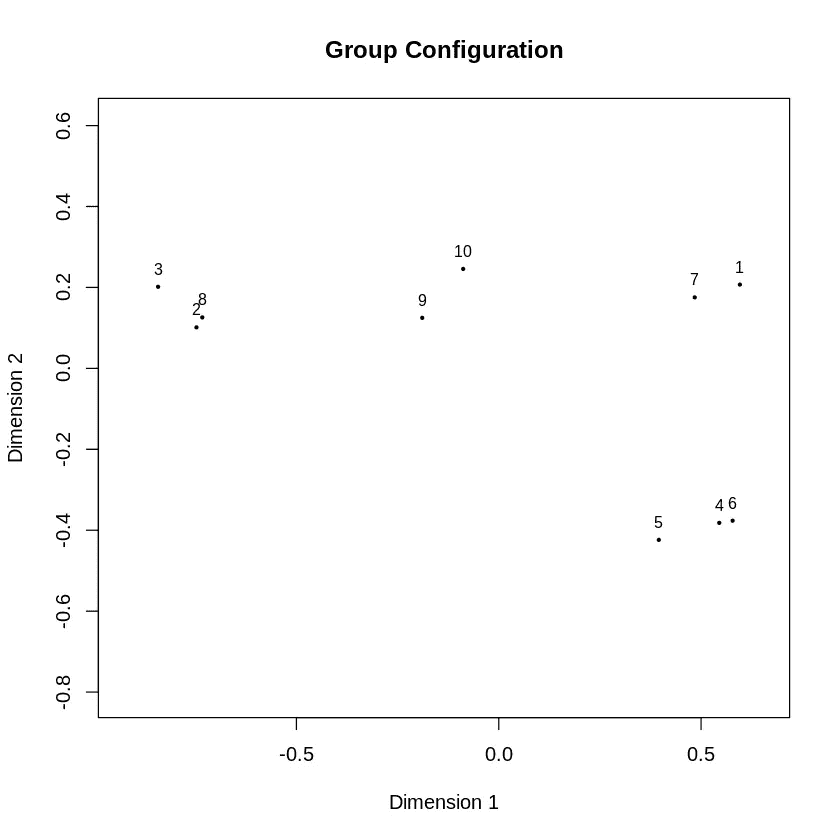
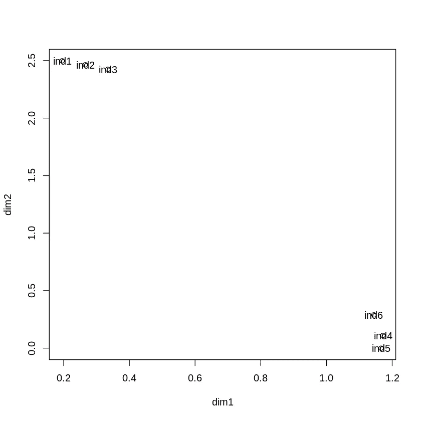
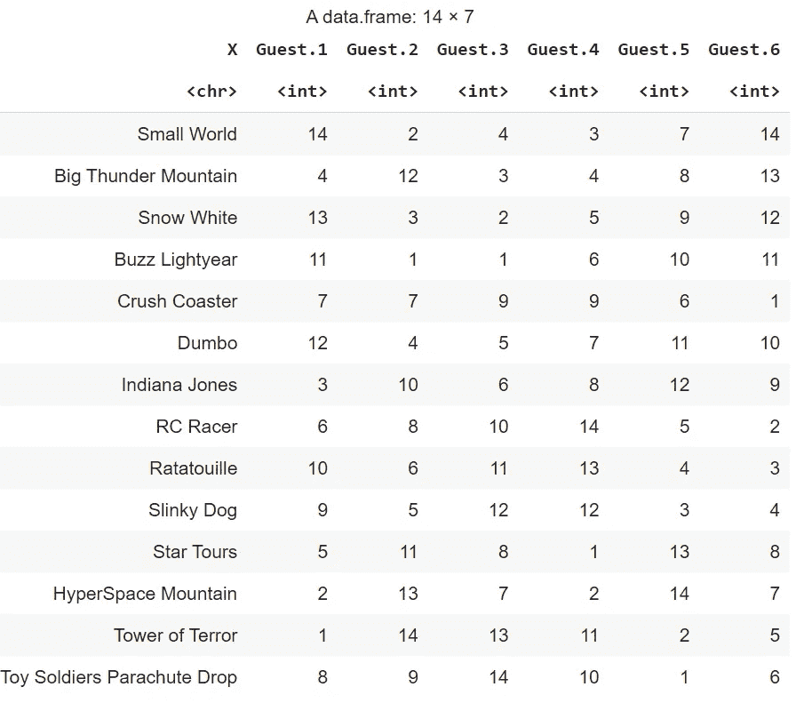
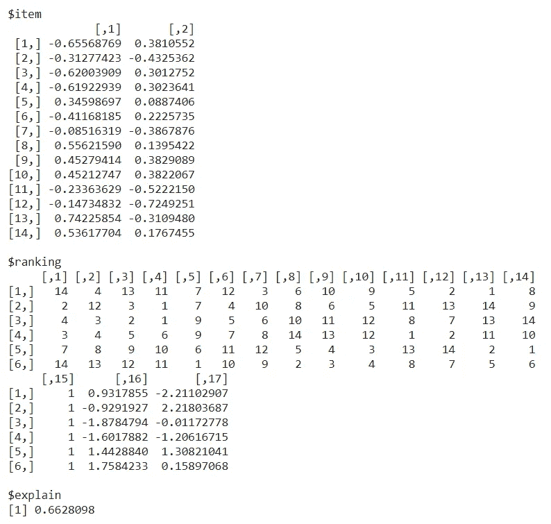
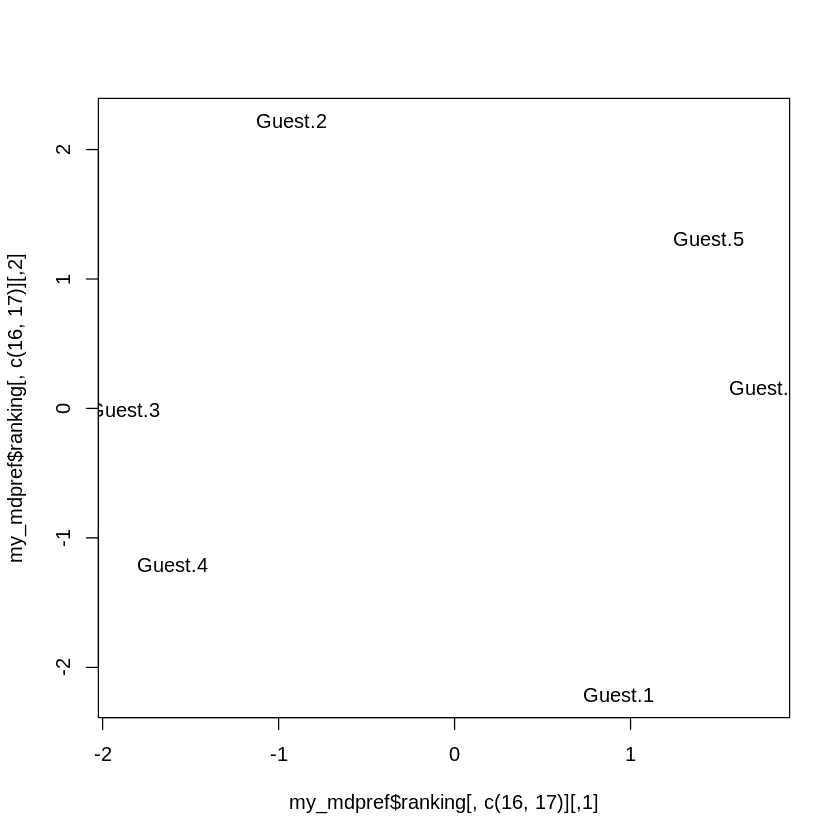

# 多维排列

> 原文：<https://towardsdatascience.com/multidimensional-scaling-d84c2a998f72?source=collection_archive---------7----------------------->

## 多维标度的理论与应用。在 r 中有一个完整的例子。

多维缩放—照片由 [Unsplash](https://unsplash.com/?utm_source=unsplash&utm_medium=referral&utm_content=creditCopyText) 上的[石罩](https://unsplash.com/@stonehood?utm_source=unsplash&utm_medium=referral&utm_content=creditCopyText)拍摄

# 多维排列

多维标度是一系列统计方法，侧重于根据距离创建项目映射。在多维标度中，不同类型的数据有不同的方法:

*   **公制多维标度**，也称为**主坐标分析**，是多维标度的一个子类型，处理*数值距离*，其中没有*测量误差*(每对项目正好有一个距离测量)。
*   **非度量多维标度**是多维标度的一个子类，处理*项目*之间的非数字距离，其中*没有测量误差*(每对项目只有一个距离度量)。
*   **个体差异标度**是一种多维标度，当您对项目之间的距离有*多个(不同)估计值时适用。当多个个体各自给出所有对之间的距离的估计时，通常就是这种情况。*
*   **偏好的多维分析**是一种多维标度，适用于您对项目之间的距离有*多种(不同)估计的情况。该方法不适用于距离矩阵，而是适用于*排名数据*(多个参与者各自从最好到最差排列项目)。*

多维标度最有趣的应用(从统计角度来说)是那些让多个参与者给出(稍微或非常)不同估计的应用。因此，我将在度量和非度量多维标度上讲得快一点，并在个体差异标度和偏好的多维分析上多花一点时间。

# 度量多维标度

第一类多维标度是**度量多维标度**，也称为[主坐标分析](/principal-coordinates-analysis-cc9a572ce6c)。这种方法可以归结为根据观察值之间的距离来创建观察值的映射。

您可以将 Metric dimensional Scaling 视为一种数据可视化方法:输入一定数量的数据点之间的距离矩阵，该方法将输出一个显示这些观察结果的图表。

度量多维标度通常用于感知映射(基于不同于通常的距离度量创建地图)和产品开发。

数学上，度量多维缩放将输入距离矩阵转换为双中心距离矩阵，然后应用奇异值分解。由于这种方法中的统计分析非常简单，我更愿意链接到一篇深入介绍[度量多维扩展](/principal-coordinates-analysis-cc9a572ce6c)的文章。

# 非度量多维标度

我也将简短介绍非度量多维标度，因为它与度量多维标度非常相似。公制和非公制 MDS 的目标完全相同。

区别在于数据的测量尺度。度量多维标度仅适用于间隔标度数据，而您需要非度量多维标度用于序数数据。由于多维标度经常应用于市场营销、心理学等领域，因此它经常受到序数数据的影响，如表达配对之间偏好的数据，或 1-7 个测量标度的数据。

在非度量多维标度中，您从相异矩阵而不是距离矩阵开始。当然，这两者背后的思想是相同的，除了不相似性不能用于计算事物。为了说明这一点，假设我说两种产品非常不同。我可以说他们的相似度是 1 到 10 分。然而，这并不意味着相似度为 2 的一对产品是第一对数据的两倍！

为了对这种类型的数据进行 MDS，我们需要一种不同的方法:我们将使用迭代优化方法和成本函数。我们从在地图上随机放置数据点开始。然后我们计算压力:数据点的原始相异点与它们在地图中的相异点之间的差异。最后，我们使用迭代优化算法来寻找最小化该压力的映射。

多维标度—应力公式

非度量多维标度是一个很好的数据可视化工具，可以让你做一些有趣的用例。在[这篇文章](/principal-coordinates-analysis-cc9a572ce6c)中，您可以了解适合的用例类型。

前两种多维标度方法的一个大缺点是它们都从 1 个距离/相异矩阵开始。在现实生活的数据分析中，对距离进行多次估计要常见得多。例如，在一项产品开发研究中，你问人们如何看待你的产品，**你可以很容易地采访 100 个人，最后得到 100 个不同的相异矩阵！**

在本文接下来的部分，您将发现两种方法，它们允许您**对产品的相似性以及个人观点和评估的差异进行建模。**

# 个体差异量表

我们现在开始第三种多维标度方法，称为个体差异标度。这种方法在模型中加入了人类的异质性。这使得模型更加现实，因为人类并不以同样的方式看待世界。数据的变化往往比一般平均值更重要。

个体差异衡量是一个具有三个主要映射的模型:

*   一张*个人感知图*，用于研究中的每个个体参与者
*   *组刺激空间*是代表“最终”地图上产品的映射
*   *主题空间*具有一组用于每个个体的权重，其将每个*个体映射*转换成*组刺激空间*映射。

这意味着该模型确实允许人们对现实有**不同的感知**(他们每个人仍然有自己的地图)，并且它将这些不同的感知转换成对**总体感知的估计。**

在以前的方法中，我们必须忽略人们意见不同的事实，并且我们必须定义一个单一的相异度矩阵。接受个体差异使得**个体差异衡量更接近现实。**

## 个体差异量表示例

在这个例子中，我们将使用 10 种麦当劳产品之间不同之处的模拟数据集。我们模拟了 5 个人的相异矩阵。分析的目标是:

*   创建群体刺激空间，以更好地了解产品的相似性
*   创建主题空间，了解人与人之间的差异

## R 中的个体差异标度

让我们开始研究这个例子。我们将有 5 个不同的矩阵作为输入。五个相异矩阵已经被连接在一个数据文件中。您可以使用以下代码从我的 AWS S3 桶中获取这些数据:

多维缩放-导入数据

数据将如下所示:

多维标度—数据集

要使用 R 中的单个缩放函数，首先需要将这些数据转换成距离矩阵列表。您可以这样做:

多维标度-距离矩阵列表

现在，我们将使用`smacof`包来拟合个体差异缩放模型:

多维标度—拟合 indscal 模型

个体差异标度最有趣的地方是前面提到的图:

*   理解对产品相似性的总体认知的群体空间
*   理解为什么参与者对你的产品有这种感觉的主题空间。

## 群体空间

让我们从生成组空间开始。组空间是由 smacof 的 indscal 函数输出的标准图，如下所示:

多维标度—绘制组空间

多维标度—组空间

在这个群组空间中，您会看到一些非常有趣的麦当劳产品集群:

*   产品 3(巨无霸)、8(四分之一磅)和 2(三层芝士汉堡)
*   产品 9(双层芝士汉堡)和产品 10(双层麦当劳)
*   产品 7(烧烤牧场汉堡)和 1(汉堡)
*   产品 5(麦乐鸡)、4(麦香鸡)和 6(菲力鱼)

这是一个很好的分组，因为它很容易解释。似乎是:

*   ****第一组包含了*最大的*汉堡****
*   ****第二组包含*双层*汉堡****
*   ****第三组包含*单个*汉堡****
*   ****第四组包含不同动物的汉堡*(鸡肉和鱼肉)*****

***我们可以使用这种聚类来解释已经创建的**两个维度**:***

*   *****尺寸 1** 从左边的大汉堡，到中间的双层汉堡，再到右边的单层汉堡。**维度 1 明确代表** **汉堡大小。*****
*   *****Dimension 2** ranges 底部有非牛汉堡(低分)，高分有牛汉堡。**维 2 明确区分了牛肉和非牛肉。*****

## ***主题空间***

***现在，对于个体差异衡量的第二个主图表，我们将着眼于主题空间。您可以使用以下代码来获取主题空间:***

***多维标度——主题空间***

***您将获得下图:***

******

***多维标度——主题空间***

***有趣的是，在主题空间中，有两个非常明显的集群:***

*   ***个体 1、2 和 3 在维度 2 上非常**高，在维度 1 上非常**低。*******
*   ***个体 4、5 和 6 是相反的:在维度 2 上非常低**并且在维度 1 上非常高**。*******

***我们由此得出的结论非常有趣。我们已经发现区分麦当劳产品的两个重要方面是大小(维度 1)和肉的类型(维度 2)。***

***主题空间给了我们额外的结论:有些人几乎只根据大小来区分麦当劳产品，而有些人几乎只根据肉的种类来区分。***

***总之，个体差异量表让我们深入了解产品之间的相似性，并解释了区分产品的因素。最重要的是，它允许我们对个人偏好建模，并理解人类感知的差异。这才是个体差异缩放的真正附加值！***

# ***偏好的多维分析***

***我将介绍的最后一种多维标度方法是偏好的多维分析。该方法还搜索表示二维平面上的项目的映射。和前面的方法一样，当有多人给你的项目评分时，也可以使用这种方法。然而，最大的区别在于，它对排名数据起作用，而不是对相异度的估计。***

## ***R 中偏好的多维分析***

***对于这个分析，我们需要一个等级数据集。我们将使用六名巴黎迪士尼乐园游客的模拟数据集，他们根据偏好对 14 个景点进行排名(1 个是最高偏好，14 个是最低偏好)。您可以使用以下代码导入数据:***

***多维缩放-导入数据***

***您将获得以下数据帧:***

******

***多维标度—数据集***

***这个数据还不能用于 R 的`mdprep`函数。您需要从数据框中移除第一列。您还需要转置数据:该函数期望“法官”在行中，项目在列中。您还需要添加一个名为“n”的列。只有当很多人给出完全相同的排名时，这个专栏才有用。如果是这种情况，您可以只指定一次该行，但是将值放在“n”中，作为它出现的次数。在我们的例子中，它们都恰好出现一次。***

***多维标度—准备数据***

***现在数据已经准备好了，我们可以继续使用`pmr`包来安装`mdpref`模型。您可以使用以下代码来实现这一点:***

***多维标度—拟合 mdpref 模型***

***拟合模型的内容将是`items`中每个项目的新坐标，`ranking`包含最后两列中裁判的新坐标。`explain`告诉我们该模型使用 2 个维度而不是全部数据解释了多少:我们看到 0.66 (66%)，对于只有 6 个人的 14 个项目来说，这不是很大，但也不算太坏。***

******

***多维缩放-模型内容***

***下一步是最重要的:创建巴黎迪士尼乐园景点的地图。您可以使用以下代码创建它:***

***多维标度-绘制景点***

***您将获得下图:***

******

***多维扩展——吸引力***

***这张图表向我们展示了一些深刻的认识。首先，我们获得几组吸引力:***

*   *****左上组**:小世界、巴斯光年、白雪公主和小飞象***
*   *****右上组:**料理鼠王、遥控赛车、玩具士兵、碾压***
*   *****底部中间组:**奇兵、大雷山、星际之旅、超空间山***
*   *****局外人:**恐怖之塔***

***了解了这些吸引人的地方，我们可以将这些群体解释如下:***

*   *****左上组:**魔法王国 parc 的儿童景点***
*   *****右上组:**华特·迪士尼影城公园的儿童景点***
*   *****底部中间组:**魔幻王国公园的精彩景点***
*   *****恐怖之塔:**华特·迪士尼影城帕洛阿尔托公园中唯一的强烈吸引力(数据集中唯一的一个)***

***这直接让我们能够解释我们的维度测量了什么:***

*   *****Dimension 1** 左侧显示魔法王国景点，右侧显示华特·迪士尼影城景点。尺寸代表*景点所在的 parc*。***
*   ***维度 2 在顶部显示缓慢的吸引力，在底部显示强烈的吸引力。尺寸代表*吸引力的缓慢度*。***

***由于这种分析，我们可以清楚地说，这两个维度是游客吸引力偏好的重要变量。***

***现在我们来看看各个评委(嘉宾)的评分有多大的不同。我们可以使用以下代码创建绘图:***

***多维标度——描绘个体***

***该图将如下所示:***

******

***多维尺度——个体***

***我们看到没有超级明显的客人群体。这意味着一些客人倾向于根据位置进行选择，一些客人倾向于根据强度进行选择，但在这两者之间没有一般的赢家:它们都很重要。***

# ***多维标度的结论***

***在本文中，您已经看到了多维伸缩的不同方法的概述。您首先看到了度量和非度量维度缩放，之后，您看到了两个深入的个体差异缩放和偏好多维分析的代码示例。***

***多维扩展是一系列方法，不同的用例需要不同的方法。我希望这篇文章能为您提供必要的信息，帮助您找到正确的方法，并在实践中将其应用于您的数据集。***

****感谢您的阅读，请不要犹豫，继续关注更多数学、统计和数据科学内容！****