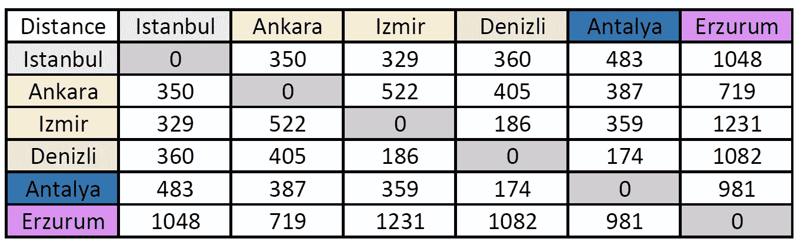
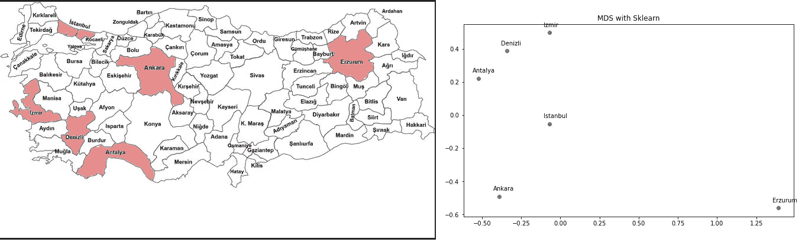
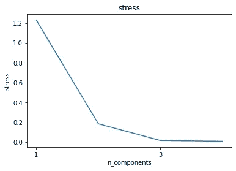
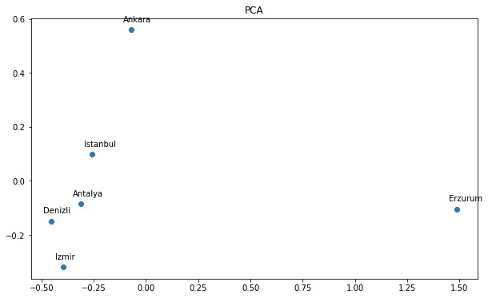
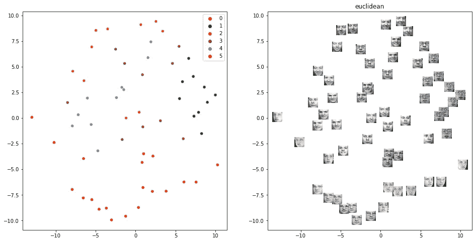
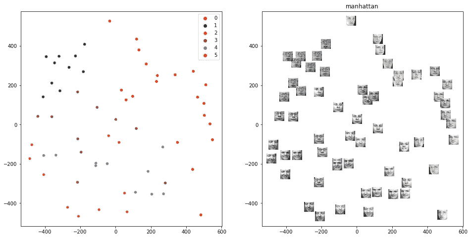
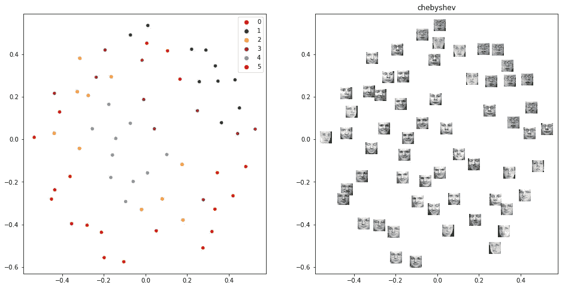
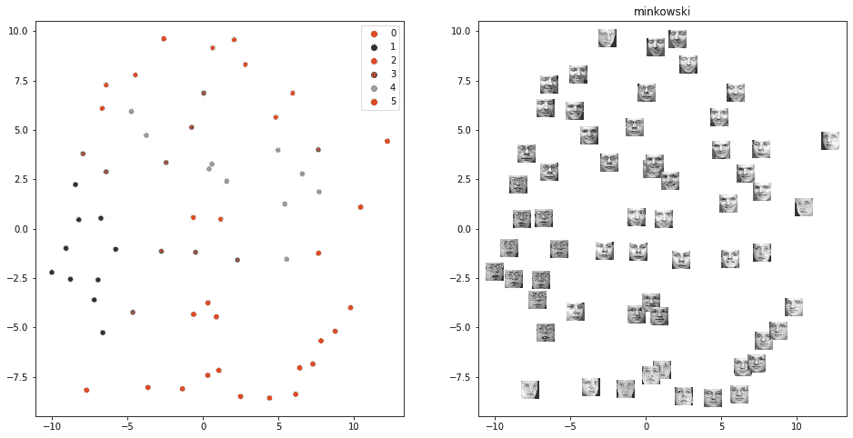
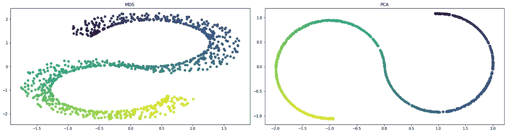
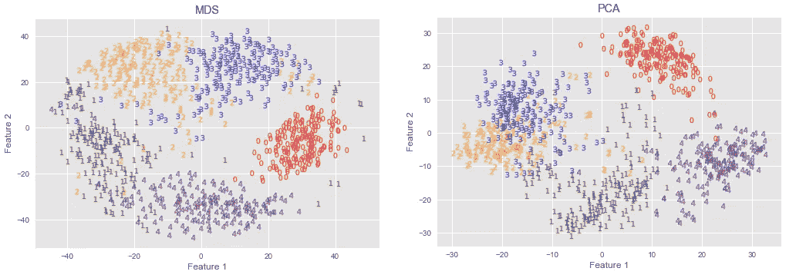

# 用于降维和数据可视化的多维标度(MDS)

> 原文：<https://towardsdatascience.com/multidimensional-scaling-mds-for-dimensionality-reduction-and-data-visualization-d5252c8bc4c0?source=collection_archive---------6----------------------->

## 通过 python 实现使用不同的距离方法解释和再现多维标度(MDS)

降维方法允许根据具有许多特征的数据集中的各种参数(例如相关性、距离、方差)之间的关系，在另一个轴上检查数据集。在这个阶段之后，可以使用监督或无监督学习方法轻松地对数据集执行分类等操作。此外，如果我们考虑具有 30 个特征的数据集，而不是进行 30 维可视化，则在可视化方面，根据它们之间的各种因素从不同方面考虑 30 个特征并使它们二维化会更容易。可以从不同的方面考虑降维方法对数据集的处理，即通过使用傅立叶变换将时间轴中给出的信号变换到频率轴，并有效地处理信号。本文从理论层面讨论了作为降维和可视化方法之一的多维尺度变换的各种类型，并介绍了它的应用领域。python 实现丰富了研究。

```
***Table of Contents* 1\. What is Multi-Dimensional Scaling?
2\. Goodness of fit — Stress —
3\. PCA vs MDS
4\. Different Distance Approaches on image dataset
- Euclidean Distance
- Manhattan Distance
- Chebyshev Distance
- Minkowski Distance
5\. Tutorials
- S curve
- Digits Dataset
6\. Metric MDS and Non-Metric MDS
7\. References**
```


索尔·阿尔维斯在 Unsplash[上的照片](https://unsplash.com?utm_source=medium&utm_medium=referral)

# 1.什么是多维标度？

多维缩放是对象集之间的距离或差异的可视化表示。[1]“对象”可以是颜色、面孔、地图坐标、政治信仰，也可以是任何一种真实的或概念上的刺激[2]。除了将差异解释为图上的距离，MDS 还可以作为高维数据的降维技术[3]。简而言之，MDS 的主要目的是在降维后保持这些不同。

在 Sklearn 库中提供的 MDS 中，距离默认设置为**欧几里德距离**。此外，可以调整和使用其他距离，如曼哈顿(见第 4 节)。



图一。数据集，按作者分类的图像

在下面的代码块中，使用图 1 和图 2(左)中所示的城市之间的航空公司距离创建了一个 6 x 6 数据集，并应用了 MDS sklearn 库中的基础版本。



图二。地图(左)，代码块的输出(右)，图片作者

结果如图 2(右)所示。另外，应力值为`0.188`。在进入压力的话题之前，让我们讨论一下得到的结果。最初，我们有一个 6×6 的矩阵，通过应用 MDS 将数据集的维数减少到 6×2，然后将其可视化。

如果考虑坐标平面，则(x，y)点的位置由参考(0，0)原点确定。任何(x，y)点相对于(0，0)点定位。另一方面，在 MDS，每个列对都是用指定的距离类型计算的。这就是为什么与 MDS 保持距离。当我们看图 2 时，可以看到埃尔祖鲁姆是离其他城市最远的。同样，在应用 MDS 后，彼此靠近的城市的位置也很接近，因此当我们查看 MDS 的结果时，会遇到类似的情况。从不同的角度查看数据集，同时保持数据之间的距离关系。

# 2.契合度——压力——

需要一个特定的表达式来确定在数据分析应用中需要降维到什么程度。在 PCA 中，累积方差是通过绘制一个 scree 图来确定的。在 MDS，距离是模型化的。因此，MDS 的最佳选择是基于实际距离与其估计值之间的差异。这种方法被称为压力。上面示例中绘制应力图的代码块及其输出如下:



图 3。代码块的输出-重音-，作者图像

结果如图 3 所示。在关于 MDS 的原始论文中，Kruskal (1964)根据他的经验给出了以下关于压力值的建议[4]:

```
0.2   – poor
0.1   – fair
0.05  – good
0.025 – excellent
0     – perfect
```

如今，学术研究认为，根据数据集的规模和数据的质量来遵循这一表格会产生误导。

# 3.PCA vs MDS

通过考虑 PCA 中的方差-相关值来执行通过保持 MDS 中的距离来执行的过程。使用欧几里德距离最小化线性距离类似于最大化线性相关性。因此，可以说 PCA 和 MDS 应用数据集的 2D 图形具有相似的特征。当然，这仅适用于使用欧几里得距离的 MDS。此外，可以根据项目应用不同的距离方法。(例如，对于大型数据集，欧几里德距离可能很弱。)PCA 已经应用于上面代码块中的数据集，结果如图 4 所示。

</comprehensive-guide-for-principal-component-analysis-7bf2b4a048ae>  

图 4。PCA 降维，作者降维

# 4.不同的距离方法

已经提到过，在 Sklearn 库中默认使用欧几里德距离。此外，通过设置`dissimilarities = “precomputed”`可以使用各种距离。在下面的代码块中，MDS 被应用于 sklearn 库中不同距离的`fetch_olivetti_faces`数据集，并在 2D 可视化。

## **欧几里德距离**



图 5。MDS 使用欧几里德距离降低了维数，作者使用图像

## **曼哈顿**距离



图 6。通过 MDS 和曼哈顿距离降低维度，通过作者降低图像维度

## **切比雪夫**距离



图 7。通过 MDS 和切比雪夫距离降低维数，图片由作者提供

## **闵可夫斯基**距离



图 8。MDS 使用闵可夫斯基距离降低维度，作者使用图像

查看上面的图像，可以看到每个结果都是根据基于距离的不同特征形成的。应该根据进行选择时所使用的数据集的结构来选择。例如，研究基因的生物学家应该选择和使用对数倍数变化，因为他们对基因的对数倍数变化感兴趣。

# 5.教程

## **S 曲线**

3D S 曲线导入到下面的代码块中。它被渲染成 2D，并用主成分分析和 MDS 可视化。结果如图 9 所示。



图 9。MDS 的 S 曲线(左)，PCA 的 S 曲线(右)，图片作者

如果在项目中使用机器学习对数据集进行分类，那么在使用各种非监督学习方法或监督学习方法应用 MDS 后，分类过程可以很容易地完成。

## 数字

导入 Digits 数据集的前 5 个标签，即 0，1，2，3，4。通过分别应用 MDS 和 PCA 过程，数据集的形状从 901 x 64 转换为 901 x 2。然后进行可视化，结果如图 10 所示。



图 10。数字数据集的维数分别通过 MDS(左)和主成分分析(右)降低，图像通过作者

经过 MDS 过程，可以看出，特别是 2。第三。与 PCA 相比，组形成在更好的簇中。在这个阶段之后，各种机器学习过程的应用将给出有效的结果。

# 6.公制 MDS 和非公制 MDS

到目前为止，它一直专注于度量(经典)多维标度，也称为主坐标分析(PCoA)。在这种方法中，通过考虑特征之间的距离进行降维，并进行可视化。

非公制 MDS 适用于序数数据集。比如在市场调研时收集的调查数据中，比方说 10 以上的 X 牌车会给多少分。在这里，8 分意味着质量比 3 分好。标签 0–1–2–3–4 被用在上面的数字数据集中，但是两者都没有优势。在另一个例子中，当精神病患者被要求评价他们的情绪时，高分和低分意味着不同的东西。

简而言之，虽然度量 MDS 显示了线性关系，但非度量 MDS(也称为有序 MDS)是由一组仅取决于等级值的曲线来描述的。[5]通过设置`metric = False`，它可以用作 Sklearn 库中的非公制 MDS。

# 7.参考

[1]“多维标度:定义、概述、示例—统计方法。”[https://www.statisticshowto.com/multidimensional-scaling/](https://www.statisticshowto.com/multidimensional-scaling/)(2021 年 10 月 14 日访问)。

[2]“多维标度——约瑟夫·b·克鲁斯卡尔，米隆·威希——谷歌图书。”[https://books . Google . de/books/about/多维 _Scaling.html？id = iTydugEACAAJ&redir _ ESC = y](https://books.google.de/books/about/Multidimensional_Scaling.html?id=iTydugEACAAJ&redir_esc=y)(2021 年 10 月 13 日访问)。

[3] A. Buja，D. F. Swayne，M. L. Littman，N. Dean，H. Hofmann 和 L. Chen，“多维标度下的数据可视化”，*计算机学报图表。统计。*，第 17 卷，第 2 期，第 444–472 页，2008 年 6 月，doi: 10.1198/106186008X318440。

[4] NCSS 有限责任公司，“435–1 多维标度”

[5]“多维标度:定义、概述、示例—统计方法。”[https://www.statisticshowto.com/multidimensional-scaling/](https://www.statisticshowto.com/multidimensional-scaling/)(2021 年 10 月 14 日访问)。

<https://ibrahimkovan.medium.com/machine-learning-guideline-959da5c6f73d> 