# 多层感知器用一个真实的例子和 Python 代码解释:情感分析

> 原文：<https://towardsdatascience.com/multilayer-perceptron-explained-with-a-real-life-example-and-python-code-sentiment-analysis-cb408ee93141?source=collection_archive---------0----------------------->

## 多层感知器是一种学习线性和非线性数据之间关系的神经网络

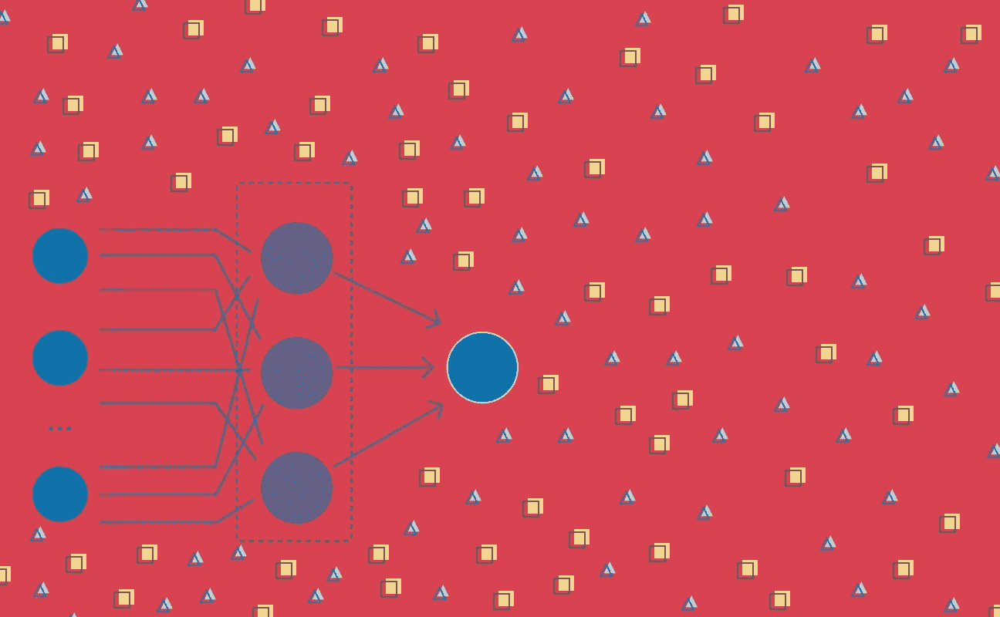

作者图片

这是致力于深度学习系列的第一篇文章，深度学习是一组可以追溯到 20 世纪 40 年代的机器学习方法。深度学习在过去几十年中因其在图像分类、语音识别和机器翻译等领域的开创性应用而受到关注。

*如果你想看用现实生活中的例子和一些 Python 代码解释不同的深度学习算法，请继续关注。*

这一系列文章重点关注**深度学习** **算法**，这在过去几年中受到了很多关注，因为它的许多应用在我们的日常生活中占据了中心位置。从自动驾驶汽车到语音助手，人脸识别或者将语音转录为文本的能力。

这些应用只是冰山一角。自 20 世纪 40 年代初以来，研究和增量应用的漫长道路已经铺就。我们今天看到的改进和广泛应用是硬件和数据可用性赶上这些复杂方法的计算需求的顶点。

# 为什么深度学习正在改变游戏规则

在传统的机器学习中，任何建立模型的人要么必须是他们正在研究的问题领域的专家，要么与一个专家合作。如果没有这方面的专业知识，设计和工程特征将成为一个越来越困难的挑战[1]。机器学习模型的质量取决于数据集的质量，但也取决于特征对数据中模式的编码程度。

**深度学习算法**使用[人工神经网络](https://en.wikipedia.org/wiki/Artificial_neural_network)作为其主要结构。使它们区别于其他算法的是，它们在特征设计和工程阶段不需要专家的输入。神经网络可以*学习*数据的特征。

深度学习算法接受数据集，*学习*它的模式，它们*学习*如何用它们自己提取的特征来表示数据。然后，他们将数据集的不同表示组合成一个更抽象、更高级的数据集表示，每种表示都标识一个特定的模式或特征[1]。这种放手的方法，在特征设计和提取中没有太多的人工干预，允许算法更快地适应手边的数据[2]。

**神经网络**受大脑结构的启发，但不一定是大脑结构的精确模型。关于大脑及其工作方式，我们仍有许多不了解的地方，但由于其开发智力的能力，它一直是许多科学领域的灵感来源。尽管有神经网络是为了理解大脑如何工作而创建的，但我们今天所知的深度学习并不是为了复制大脑如何工作。相反，深度学习专注于启用学习多层次模式构成的系统[1]。

而且，正如任何科学进步一样，**深度学习**并不是从你在最近的文献中看到的复杂结构和广泛应用开始的。

这一切都始于一个基本结构，一个类似大脑的[神经元](https://en.wikipedia.org/wiki/Neuron)的结构。

# 这一切都始于一个神经元

20 世纪 40 年代早期，神经生理学家沃伦·麦卡洛克和逻辑学家沃尔特·皮茨合作创建了一个大脑工作模型。这是一个简单的线性模型，在给定一组输入和权重的情况下，产生正或负的输出。

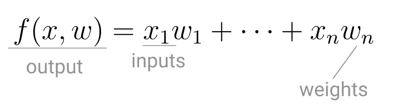

麦卡洛克和皮茨神经元模型。(图片由作者提供)

这种*计算模型*被有意称为**神经元**，因为它试图模仿大脑核心*构建模块*的工作方式。就像大脑神经元接收电信号一样，麦卡洛克和皮茨的神经元接收输入，如果这些信号足够强，就将它们传递给其他神经元。

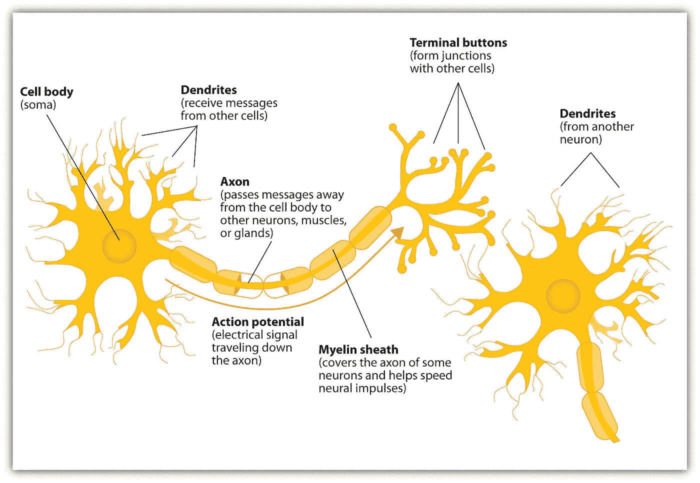

神经元及其不同的组成部分。([图片来源](https://en.wikipedia.org/wiki/File:Components_of_neuron.jpg))

神经元的第一个应用复制了一个[逻辑门](https://en.wikipedia.org/wiki/Logic_gate)，其中有一个或两个二进制输入，以及一个[布尔函数](https://en.wikipedia.org/wiki/Boolean_function)，该函数只有在给定正确的输入和权重时才会被激活。

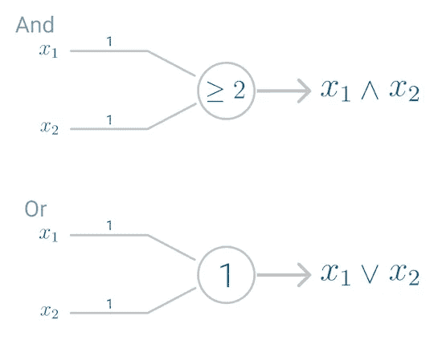

AND 和 OR 逻辑门的例子(图片由作者提供)。

然而，这个模型有一个问题。它无法像大脑一样学习。获得期望输出的唯一方法是预先设置权重，权重在模型中起催化剂的作用。

> 神经系统是一个神经元网络，每个神经元都有一个胞体和一个轴突[……]在任何时刻，神经元都有一个阈值，兴奋必须超过该阈值才能启动冲动[3]。

仅仅十年后，Frank Rosenblatt 扩展了这个模型，并创造了一种算法，可以让 T2 学习权重以产生输出。

罗森布拉特以麦卡洛克和皮特的神经元为基础，开发了**感知机**。

# 感知器

虽然今天**感知器**被广泛认为是一种算法，但它最初是作为一种图像识别机器。它因执行类似人类的*感知*功能，看到并识别图像而得名。

> 特别是，人们的兴趣集中在一种机器的想法上，这种机器能够将直接来自光、声音、温度等物理环境的输入概念化。—我们都熟悉的“现象世界”——而不是需要人类代理的干预来消化和编码必要的信息。[4]

罗森布拉特的感知机依赖于一个基本的计算单元，神经元。就像以前的模型一样，每个神经元都有一个接收一系列输入和权重对的细胞。

Rosenblatt 模型的主要区别在于，**输入被组合成一个** **加权和**，如果加权和超过一个预定义的阈值，神经元就会触发并产生一个输出。

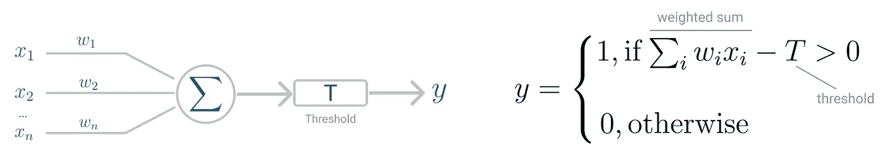

感知器神经元模型(左)和阈值逻辑(右)。(图片由作者提供)

阈值 *T* 代表**激活功能**。如果输入的加权和大于零，神经元输出值 1，否则输出值为零。

# 二元分类感知器

有了这个由激活函数控制的离散输出，感知器可以用作**二元分类模型**，定义了**线性决策边界**。它找到分离的[超平面](https://en.wikipedia.org/wiki/Hyperplane)，该超平面最小化错误分类的点和决策边界之间的距离【6】。

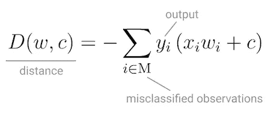

感知器的损失函数。(图片由作者提供)

为了最小化这个距离，感知器使用[随机梯度下降](/stochastic-gradient-descent-explained-in-real-life-predicting-your-pizzas-cooking-time-b7639d5e6a32)作为优化函数。

如果数据是线性可分的，则保证随机梯度下降将在有限步内收敛。

感知器需要的最后一块是**激活函数**，这个函数决定神经元是否会触发。

最初的感知器模型使用了 [sigmoid 函数](https://en.wikipedia.org/wiki/Sigmoid_function)，仅仅看它的形状，就很有道理！

sigmoid 函数将任何实数输入映射到值 0 或 1，并对非线性函数进行编码。

神经元可以接收[负数](https://en.wikipedia.org/wiki/Real_number)作为输入，它仍然能够产生 0 或 1 的输出。

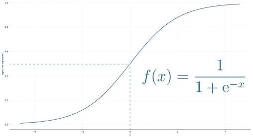

Sigmoid 函数(图片由作者提供)。

但是，如果你看看过去十年的深度学习论文和算法，你会发现它们大多数都使用[校正线性单元(ReLU)](https://en.wikipedia.org/wiki/Rectifier_(neural_networks)) 作为神经元的激活函数。

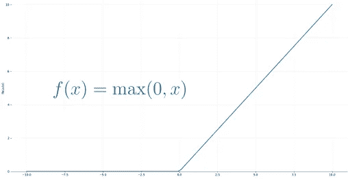

ReLU 函数。(图片由作者提供)

ReLU 越来越被采用的原因是它允许使用随机梯度下降进行更好的优化、更高效的计算并且是比例不变的，这意味着它的特征不受输入比例的影响。

## 把所有的放在一起

神经元接收输入并随机选取一组初始权重。这些组合成加权和，然后由激活函数 ReLU 确定输出值。

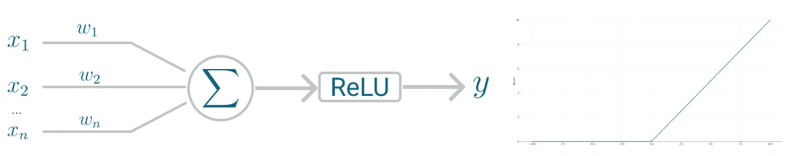

感知器神经元模型(左)和激活函数(右)。(图片由作者提供)

但是你可能想知道，*感知器实际上不学习权重吗？*

确实如此。感知器使用随机梯度下降来寻找，或者你可以说*学习*，最小化错误分类点和决策边界之间距离的权重集。一旦随机梯度下降收敛，数据集被一个线性超平面分成两个区域。

虽然据说感知器可以代表任何电路和逻辑，但最大的批评是它不能代表[异或门](https://en.wikipedia.org/wiki/XOR_gate)、*异或*，如果输入不同，该门只返回 *1* 。

近十年后，Minsky 和 Papert 在 1969 年[5]证明了这一点，并强调了只有一个神经元的感知器不能应用于非线性数据的事实。

# 多层感知器

**多层感知器**就是为了解决这个限制而开发的。这是一个神经网络，其中输入和输出之间的映射是非线性的。

多层感知器具有输入和输出层，以及一个或多个**隐藏层**，其中许多神经元堆叠在一起。而在感知器中，神经元必须有一个施加阈值的激活函数，如 ReLU 或 sigmoid，多层感知器中的神经元可以使用任何任意的激活函数。

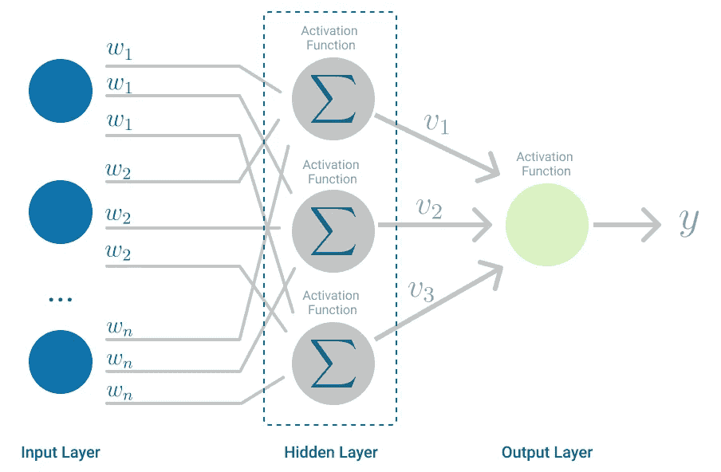

多层感知器。(图片由作者提供)

多层感知器属于[前馈算法](https://en.wikipedia.org/wiki/Feedforward_neural_network)的范畴，因为输入在加权和中与初始权重相结合，并服从激活函数，就像在感知器中一样。但不同的是，每个线性组合都传播到下一层。

每一层都由*向下一层*提供计算结果，即数据的内部表示。这一直通过隐藏层到达输出层。

但是它有更多的含义。

如果算法只计算每个神经元中的加权和，将结果传播到输出层，并在那里停止，它将无法*学习*最小化成本函数的权重。如果算法只计算一次迭代，就不会有实际的学习。

这就是 [**反向传播**](https://en.wikipedia.org/wiki/Backpropagation)【7】发挥作用的地方。

# 反向传播

反向传播是一种学习机制，允许多层感知器迭代调整网络中的权重，目标是最小化成本函数。

反向传播要正常工作有一个硬性要求。结合神经元中的输入和权重的函数(例如加权和)和阈值函数(例如 ReLU)必须是可微分的。这些函数必须有一个**有界导数**，因为[梯度下降](/stochastic-gradient-descent-explained-in-real-life-predicting-your-pizzas-cooking-time-b7639d5e6a32)通常是多层感知器中使用的优化函数。

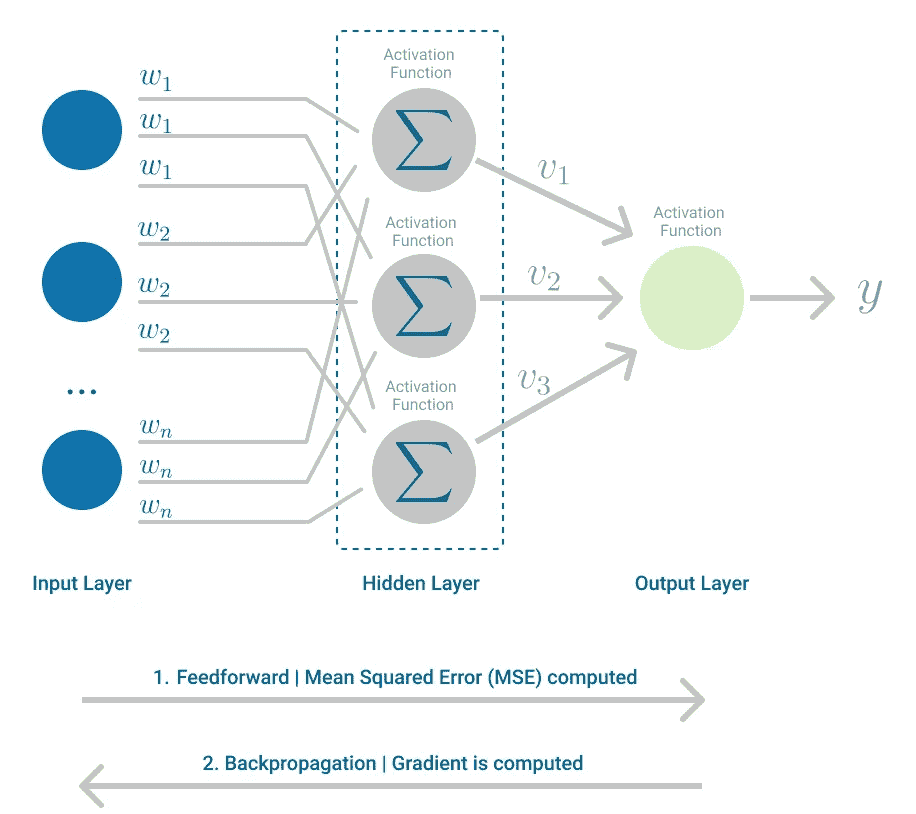

多层感知器，强调前馈和反向传播步骤。(图片由作者提供)

在每次迭代中，在通过所有层转发加权和之后，计算所有输入和输出对的**均方误差**的梯度。然后，为了将它传播回去，第一个隐藏层的权重用渐变的值更新。这就是权重如何传播回神经网络的起始点！

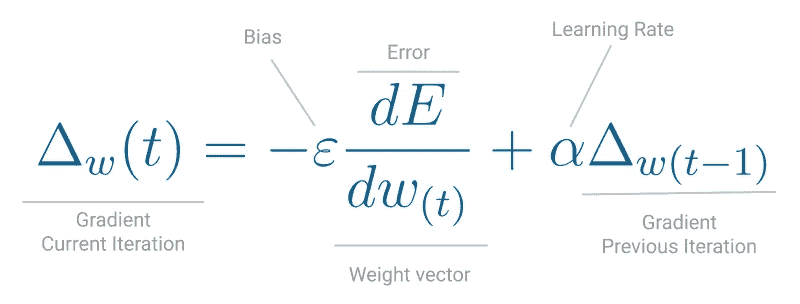

梯度下降的一次迭代。(图片由作者提供)

这个过程一直持续到每个输入-输出对的梯度收敛，这意味着与前一次迭代相比，新计算的梯度变化不超过指定的*收敛阈值*。

让我们用一个真实世界的例子来看看这一点。

# 使用感知器进行情感分析

你的父母在乡下有一个舒适的床和早餐，大厅里有传统的留言簿。欢迎每位客人在离开前写一张便条，到目前为止，很少有人离开时没有写一张短笺或励志名言。有些人甚至留下了家里的小狗莫莉的画像。

夏季即将结束，这意味着在假期工作开始前的清洁时间。在旧储藏室里，你偶然发现了一个盒子，里面装满了你父母多年来保存的留言簿。你的第一直觉？让我们什么都看！

读了几页后，你就有了更好的想法。为什么不试着了解客人留下的是积极的还是消极的信息？

你是数据科学家，所以这是二进制分类器的完美任务。

所以你随机挑选了一些留言簿，用作训练集，转录所有的信息，给它一个积极或消极情绪的分类，然后让你的堂兄弟也把它们分类。

在[自然语言处理](https://en.wikipedia.org/wiki/Natural_language_processing)任务中，一些文本可能是不明确的，所以通常你有一个文本语料库，其中的标签是由 3 个专家同意的，以避免联系。


来宾留言示例。(图片由作者提供)

将最终的标签分配给整个语料库后，你决定将数据放入一个最简单的神经网络**感知器**。

但是在建立模型之前，你需要把自由文本转换成机器学习模型可以处理的格式。

在本例中，您使用[术语频率—逆文档频率(TF-IDF)](https://en.wikipedia.org/wiki/Tf%E2%80%93idf) 将留言簿中的文本表示为一个向量。这种方法将任何类型的文本编码为每个单词或术语在每个句子和整个文档中出现频率的统计数据。

在 Python 中，你使用了 [ScikitLearn](https://scikit-learn.org/stable/index.html) 中的 [TfidfVectorizer](https://scikit-learn.org/stable/modules/generated/sklearn.feature_extraction.text.TfidfVectorizer.html#sklearn.feature_extraction.text.TfidfVectorizer) 方法，删除了英文停用词，甚至应用了 L1 规范化。

```
TfidfVectorizer(stop_words='english', lowercase=True, norm='l1')
```

用感知器进行二元分类！

为了实现这一点，您完全使用了[感知器](https://scikit-learn.org/stable/modules/generated/sklearn.linear_model.Perceptron.html)开箱即用*和所有默认参数。*

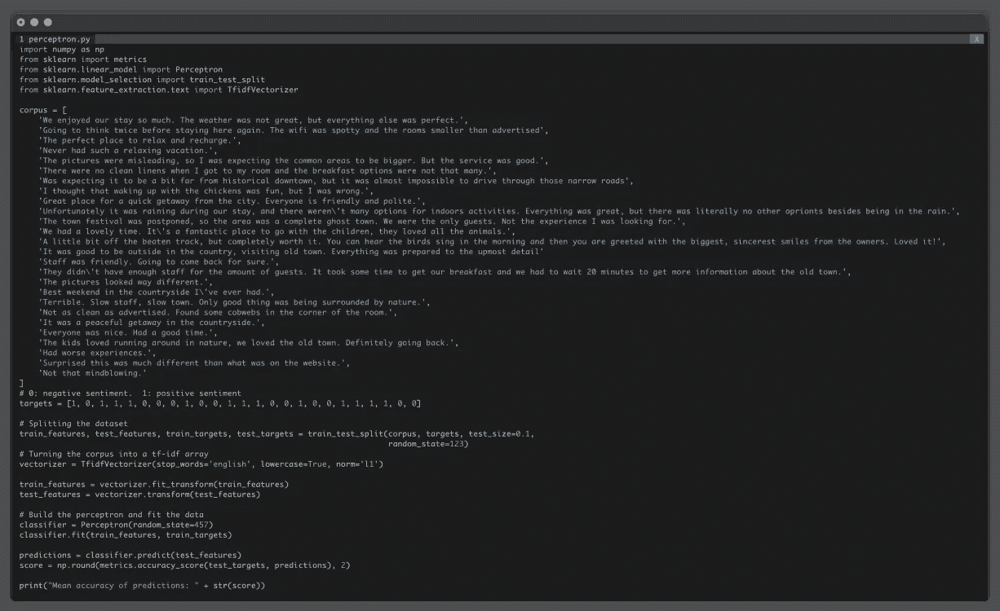

Python 源代码在语料库上运行感知器。(图片由作者提供)

在对语料库进行矢量化、拟合模型并对模型从未见过的句子进行测试后，您会发现该模型的平均准确率为 67%。

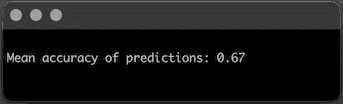

感知器模型的平均精确度。(图片由作者提供)

对于感知器这样简单的神经网络来说，这已经不错了！

平均而言，感知器会将你父母的客人写的每三条信息中的大约一条错误分类。这让你想知道，也许这些数据不是线性可分的，你也可以用稍微复杂一点的神经网络来获得更好的结果。

# 在这种情况下，多层感知器会如何表现？

使用 [SckitLearn 的多层感知器](https://scikit-learn.org/stable/modules/generated/sklearn.neural_network.MLPClassifier.html)，你决定保持简单，只调整几个参数:

*   激活函数:ReLU，用参数 *activation='relu'* 指定
*   优化函数:随机梯度下降，由参数 *solver='sgd'* 指定
*   学习率:反比例，由参数*learning _ rate =‘inv Scaling’*指定
*   迭代次数:20，由参数 *max_iter=20* 指定

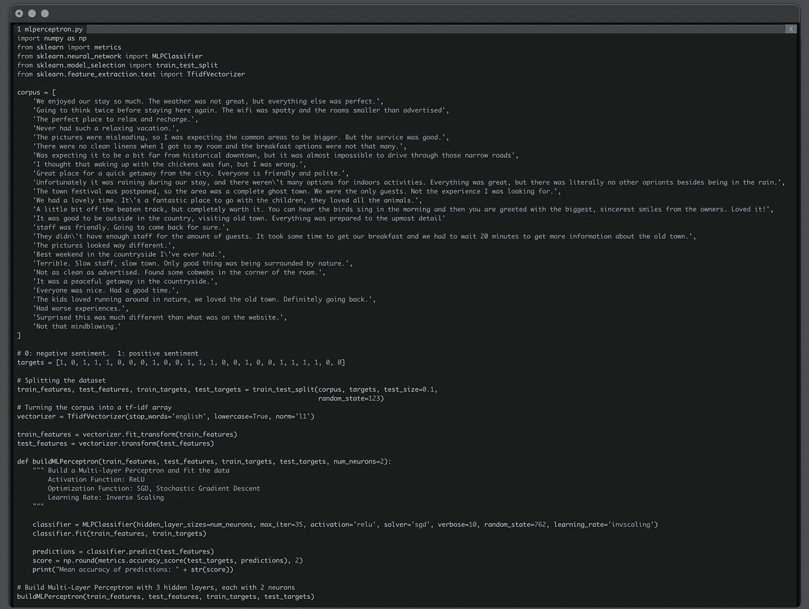

Python 源代码在语料库上运行多层感知器。(图片由作者提供)

默认情况下，**多层感知器**有三个隐藏层，但是您想要了解每层中的神经元数量如何影响性能，所以您从每个隐藏层 2 个神经元开始，设置参数 *num_neurons=2。*

最后，为了查看每次迭代中损失函数的值，您还添加了参数 *verbose=True。*

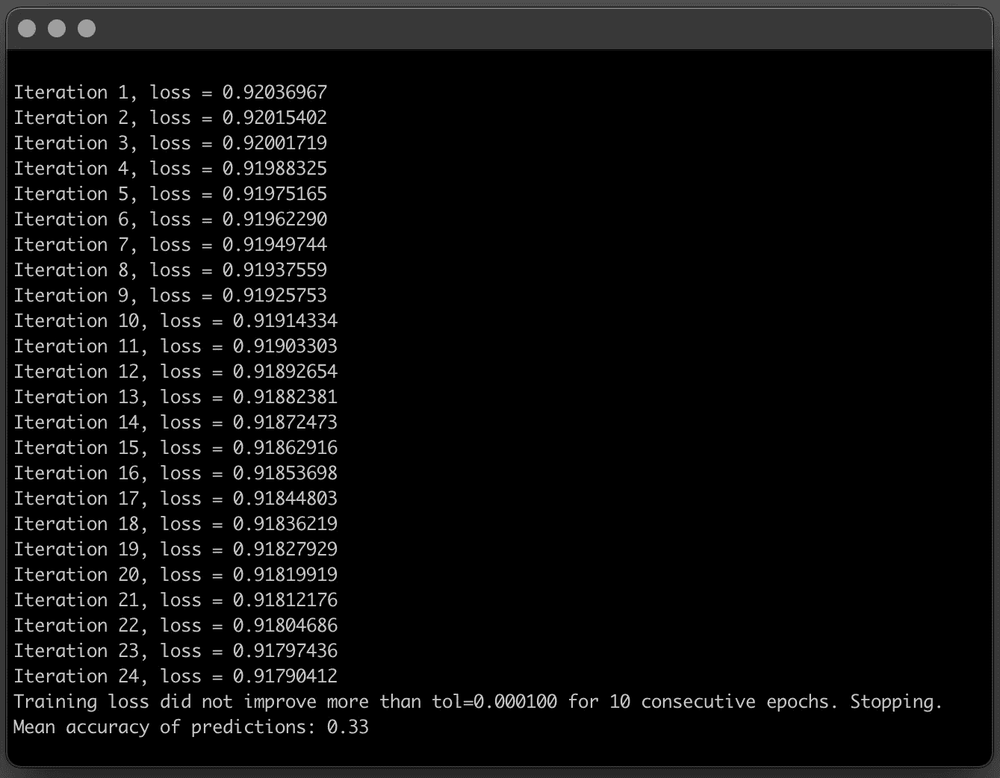

具有 3 个隐藏层，每个隐藏层有 2 个节点的多层感知器模型的平均精度。(图片由作者提供)

在这种情况下，多层感知器有 3 个隐藏层，每个层有 2 个节点，性能比简单感知器差得多。

它在 24 次迭代中收敛得相对较快，但是平均精度不好。

当感知器平均每 3 个句子中有 1 个错误分类时，这个多层感知器是相反的，平均每 3 个句子中预测正确的标签 1。

如果你给神经网络增加更多的容量会怎么样？当每个隐藏层有更多的神经元来学习数据集的模式时，会发生什么？

使用同样的方法，你可以简单地改变参数 *num_neurons* 并将其设置为 5。

```
buildMLPerceptron(train_features, test_features, train_targets, test_targets, num_neurons=5)
```

向隐藏层添加更多的神经元无疑提高了模型的准确性！

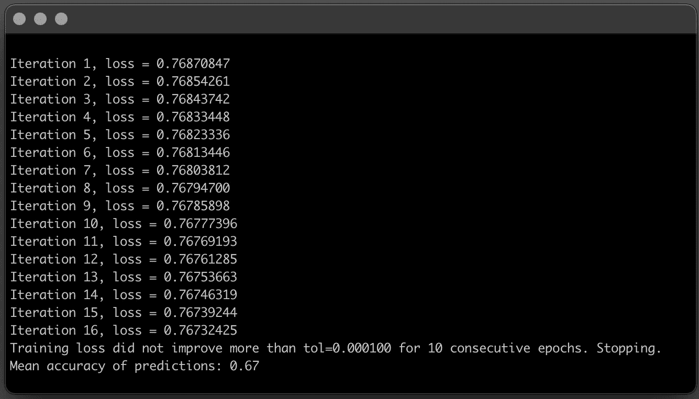

具有 3 个隐藏层，每个隐藏层有 5 个节点的多层感知器模型的平均精度。(图片由作者提供)

您保持了相同的神经网络结构，3 个隐藏层，但是随着 5 个神经元的计算能力的增加，模型在理解数据中的模式方面变得更好。它收敛得更快，平均精度提高了一倍！

最后，对于这个特定的案例和数据集，多层感知器表现得和简单感知器一样好。但这绝对是一个很好的练习，可以看到改变每个隐藏层中神经元的数量是如何影响模型性能的。

这不是一个完美的模型，可能有一些改进的空间，但下次有客人留言说你的父母不确定这是积极的还是消极的，你可以使用感知器来获得第二种意见。

# 结论

与当前最先进的技术相比，第一个深度学习算法非常简单。感知器是一个只有一个神经元的神经网络，只能*理解提供的输入和输出数据之间的*线性关系。

然而，有了多层感知器，视野扩大了，现在这个神经网络可以有许多层神经元，并准备学习更复杂的模式。

希望你喜欢学习算法！

敬请关注本系列的下一篇文章，我们将继续探索深度学习算法。

# 参考

1.  深度学习。*自然* 521，**436–444(2015)**
2.  伊恩·古德菲勒、约舒阿·本吉奥和亚伦·库维尔。2016.深度学习。麻省理工学院出版社。
3.  麦卡洛克，W.S .，皮茨，w.《神经活动中固有观念的逻辑演算》。数学生物物理学通报 115–133(1943 年)
4.  弗兰克·罗森布拉特。感知器，一个感知和识别自动机项目。康奈尔航空实验室(1957 年)
5.  明斯基法学硕士和 Papert S. A. 1969。*感知器*。麻省剑桥:麻省理工学院出版社。
6.  加雷斯·詹姆斯，丹妮拉·威滕，特雷弗·哈斯蒂，罗伯特·蒂布拉尼。*(2013)*。*统计学习导论:在 r .纽约的应用*
7.  D.鲁梅尔哈特、g .辛顿和 r .威廉姆斯。通过反向传播误差学习表征。*性质*323(6088):533–536(1986)。