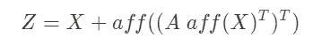
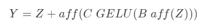

# 用于图像分类的多层感知器

> 原文：<https://towardsdatascience.com/multilayer-perceptron-for-image-classification-5c1f25738935?source=collection_archive---------17----------------------->

## 没有回旋也没有关注。只是全连接层。


由[乌列尔 SC](https://unsplash.com/@urielsc26?utm_source=unsplash&utm_medium=referral&utm_content=creditCopyText) 在 [Unsplash](https://unsplash.com/s/photos/neural-network?utm_source=unsplash&utm_medium=referral&utm_content=creditCopyText) 上拍摄的照片

# 介绍

卷积神经网络(CNN)已经帮助我们解决了图像分类等计算机视觉任务。它可以捕捉邻居信息，这要归功于它的卷积过程，其中它通过一个过滤器使用相乘矩阵的和。此外，使用 CNN 是因为它在其模型上具有权重共享机制，因此参数的数量将少于使用深度神经网络。

随着时间的进步，CNN 并不是做计算机视觉任务的唯一方式。主要用于自然语言处理任务的 transformer 体系结构可以在 ImageNet 数据集上以很高的性能完成图像分类任务。并且与 CNN 模型具有可比性[1]。

现在，Touvron 等人(2021)提出了一种仅使用全连接层的图像分类架构。它被称为剩余多层感知器(ResMLP)。它的伟大之处在于，该模型可以在 ImageNet-1k 训练数据上取得很好的结果[2]。

本文将向您解释 ResMLP 架构。此外，我将向您展示使用 PyTorch 实现这个模型。没有进一步，让我们开始吧！

# 建筑

那么这个模型是如何工作的呢？该模型的灵感来自于基于变形金刚模型[1]的 ViT 架构。

首先，ResMLP 模型将图像分成 N×N 个小块，其中 N 是 16。然后，每个面片将被展平为一个矢量，然后这些面片被独立地馈送到 ResMLP 层。

ResMLP 将采用大小为 d x (N x N)的矩阵 X，其中 d 是向量维数，N x N 是面片数。然后，那个矩阵会得到几次变换，直到得到一个与矩阵 x 大小相同的矩阵 Y，下面是得到矩阵 Y 的等式。



GELU 是激活层，aff 是通过重新缩放和移动图像来变换输入列的算子，B C 矩阵是模型可学习的权重。

在我们获得矩阵 Y 之后，该矩阵将被平均为 d 维向量，其中该向量将被用作线性分类器的特征并捕捉预测结果。该架构的概述可以在下图中看到。


架构(Touvron 等人(2021 年) )

# 实施

值得庆幸的是，作者还包括了 GitHub 上的实现，你可以看看这个[链接](https://github.com/lucidrains/res-mlp-pytorch)。代码是使用 PyTorch 库实现的，并且已经打包成了一个包。你可以用 pip 下载，看起来是这样的。

```
**! pip install res-mlp-pytorch**
```

## 数据

我们将使用的数据来自 EPFL，名为 Food 5K。该数据集由 5000 幅图像组成，这些图像根据是否包含食物进行了分类。要下载数据集，可以从[官网](https://www.epfl.ch/labs/mmspg/downloads/food-image-datasets/)或者[这个 kaggle 资源库](https://www.kaggle.com/binhminhs10/food5k)下载。

## 导入库

在运行代码之前，我们需要导入库。这是完成这项工作的代码，

## 加载数据

PyTorch 的主要优点是模块化，因为您可以更容易地定制您的数据加载器，因此您可以更容易地将数据加载到模型中。下面是加载数据的代码。

## 训练模型

准备好数据后，现在可以使用 ResMLP 模型对数据进行建模。在这种情况下，我们将通过 20 个时期迭代建模过程。下面是训练模型的代码。

## 与 CNN 的比较

这是使用 ResMLP 模型的训练结果，

```
**# ResMLP 
Best val loss: 0.2860 
Best acc: 0.891**
```

基于训练结果，我们得到验证损失为 0.2789，准确率为 0.895。对于一个只使用前馈神经网络的模型来说，确实是一个不错的结果。但我们需要将其与现有模型进行比较。

为了确定该模型与其他模型的性能如何，我还使用 ResNet-18 和 ResNet-50 架构训练了 CNN 模型。这是结果，

```
**# ResNet-18 
Best val loss: 0.0365 
Best acc: 0.986** **# ResNet-50 
Best val loss: 0.0245 
Best acc: 0.993**
```

正如你所看到的，ResNet-18 实现了良好的性能。验证损失为 0.0365，准确率为 0.986。ResNet-50 取得了较好的效果。验证损失为 0.0245，准确率为 0.993。

# 结束语

从这些结果来看，我们可以说 ResMLP 仍然支持 ResNet 或类似的体系结构。但有了这个结果，我相信这个模型可以改进得更好，所以它可以像 CNN 一样有相当的表现，甚至更好。

以上是对 ResMLP 模型的解释和实现。我希望你现在能从深度学习的进展中得到启发。如果你以后喜欢我的文章，对我的文章感兴趣，请关注我的媒体。如有疑问，可联系我 [LinkedIn](https://www.linkedin.com/in/alghaniirfan/) 。

谢谢你看我的文章！

## 参考

[1] Dosovitskiy，a .，Beyer，l .，科列斯尼科夫，a .，Weissenborn，d .，Zhai，x .，Unterthiner，t .，Dehghani，m .，Minderer，m .，Heigold，g .，Gelly，s .，Uszkoreit，j .，& Houlsby，N. (2020)。一幅图像相当于 16x16 个字:大规模图像识别的变形金刚。ArXiv:2010.11929 [Cs]。[http://arxiv.org/abs/2010.11929](http://arxiv.org/abs/2010.11929)

[2]图夫龙，h .、博雅诺斯基，p .、卡隆，m .、科德，m .、埃尔-努比，a .、格雷夫，e .、朱林，a .、辛那夫，g .、维尔比克，j .、杰古，H. (2021 年)。具有数据有效训练的图像分类前馈网络。ArXiv:2105.03404 [Cs]。http://arxiv.org/abs/2105.03404