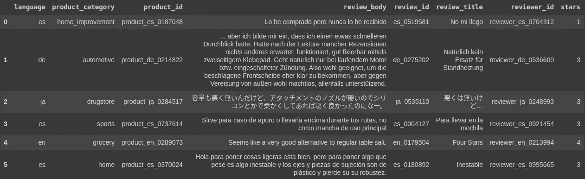

# 多语言亚马逊评论分类

> 原文：<https://towardsdatascience.com/multilingual-amazon-reviews-classification-f55f8a650c9a?source=collection_archive---------29----------------------->

## 用数据做很酷的事情

# 介绍

NLP 将成为这十年中最具变革性的技术。变压器模型推动了 NLP 的发展。在这篇博客中，我们来看看转换器在多语言数据上的应用。现在，许多企业的业务范围遍及全球，并以多种语言收集数据。NLP 也在建立强大的处理多语言数据的能力。Transformer 模型现在可以用多种语言进行训练，并无缝地接收其中的文本。这太神奇了！


来源:免版税的 Unsplash—[https://unsplash.com/photos/jhtPCeQ2mMU](https://unsplash.com/photos/jhtPCeQ2mMU)

在这篇博客中，我们使用了一个[预先训练的多语言 XLM 罗伯塔模型](https://arxiv.org/pdf/1911.02116.pdf)，并在下游分类任务中对其进行了微调。XLM-罗伯塔已经接受了超过 100 种不同语言的训练！该模型能够在多种语言的产品评论数据集上提供最先进的性能。我认为这为企业整合来自不同国家的运营数据并产生有价值的见解提供了新的机会。

这个模型的代码可以在我的 Colab 笔记本[这里](https://colab.research.google.com/drive/1dfn3uCAYh1L812StenVWjVUSNbWcS0jh?usp=sharing)找到。我也上传到我的 GitHub [这里](https://github.com/priya-dwivedi/Deep-Learning/blob/master/MultiLingual-Amazon-Reviews-Classification/Text_classification_on_Multiilingual_Reviews.ipynb)。

这里的代码是使用 HuggingFace 和 Datasets 库运行分类的通用代码。它可以很容易地修改为许多其他数据集和涉及分类的问题。

# 数据集和预处理

对于这个博客，我们使用[亚马逊多语言评论语料库](https://colab.research.google.com/drive/1dfn3uCAYh1L812StenVWjVUSNbWcS0jh?usp=sharing)。该数据集由亚马逊公开提供，包含 6 种不同语言(英语、日语、德语、法语、西班牙语和中文)的各种产品的客户评论。数据集库提供了一个简单的 API 来下载和访问数据集。

```
!pip install datasets
dataset  = datasets.load_dataset('amazon_reviews_multi')
```

数据集在训练集中有 1.2MM 的评论，在验证集中有 30K 的评论。每篇评论都有标题、类别、正文和星级。星级从 1 到 5 不等，平均分布在 5 个等级中。



英语评论及其评级的示例如下:

```
Review: 'I’ve had good luck with this product when I’ve bought it in stores, but this particular one I bought though Amazon was watered down! The texture was much more viscous than any of the tubes I bought in person and it lasted me about half the time. You’re better off finding it in a shop than wasting your money on watered down face wash.'
Rating: 2
```

我们加载 XML-Roberta 模型，并用它来标记文本。文本的最大长度设置为 512 个标记。为了提高模型的准确性，我们将 review_body、review_title 和 review_category 连接起来。

由于实际数据集相当大，我们在 10%的训练样本上进行训练。数据集库中的`shard`功能使得对一小部分数据进行采样进行实验变得很容易。完成此操作的代码如下:

```
dataset = dataset.shuffle(seed=123)train_dataset = dataset["train"].shard(index=1, num_shards=10)val_dataset = dataset['validation'].shard(index=1, num_shards=5)
```

tokenizer，encode_plus 选项用于标记与审查主体、审查标题和审查类别相关联的文本。实际评论的星级从 1 星到 5 星不等。我们将其转换为范围从 0 到 4 的目标标签。

# 模特培训

为了简化训练过程，我们使用 HuggingFace 的训练器库。我们使用自动建模功能加载预训练的 XLM-罗伯塔基础模型。

```
from transformers import AutoModelForSequenceClassification, TrainingArguments, Trainerbatch_size = 8num_labels = 5model = AutoModelForSequenceClassification.from_pretrained('xlm-roberta-base', num_labels=num_labels)
```

为了实例化训练器，我们定义了两件事:

1.  训练参数——这些参数包括输出目录的位置、学习速度、批量大小、次数等
2.  评估的计算指标功能—我们可以定义一个评估指标，在培训期间在 val 集上运行。

数据集包还定义了许多自定义指标。我喜欢数据集库中的这一功能，因为它使得在数据集上计算 bleu、rouge 或自定义小队指标的范围变得非常容易。

我们首先从数据集库中加载我们选择的指标

```
from datasets import load_metricmetric = load_metric('accuracy')
f1_metric = load_metric('f1')
```

metric.compute()函数可用于获取结果。

```
import numpy as npfake_preds = np.random.randint(1, 6, size=(64,))fake_labels = np.random.randint(1, 6, size=(64,))metric.compute(predictions=fake_preds, references=fake_labels)f1_metric.compute(predictions=fake_preds, references=fake_labels, average='weighted')
```

为了在训练期间运行它，我们从 eval_pred 获取预测和标签，然后运行 metric.compute()。仅此而已！！

为了开始训练，现在我们可以将所有这些参数传递给训练者。

```
trainer = Trainer(model,args,train_dataset= encoded_train_dataset,eval_dataset=encoded_val_dataset,data_collator=SmartCollator(pad_token_id=tokenizer.pad_token_id),tokenizer=tokenizer,compute_metrics=compute_metrics)
```

该模型在 Colab 上的 P100 实例上训练大约需要 2 小时 20 分钟。这是针对训练数据集的 10%样本的。

该模型达到了 59.9%的准确率，比介绍该数据集的[论文](https://arxiv.org/abs/2010.02573)中报告的 59.2%的准确率略高。对完整数据集的训练应该会进一步改善结果。

我想谈谈其他一些可以用来提高训练速度/模型结果的很酷的东西

## 智能动态填充减少训练时间

这里的灵感来自于的作品[。在训练期间，我们必须输入相同长度的样本。由于基础文本可以有不同的长度，典型的方法是将所有内容填充到最大长度。这通常在完整数据集级别完成，其中如果文本的最大长度是 512 个标记，则所有内容都被填充到该最大长度。然而，这是低效的。例如，一个有 20 个标记的句子也会被填充到 512 个标记。由于*注意力在计算*中是二次的，这将显著减慢对这种样本的训练。](https://github.com/ELS-RD/transformers-notebook/blob/master/Divide_Hugging_Face_Transformers_training_time_by_2_or_more.ipynb)

这里可以做的一个优化是填充到**批次**中的最大长度，而不是数据集中的最大长度。我笔记本中的代码通过定义一个智能数据排序器来实现这一点。在数据排序器中，完成这一任务的主要模块是:

```
max_size = max([len(ex['input_ids']) for ex in batch])for item in batch:batch_inputs += [pad_seq(item['input_ids'], max_size, self.pad_token_id)]
```

这种优化减少了一半的训练时间！这对一小段代码非常有用。

## 使用 Optuna 的超参数优化


Unsplash 的免版税:[https://unsplash.com/photos/4Ennrbj1svk](https://unsplash.com/photos/4Ennrbj1svk)

[Optuna](https://optuna.org/) 是一个超参数搜索器，可以很容易地与教练类集成。它有效地搜索大空间的超参数，及早修剪没有希望的试验。

在我们的实验中，我们像以前一样定义训练参数和训练器，并让 Optune 在选定数量的试验中进行优化。

`trainer.hyperparameter_search(n_trials=15, direction=”maximize”)`

# 结论

这个博客展示了如何使用 Transformer 模型来处理多语言数据。我们使用 HuggingFace 库和它的许多特性来准备我们的数据，并用几行代码来训练它。经过训练的模型具有最先进的结果。代码是以非常模块化的格式编写的，可以用于任何类型的分类问题。我们还讨论了动态填充的功能，以显著加快训练速度，并研究超参数优化，以进一步改善结果。

我希望您尝试一下代码，并训练自己的模型。请在下面的评论中分享你的经历。

在[深度学习分析](https://deeplearninganalytics.org/)，我们非常热衷于使用机器学习来解决现实世界的问题。我们已经帮助许多企业部署了创新的基于人工智能的解决方案。如果您看到合作的机会，请通过我们的网站[这里](https://deeplearninganalytics.org/contact-us/)联系我们。

# 参考

*   [XML-Roberta 论文](https://arxiv.org/pdf/1911.02116.pdf)
*   [拥抱脸分类笔记本](https://github.com/huggingface/notebooks/blob/master/examples/text_classification.ipynb)
*   [拥抱脸](https://huggingface.co/)
*   [Optuna](https://optuna.org/)