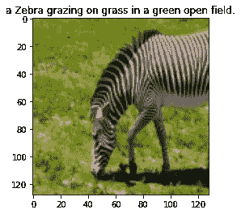
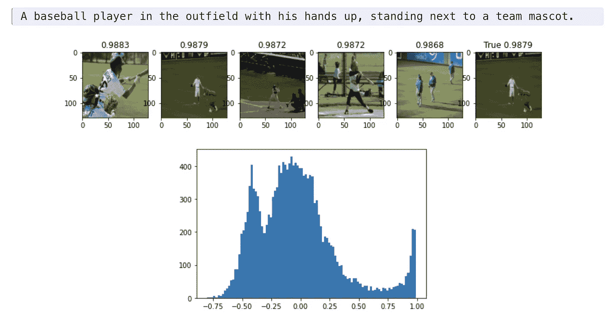
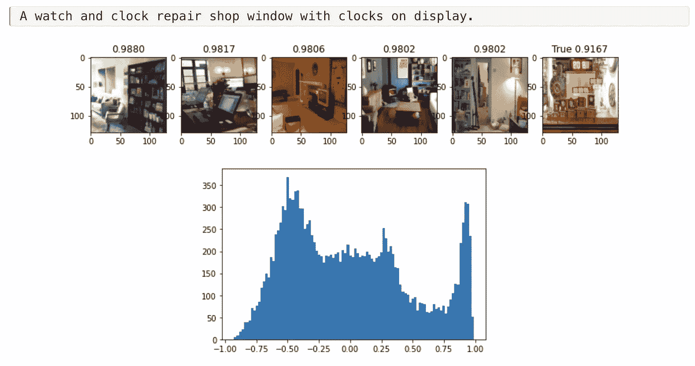
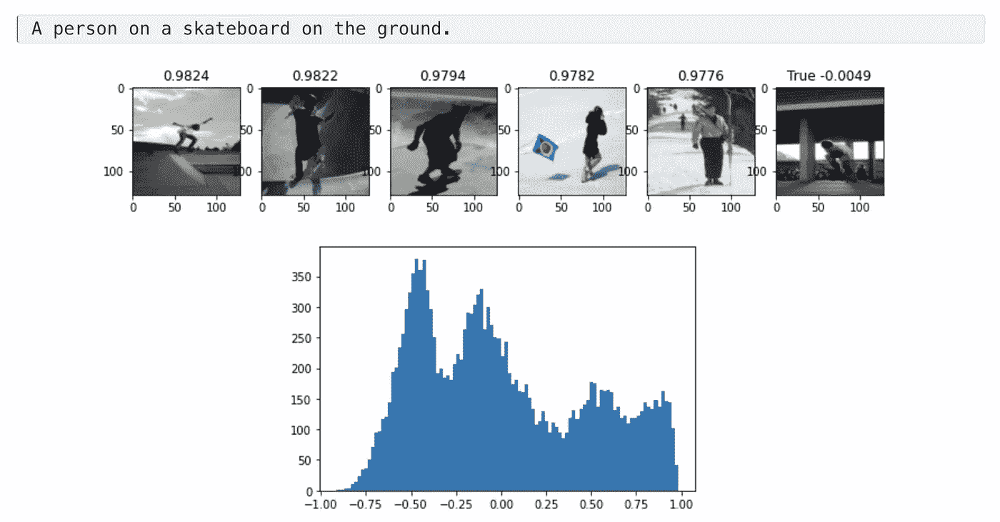
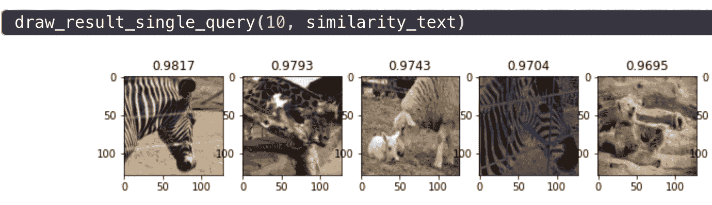
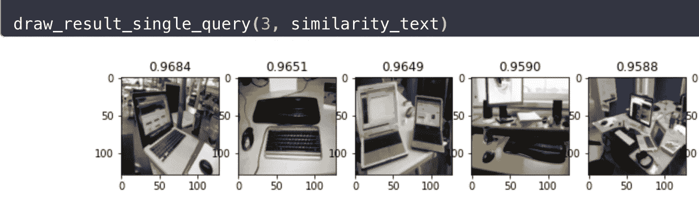
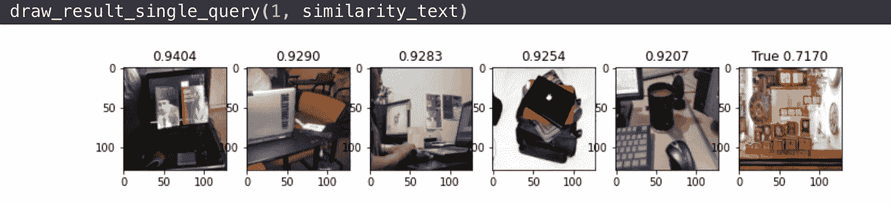
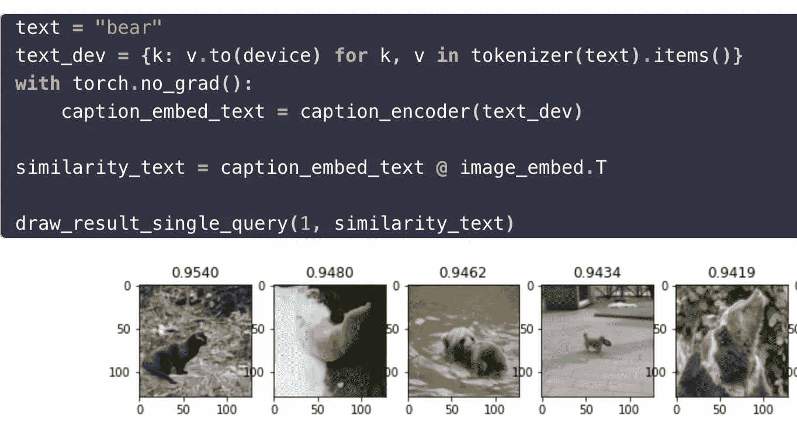

# 多语言剪辑，带 Huggingface + PyTorch Lightning

> 原文：<https://towardsdatascience.com/multilingual-clip-with-huggingface-pytorch-lightning-9a060eee334d?source=collection_archive---------16----------------------->


openAI CLIP 算法(摘自官方博客)

这是 OpenAI 训练[片段](https://openai.com/blog/clip/)的演练。CLIP 旨在将图像和文本放入一个新的投影空间，这样只需查看点积，它们就可以相互映射。

同时训练图像模型和语言模型的情况并不常见！

传统上，像 imagenet 这样的训练集只允许将图像映射到一个类(因此是一个单词)。此方法允许您将文本映射到图像，但是如果需要的话，也可以用于将图像映射到文本。

然而，这篇特别的博客具体介绍了我们如何使用拥抱脸变形金刚和 pytorch 闪电在 colab GPUs 上进行训练。

完整的代码可以在 [Google colab 中找到。](https://colab.research.google.com/github/sachinruk/blog/blob/master/_notebooks/2021-03-07-CLIP.ipynb)

# 确认

keras 文档中的以下剪辑教程值得称赞。

关于常量，需要注意的重要一点是嵌入维数。我们将把 resnet 和 transformers 的输出投射到 512 维空间。

```
EMBED_DIM **=** 512
TRANSFORMER_EMBED_DIM **=** 768
MAX_LEN **=** 128 *# Maximum length of text*
TEXT_MODEL **=** "distilbert-base-multilingual-cased"

EPOCHS **=** 5
BATCH_SIZE **=** 64
```

# 数据

我们下载了 coco 数据集，每个图像包含 5 个标题，大约有 82k 的图像。我们取其中的 20%作为我们的验证集。

考虑到图像主干是使用 imagenet 训练的，我们使用 imagenet stats 对其进行规范化，如转换规范化步骤所示。我们还将图像的大小调整为 128x128，以确保它在合理的时间内进行训练。



# 模型

主要有两种型号，`VisionEncoder`和`TextEncoder`以 resnet18 和 distilbert 为骨干。为了让它支持多种语言，我们简单地选择了`distilbert-multilingual`模式，就是这样！你很快就会看到，没有必要专门训练非英语单词。

`Projection`模块从视觉和文本编码器中提取嵌入内容，并将其投射到 512 维空间中。

需要注意两件事:

1.  我们已经冻结了文本和视觉编码器的主干，不再训练它们的重量。
2.  对于两种编码器，最终输出被归一化为单位长度。

```
**class** **Projection(**nn**.**Module**):**
    **def** __init__**(***self***,** d_in**:** *int***,** d_out**:** *int***,** p**:** *float***=**0.5**)** **->** **None:**
        *super***().**__init__**()**
        *self***.**linear1 **=** nn**.**Linear**(**d_in**,** d_out**,** bias**=False)**
        *self***.**linear2 **=** nn**.**Linear**(**d_out**,** d_out**,** bias**=False)**
        *self***.**layer_norm **=** nn**.**LayerNorm**(**d_out**)**
        *self***.**drop **=** nn**.**Dropout**(**p**)** **def** **forward(***self***,** x**:** torch**.**Tensor**)** **->** torch**.**Tensor**:**
        embed1 **=** *self***.**linear1**(**x**)**
        embed2 **=** *self***.**drop**(***self***.**linear2**(**F**.**gelu**(**embed1**)))**
        embeds **=** *self***.**layer_norm**(**embed1 **+** embed2**)**
        **return** embeds **class** **VisionEncoder(**nn**.**Module**):**
    **def** __init__**(***self***,** d_out**:** *int***)** **->** **None:**
        *super***().**__init__**()**
        base **=** models**.**resnet34**(**pretrained**=True)**
        d_in **=** base**.**fc**.**in_features
        base**.**fc **=** nn**.**Identity**()**
        *self***.**base **=** base
        *self***.**projection **=** Projection**(**d_in**,** d_out**)**
        **for** p **in** *self***.**base**.**parameters**():**
            p**.**requires_grad **=** **False** **def** **forward(***self***,** x**):**
        projected_vec **=** *self***.**projection**(***self***.**base**(**x**))**
        projection_len **=** torch**.**norm**(**projected_vec**,** dim**=-**1**,** keepdim**=True)**
        **return** projected_vec **/** projection_len**class** **TextEncoder(**nn**.**Module**):**
    **def** __init__**(***self***,** d_out**:** *int***)** **->** **None:**
        *super***().**__init__**()**
        *self***.**base **=** AutoModel**.**from_pretrained**(**TEXT_MODEL**)**
        *self***.**projection **=** Projection**(**TRANSFORMER_EMBED_DIM**,** d_out**)**
        **for** p **in** *self***.**base**.**parameters**():**
            p**.**requires_grad **=** **False** **def** **forward(***self***,** x**):**
        out **=** *self***.**base**(****x**)[**0**]**
        out **=** out**[:,** 0**,** **:]**  *# get CLS token output*
        projected_vec **=** *self***.**projection**(**out**)**
        projection_len **=** torch**.**norm**(**projected_vec**,** dim**=-**1**,** keepdim**=True)**
        **return** projected_vec **/** projection_len**class** **Tokenizer:**
    **def** __init__**(***self***,** tokenizer**:** BertTokenizer**)** **->** **None:**
        *self***.**tokenizer **=** tokenizer **def** __call__**(***self***,** x**:** *str***)** **->** AutoTokenizer**:**
        **return** *self***.**tokenizer**(**
            x**,** max_length**=**MAX_LEN**,** truncation**=True,** padding**=True,** return_tensors**=**"pt"
        **)**
```

# 削波损失函数

对于像我这样没有经历过对比损失的人来说，这是最有趣的部分。

我们知道我们希望相应图像和文本的向量对齐。这意味着点积必须尽可能接近 1。对于其他一切，我们需要把它推向 0。

因此，对于给定的标题，我们取所有图像的点积的软最大值，然后取交叉熵损失。类似地，对于给定的图像，我们对所有的标题重复这个过程。我们平均这两次损失。

就哪一个元素在一批中是真阳性而言，请记住，我们发送的是已经排列好的图像、标题对。因此，我们希望所有的对角线元素排成一行，而所有非对角线的元素我们希望推向零。

```
**def** **contrastive_loss(**logits**,** dim**):**
    neg_ce **=** torch**.**diag**(**F**.**log_softmax**(**logits**,** dim**=**dim**))**
    **return** **-**neg_ce**.**mean**()**

**def** **clip_loss(**similarity**:** torch**.**Tensor**)** **->** torch**.**Tensor**:**
    caption_loss **=** contrastive_loss**(**similarity**,** dim**=**0**)**
    image_loss **=** contrastive_loss**(**similarity**,** dim**=**1**)**
    **return** **(**caption_loss **+** image_loss**)** **/** 2.0**def** **metrics(**similarity**:** torch**.**Tensor**)** **->** Tuple**[**torch**.**Tensor**,** torch**.**Tensor**]:**
    y **=** torch**.**arange**(***len***(**similarity**)).**to**(**similarity**.**device**)**
    img2cap_match_idx **=** similarity**.**argmax**(**dim**=**1**)**
    cap2img_match_idx **=** similarity**.**argmax**(**dim**=**0**)** img_acc **=** **(**img2cap_match_idx **==** y**).**float**().**mean**()**
    cap_acc **=** **(**cap2img_match_idx **==** y**).**float**().**mean**()** **return** img_acc**,** cap_acc
```

# PyTorch 闪电模型

如果你以前没有使用过 pytorch lightning，它的好处是你不需要担心把它放在哪个设备上，记住要把优化器归零等等。所有这些都已经处理好了。只需简单地指定训练和验证步骤，以及优化器，您就可以开始了。

我真正喜欢的另一个好处是记录。你只需要写`self.log("name", metric_to_track)`，默认情况下它会记录到 tensorboard，或者任何其他类型的日志程序。

```
**class** **Model(**pl**.**LightningModule**):**
    **def** __init__**(***self***,** lr**:** *float* **=** 1e-3**)** **->** **None:**
        *super***().**__init__**()**
        *self***.**vision_encoder **=** VisionEncoder**(**EMBED_DIM**)**
        *self***.**caption_encoder **=** TextEncoder**(**EMBED_DIM**)**
        *self***.**tokenizer **=** Tokenizer**(**AutoTokenizer**.**from_pretrained**(**TEXT_MODEL**))**
        *self***.**lr **=** lr

    **def** **common_step(***self***,** batch**:** Tuple**[**torch**.**Tensor**,** List**[***str***]])** **->** torch**.**Tensor**:**
        images**,** text **=** batch
        device **=** images**.**device
        text_dev **=** **{**k**:** v**.**to**(**device**)** **for** k**,** v **in** *self***.**tokenizer**(**text**).**items**()}** image_embed **=** *self***.**vision_encoder**(**images**)**
        caption_embed **=** *self***.**caption_encoder**(**text_dev**)**
        similarity **=** caption_embed **@** image_embed**.**T loss **=** clip_loss**(**similarity**)**
        img_acc**,** cap_acc **=** metrics**(**similarity**)**
        **return** loss**,** img_acc**,** cap_acc **def** **training_step(**
        *self***,** batch**:** Tuple**[**torch**.**Tensor**,** List**[***str***]],** *****args**:** *list*
    **)** **->** torch**.**Tensor**:**
        loss**,** img_acc**,** cap_acc **=** *self***.**common_step**(**batch**)**     
        *self***.**log**(**"training_loss"**,** loss**,** on_step**=True)**
        *self***.**log**(**"training_img_acc"**,** img_acc**,** on_step**=True,** prog_bar**=True)**
        *self***.**log**(**"training_cap_acc"**,** cap_acc**,** on_step**=True,** prog_bar**=True)**
        **return** loss **def** **validation_step(**
        *self***,** batch**:** Tuple**[**torch**.**Tensor**,** List**[***str***]],** *****args**:** *list*
    **)** **->** torch**.**Tensor**:**
        loss**,** img_acc**,** cap_acc **=** *self***.**common_step**(**batch**)**
        *self***.**log**(**"validation_loss"**,** loss**,** on_step**=True)**
        *self***.**log**(**"validation_img_acc"**,** img_acc**,** on_step**=True,** prog_bar**=True)**
        *self***.**log**(**"validation_cap_acc"**,** cap_acc**,** on_step**=True,** prog_bar**=True)**
        **return** loss **def** **configure_optimizers(***self***)** **->** torch**.**optim**.**Optimizer**:**
        vision_params **=** **{**"params"**:** *self***.**vision_encoder**.**projection**.**parameters**(),** "lr"**:** *self***.**lr**}**
        caption_params **=** **{**"params"**:** *self***.**caption_encoder**.**projection**.**parameters**()** **,** "lr"**:** *self***.**lr**}**
        **return** torch**.**optim**.**Adam**([**vision_params**,** caption_params**])**
```

# 火车

训练是直截了当的，如下面的五行所示。使用 16 位精度几乎使每个历元的训练时间减半，从 16 分钟减少到 9 分钟。请注意，添加半精度训练和梯度裁剪是多么容易。

还有一点要注意的是，我无法在 TPUs 上运行，所以如果有人知道我需要调整什么，请告诉我。设置`tpu_cores=8`不起作用。

```
model **=** Model**(**1e-3**)**
trainer **=** pl**.**Trainer**(**
    max_epochs**=** EPOCHS**,**
    gpus**=**torch**.**cuda**.**device_count**(),**
    gradient_clip_val**=**1.0**,**
    precision**=**16
**)**
trainer**.**fit**(**model**,** train_dl**,** valid_dl**)**
```

# 结果

我将第一批文本嵌入(在验证集中)与验证集的所有图像进行比较，取它们之间的点积。

```
similarity **=** caption_embed **@** image_embed**.**T
val**,** closest **=** similarity**.**topk**(**5**,** dim**=-**1**)**
```

`draw_result(i, similarity_matrix)`是一个方便的函数，它获取第 I 个标题和相似性矩阵，并绘制出五个最接近的图像以及真实图像。标题和图像之间的相似性显示在标题中。首先打印标题。

直方图以直方图的形式显示标题与所有图像的相似性。



下面是其中一个标题的谷歌翻译版本。

英文描述:“一只斑马低着头站起来，在泥地上吃草。”，翻译成西班牙语:“一个 cebra de pie con la cabeza gacha 和 comiendo hierba 在 el suelo de tierra。”



又是一个翻译版本，这次是法语版。英文说明:“一台笔记本电脑陈列在一个小木平台上。”根据谷歌翻译的意思是:“一个小平板上的便携式附件。”



下面的俄语翻译做得很糟糕，所以它显然不是防弹的。或者我需要多训练一段时间。英文说明:“一个摆满各种钟的商店。



最后，我检查一个单词版本。注意这只狗看起来确实有点像熊。也许它的名字叫熊？



# 无耻的自我推销

看这里[我的关于机器学习和深度学习的课程](https://www.udemy.com/course/machine-learning-and-data-science-2021/?couponCode=DEEPSCHOOL-MARCH)(使用代码 DEEPSCHOOL-MARCH 获得 85 折优惠)。