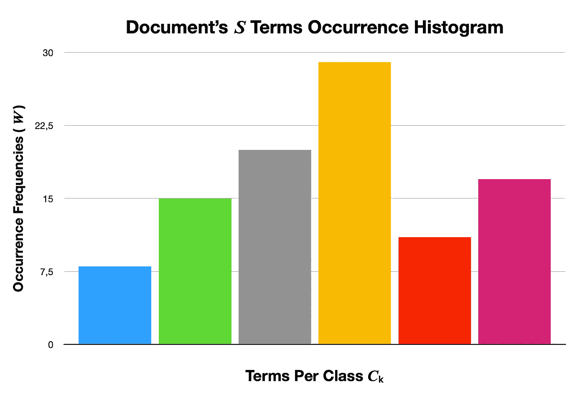
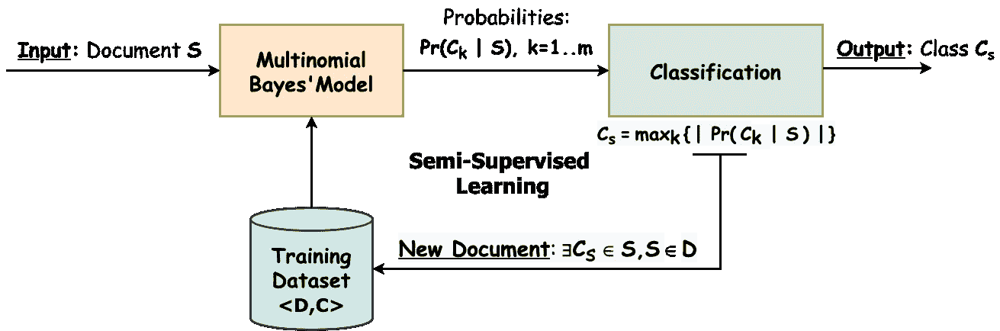

# 用于文档分类和自然语言处理的多项式朴素贝叶斯

> 原文：<https://towardsdatascience.com/multinomial-na%C3%AFve-bayes-for-documents-classification-and-natural-language-processing-nlp-e08cc848ce6?source=collection_archive---------9----------------------->

Arthur V. Ratz 的照片

## 多项式朴素贝叶斯在 Python 3.8、NumPy 和 NLTK 中的实现

# 介绍

朴素贝叶斯——一种用于构建数据分类模型的概率方法。它被公式化为几种方法，广泛用作基于距离的 K-Means 聚类和决策树森林的替代方法，并将概率作为数据属于特定类的“可能性”来处理。朴素贝叶斯的高斯和多项式模型是存在的。

多项式模型提供了对无法用数字表示的数据进行分类的能力。它的主要优点是大大降低了复杂性。它提供了使用小的训练集来执行分类的能力，而不需要不断地重新训练。

通过使用最新的 NumPy 和 NLTK 库，本文的读者将了解多项式朴素贝叶斯分类算法及其在 Python 3.8 中的实现。

# 多项式朴素贝叶斯分类器

多项式朴素贝叶斯广泛用于根据文档内容的统计分析将文档分配到类别中。它为“繁重的”基于人工智能的语义分析提供了一种替代方案，并大大简化了文本数据分类。

分类的目的是通过确定一个文档属于具有相同主题的其他文档类别的概率，将文本片段(即文档)分配到类别。

每个文档由多个单词(即术语)组成，这些单词有助于理解文档的内容。类是一个或多个文档的标记，指的是同一主题。

通过执行统计分析，测试文档的术语已经在特定类别的其他文档中出现的假设，来用现有类别之一标记文档。这增加了文档与已经分类的文档来自同一类别的可能性:

**给定**:𝑺想要分类的样品；

𝑺中的每个样本都被定义为出现在𝑪:类的一个或多个文档中的字符串

根据已经分类的𝐷文档执行分类:

为了执行分类，𝑺的术语由向量𝑾.表示𝑾的每个特征𝒘ᵢ是相应的𝒊-th 术语在𝑪.类文档中的出现频率每个特征向量𝑾 —一个术语/类别出现频率直方图:

词汇出现频率直方图|作者图片

通过估计𝒑(𝒘ᵢ | 𝑪) 𝒊=𝟏的概率来执行分类..𝒏认为，𝑺的术语出现在𝑪.的𝐷文献中

多项式模型仅依赖于从贝叶斯定理得出的基于概率的决策函数的评估。

贝叶斯概率𝒑(𝑪ₖ | 𝑾)计算如下:

贝叶斯概率公式

朴素贝叶斯背后的主要思想是，𝑾的所有要素都独立地影响𝑺属于𝑪ₖ.的概率

或者，后验𝒑(𝑪ₖ | 𝑾)表示为:

后𝒑(𝑪ₖ | 𝑾)公式|作者图片

估计的先验𝒑(𝐶ₖ)和可能性𝒑(𝑾 | 𝐶ₖ)成比例地对𝐶ₖ是𝑺.类的结果有贡献

然而，只有它的分子影响后验𝐏𝐫(𝐶ₖ | 𝑾).的估计尽管如此，证据𝒑(𝑾)同样规模的𝐏𝐫(𝐶ₖ | 𝑾)的每个𝐶ₖ，可能只是从估计中省略。

多项式模型用于文档分类，假设𝑺由特征向量𝑾.表示每个特征𝒘ᵢ是来自𝑺的𝒊-th 术语在文档𝐷中出现的计数(即频率),该文档已经被分配给类别𝐶.之一

原来，每个𝐶ₖ的后验𝐏𝐫(𝑾 | 𝐶ₖ)估计为:

多项式朴素贝叶斯分类器|作者图片

先验𝐏𝐫(𝑪ₖ)是一个商。哪个分子被估计为所有特征之和的阶乘∀ **𝑤** ₖ **ᵢ** ∈ 𝑾 𝒊=𝟏..𝒏.反过来，分母是所有特性的' **𝑤** ₖᵢ阶乘的乘积。

分子被评估为概率分布，这是𝑺在来自𝑪ₖ.类的文档𝑫中发生的所有可能结果的可能性这些结果的总量等于上面提到的∀ **𝑤** ₖᵢ ∈ 𝑾的特征总和的阶乘。

反过来，𝒑(𝑪ₖ的分母)被获得作为𝑾的特征在𝑫.的文档语料库中出现的所有可能结果的量这被确定为一个算术级数，作为每个特征的 **𝑤** ₖᵢ之和获得！阶乘。

上面的计算非常类似于矢量𝑾.的勒让德质因数分解此外，它意味着多元二项式分布计算。当分母足够大时，𝒑(𝑪ₖ显著降低。这通常提供了排除出现在语料库𝑫.的所有文档中的特征的能力

𝑺给定𝑪ₖ的可能性是项的概率的乘积𝒑ₖᵢ在统计程度上 **𝑤** ₖᵢ，拒绝零假设:

可能性𝒊-th 任期 **𝑤** ᵢ属于𝐶ₖ类|图片由作者提供

上面的多项式模型被用于计算𝑺来自𝑪ₖ.的概率𝒑(𝑾 | 𝑪ₖ

虽然，在这种情况下，目标是计算𝑪ₖ是𝑺.类的概率通过在对数空间中表示多项式模型，可以容易地计算𝐏𝐫(𝐶ₖ | 𝑾:

对数空间中的多项式贝叶斯分类器

因为可能性𝒑(𝑾 | 𝐶ₖ)是概率𝒑ₖᵢ ≡ 𝒑( **𝑤** ᵢ | 𝐶ₖ)的乘积，所以它用对数标度表示。在这种情况下，𝒑(𝑾 | 𝐶ₖ)与统计模型所支持的最大可能程度成正比。

在上式中，𝗹𝗼𝗴(𝒑)是概率𝒑的自然对数，计算如下:

概率自然对数𝗹𝗼𝗴(𝒑) |图片由作者提供

𝒑's 对数总是𝟏.𝒑小于或等于𝟏.时的𝟎𝟎，和自然对数𝐥𝐧(𝒑)，除非另有说明。

关于𝑆的阶级𝐶ₛ的决定是这样作出的:

基于概率的分类公式|作者图片

𝐶ₛ类被确定为现有的𝐶ₖ类之一，其𝐏𝐫(𝐶ₖ | 𝑾)的绝对值最大。因为𝐏𝐫(𝐶ₖ | 𝑾)总是负值，所以取其绝对值。

# 多项式贝叶斯分类算法

让𝑺 —一个输入字符串，𝑫 —一个𝒛-documents 语料库，𝑪 —一个𝒎-classes:集

**计算样本**𝑺**的类别** 𝑪ₛ **如下:**

1.  将样本𝑺分割成一组𝒏-terms
2.  对于每个𝒌-th 级𝑪ₖ 𝒌=𝟭..𝒎做到了以下几点:

*   计算𝒏-features ∀𝒘ₖᵢ ∈ 𝑾的向量𝑾，其中𝒘ₖᵢ是相应的𝒊-th 项在𝑪ₖ.的文档中出现的频率
*   评估先前的𝒑(𝑪ₖ)作为文档出现在来自𝑪ₖ.类别的文档中的全概率
*   计算后验𝐏𝐫(𝑪ₖ | 𝑾)的方法是将先验𝒑(𝑪ₖ)加到每项𝒘ᵢ的总和上，给定𝑪ₖ，概率𝒑(𝒘ᵢ | 𝑪ₖ):

后𝐏𝐫(𝑪ₖ | 𝑾)公式|作者图片

3.确定𝑪ₛ为𝑺的一类，其中𝐏𝐫(𝑪ₖ | 𝑾) 𝒌=𝟭..𝒎是最高的:

𝑺计算的类𝑪ₛ|图片作者

该算法的复杂度 **𝜎** 被评估为:

多项式贝叶斯分类器复杂性( **𝜎** ) |图片由作者提供

𝒛—𝒏𝑫的文档总数—𝒎𝑺样本中的术语数—𝑪的类数

# 半监督学习

半监督学习提供了提高多项式模型性能的能力。此外，它允许通过基于已经分类的文档语料库训练模型来提高分类的质量。

半监督学习算法相当直观简单且公式化，例如:

1.  使用上面讨论的多项式模型计算𝑺的𝑪ₛ等级。
2.  将标有𝑪ₛ的𝑺加入𝐷.文献集
3.  重新评估分类模型。

按照以下流程对每个新的𝑺.样本进行分类

**半监督学习过程:**

半监督学习过程|作者图片

如上所示，该过程提供了执行分类的能力，将样本分配到有限的类别集，类似于使用期望最大化算法(EM)。

# 使用代码

下面列出了 Python 3.8、NumPy 和 NLTK 库中实现多项式分类算法的代码:

**输出:**

# 结论

多项式贝叶斯模型是已知的 K 均值聚类和决策树算法的有效替代，能够对通常不容易量化的各种数据进行分类。例如，它可以用作基于人工神经网络的文本分类模型的一部分，该模型基于由多项式贝叶斯分类器推断的文本内容摘要来学习和预测文本的类别。

与用于基于内容的文本分类的类似人工智能和机器学习(ML)不同，多项式贝叶斯分类器完全是一种数据挖掘方法，允许预测引入模型的文本的类别，而无需连续训练。然而，为了防止多项式模型中遇到的早期收敛和冷启动问题，建议使用半监督学习算法来训练模型，以便更好地预测文本。这通常是通过训练模型并同时将其用于预测来完成的。

对于多项式贝叶斯分类器演示，请下载并运行下面的项目:

*   [**Python 3.7 中的多项朴素贝叶斯分类器**](https://github.com/arthurratz/bayes_classifier_multi)