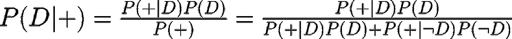
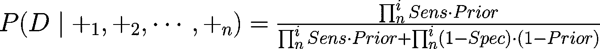
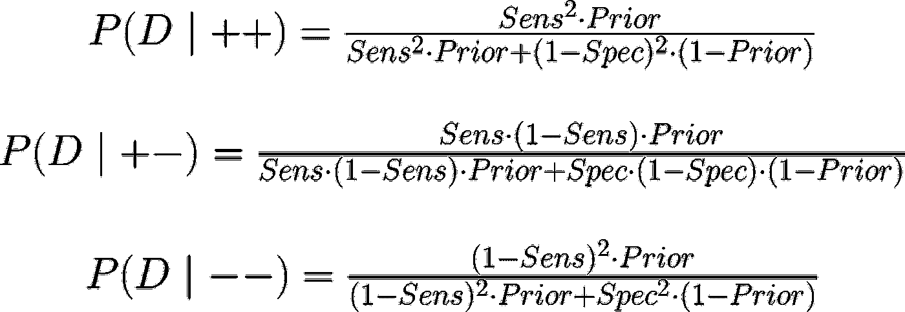
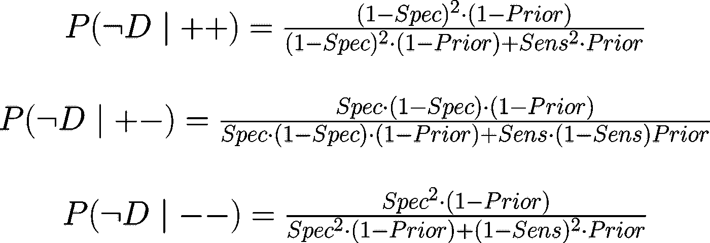
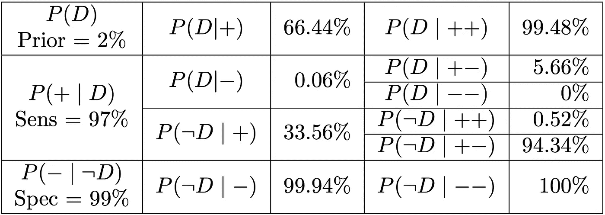

# 连续多个贝叶斯测试

> 原文：<https://towardsdatascience.com/multiple-bayesian-tests-in-row-2e4ad8fb5055?source=collection_archive---------22----------------------->

约翰·莫塞斯·鲍恩在 [Unsplash](https://unsplash.com/s/photos/test?utm_source=unsplash&utm_medium=referral&utm_content=creditCopyText) 上拍摄的照片

在我之前的一篇文章中，我已经简要讨论了如何在给定两个测试的情况下看到一个事件的*条件概率*。在这种情况下，我们看到了被疾病影响的条件概率的例子，给出了两个积极的医学测试。

我开始思考，对于许多测试，我们如何计算测试结果和期望结果的所有可能组合。

奇怪的是，我在网上找不到关于这个特定话题的现成解决方案。我有点惊讶，考虑到贝叶斯定理最精确的元素之一，它给我们新的预测的能力给了我们新的更新信息。

因此，在这篇文章中，我想解决的只是，我算出了一些数学，所以你不必，我已经列出了公式。希望这能帮助处于相同情况的人。

要重温贝叶斯定理的基础，请参考我的另一篇文章。

 [## 医学检验的贝叶斯定理

### 理解医学检验的贝叶斯定理。解释结果和更多测试的组合

towardsdatascience.com](/bayes-theorem-for-medical-test-f1fb12b579c6) 

# 公式

让我们继续之前看到的医学测试 *T* 的例子，对于疾病 *D* ，我们知道对其的**敏感性**和**特异性**。

假设检测结果为阳性 P(+)，则受该疾病影响的概率 P(D)将由以下公式给出:

经典表示中的贝叶斯定理和 P(+)的展开式。(图片由作者提供)

这里，我们可以看到条件概率 P(D|+)由下式给出:

*   **P(+|D)** 又名测试的 ***灵敏度*** 乘以
*   此类疾病的传播 P(D)，这是 ***先验*** 值
*   除以**概率，以检测疾病的阳性 P(+)** ，而不管我们是否真的被感染，是真阳性，还是假阳性。

来自上述例子的公式由灵敏度乘以 P(D)加上, ***特异性*** P(+|D)乘以 ***1 减去先前的*** 给出

因此，为了计算条件概率，我们只需要敏感性、特异性和疾病传播的值。前两个是固定的和给定的，另一个经常变化，取决于遗传疾病的人群和时间/地点，如季节性流感等。

因此，计算给定多重测试的条件概率的技巧是根据测试结果乘以灵敏度和特异性。

例如，对于一系列 *n* 测试的阳性结果，我们可以使用公式:

多重贝叶斯定理的一般化版本(图片由作者提供)

然而，如果其中一个测试是阴性的，我们必须使用假阴性率，因此，1-Sens。并且，为了使用，用假阳性率 1-Spec 替换特异性的相同方法。

两个测试的所有可能示例如下:

连续两个贝叶斯定理(图片由作者提供)

相反 P(D)的值由 1 减去上述公式的结果给出，或由下式给出:

连续两个贝叶斯定理(图片由作者提供)

# 例子

在这里，我已经锻炼了一个例子，只有先验，敏感性和特异性。

两个贝叶斯定理的例子(图片由作者提供)

我们可以看到，如果我们只在一项测试中测试为阳性，我们有 66%会受到实际影响，33%不会。这在第二次阳性测试中发生了巨大的变化。现在我们可以确定医学结果了。

相反，给我们一个阴性测试，我们就非常确定我们的状况。

这个测试示例确保在测试完成时没有假阴性。

希望你喜欢这篇文章，并发现它很有帮助，如果是这样，请告诉我！
我打算在接下来的几天里在 Jupyter 笔记本上重现这个例子。萧然若不是跟我扯上关系，这里就只有叶了。